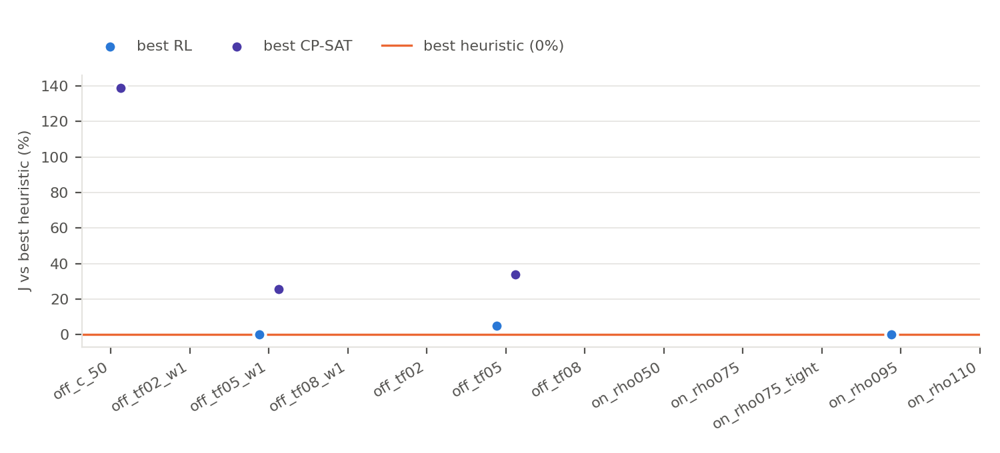
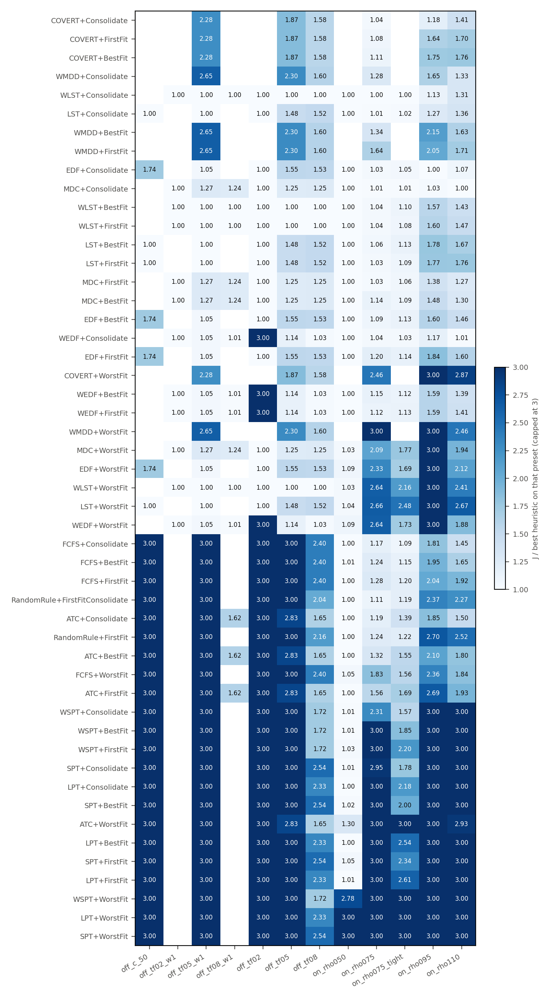

# v2 results: highlights

Start here. Generated by `scripts/build_folder.py`; do not edit by hand. Setup, methods and caveats: [`README.md`](README.md). J = sum w_j T_j^2 (lower is better); every row of one preset uses the same held-out instances.

## 1. Headline: best of each method family

| preset | best heuristic (J) | best RL (J) | RL vs best heuristic | PSO (J) | CP-SAT (J) |
|---|---|---|---|---|---|
| off_c_50 | LST+FirstFit (98) | - | - | - | 234 |
| off_tf02_w1 | WLST+FirstFit (0) | - | - | - | - |
| off_tf05_w1 | LST+FirstFit (13098) | PPO Opt1 rule selection +Consolidate look-ahead fixed scaling arrival-aware critic lateness shaping [tuned] (13098, 3 seeds) | +0.0% | - | 16469 |
| off_tf08_w1 | WLST+FirstFit (129805) | - | - | - | - |
| off_tf02 | EDF+FirstFit (0) | - | - | - | - |
| off_tf05 | WLST+FirstFit (26670) | PPO Opt2 priority score look-ahead fixed scaling arrival-aware critic lateness shaping reward scaling event-driven idle [tuned] (28061, 3 seeds) | +5.2% | - | 35681 |
| off_tf08 | WLST+FirstFit (257155) | - | - | - | - |
| on_rho050 | WLST+Consolidate (4085) | - | - | - | - |
| on_rho075 | WLST+Consolidate (5990) | - | - | - | - |
| on_rho075_tight | WLST+Consolidate (29502) | - | - | - | - |
| on_rho095 | EDF+Consolidate (21986) | PPO Opt2 priority score look-ahead fixed scaling arrival-aware critic lateness shaping reward scaling event-driven idle +linear-tardiness objective 1M-step budget [tuned] (22000, 1 seed) | +0.1% | - | - |
| on_rho110 | MDC+Consolidate (106463) | - | - | - | - |

## 2. Best method on each metric

Click a preset for its top-5 / top-10 leaderboards. Value in brackets = mean over instances.

| preset | J (min) | on-time rate (max) | late jobs (min) | weighted late jobs (min) | weighted tardiness (min) | max tardiness (min) | p95 tardiness (min) | mean wait (min) | mean flow time (min) | makespan (min) | utilisation of active machines (max) | active machine-ticks (min) | energy (SPECpower) (min) |
|---|---|---|---|---|---|---|---|---|---|---|---|---|---|
| [off_c_50](leaderboards/off_c_50.md) | LST+FirstFit (98) | CP-SAT (0.919) | CP-SAT (8.1) | (all equal) | LST+FirstFit (24) | LST+FirstFit (1.7) | LST+FirstFit (1.1) | LST+FirstFit (49.50) | LST+FirstFit (54.54) | LPT+BestFit (100.0) | LPT+Consolidate (0.665) | LPT+Consolidate (162) | LPT+Consolidate (139) |
| [off_tf02_w1](leaderboards/off_tf02_w1.md) | (all equal) | (all equal) | (all equal) | (all equal) | (all equal) | (all equal) | (all equal) | (all equal) | (all equal) | MDC+FirstFit (102.3) | MDC+Consolidate (0.650) | MDC+Consolidate (166) | MDC+Consolidate (142) |
| [off_tf05_w1](leaderboards/off_tf05_w1.md) | LST+FirstFit (13098) | WMDD+BestFit (0.678) | WMDD+BestFit (32.2) | A2C Opt3 ATC-prior score windowed look-ahead fixed scaling arrival-aware critic lateness shaping reward scaling event-driven idle [tuned] (60.3) | LST+FirstFit (785) | PPO Opt1 rule selection +Consolidate look-ahead fixed scaling arrival-aware critic lateness shaping [tuned] (23.9) | PPO Opt1 rule selection +Consolidate look-ahead fixed scaling arrival-aware critic lateness shaping [tuned] (22.3) | LST+FirstFit (49.50) | PPO Opt1 rule selection +Consolidate look-ahead fixed scaling arrival-aware critic lateness shaping [tuned] (54.54) | LPT+BestFit (100.0) | LPT+Consolidate (0.665) | LPT+Consolidate (162) | LPT+Consolidate (139) |
| [off_tf08_w1](leaderboards/off_tf08_w1.md) | WLST+FirstFit (129805) | ATC+FirstFit (0.243) | ATC+FirstFit (75.7) | (all equal) | WLST+FirstFit (3283) | WLST+FirstFit (53.9) | WLST+FirstFit (52.3) | (all equal) | (all equal) | WLST+FirstFit (102.6) | MDC+Consolidate (0.654) | MDC+Consolidate (166) | MDC+Consolidate (142) |
| [off_tf02](leaderboards/off_tf02.md) | EDF+FirstFit (0) | EDF+FirstFit (1.000) | EDF+FirstFit (0.0) | (all equal) | EDF+FirstFit (0) | EDF+FirstFit (0.0) | EDF+FirstFit (0.0) | (all equal) | (all equal) | LPT+BestFit (100.0) | LPT+Consolidate (0.665) | LPT+Consolidate (162) | LPT+Consolidate (139) |
| [off_tf05](leaderboards/off_tf05.md) | WLST+FirstFit (26670) | WMDD+BestFit (0.694) | WMDD+BestFit (30.6) | WMDD+BestFit (55.6) | PPO Opt2 priority score look-ahead fixed scaling arrival-aware critic lateness shaping reward scaling event-driven idle +linear-tardiness objective [lambda x4] (1361) | PPO Opt1 rule selection +Consolidate look-ahead fixed scaling arrival-aware critic lateness shaping [tuned] (23.9) | PPO Opt1 rule selection +Consolidate look-ahead fixed scaling arrival-aware critic lateness shaping [tuned] (22.3) | WLST+FirstFit (49.50) | PPO Opt2 priority score look-ahead fixed scaling arrival-aware critic lateness shaping reward scaling event-driven idle [tuned] (54.54) | LPT+BestFit (100.0) | A2C Opt0 full action space pointer look-ahead fixed scaling arrival-aware critic lateness shaping reward scaling event-driven idle +linear-tardiness objective +late-count objective +energy objective (0.682) | A2C Opt0 full action space pointer look-ahead fixed scaling arrival-aware critic lateness shaping reward scaling event-driven idle +linear-tardiness objective +late-count objective +energy objective (154) | A2C Opt0 full action space pointer look-ahead fixed scaling arrival-aware critic lateness shaping reward scaling event-driven idle +linear-tardiness objective +late-count objective +energy objective (134) |
| [off_tf08](leaderboards/off_tf08.md) | WLST+FirstFit (257155) | ATC+FirstFit (0.235) | ATC+FirstFit (76.5) | (all equal) | WLST+FirstFit (7048) | LST+FirstFit (53.9) | LST+FirstFit (52.3) | (all equal) | (all equal) | LPT+BestFit (100.0) | LPT+Consolidate (0.665) | LPT+Consolidate (162) | LPT+Consolidate (139) |
| [on_rho050](leaderboards/on_rho050.md) | WLST+Consolidate (4085) | WLST+Consolidate (0.978) | WLST+Consolidate (10.6) | (all equal) | WLST+Consolidate (278) | WLST+Consolidate (21.9) | WLST+Consolidate (0.0) | SPT+Consolidate (0.03) | SPT+Consolidate (5.50) | WLST+Consolidate (127.0) | LPT+Consolidate (0.860) | LPT+Consolidate (815) | LPT+Consolidate (708) |
| [on_rho075](leaderboards/on_rho075.md) | WLST+Consolidate (5990) | MDC+Consolidate (0.977) | MDC+Consolidate (16.3) | (all equal) | WLST+Consolidate (414) | WLST+BestFit (23.8) | WLST+Consolidate (0.0) | SPT+Consolidate (0.60) | SPT+Consolidate (6.03) | LPT+BestFit (129.7) | LPT+Consolidate (0.916) | LPT+Consolidate (1073) | LPT+Consolidate (961) |
| [on_rho075_tight](leaderboards/on_rho075_tight.md) | WLST+Consolidate (29502) | ATC+Consolidate (0.887) | ATC+Consolidate (81.1) | (all equal) | MDC+Consolidate (1966) | LST+Consolidate (32.9) | MDC+Consolidate (6.2) | SPT+Consolidate (0.60) | SPT+Consolidate (6.03) | LPT+BestFit (129.7) | LPT+Consolidate (0.916) | LPT+Consolidate (1073) | LPT+Consolidate (961) |
| [on_rho095](leaderboards/on_rho095.md) | EDF+Consolidate (21986) | ATC+Consolidate (0.960) | ATC+Consolidate (36.2) | ATC+Consolidate (97.2) | WMDD+Consolidate (1207) | LST+Consolidate (30.3) | ATC+Consolidate (0.2) | SPT+Consolidate (2.30) | SPT+Consolidate (7.71) | LPT+Consolidate (132.0) | LPT+Consolidate (0.966) | LPT+Consolidate (1219) | LPT+Consolidate (1123) |
| [on_rho110](leaderboards/on_rho110.md) | MDC+Consolidate (106463) | ATC+Consolidate (0.935) | ATC+Consolidate (69.4) | (all equal) | ATC+Consolidate (3604) | LST+Consolidate (48.5) | ATC+Consolidate (4.7) | SPT+Consolidate (4.35) | SPT+Consolidate (9.82) | LPT+Consolidate (140.9) | LPT+Consolidate (0.986) | LPT+Consolidate (1368) | LPT+Consolidate (1273) |

## 3. Key figures

**Best RL / PSO / CP-SAT vs the best heuristic, per preset**

**Every heuristic relative to the best heuristic, per preset**

## 4. Leaderboard figures (top 5 and top 10)

| preset | J | on-time rate | late jobs | weighted late jobs | weighted tardiness | max tardiness | p95 tardiness | mean wait | mean flow time | makespan | utilisation of active machines | active machine-ticks | energy (SPECpower) |
|---|---|---|---|---|---|---|---|---|---|---|---|---|---|
| [off_c_50](leaderboards/off_c_50.md) | [top 5](figures/leaderboards/off_c_50/top5_objective_J.png) / [top 10](figures/leaderboards/off_c_50/top10_objective_J.png) | [top 5](figures/leaderboards/off_c_50/top5_on_time_rate.png) / [top 10](figures/leaderboards/off_c_50/top10_on_time_rate.png) | [top 5](figures/leaderboards/off_c_50/top5_late_jobs.png) / [top 10](figures/leaderboards/off_c_50/top10_late_jobs.png) | - | [top 5](figures/leaderboards/off_c_50/top5_weighted_tardiness.png) / [top 10](figures/leaderboards/off_c_50/top10_weighted_tardiness.png) | [top 5](figures/leaderboards/off_c_50/top5_max_tardiness.png) / [top 10](figures/leaderboards/off_c_50/top10_max_tardiness.png) | [top 5](figures/leaderboards/off_c_50/top5_p95_tardiness.png) / [top 10](figures/leaderboards/off_c_50/top10_p95_tardiness.png) | [top 5](figures/leaderboards/off_c_50/top5_mean_wait.png) / [top 10](figures/leaderboards/off_c_50/top10_mean_wait.png) | [top 5](figures/leaderboards/off_c_50/top5_mean_flow_time.png) / [top 10](figures/leaderboards/off_c_50/top10_mean_flow_time.png) | [top 5](figures/leaderboards/off_c_50/top5_makespan.png) / [top 10](figures/leaderboards/off_c_50/top10_makespan.png) | [top 5](figures/leaderboards/off_c_50/top5_mean_active_utilisation.png) / [top 10](figures/leaderboards/off_c_50/top10_mean_active_utilisation.png) | [top 5](figures/leaderboards/off_c_50/top5_active_machine_ticks.png) / [top 10](figures/leaderboards/off_c_50/top10_active_machine_ticks.png) | [top 5](figures/leaderboards/off_c_50/top5_energy_specpower.png) / [top 10](figures/leaderboards/off_c_50/top10_energy_specpower.png) |
| [off_tf02_w1](leaderboards/off_tf02_w1.md) | - | - | - | - | - | - | - | - | - | [top 5](figures/leaderboards/off_tf02_w1/top5_makespan.png) / [top 10](figures/leaderboards/off_tf02_w1/top10_makespan.png) | [top 5](figures/leaderboards/off_tf02_w1/top5_mean_active_utilisation.png) / [top 10](figures/leaderboards/off_tf02_w1/top10_mean_active_utilisation.png) | [top 5](figures/leaderboards/off_tf02_w1/top5_active_machine_ticks.png) / [top 10](figures/leaderboards/off_tf02_w1/top10_active_machine_ticks.png) | [top 5](figures/leaderboards/off_tf02_w1/top5_energy_specpower.png) / [top 10](figures/leaderboards/off_tf02_w1/top10_energy_specpower.png) |
| [off_tf05_w1](leaderboards/off_tf05_w1.md) | [top 5](figures/leaderboards/off_tf05_w1/top5_objective_J.png) / [top 10](figures/leaderboards/off_tf05_w1/top10_objective_J.png) | [top 5](figures/leaderboards/off_tf05_w1/top5_on_time_rate.png) / [top 10](figures/leaderboards/off_tf05_w1/top10_on_time_rate.png) | [top 5](figures/leaderboards/off_tf05_w1/top5_late_jobs.png) / [top 10](figures/leaderboards/off_tf05_w1/top10_late_jobs.png) | [top 5](figures/leaderboards/off_tf05_w1/top5_weighted_late_jobs.png) | [top 5](figures/leaderboards/off_tf05_w1/top5_weighted_tardiness.png) / [top 10](figures/leaderboards/off_tf05_w1/top10_weighted_tardiness.png) | [top 5](figures/leaderboards/off_tf05_w1/top5_max_tardiness.png) / [top 10](figures/leaderboards/off_tf05_w1/top10_max_tardiness.png) | [top 5](figures/leaderboards/off_tf05_w1/top5_p95_tardiness.png) / [top 10](figures/leaderboards/off_tf05_w1/top10_p95_tardiness.png) | [top 5](figures/leaderboards/off_tf05_w1/top5_mean_wait.png) / [top 10](figures/leaderboards/off_tf05_w1/top10_mean_wait.png) | [top 5](figures/leaderboards/off_tf05_w1/top5_mean_flow_time.png) / [top 10](figures/leaderboards/off_tf05_w1/top10_mean_flow_time.png) | [top 5](figures/leaderboards/off_tf05_w1/top5_makespan.png) / [top 10](figures/leaderboards/off_tf05_w1/top10_makespan.png) | [top 5](figures/leaderboards/off_tf05_w1/top5_mean_active_utilisation.png) / [top 10](figures/leaderboards/off_tf05_w1/top10_mean_active_utilisation.png) | [top 5](figures/leaderboards/off_tf05_w1/top5_active_machine_ticks.png) / [top 10](figures/leaderboards/off_tf05_w1/top10_active_machine_ticks.png) | [top 5](figures/leaderboards/off_tf05_w1/top5_energy_specpower.png) / [top 10](figures/leaderboards/off_tf05_w1/top10_energy_specpower.png) |
| [off_tf08_w1](leaderboards/off_tf08_w1.md) | [top 5](figures/leaderboards/off_tf08_w1/top5_objective_J.png) / [top 10](figures/leaderboards/off_tf08_w1/top10_objective_J.png) | [top 5](figures/leaderboards/off_tf08_w1/top5_on_time_rate.png) / [top 10](figures/leaderboards/off_tf08_w1/top10_on_time_rate.png) | [top 5](figures/leaderboards/off_tf08_w1/top5_late_jobs.png) / [top 10](figures/leaderboards/off_tf08_w1/top10_late_jobs.png) | - | [top 5](figures/leaderboards/off_tf08_w1/top5_weighted_tardiness.png) / [top 10](figures/leaderboards/off_tf08_w1/top10_weighted_tardiness.png) | [top 5](figures/leaderboards/off_tf08_w1/top5_max_tardiness.png) / [top 10](figures/leaderboards/off_tf08_w1/top10_max_tardiness.png) | [top 5](figures/leaderboards/off_tf08_w1/top5_p95_tardiness.png) / [top 10](figures/leaderboards/off_tf08_w1/top10_p95_tardiness.png) | - | - | [top 5](figures/leaderboards/off_tf08_w1/top5_makespan.png) / [top 10](figures/leaderboards/off_tf08_w1/top10_makespan.png) | [top 5](figures/leaderboards/off_tf08_w1/top5_mean_active_utilisation.png) / [top 10](figures/leaderboards/off_tf08_w1/top10_mean_active_utilisation.png) | [top 5](figures/leaderboards/off_tf08_w1/top5_active_machine_ticks.png) / [top 10](figures/leaderboards/off_tf08_w1/top10_active_machine_ticks.png) | [top 5](figures/leaderboards/off_tf08_w1/top5_energy_specpower.png) / [top 10](figures/leaderboards/off_tf08_w1/top10_energy_specpower.png) |
| [off_tf02](leaderboards/off_tf02.md) | [top 5](figures/leaderboards/off_tf02/top5_objective_J.png) / [top 10](figures/leaderboards/off_tf02/top10_objective_J.png) | [top 5](figures/leaderboards/off_tf02/top5_on_time_rate.png) / [top 10](figures/leaderboards/off_tf02/top10_on_time_rate.png) | [top 5](figures/leaderboards/off_tf02/top5_late_jobs.png) / [top 10](figures/leaderboards/off_tf02/top10_late_jobs.png) | - | [top 5](figures/leaderboards/off_tf02/top5_weighted_tardiness.png) / [top 10](figures/leaderboards/off_tf02/top10_weighted_tardiness.png) | [top 5](figures/leaderboards/off_tf02/top5_max_tardiness.png) / [top 10](figures/leaderboards/off_tf02/top10_max_tardiness.png) | [top 5](figures/leaderboards/off_tf02/top5_p95_tardiness.png) / [top 10](figures/leaderboards/off_tf02/top10_p95_tardiness.png) | - | - | [top 5](figures/leaderboards/off_tf02/top5_makespan.png) / [top 10](figures/leaderboards/off_tf02/top10_makespan.png) | [top 5](figures/leaderboards/off_tf02/top5_mean_active_utilisation.png) / [top 10](figures/leaderboards/off_tf02/top10_mean_active_utilisation.png) | [top 5](figures/leaderboards/off_tf02/top5_active_machine_ticks.png) / [top 10](figures/leaderboards/off_tf02/top10_active_machine_ticks.png) | [top 5](figures/leaderboards/off_tf02/top5_energy_specpower.png) / [top 10](figures/leaderboards/off_tf02/top10_energy_specpower.png) |
| [off_tf05](leaderboards/off_tf05.md) | [top 5](figures/leaderboards/off_tf05/top5_objective_J.png) / [top 10](figures/leaderboards/off_tf05/top10_objective_J.png) | [top 5](figures/leaderboards/off_tf05/top5_on_time_rate.png) / [top 10](figures/leaderboards/off_tf05/top10_on_time_rate.png) | [top 5](figures/leaderboards/off_tf05/top5_late_jobs.png) / [top 10](figures/leaderboards/off_tf05/top10_late_jobs.png) | [top 5](figures/leaderboards/off_tf05/top5_weighted_late_jobs.png) / [top 10](figures/leaderboards/off_tf05/top10_weighted_late_jobs.png) | [top 5](figures/leaderboards/off_tf05/top5_weighted_tardiness.png) / [top 10](figures/leaderboards/off_tf05/top10_weighted_tardiness.png) | [top 5](figures/leaderboards/off_tf05/top5_max_tardiness.png) / [top 10](figures/leaderboards/off_tf05/top10_max_tardiness.png) | [top 5](figures/leaderboards/off_tf05/top5_p95_tardiness.png) / [top 10](figures/leaderboards/off_tf05/top10_p95_tardiness.png) | [top 5](figures/leaderboards/off_tf05/top5_mean_wait.png) / [top 10](figures/leaderboards/off_tf05/top10_mean_wait.png) | [top 5](figures/leaderboards/off_tf05/top5_mean_flow_time.png) / [top 10](figures/leaderboards/off_tf05/top10_mean_flow_time.png) | [top 5](figures/leaderboards/off_tf05/top5_makespan.png) / [top 10](figures/leaderboards/off_tf05/top10_makespan.png) | [top 5](figures/leaderboards/off_tf05/top5_mean_active_utilisation.png) / [top 10](figures/leaderboards/off_tf05/top10_mean_active_utilisation.png) | [top 5](figures/leaderboards/off_tf05/top5_active_machine_ticks.png) / [top 10](figures/leaderboards/off_tf05/top10_active_machine_ticks.png) | [top 5](figures/leaderboards/off_tf05/top5_energy_specpower.png) / [top 10](figures/leaderboards/off_tf05/top10_energy_specpower.png) |
| [off_tf08](leaderboards/off_tf08.md) | [top 5](figures/leaderboards/off_tf08/top5_objective_J.png) / [top 10](figures/leaderboards/off_tf08/top10_objective_J.png) | [top 5](figures/leaderboards/off_tf08/top5_on_time_rate.png) / [top 10](figures/leaderboards/off_tf08/top10_on_time_rate.png) | [top 5](figures/leaderboards/off_tf08/top5_late_jobs.png) / [top 10](figures/leaderboards/off_tf08/top10_late_jobs.png) | - | [top 5](figures/leaderboards/off_tf08/top5_weighted_tardiness.png) / [top 10](figures/leaderboards/off_tf08/top10_weighted_tardiness.png) | [top 5](figures/leaderboards/off_tf08/top5_max_tardiness.png) / [top 10](figures/leaderboards/off_tf08/top10_max_tardiness.png) | [top 5](figures/leaderboards/off_tf08/top5_p95_tardiness.png) / [top 10](figures/leaderboards/off_tf08/top10_p95_tardiness.png) | - | - | [top 5](figures/leaderboards/off_tf08/top5_makespan.png) / [top 10](figures/leaderboards/off_tf08/top10_makespan.png) | [top 5](figures/leaderboards/off_tf08/top5_mean_active_utilisation.png) / [top 10](figures/leaderboards/off_tf08/top10_mean_active_utilisation.png) | [top 5](figures/leaderboards/off_tf08/top5_active_machine_ticks.png) / [top 10](figures/leaderboards/off_tf08/top10_active_machine_ticks.png) | [top 5](figures/leaderboards/off_tf08/top5_energy_specpower.png) / [top 10](figures/leaderboards/off_tf08/top10_energy_specpower.png) |
| [on_rho050](leaderboards/on_rho050.md) | [top 5](figures/leaderboards/on_rho050/top5_objective_J.png) / [top 10](figures/leaderboards/on_rho050/top10_objective_J.png) | [top 5](figures/leaderboards/on_rho050/top5_on_time_rate.png) / [top 10](figures/leaderboards/on_rho050/top10_on_time_rate.png) | [top 5](figures/leaderboards/on_rho050/top5_late_jobs.png) / [top 10](figures/leaderboards/on_rho050/top10_late_jobs.png) | - | [top 5](figures/leaderboards/on_rho050/top5_weighted_tardiness.png) / [top 10](figures/leaderboards/on_rho050/top10_weighted_tardiness.png) | [top 5](figures/leaderboards/on_rho050/top5_max_tardiness.png) / [top 10](figures/leaderboards/on_rho050/top10_max_tardiness.png) | [top 5](figures/leaderboards/on_rho050/top5_p95_tardiness.png) / [top 10](figures/leaderboards/on_rho050/top10_p95_tardiness.png) | [top 5](figures/leaderboards/on_rho050/top5_mean_wait.png) / [top 10](figures/leaderboards/on_rho050/top10_mean_wait.png) | [top 5](figures/leaderboards/on_rho050/top5_mean_flow_time.png) / [top 10](figures/leaderboards/on_rho050/top10_mean_flow_time.png) | [top 5](figures/leaderboards/on_rho050/top5_makespan.png) / [top 10](figures/leaderboards/on_rho050/top10_makespan.png) | [top 5](figures/leaderboards/on_rho050/top5_mean_active_utilisation.png) / [top 10](figures/leaderboards/on_rho050/top10_mean_active_utilisation.png) | [top 5](figures/leaderboards/on_rho050/top5_active_machine_ticks.png) / [top 10](figures/leaderboards/on_rho050/top10_active_machine_ticks.png) | [top 5](figures/leaderboards/on_rho050/top5_energy_specpower.png) / [top 10](figures/leaderboards/on_rho050/top10_energy_specpower.png) |
| [on_rho075](leaderboards/on_rho075.md) | [top 5](figures/leaderboards/on_rho075/top5_objective_J.png) / [top 10](figures/leaderboards/on_rho075/top10_objective_J.png) | [top 5](figures/leaderboards/on_rho075/top5_on_time_rate.png) / [top 10](figures/leaderboards/on_rho075/top10_on_time_rate.png) | [top 5](figures/leaderboards/on_rho075/top5_late_jobs.png) / [top 10](figures/leaderboards/on_rho075/top10_late_jobs.png) | - | [top 5](figures/leaderboards/on_rho075/top5_weighted_tardiness.png) / [top 10](figures/leaderboards/on_rho075/top10_weighted_tardiness.png) | [top 5](figures/leaderboards/on_rho075/top5_max_tardiness.png) / [top 10](figures/leaderboards/on_rho075/top10_max_tardiness.png) | [top 5](figures/leaderboards/on_rho075/top5_p95_tardiness.png) / [top 10](figures/leaderboards/on_rho075/top10_p95_tardiness.png) | [top 5](figures/leaderboards/on_rho075/top5_mean_wait.png) / [top 10](figures/leaderboards/on_rho075/top10_mean_wait.png) | [top 5](figures/leaderboards/on_rho075/top5_mean_flow_time.png) / [top 10](figures/leaderboards/on_rho075/top10_mean_flow_time.png) | [top 5](figures/leaderboards/on_rho075/top5_makespan.png) / [top 10](figures/leaderboards/on_rho075/top10_makespan.png) | [top 5](figures/leaderboards/on_rho075/top5_mean_active_utilisation.png) / [top 10](figures/leaderboards/on_rho075/top10_mean_active_utilisation.png) | [top 5](figures/leaderboards/on_rho075/top5_active_machine_ticks.png) / [top 10](figures/leaderboards/on_rho075/top10_active_machine_ticks.png) | [top 5](figures/leaderboards/on_rho075/top5_energy_specpower.png) / [top 10](figures/leaderboards/on_rho075/top10_energy_specpower.png) |
| [on_rho075_tight](leaderboards/on_rho075_tight.md) | [top 5](figures/leaderboards/on_rho075_tight/top5_objective_J.png) / [top 10](figures/leaderboards/on_rho075_tight/top10_objective_J.png) | [top 5](figures/leaderboards/on_rho075_tight/top5_on_time_rate.png) / [top 10](figures/leaderboards/on_rho075_tight/top10_on_time_rate.png) | [top 5](figures/leaderboards/on_rho075_tight/top5_late_jobs.png) / [top 10](figures/leaderboards/on_rho075_tight/top10_late_jobs.png) | - | [top 5](figures/leaderboards/on_rho075_tight/top5_weighted_tardiness.png) / [top 10](figures/leaderboards/on_rho075_tight/top10_weighted_tardiness.png) | [top 5](figures/leaderboards/on_rho075_tight/top5_max_tardiness.png) / [top 10](figures/leaderboards/on_rho075_tight/top10_max_tardiness.png) | [top 5](figures/leaderboards/on_rho075_tight/top5_p95_tardiness.png) / [top 10](figures/leaderboards/on_rho075_tight/top10_p95_tardiness.png) | [top 5](figures/leaderboards/on_rho075_tight/top5_mean_wait.png) / [top 10](figures/leaderboards/on_rho075_tight/top10_mean_wait.png) | [top 5](figures/leaderboards/on_rho075_tight/top5_mean_flow_time.png) / [top 10](figures/leaderboards/on_rho075_tight/top10_mean_flow_time.png) | [top 5](figures/leaderboards/on_rho075_tight/top5_makespan.png) / [top 10](figures/leaderboards/on_rho075_tight/top10_makespan.png) | [top 5](figures/leaderboards/on_rho075_tight/top5_mean_active_utilisation.png) / [top 10](figures/leaderboards/on_rho075_tight/top10_mean_active_utilisation.png) | [top 5](figures/leaderboards/on_rho075_tight/top5_active_machine_ticks.png) / [top 10](figures/leaderboards/on_rho075_tight/top10_active_machine_ticks.png) | [top 5](figures/leaderboards/on_rho075_tight/top5_energy_specpower.png) / [top 10](figures/leaderboards/on_rho075_tight/top10_energy_specpower.png) |
| [on_rho095](leaderboards/on_rho095.md) | [top 5](figures/leaderboards/on_rho095/top5_objective_J.png) / [top 10](figures/leaderboards/on_rho095/top10_objective_J.png) | [top 5](figures/leaderboards/on_rho095/top5_on_time_rate.png) / [top 10](figures/leaderboards/on_rho095/top10_on_time_rate.png) | [top 5](figures/leaderboards/on_rho095/top5_late_jobs.png) / [top 10](figures/leaderboards/on_rho095/top10_late_jobs.png) | [top 5](figures/leaderboards/on_rho095/top5_weighted_late_jobs.png) / [top 10](figures/leaderboards/on_rho095/top10_weighted_late_jobs.png) | [top 5](figures/leaderboards/on_rho095/top5_weighted_tardiness.png) / [top 10](figures/leaderboards/on_rho095/top10_weighted_tardiness.png) | [top 5](figures/leaderboards/on_rho095/top5_max_tardiness.png) / [top 10](figures/leaderboards/on_rho095/top10_max_tardiness.png) | [top 5](figures/leaderboards/on_rho095/top5_p95_tardiness.png) / [top 10](figures/leaderboards/on_rho095/top10_p95_tardiness.png) | [top 5](figures/leaderboards/on_rho095/top5_mean_wait.png) / [top 10](figures/leaderboards/on_rho095/top10_mean_wait.png) | [top 5](figures/leaderboards/on_rho095/top5_mean_flow_time.png) / [top 10](figures/leaderboards/on_rho095/top10_mean_flow_time.png) | [top 5](figures/leaderboards/on_rho095/top5_makespan.png) / [top 10](figures/leaderboards/on_rho095/top10_makespan.png) | [top 5](figures/leaderboards/on_rho095/top5_mean_active_utilisation.png) / [top 10](figures/leaderboards/on_rho095/top10_mean_active_utilisation.png) | [top 5](figures/leaderboards/on_rho095/top5_active_machine_ticks.png) / [top 10](figures/leaderboards/on_rho095/top10_active_machine_ticks.png) | [top 5](figures/leaderboards/on_rho095/top5_energy_specpower.png) / [top 10](figures/leaderboards/on_rho095/top10_energy_specpower.png) |
| [on_rho110](leaderboards/on_rho110.md) | [top 5](figures/leaderboards/on_rho110/top5_objective_J.png) / [top 10](figures/leaderboards/on_rho110/top10_objective_J.png) | [top 5](figures/leaderboards/on_rho110/top5_on_time_rate.png) / [top 10](figures/leaderboards/on_rho110/top10_on_time_rate.png) | [top 5](figures/leaderboards/on_rho110/top5_late_jobs.png) / [top 10](figures/leaderboards/on_rho110/top10_late_jobs.png) | - | [top 5](figures/leaderboards/on_rho110/top5_weighted_tardiness.png) / [top 10](figures/leaderboards/on_rho110/top10_weighted_tardiness.png) | [top 5](figures/leaderboards/on_rho110/top5_max_tardiness.png) / [top 10](figures/leaderboards/on_rho110/top10_max_tardiness.png) | [top 5](figures/leaderboards/on_rho110/top5_p95_tardiness.png) / [top 10](figures/leaderboards/on_rho110/top10_p95_tardiness.png) | [top 5](figures/leaderboards/on_rho110/top5_mean_wait.png) / [top 10](figures/leaderboards/on_rho110/top10_mean_wait.png) | [top 5](figures/leaderboards/on_rho110/top5_mean_flow_time.png) / [top 10](figures/leaderboards/on_rho110/top10_mean_flow_time.png) | [top 5](figures/leaderboards/on_rho110/top5_makespan.png) / [top 10](figures/leaderboards/on_rho110/top10_makespan.png) | [top 5](figures/leaderboards/on_rho110/top5_mean_active_utilisation.png) / [top 10](figures/leaderboards/on_rho110/top10_mean_active_utilisation.png) | [top 5](figures/leaderboards/on_rho110/top5_active_machine_ticks.png) / [top 10](figures/leaderboards/on_rho110/top10_active_machine_ticks.png) | [top 5](figures/leaderboards/on_rho110/top5_energy_specpower.png) / [top 10](figures/leaderboards/on_rho110/top10_energy_specpower.png) |

## 5. Everything per preset

| preset | full table | J by method | leaderboards | training curves |
|---|---|---|---|---|
| off_c_50 | [table](tables/off_c_50.md) | [figure](figures/J_by_method_off_c_50.png) | [top 5 / 10](leaderboards/off_c_50.md) | [figure](figures/training_curves_off_c_50.png) |
| off_tf02_w1 | [table](tables/off_tf02_w1.md) | [figure](figures/J_by_method_off_tf02_w1.png) | [top 5 / 10](leaderboards/off_tf02_w1.md) | - |
| off_tf05_w1 | [table](tables/off_tf05_w1.md) | [figure](figures/J_by_method_off_tf05_w1.png) | [top 5 / 10](leaderboards/off_tf05_w1.md) | [figure](figures/training_curves_off_tf05_w1.png) |
| off_tf08_w1 | [table](tables/off_tf08_w1.md) | [figure](figures/J_by_method_off_tf08_w1.png) | [top 5 / 10](leaderboards/off_tf08_w1.md) | - |
| off_tf02 | [table](tables/off_tf02.md) | [figure](figures/J_by_method_off_tf02.png) | [top 5 / 10](leaderboards/off_tf02.md) | - |
| off_tf05 | [table](tables/off_tf05.md) | [figure](figures/J_by_method_off_tf05.png) | [top 5 / 10](leaderboards/off_tf05.md) | [figure](figures/training_curves_off_tf05.png) |
| off_tf08 | [table](tables/off_tf08.md) | [figure](figures/J_by_method_off_tf08.png) | [top 5 / 10](leaderboards/off_tf08.md) | [figure](figures/training_curves_off_tf08.png) |
| on_rho050 | [table](tables/on_rho050.md) | [figure](figures/J_by_method_on_rho050.png) | [top 5 / 10](leaderboards/on_rho050.md) | - |
| on_rho075 | [table](tables/on_rho075.md) | [figure](figures/J_by_method_on_rho075.png) | [top 5 / 10](leaderboards/on_rho075.md) | [figure](figures/training_curves_on_rho075.png) |
| on_rho075_tight | [table](tables/on_rho075_tight.md) | [figure](figures/J_by_method_on_rho075_tight.png) | [top 5 / 10](leaderboards/on_rho075_tight.md) | - |
| on_rho095 | [table](tables/on_rho095.md) | [figure](figures/J_by_method_on_rho095.png) | [top 5 / 10](leaderboards/on_rho095.md) | [figure](figures/training_curves_on_rho095.png) |
| on_rho110 | [table](tables/on_rho110.md) | [figure](figures/J_by_method_on_rho110.png) | [top 5 / 10](leaderboards/on_rho110.md) | [figure](figures/training_curves_on_rho110.png) |

Raw numbers for all of the above: [`data/all_results.csv`](data/all_results.csv).
