# off_c_50: leaderboards

Top 10 methods on each metric. Full ranking by J: [`tables/off_c_50.md`](../tables/off_c_50.md). Archive overview: [`HIGHLIGHTS.md`](../HIGHLIGHTS.md).

## J (lower is better)

| rank | method | family | J |
|---|---|---|---|
| 1 | LST+FirstFit | Heuristic | 98 +/- 309 |
| 2 | LST+BestFit | Heuristic | 98 +/- 309 |
| 3 | LST+Consolidate | Heuristic | 98 +/- 309 |
| 4 | LST+WorstFit | Heuristic | 98 +/- 309 |
| 5 | EDF+FirstFit | Heuristic | 170 +/- 381 |
| 6 | EDF+BestFit | Heuristic | 170 +/- 381 |
| 7 | EDF+Consolidate | Heuristic | 170 +/- 381 |
| 8 | EDF+WorstFit | Heuristic | 170 +/- 381 |
| 9 | CP-SAT | CP-SAT | 234 +/- 809 |
| 10 | ATC+FirstFit | Heuristic | 7022 +/- 8619 |

| top 5 | top 10 |
|---|---|
| 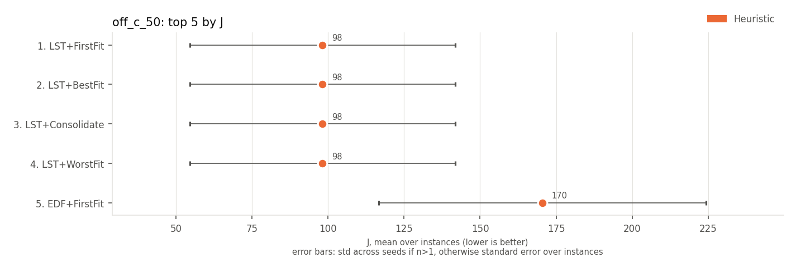 | 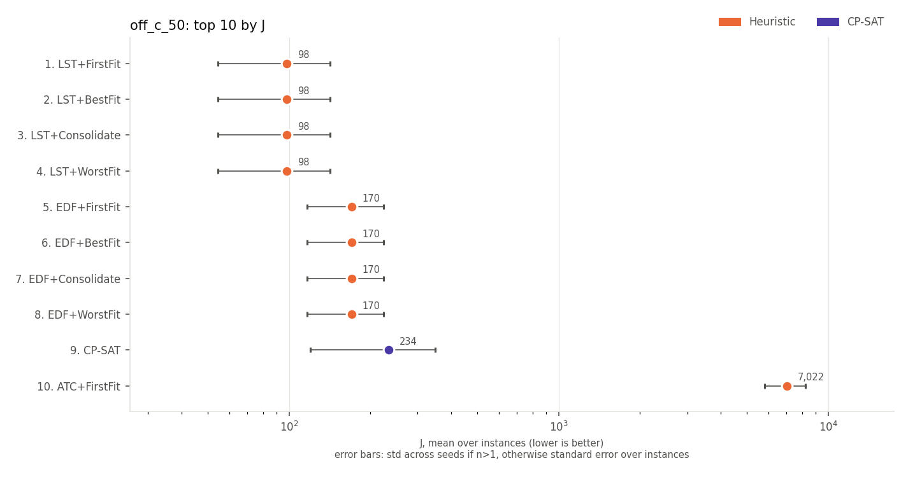 |

## on-time rate (higher is better)

| rank | method | family | on-time rate | J |
|---|---|---|---|---|
| 1 | CP-SAT | CP-SAT | 0.919 +/- 0.132 | 234 +/- 809 |
| 2 | LST+FirstFit | Heuristic | 0.917 +/- 0.139 | 98 +/- 309 |
| 3 | LST+BestFit | Heuristic | 0.917 +/- 0.139 | 98 +/- 309 |
| 4 | LST+Consolidate | Heuristic | 0.917 +/- 0.139 | 98 +/- 309 |
| 5 | LST+WorstFit | Heuristic | 0.917 +/- 0.139 | 98 +/- 309 |
| 6 | EDF+FirstFit | Heuristic | 0.874 +/- 0.151 | 170 +/- 381 |
| 7 | EDF+BestFit | Heuristic | 0.874 +/- 0.151 | 170 +/- 381 |
| 8 | EDF+Consolidate | Heuristic | 0.874 +/- 0.151 | 170 +/- 381 |
| 9 | EDF+WorstFit | Heuristic | 0.874 +/- 0.151 | 170 +/- 381 |
| 10 | ATC+FirstFit | Heuristic | 0.851 +/- 0.061 | 7022 +/- 8619 |

| top 5 | top 10 |
|---|---|
| 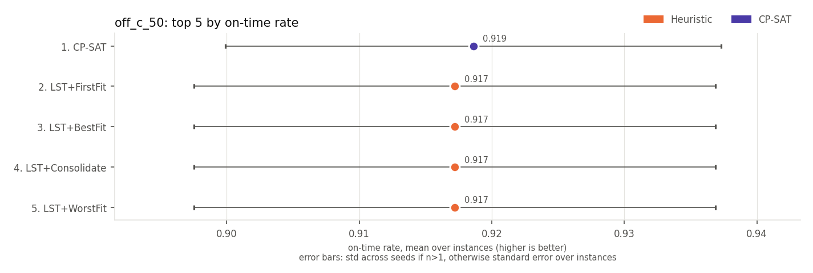 | 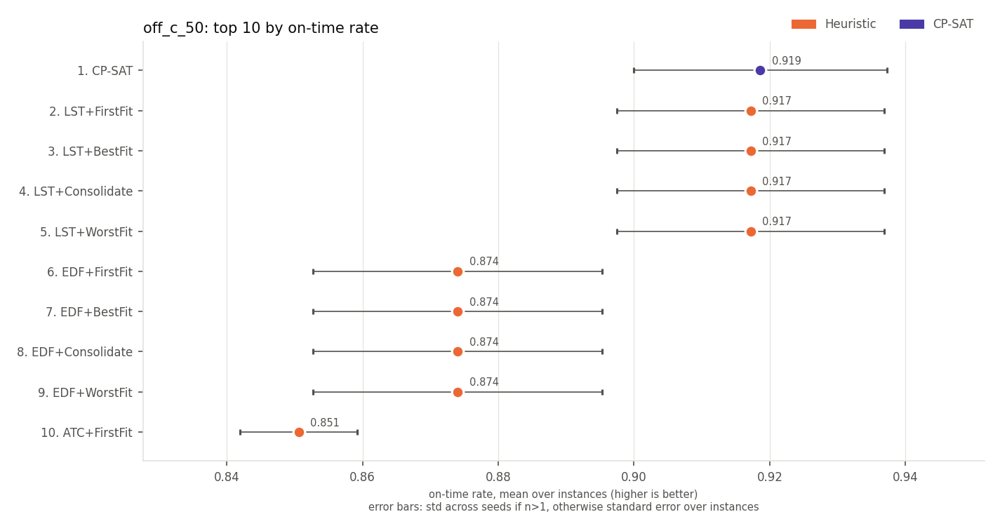 |

## late jobs (lower is better)

| rank | method | family | late jobs | J |
|---|---|---|---|---|
| 1 | CP-SAT | CP-SAT | 8.1 +/- 13.2 | 234 +/- 809 |
| 2 | LST+FirstFit | Heuristic | 8.3 +/- 13.9 | 98 +/- 309 |
| 3 | LST+BestFit | Heuristic | 8.3 +/- 13.9 | 98 +/- 309 |
| 4 | LST+Consolidate | Heuristic | 8.3 +/- 13.9 | 98 +/- 309 |
| 5 | LST+WorstFit | Heuristic | 8.3 +/- 13.9 | 98 +/- 309 |
| 6 | EDF+FirstFit | Heuristic | 12.6 +/- 15.1 | 170 +/- 381 |
| 7 | EDF+BestFit | Heuristic | 12.6 +/- 15.1 | 170 +/- 381 |
| 8 | EDF+Consolidate | Heuristic | 12.6 +/- 15.1 | 170 +/- 381 |
| 9 | EDF+WorstFit | Heuristic | 12.6 +/- 15.1 | 170 +/- 381 |
| 10 | ATC+FirstFit | Heuristic | 14.9 +/- 6.1 | 7022 +/- 8619 |

| top 5 | top 10 |
|---|---|
| 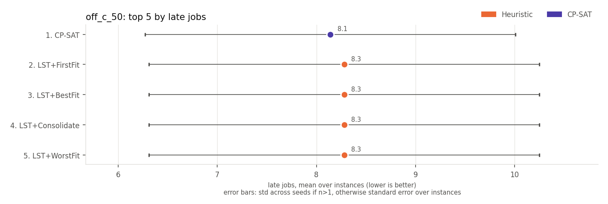 | 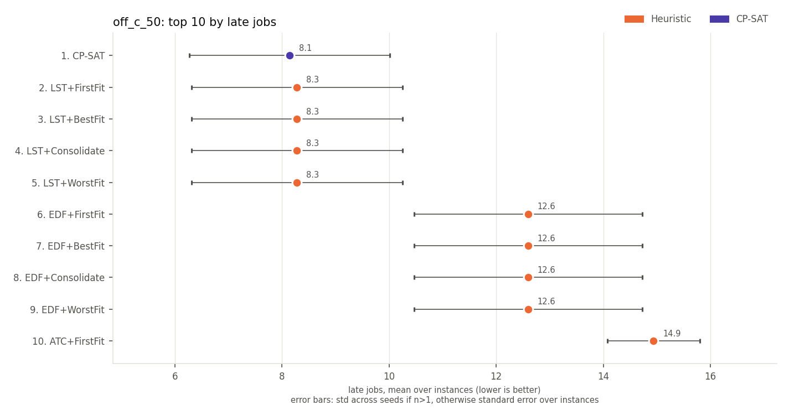 |

## weighted late jobs (lower is better)

Every method has the same value here, so there is no ranking.

## weighted tardiness (lower is better)

| rank | method | family | weighted tardiness | J |
|---|---|---|---|---|
| 1 | LST+FirstFit | Heuristic | 24 +/- 57 | 98 +/- 309 |
| 2 | LST+BestFit | Heuristic | 24 +/- 57 | 98 +/- 309 |
| 3 | LST+Consolidate | Heuristic | 24 +/- 57 | 98 +/- 309 |
| 4 | LST+WorstFit | Heuristic | 24 +/- 57 | 98 +/- 309 |
| 5 | CP-SAT | CP-SAT | 27 +/- 63 | 234 +/- 809 |
| 6 | EDF+FirstFit | Heuristic | 38 +/- 62 | 170 +/- 381 |
| 7 | EDF+BestFit | Heuristic | 38 +/- 62 | 170 +/- 381 |
| 8 | EDF+Consolidate | Heuristic | 38 +/- 62 | 170 +/- 381 |
| 9 | EDF+WorstFit | Heuristic | 38 +/- 62 | 170 +/- 381 |
| 10 | ATC+FirstFit | Heuristic | 205 +/- 168 | 7022 +/- 8619 |

| top 5 | top 10 |
|---|---|
| 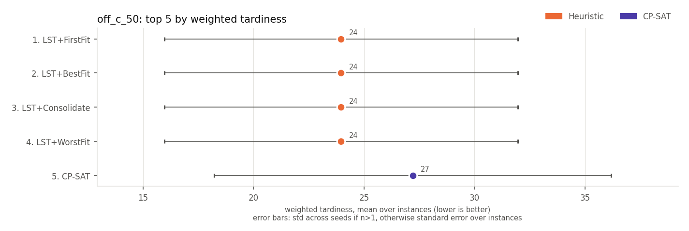 | 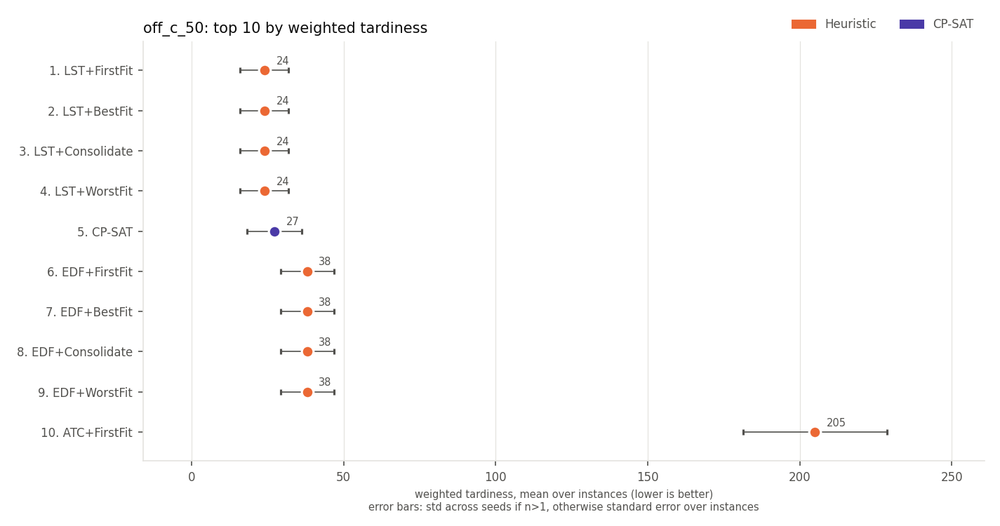 |

## max tardiness (lower is better)

| rank | method | family | max tardiness | J |
|---|---|---|---|---|
| 1 | LST+FirstFit | Heuristic | 1.7 +/- 2.4 | 98 +/- 309 |
| 2 | LST+BestFit | Heuristic | 1.7 +/- 2.4 | 98 +/- 309 |
| 3 | LST+Consolidate | Heuristic | 1.7 +/- 2.4 | 98 +/- 309 |
| 4 | LST+WorstFit | Heuristic | 1.7 +/- 2.4 | 98 +/- 309 |
| 5 | EDF+FirstFit | Heuristic | 3.6 +/- 3.2 | 170 +/- 381 |
| 6 | EDF+BestFit | Heuristic | 3.6 +/- 3.2 | 170 +/- 381 |
| 7 | EDF+Consolidate | Heuristic | 3.6 +/- 3.2 | 170 +/- 381 |
| 8 | EDF+WorstFit | Heuristic | 3.6 +/- 3.2 | 170 +/- 381 |
| 9 | CP-SAT | CP-SAT | 4.0 +/- 9.4 | 234 +/- 809 |
| 10 | RandomRule+FirstFitConsolidate | Heuristic | 35.6 +/- 7.5 | 21215 +/- 9403 |

| top 5 | top 10 |
|---|---|
| 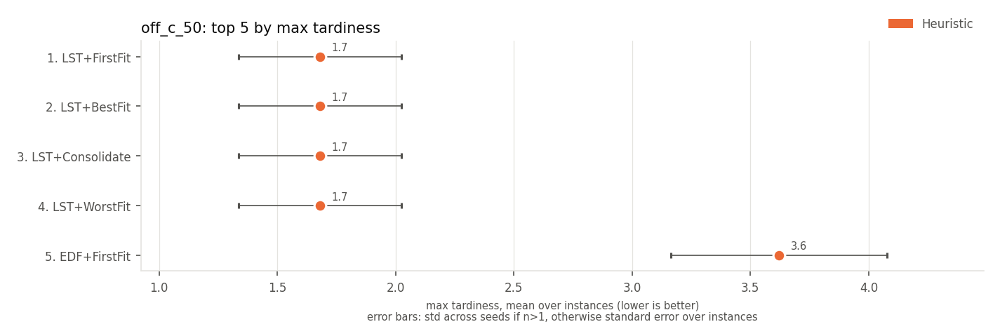 | 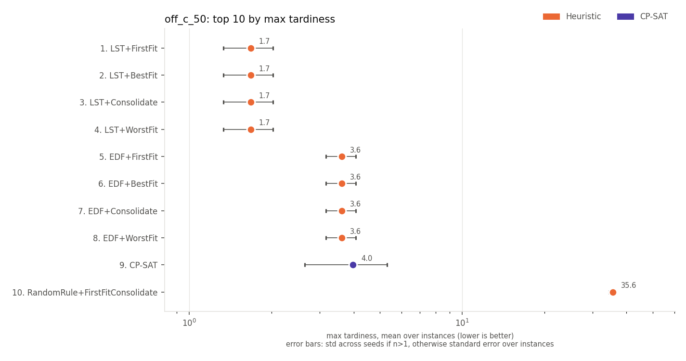 |

## p95 tardiness (lower is better)

| rank | method | family | p95 tardiness | J |
|---|---|---|---|---|
| 1 | LST+FirstFit | Heuristic | 1.1 +/- 1.9 | 98 +/- 309 |
| 2 | LST+BestFit | Heuristic | 1.1 +/- 1.9 | 98 +/- 309 |
| 3 | LST+Consolidate | Heuristic | 1.1 +/- 1.9 | 98 +/- 309 |
| 4 | LST+WorstFit | Heuristic | 1.1 +/- 1.9 | 98 +/- 309 |
| 5 | CP-SAT | CP-SAT | 1.3 +/- 2.6 | 234 +/- 809 |
| 6 | EDF+FirstFit | Heuristic | 1.9 +/- 2.5 | 170 +/- 381 |
| 7 | EDF+BestFit | Heuristic | 1.9 +/- 2.5 | 170 +/- 381 |
| 8 | EDF+Consolidate | Heuristic | 1.9 +/- 2.5 | 170 +/- 381 |
| 9 | EDF+WorstFit | Heuristic | 1.9 +/- 2.5 | 170 +/- 381 |
| 10 | ATC+FirstFit | Heuristic | 13.7 +/- 12.3 | 7022 +/- 8619 |

| top 5 | top 10 |
|---|---|
| 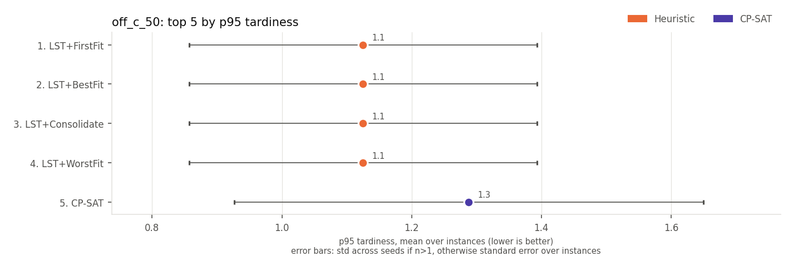 | 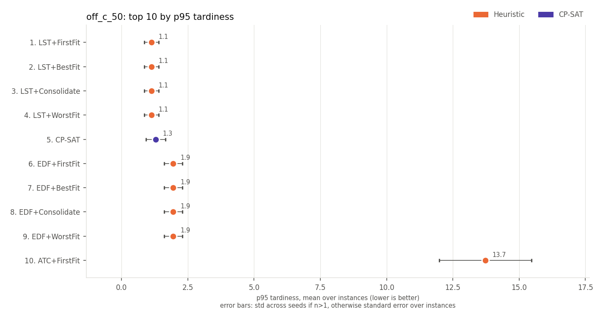 |

## mean wait (lower is better)

| rank | method | family | mean wait | J |
|---|---|---|---|---|
| 1 | LST+FirstFit | Heuristic | 49.50 +/- 0.00 | 98 +/- 309 |
| 2 | LST+BestFit | Heuristic | 49.50 +/- 0.00 | 98 +/- 309 |
| 3 | LST+Consolidate | Heuristic | 49.50 +/- 0.00 | 98 +/- 309 |
| 4 | LST+WorstFit | Heuristic | 49.50 +/- 0.00 | 98 +/- 309 |
| 5 | EDF+FirstFit | Heuristic | 49.50 +/- 0.00 | 170 +/- 381 |
| 6 | EDF+BestFit | Heuristic | 49.50 +/- 0.00 | 170 +/- 381 |
| 7 | EDF+Consolidate | Heuristic | 49.50 +/- 0.00 | 170 +/- 381 |
| 8 | EDF+WorstFit | Heuristic | 49.50 +/- 0.00 | 170 +/- 381 |
| 9 | ATC+FirstFit | Heuristic | 49.50 +/- 0.00 | 7022 +/- 8619 |
| 10 | ATC+BestFit | Heuristic | 49.50 +/- 0.00 | 7022 +/- 8619 |

| top 5 | top 10 |
|---|---|
| 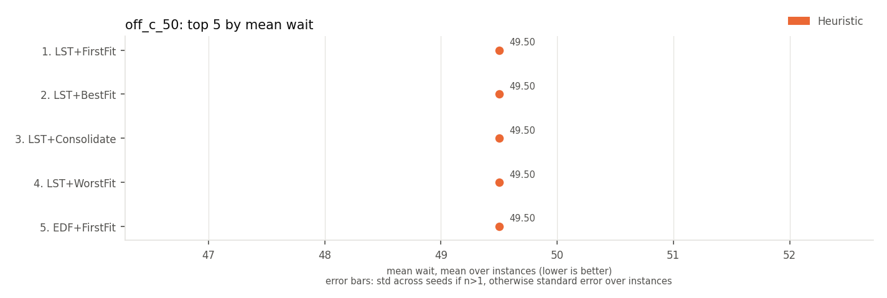 | 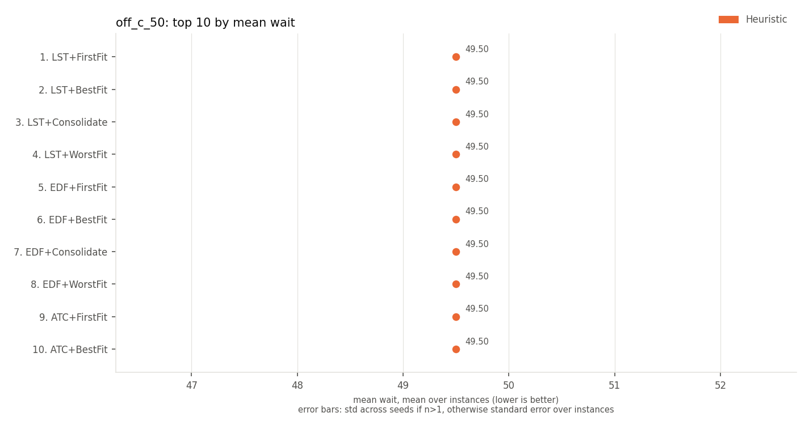 |

## mean flow time (lower is better)

| rank | method | family | mean flow time | J |
|---|---|---|---|---|
| 1 | LST+FirstFit | Heuristic | 54.54 +/- 0.27 | 98 +/- 309 |
| 2 | LST+BestFit | Heuristic | 54.54 +/- 0.27 | 98 +/- 309 |
| 3 | LST+Consolidate | Heuristic | 54.54 +/- 0.27 | 98 +/- 309 |
| 4 | LST+WorstFit | Heuristic | 54.54 +/- 0.27 | 98 +/- 309 |
| 5 | EDF+FirstFit | Heuristic | 54.54 +/- 0.27 | 170 +/- 381 |
| 6 | EDF+BestFit | Heuristic | 54.54 +/- 0.27 | 170 +/- 381 |
| 7 | EDF+Consolidate | Heuristic | 54.54 +/- 0.27 | 170 +/- 381 |
| 8 | EDF+WorstFit | Heuristic | 54.54 +/- 0.27 | 170 +/- 381 |
| 9 | ATC+FirstFit | Heuristic | 54.54 +/- 0.27 | 7022 +/- 8619 |
| 10 | ATC+BestFit | Heuristic | 54.54 +/- 0.27 | 7022 +/- 8619 |

| top 5 | top 10 |
|---|---|
| 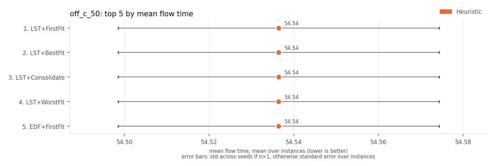 | 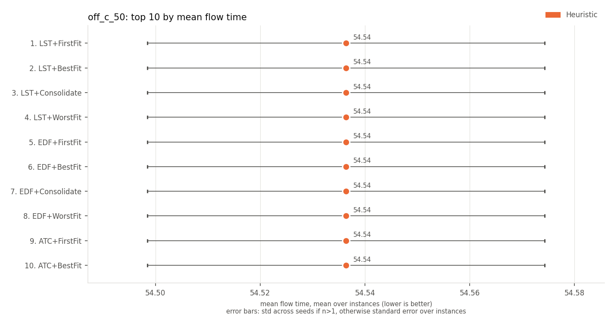 |

## makespan (lower is better)

| rank | method | family | makespan | J |
|---|---|---|---|---|
| 1 | LPT+BestFit | Heuristic | 100.0 +/- 0.0 | 64045 +/- 10792 |
| 2 | LPT+Consolidate | Heuristic | 100.0 +/- 0.0 | 64045 +/- 10792 |
| 3 | LPT+FirstFit | Heuristic | 100.0 +/- 0.0 | 64045 +/- 10792 |
| 4 | LPT+WorstFit | Heuristic | 100.0 +/- 0.0 | 64045 +/- 10792 |
| 5 | LST+FirstFit | Heuristic | 103.6 +/- 1.4 | 98 +/- 309 |
| 6 | LST+BestFit | Heuristic | 103.6 +/- 1.4 | 98 +/- 309 |
| 7 | LST+Consolidate | Heuristic | 103.6 +/- 1.4 | 98 +/- 309 |
| 8 | LST+WorstFit | Heuristic | 103.6 +/- 1.4 | 98 +/- 309 |
| 9 | Random | Heuristic | 105.2 +/- 1.5 | 69559 +/- 12277 |
| 10 | EDF+FirstFit | Heuristic | 105.4 +/- 1.5 | 170 +/- 381 |

| top 5 | top 10 |
|---|---|
| 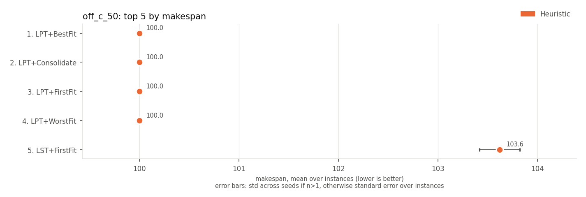 | 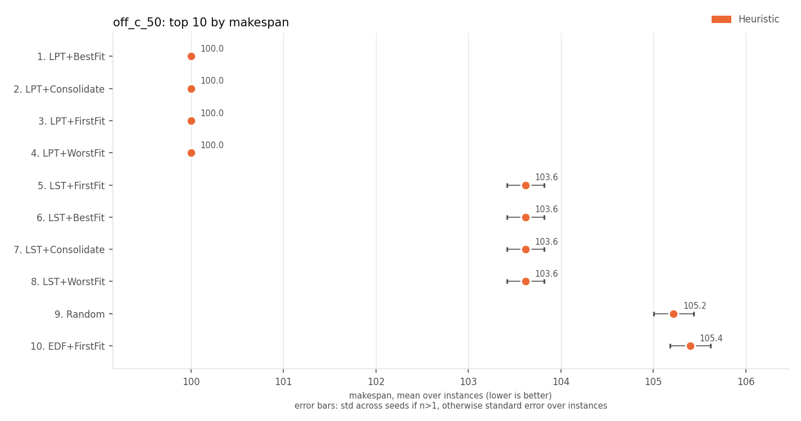 |

## utilisation of active machines (higher is better)

| rank | method | family | utilisation of active machines | J |
|---|---|---|---|---|
| 1 | LPT+Consolidate | Heuristic | 0.665 +/- 0.022 | 64045 +/- 10792 |
| 2 | LPT+BestFit | Heuristic | 0.648 +/- 0.025 | 64045 +/- 10792 |
| 3 | SPT+Consolidate | Heuristic | 0.647 +/- 0.024 | 75534 +/- 12870 |
| 4 | WSPT+Consolidate | Heuristic | 0.647 +/- 0.024 | 75534 +/- 12870 |
| 5 | LPT+FirstFit | Heuristic | 0.647 +/- 0.022 | 64045 +/- 10792 |
| 6 | EDF+Consolidate | Heuristic | 0.645 +/- 0.017 | 170 +/- 381 |
| 7 | FCFS+Consolidate | Heuristic | 0.645 +/- 0.020 | 67720 +/- 11063 |
| 8 | ATC+Consolidate | Heuristic | 0.643 +/- 0.020 | 7022 +/- 8619 |
| 9 | LST+Consolidate | Heuristic | 0.643 +/- 0.020 | 98 +/- 309 |
| 10 | SPT+FirstFit | Heuristic | 0.629 +/- 0.023 | 75534 +/- 12870 |

| top 5 | top 10 |
|---|---|
| 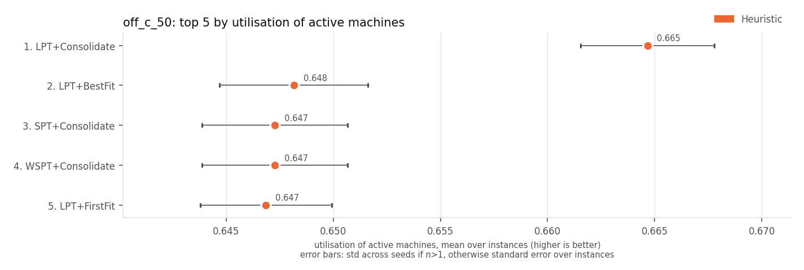 | 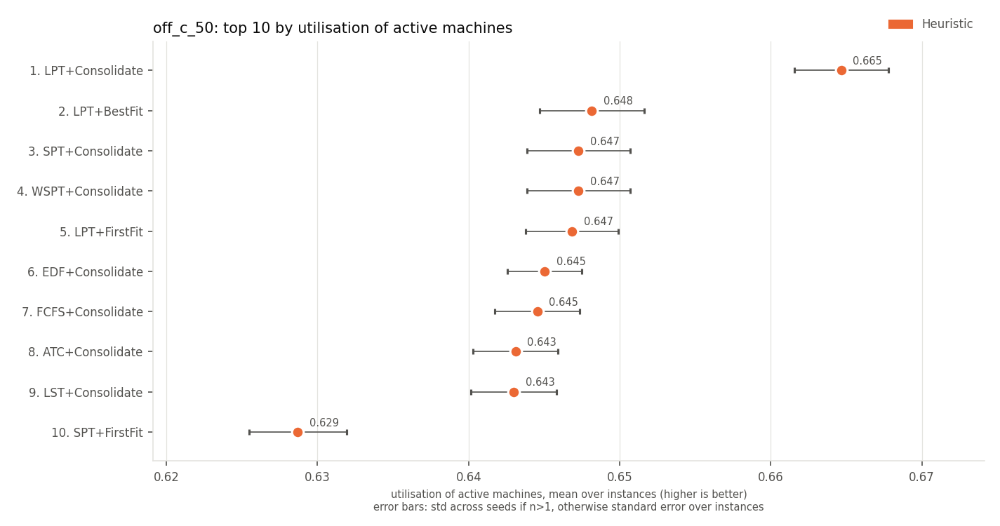 |

## active machine-ticks (lower is better)

| rank | method | family | active machine-ticks | J |
|---|---|---|---|---|
| 1 | LPT+Consolidate | Heuristic | 162 +/- 9 | 64045 +/- 10792 |
| 2 | LPT+BestFit | Heuristic | 165 +/- 10 | 64045 +/- 10792 |
| 3 | LPT+FirstFit | Heuristic | 166 +/- 10 | 64045 +/- 10792 |
| 4 | SPT+Consolidate | Heuristic | 167 +/- 7 | 75534 +/- 12870 |
| 5 | WSPT+Consolidate | Heuristic | 167 +/- 7 | 75534 +/- 12870 |
| 6 | FCFS+Consolidate | Heuristic | 167 +/- 11 | 67720 +/- 11063 |
| 7 | EDF+Consolidate | Heuristic | 167 +/- 11 | 170 +/- 381 |
| 8 | LST+Consolidate | Heuristic | 168 +/- 10 | 98 +/- 309 |
| 9 | ATC+Consolidate | Heuristic | 168 +/- 10 | 7022 +/- 8619 |
| 10 | SPT+FirstFit | Heuristic | 172 +/- 9 | 75534 +/- 12870 |

| top 5 | top 10 |
|---|---|
| 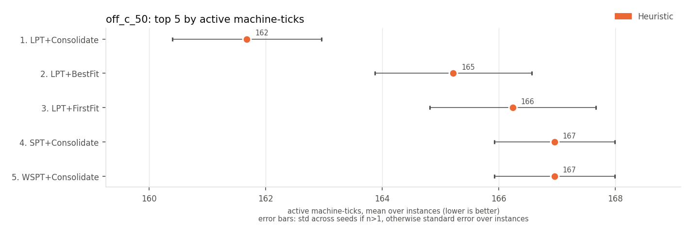 | 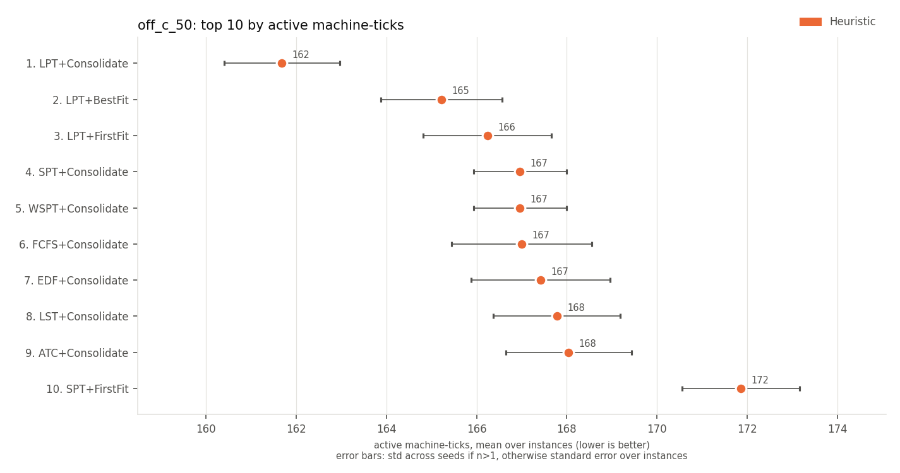 |

## energy (SPECpower) (lower is better)

| rank | method | family | energy (SPECpower) | J |
|---|---|---|---|---|
| 1 | LPT+Consolidate | Heuristic | 139 +/- 8 | 64045 +/- 10792 |
| 2 | LPT+BestFit | Heuristic | 141 +/- 8 | 64045 +/- 10792 |
| 3 | LPT+FirstFit | Heuristic | 142 +/- 9 | 64045 +/- 10792 |
| 4 | FCFS+Consolidate | Heuristic | 143 +/- 9 | 67720 +/- 11063 |
| 5 | SPT+Consolidate | Heuristic | 143 +/- 7 | 75534 +/- 12870 |
| 6 | WSPT+Consolidate | Heuristic | 143 +/- 7 | 75534 +/- 12870 |
| 7 | EDF+Consolidate | Heuristic | 143 +/- 9 | 170 +/- 381 |
| 8 | LST+Consolidate | Heuristic | 143 +/- 9 | 98 +/- 309 |
| 9 | ATC+Consolidate | Heuristic | 143 +/- 8 | 7022 +/- 8619 |
| 10 | SPT+FirstFit | Heuristic | 146 +/- 8 | 75534 +/- 12870 |

| top 5 | top 10 |
|---|---|
| 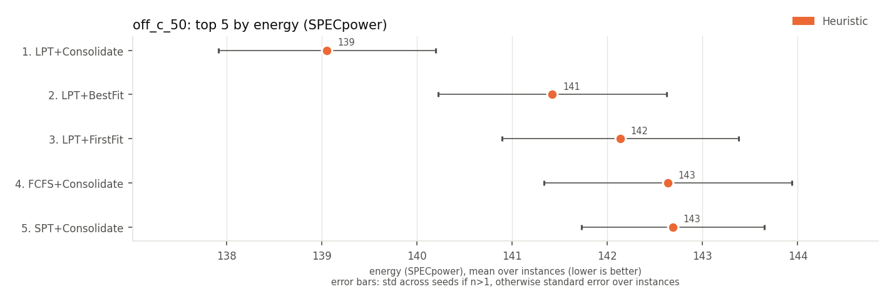 | 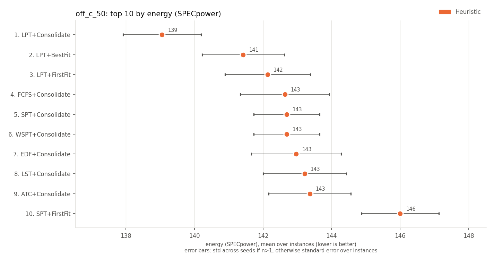 |

Spread (+/-): std across seeds for multi-seed RL rows, otherwise std across instances.
