# off_tf02: leaderboards

Top 10 methods on each metric. Full ranking by J: [`tables/off_tf02.md`](../tables/off_tf02.md). Archive overview: [`HIGHLIGHTS.md`](../HIGHLIGHTS.md).

## J (lower is better)

| rank | method | family | J |
|---|---|---|---|
| 1 | EDF+FirstFit | Heuristic | 0 +/- 0 |
| 2 | EDF+BestFit | Heuristic | 0 +/- 0 |
| 3 | EDF+Consolidate | Heuristic | 0 +/- 0 |
| 4 | EDF+WorstFit | Heuristic | 0 +/- 0 |
| 5 | LST+FirstFit | Heuristic | 0 +/- 0 |
| 6 | LST+BestFit | Heuristic | 0 +/- 0 |
| 7 | LST+Consolidate | Heuristic | 0 +/- 0 |
| 8 | LST+WorstFit | Heuristic | 0 +/- 0 |
| 9 | WLST+FirstFit | Heuristic | 0 +/- 0 |
| 10 | WLST+BestFit | Heuristic | 0 +/- 0 |

| top 5 | top 10 |
|---|---|
| 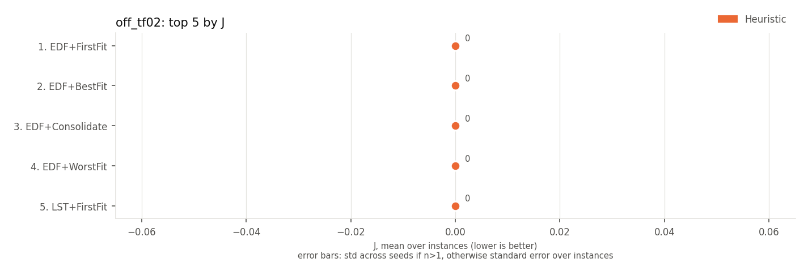 | 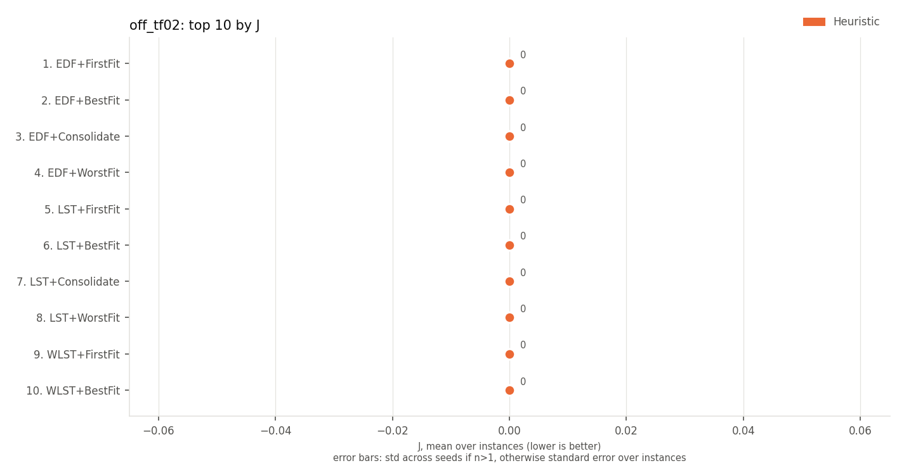 |

## on-time rate (higher is better)

| rank | method | family | on-time rate | J |
|---|---|---|---|---|
| 1 | EDF+FirstFit | Heuristic | 1.000 +/- 0.000 | 0 +/- 0 |
| 2 | EDF+BestFit | Heuristic | 1.000 +/- 0.000 | 0 +/- 0 |
| 3 | EDF+Consolidate | Heuristic | 1.000 +/- 0.000 | 0 +/- 0 |
| 4 | EDF+WorstFit | Heuristic | 1.000 +/- 0.000 | 0 +/- 0 |
| 5 | LST+FirstFit | Heuristic | 1.000 +/- 0.000 | 0 +/- 0 |
| 6 | LST+BestFit | Heuristic | 1.000 +/- 0.000 | 0 +/- 0 |
| 7 | LST+Consolidate | Heuristic | 1.000 +/- 0.000 | 0 +/- 0 |
| 8 | LST+WorstFit | Heuristic | 1.000 +/- 0.000 | 0 +/- 0 |
| 9 | WLST+FirstFit | Heuristic | 1.000 +/- 0.000 | 0 +/- 0 |
| 10 | WLST+BestFit | Heuristic | 1.000 +/- 0.000 | 0 +/- 0 |

| top 5 | top 10 |
|---|---|
| 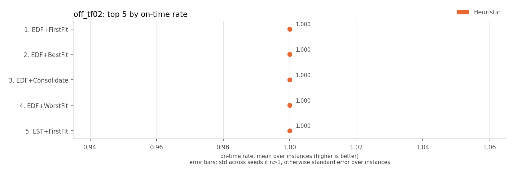 | 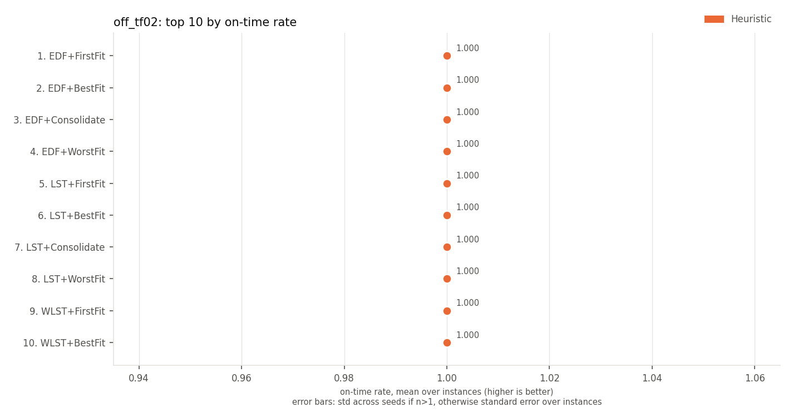 |

## late jobs (lower is better)

| rank | method | family | late jobs | J |
|---|---|---|---|---|
| 1 | EDF+FirstFit | Heuristic | 0.0 +/- 0.0 | 0 +/- 0 |
| 2 | EDF+BestFit | Heuristic | 0.0 +/- 0.0 | 0 +/- 0 |
| 3 | EDF+Consolidate | Heuristic | 0.0 +/- 0.0 | 0 +/- 0 |
| 4 | EDF+WorstFit | Heuristic | 0.0 +/- 0.0 | 0 +/- 0 |
| 5 | LST+FirstFit | Heuristic | 0.0 +/- 0.0 | 0 +/- 0 |
| 6 | LST+BestFit | Heuristic | 0.0 +/- 0.0 | 0 +/- 0 |
| 7 | LST+Consolidate | Heuristic | 0.0 +/- 0.0 | 0 +/- 0 |
| 8 | LST+WorstFit | Heuristic | 0.0 +/- 0.0 | 0 +/- 0 |
| 9 | WLST+FirstFit | Heuristic | 0.0 +/- 0.0 | 0 +/- 0 |
| 10 | WLST+BestFit | Heuristic | 0.0 +/- 0.0 | 0 +/- 0 |

| top 5 | top 10 |
|---|---|
| 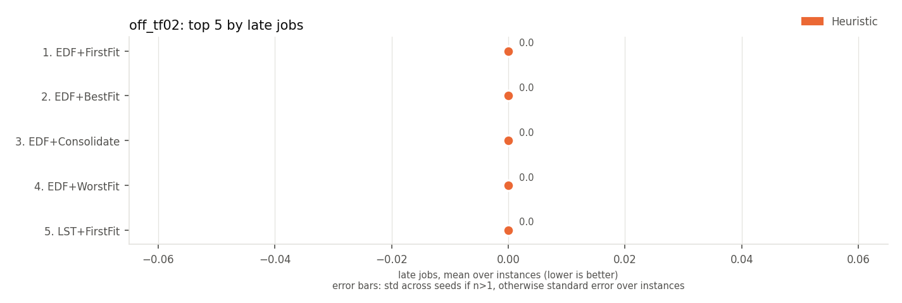 | 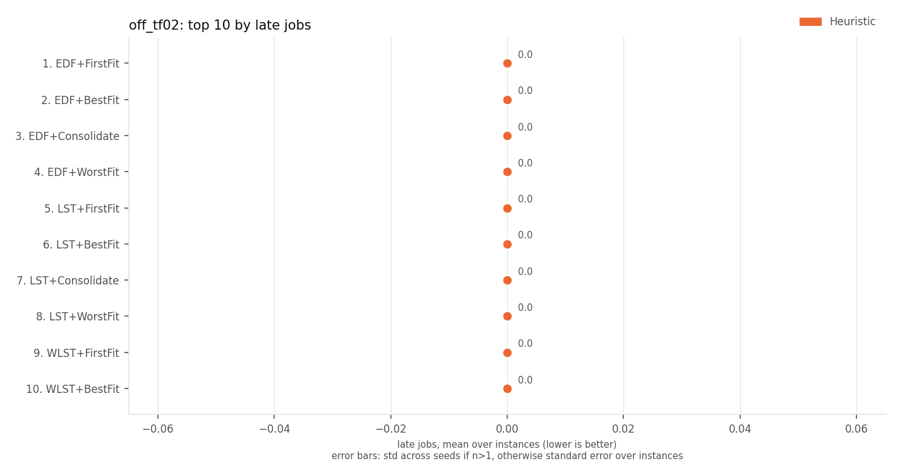 |

## weighted late jobs (lower is better)

Every method has the same value here, so there is no ranking.

## weighted tardiness (lower is better)

| rank | method | family | weighted tardiness | J |
|---|---|---|---|---|
| 1 | EDF+FirstFit | Heuristic | 0 +/- 0 | 0 +/- 0 |
| 2 | EDF+BestFit | Heuristic | 0 +/- 0 | 0 +/- 0 |
| 3 | EDF+Consolidate | Heuristic | 0 +/- 0 | 0 +/- 0 |
| 4 | EDF+WorstFit | Heuristic | 0 +/- 0 | 0 +/- 0 |
| 5 | LST+FirstFit | Heuristic | 0 +/- 0 | 0 +/- 0 |
| 6 | LST+BestFit | Heuristic | 0 +/- 0 | 0 +/- 0 |
| 7 | LST+Consolidate | Heuristic | 0 +/- 0 | 0 +/- 0 |
| 8 | LST+WorstFit | Heuristic | 0 +/- 0 | 0 +/- 0 |
| 9 | WLST+FirstFit | Heuristic | 0 +/- 0 | 0 +/- 0 |
| 10 | WLST+BestFit | Heuristic | 0 +/- 0 | 0 +/- 0 |

| top 5 | top 10 |
|---|---|
| 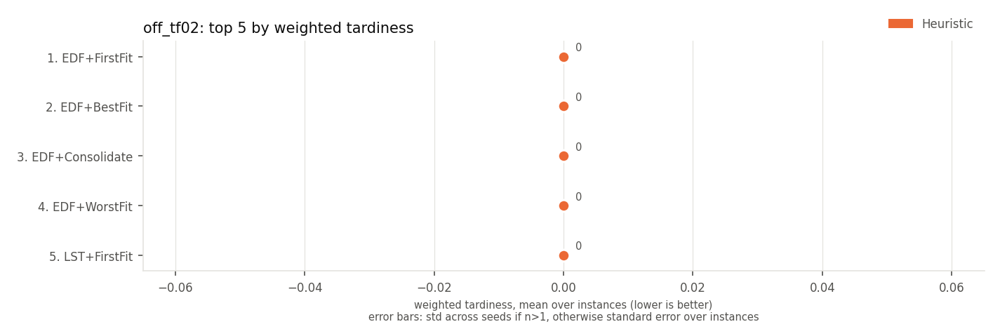 | 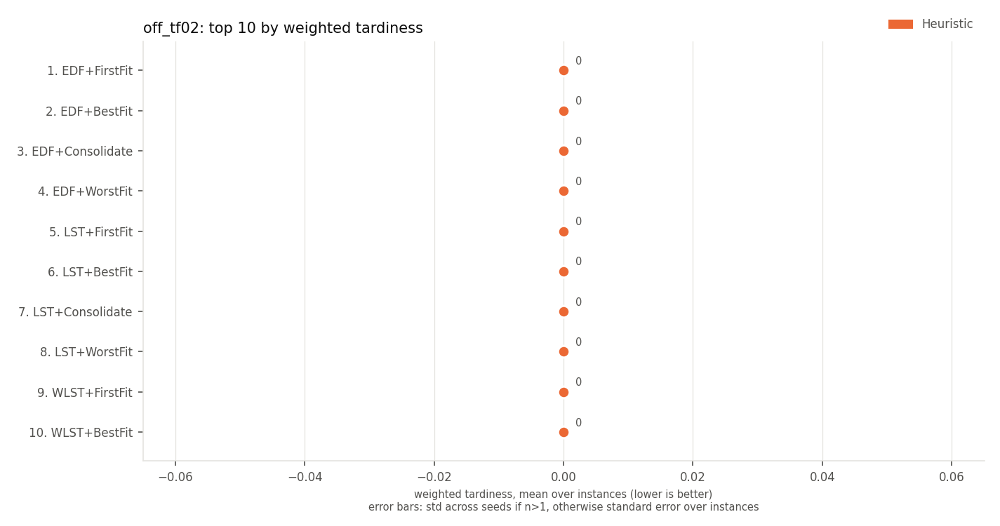 |

## max tardiness (lower is better)

| rank | method | family | max tardiness | J |
|---|---|---|---|---|
| 1 | EDF+FirstFit | Heuristic | 0.0 +/- 0.0 | 0 +/- 0 |
| 2 | EDF+BestFit | Heuristic | 0.0 +/- 0.0 | 0 +/- 0 |
| 3 | EDF+Consolidate | Heuristic | 0.0 +/- 0.0 | 0 +/- 0 |
| 4 | EDF+WorstFit | Heuristic | 0.0 +/- 0.0 | 0 +/- 0 |
| 5 | LST+FirstFit | Heuristic | 0.0 +/- 0.0 | 0 +/- 0 |
| 6 | LST+BestFit | Heuristic | 0.0 +/- 0.0 | 0 +/- 0 |
| 7 | LST+Consolidate | Heuristic | 0.0 +/- 0.0 | 0 +/- 0 |
| 8 | LST+WorstFit | Heuristic | 0.0 +/- 0.0 | 0 +/- 0 |
| 9 | WLST+FirstFit | Heuristic | 0.0 +/- 0.0 | 0 +/- 0 |
| 10 | WLST+BestFit | Heuristic | 0.0 +/- 0.0 | 0 +/- 0 |

| top 5 | top 10 |
|---|---|
|  | 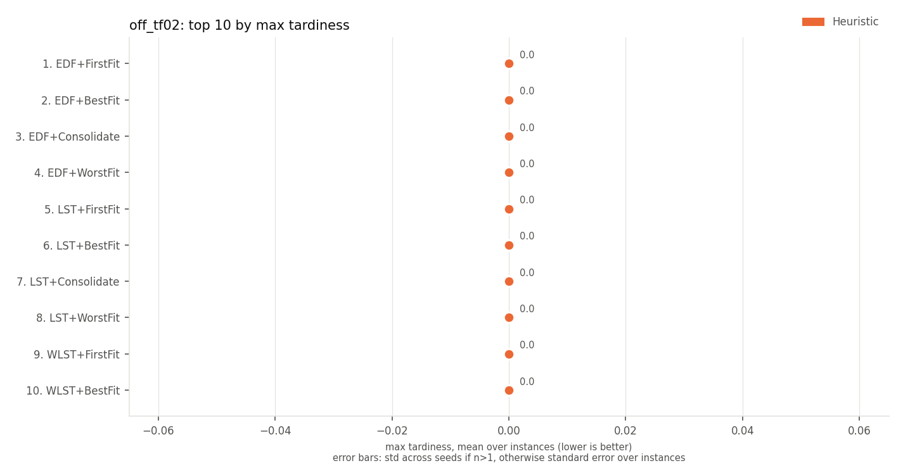 |

## p95 tardiness (lower is better)

| rank | method | family | p95 tardiness | J |
|---|---|---|---|---|
| 1 | EDF+FirstFit | Heuristic | 0.0 +/- 0.0 | 0 +/- 0 |
| 2 | EDF+BestFit | Heuristic | 0.0 +/- 0.0 | 0 +/- 0 |
| 3 | EDF+Consolidate | Heuristic | 0.0 +/- 0.0 | 0 +/- 0 |
| 4 | EDF+WorstFit | Heuristic | 0.0 +/- 0.0 | 0 +/- 0 |
| 5 | LST+FirstFit | Heuristic | 0.0 +/- 0.0 | 0 +/- 0 |
| 6 | LST+BestFit | Heuristic | 0.0 +/- 0.0 | 0 +/- 0 |
| 7 | LST+Consolidate | Heuristic | 0.0 +/- 0.0 | 0 +/- 0 |
| 8 | LST+WorstFit | Heuristic | 0.0 +/- 0.0 | 0 +/- 0 |
| 9 | WLST+FirstFit | Heuristic | 0.0 +/- 0.0 | 0 +/- 0 |
| 10 | WLST+BestFit | Heuristic | 0.0 +/- 0.0 | 0 +/- 0 |

| top 5 | top 10 |
|---|---|
| 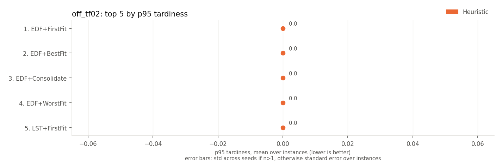 |  |

## mean wait (lower is better)

Every method has the same value here, so there is no ranking.

## mean flow time (lower is better)

Every method has the same value here, so there is no ranking.

## makespan (lower is better)

| rank | method | family | makespan | J |
|---|---|---|---|---|
| 1 | LPT+BestFit | Heuristic | 100.0 +/- 0.0 | 30320 +/- 8473 |
| 2 | LPT+Consolidate | Heuristic | 100.0 +/- 0.0 | 30320 +/- 8473 |
| 3 | LPT+FirstFit | Heuristic | 100.0 +/- 0.0 | 30320 +/- 8473 |
| 4 | LPT+WorstFit | Heuristic | 100.0 +/- 0.0 | 30320 +/- 8473 |
| 5 | LST+FirstFit | Heuristic | 102.3 +/- 1.4 | 0 +/- 0 |
| 6 | LST+BestFit | Heuristic | 102.3 +/- 1.4 | 0 +/- 0 |
| 7 | LST+Consolidate | Heuristic | 102.3 +/- 1.4 | 0 +/- 0 |
| 8 | LST+WorstFit | Heuristic | 102.3 +/- 1.4 | 0 +/- 0 |
| 9 | MDC+FirstFit | Heuristic | 102.3 +/- 1.4 | 0 +/- 0 |
| 10 | MDC+BestFit | Heuristic | 102.3 +/- 1.4 | 0 +/- 0 |

| top 5 | top 10 |
|---|---|
| 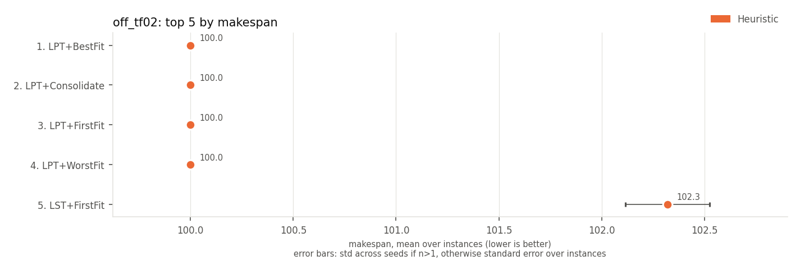 | 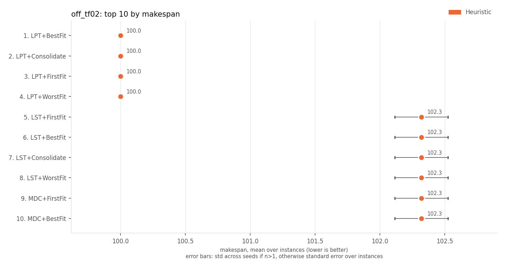 |

## utilisation of active machines (higher is better)

| rank | method | family | utilisation of active machines | J |
|---|---|---|---|---|
| 1 | LPT+Consolidate | Heuristic | 0.665 +/- 0.022 | 30320 +/- 8473 |
| 2 | LST+Consolidate | Heuristic | 0.650 +/- 0.021 | 0 +/- 0 |
| 3 | MDC+Consolidate | Heuristic | 0.650 +/- 0.021 | 0 +/- 0 |
| 4 | LPT+BestFit | Heuristic | 0.648 +/- 0.025 | 30320 +/- 8473 |
| 5 | SPT+Consolidate | Heuristic | 0.647 +/- 0.024 | 46496 +/- 11434 |
| 6 | LPT+FirstFit | Heuristic | 0.647 +/- 0.022 | 30320 +/- 8473 |
| 7 | WEDF+Consolidate | Heuristic | 0.646 +/- 0.021 | 26 +/- 24 |
| 8 | FCFS+Consolidate | Heuristic | 0.645 +/- 0.020 | 36198 +/- 10404 |
| 9 | WLST+Consolidate | Heuristic | 0.644 +/- 0.021 | 0 +/- 0 |
| 10 | EDF+Consolidate | Heuristic | 0.640 +/- 0.019 | 0 +/- 0 |

| top 5 | top 10 |
|---|---|
| 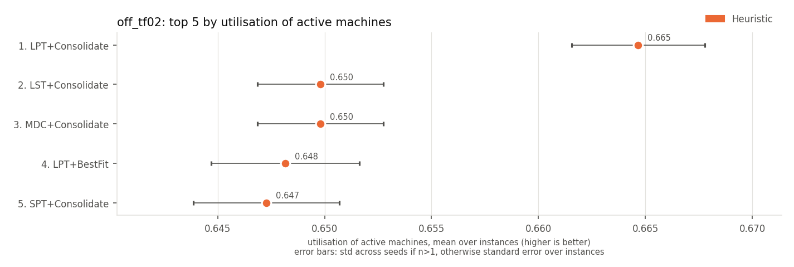 | 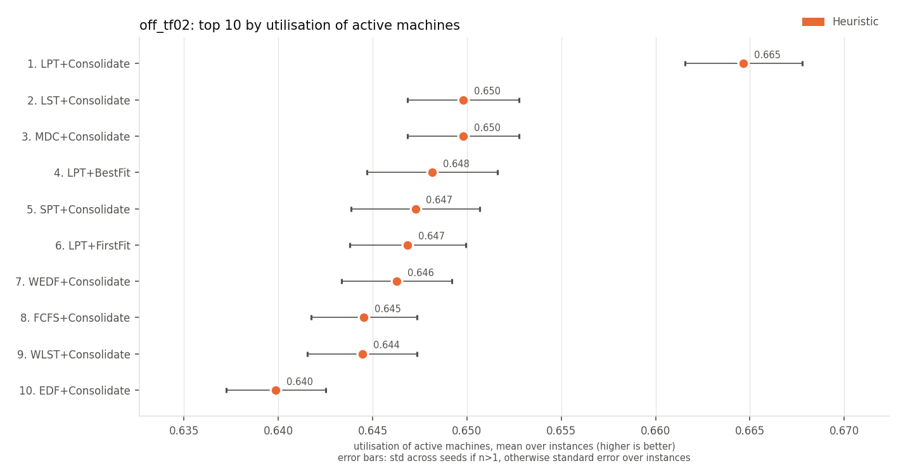 |

## active machine-ticks (lower is better)

| rank | method | family | active machine-ticks | J |
|---|---|---|---|---|
| 1 | LPT+Consolidate | Heuristic | 162 +/- 9 | 30320 +/- 8473 |
| 2 | LPT+BestFit | Heuristic | 165 +/- 10 | 30320 +/- 8473 |
| 3 | LST+Consolidate | Heuristic | 166 +/- 9 | 0 +/- 0 |
| 4 | MDC+Consolidate | Heuristic | 166 +/- 9 | 0 +/- 0 |
| 5 | LPT+FirstFit | Heuristic | 166 +/- 10 | 30320 +/- 8473 |
| 6 | WEDF+Consolidate | Heuristic | 166 +/- 11 | 26 +/- 24 |
| 7 | WLST+Consolidate | Heuristic | 167 +/- 9 | 0 +/- 0 |
| 8 | SPT+Consolidate | Heuristic | 167 +/- 7 | 46496 +/- 11434 |
| 9 | FCFS+Consolidate | Heuristic | 167 +/- 11 | 36198 +/- 10404 |
| 10 | EDF+Consolidate | Heuristic | 169 +/- 11 | 0 +/- 0 |

| top 5 | top 10 |
|---|---|
| 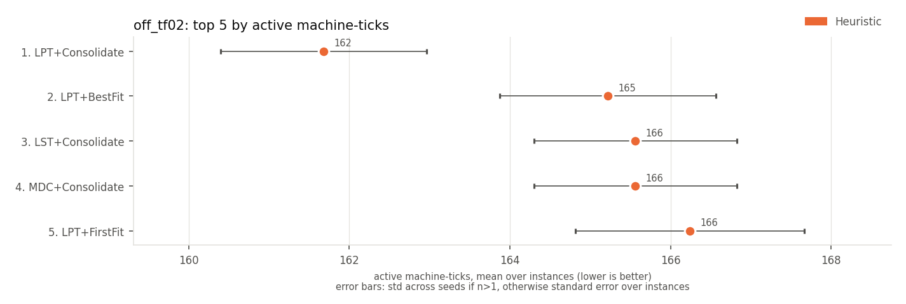 | 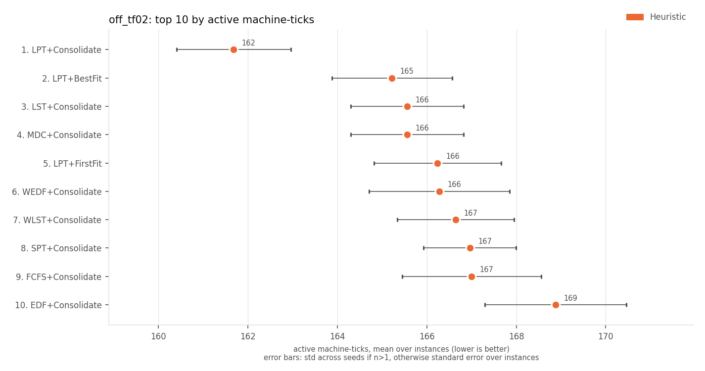 |

## energy (SPECpower) (lower is better)

| rank | method | family | energy (SPECpower) | J |
|---|---|---|---|---|
| 1 | LPT+Consolidate | Heuristic | 139 +/- 8 | 30320 +/- 8473 |
| 2 | LPT+BestFit | Heuristic | 141 +/- 8 | 30320 +/- 8473 |
| 3 | LST+Consolidate | Heuristic | 142 +/- 8 | 0 +/- 0 |
| 4 | MDC+Consolidate | Heuristic | 142 +/- 8 | 0 +/- 0 |
| 5 | LPT+FirstFit | Heuristic | 142 +/- 9 | 30320 +/- 8473 |
| 6 | WEDF+Consolidate | Heuristic | 142 +/- 10 | 26 +/- 24 |
| 7 | WLST+Consolidate | Heuristic | 142 +/- 8 | 0 +/- 0 |
| 8 | FCFS+Consolidate | Heuristic | 143 +/- 9 | 36198 +/- 10404 |
| 9 | SPT+Consolidate | Heuristic | 143 +/- 7 | 46496 +/- 11434 |
| 10 | EDF+Consolidate | Heuristic | 144 +/- 10 | 0 +/- 0 |

| top 5 | top 10 |
|---|---|
| 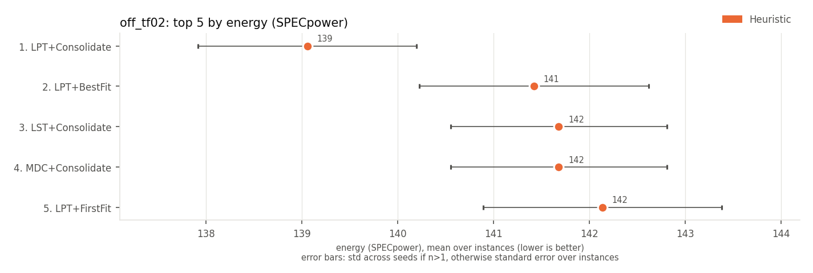 | 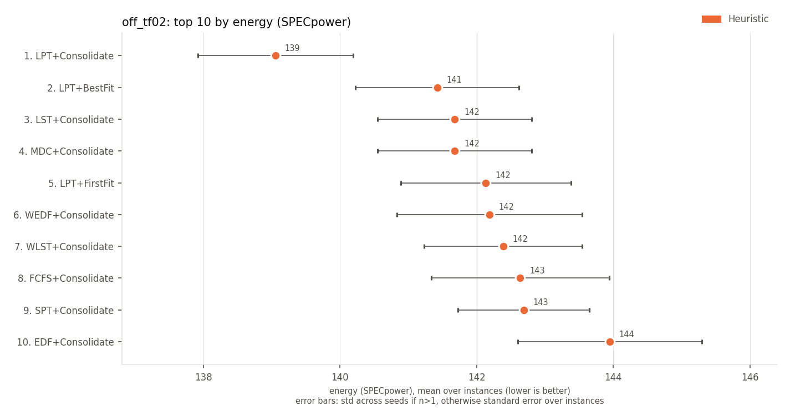 |

Spread (+/-): std across seeds for multi-seed RL rows, otherwise std across instances.
