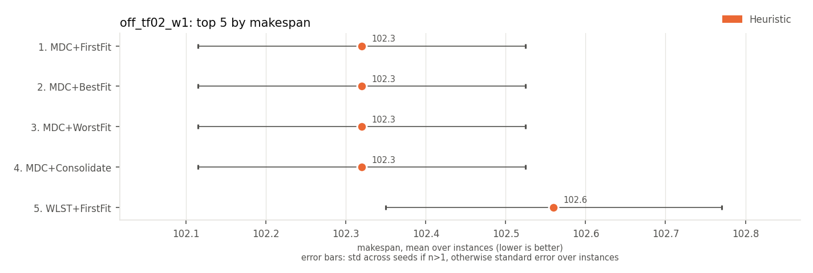
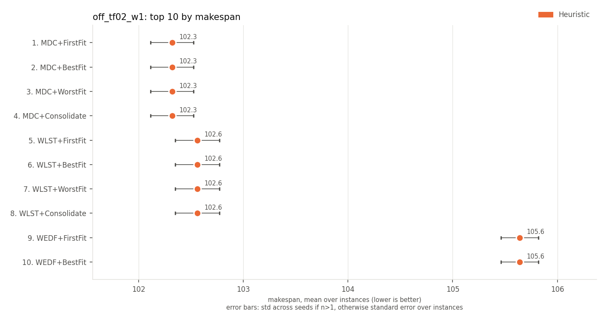
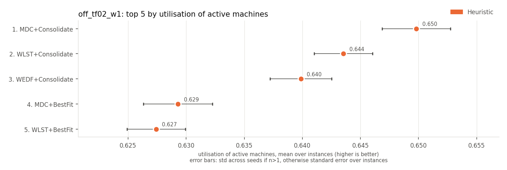
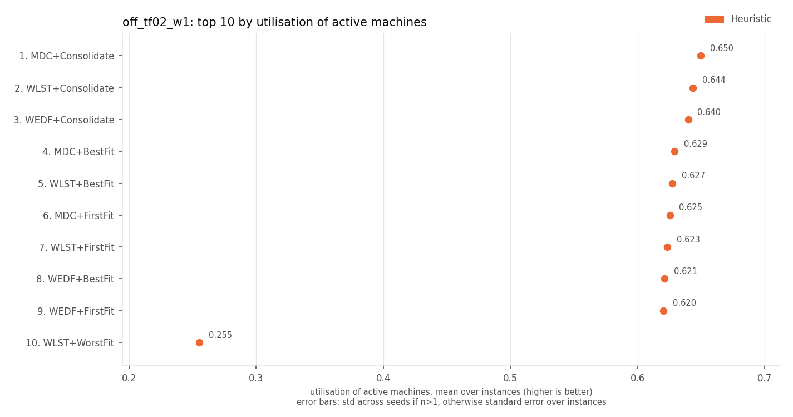
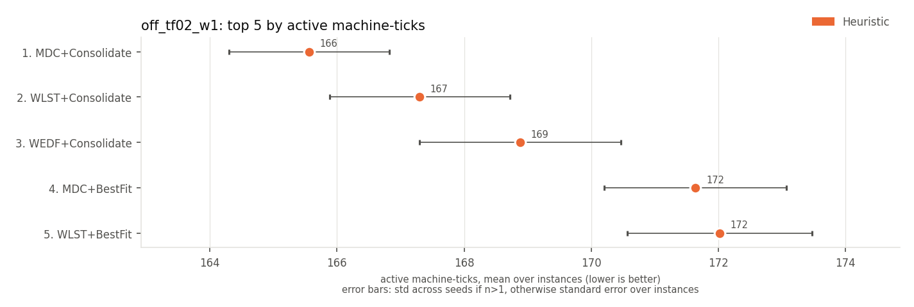
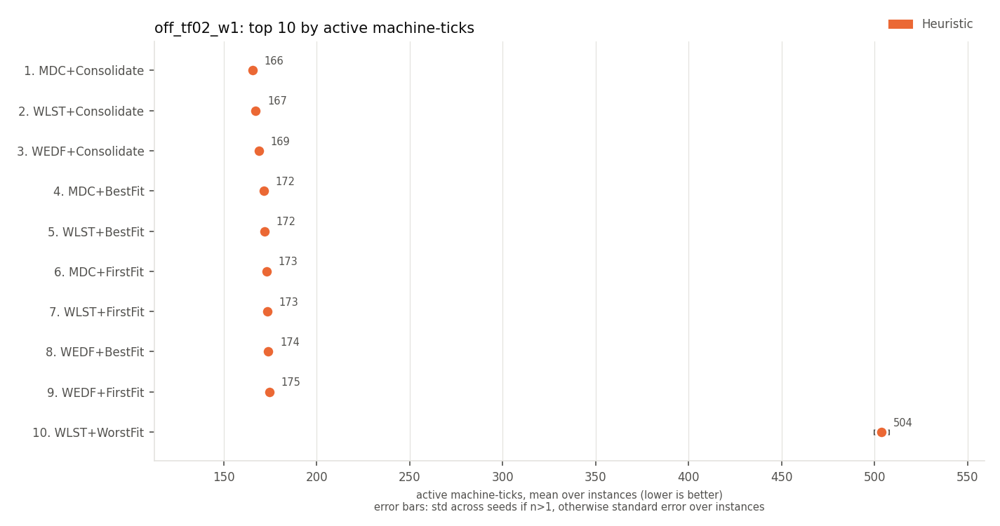
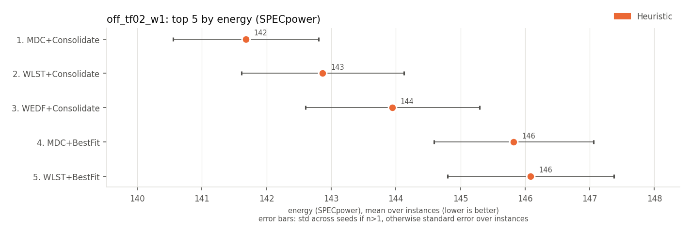
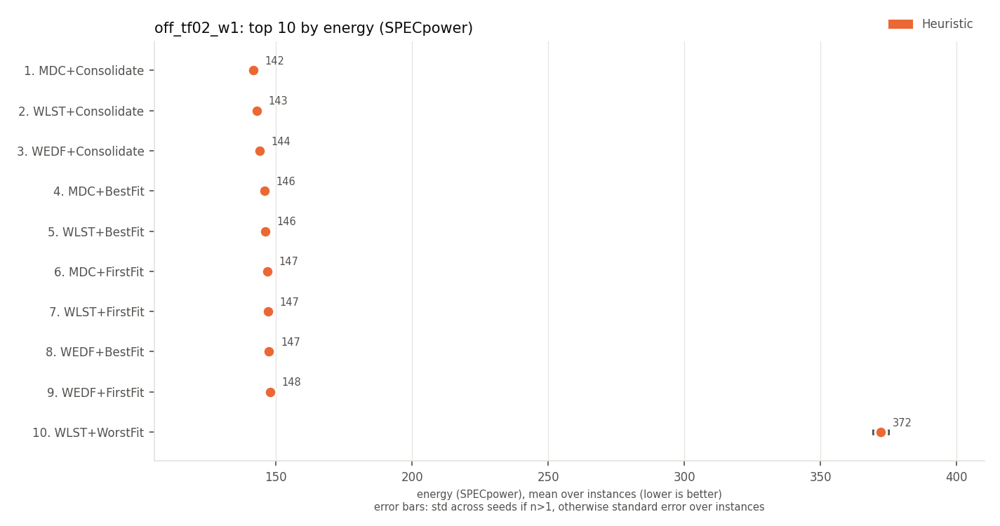

# off_tf02_w1: leaderboards

Top 10 methods on each metric. Full ranking by J: [`tables/off_tf02_w1.md`](../tables/off_tf02_w1.md). Archive overview: [`HIGHLIGHTS.md`](../HIGHLIGHTS.md).

## J (lower is better)

Every method has the same value here, so there is no ranking.

## on-time rate (higher is better)

Every method has the same value here, so there is no ranking.

## late jobs (lower is better)

Every method has the same value here, so there is no ranking.

## weighted late jobs (lower is better)

Every method has the same value here, so there is no ranking.

## weighted tardiness (lower is better)

Every method has the same value here, so there is no ranking.

## max tardiness (lower is better)

Every method has the same value here, so there is no ranking.

## p95 tardiness (lower is better)

Every method has the same value here, so there is no ranking.

## mean wait (lower is better)

Every method has the same value here, so there is no ranking.

## mean flow time (lower is better)

Every method has the same value here, so there is no ranking.

## makespan (lower is better)

| rank | method | family | makespan | J |
|---|---|---|---|---|
| 1 | MDC+FirstFit | Heuristic | 102.3 +/- 1.4 | 0 +/- 0 |
| 2 | MDC+BestFit | Heuristic | 102.3 +/- 1.4 | 0 +/- 0 |
| 3 | MDC+WorstFit | Heuristic | 102.3 +/- 1.4 | 0 +/- 0 |
| 4 | MDC+Consolidate | Heuristic | 102.3 +/- 1.4 | 0 +/- 0 |
| 5 | WLST+FirstFit | Heuristic | 102.6 +/- 1.5 | 0 +/- 0 |
| 6 | WLST+BestFit | Heuristic | 102.6 +/- 1.5 | 0 +/- 0 |
| 7 | WLST+WorstFit | Heuristic | 102.6 +/- 1.5 | 0 +/- 0 |
| 8 | WLST+Consolidate | Heuristic | 102.6 +/- 1.5 | 0 +/- 0 |
| 9 | WEDF+FirstFit | Heuristic | 105.6 +/- 1.3 | 0 +/- 0 |
| 10 | WEDF+BestFit | Heuristic | 105.6 +/- 1.3 | 0 +/- 0 |

| top 5 | top 10 |
|---|---|
|  |  |

## utilisation of active machines (higher is better)

| rank | method | family | utilisation of active machines | J |
|---|---|---|---|---|
| 1 | MDC+Consolidate | Heuristic | 0.650 +/- 0.021 | 0 +/- 0 |
| 2 | WLST+Consolidate | Heuristic | 0.644 +/- 0.018 | 0 +/- 0 |
| 3 | WEDF+Consolidate | Heuristic | 0.640 +/- 0.019 | 0 +/- 0 |
| 4 | MDC+BestFit | Heuristic | 0.629 +/- 0.021 | 0 +/- 0 |
| 5 | WLST+BestFit | Heuristic | 0.627 +/- 0.018 | 0 +/- 0 |
| 6 | MDC+FirstFit | Heuristic | 0.625 +/- 0.020 | 0 +/- 0 |
| 7 | WLST+FirstFit | Heuristic | 0.623 +/- 0.015 | 0 +/- 0 |
| 8 | WEDF+BestFit | Heuristic | 0.621 +/- 0.019 | 0 +/- 0 |
| 9 | WEDF+FirstFit | Heuristic | 0.620 +/- 0.022 | 0 +/- 0 |
| 10 | WLST+WorstFit | Heuristic | 0.255 +/- 0.005 | 0 +/- 0 |

| top 5 | top 10 |
|---|---|
|  |  |

## active machine-ticks (lower is better)

| rank | method | family | active machine-ticks | J |
|---|---|---|---|---|
| 1 | MDC+Consolidate | Heuristic | 166 +/- 9 | 0 +/- 0 |
| 2 | WLST+Consolidate | Heuristic | 167 +/- 10 | 0 +/- 0 |
| 3 | WEDF+Consolidate | Heuristic | 169 +/- 11 | 0 +/- 0 |
| 4 | MDC+BestFit | Heuristic | 172 +/- 10 | 0 +/- 0 |
| 5 | WLST+BestFit | Heuristic | 172 +/- 10 | 0 +/- 0 |
| 6 | MDC+FirstFit | Heuristic | 173 +/- 11 | 0 +/- 0 |
| 7 | WLST+FirstFit | Heuristic | 173 +/- 10 | 0 +/- 0 |
| 8 | WEDF+BestFit | Heuristic | 174 +/- 11 | 0 +/- 0 |
| 9 | WEDF+FirstFit | Heuristic | 175 +/- 11 | 0 +/- 0 |
| 10 | WLST+WorstFit | Heuristic | 504 +/- 27 | 0 +/- 0 |

| top 5 | top 10 |
|---|---|
|  |  |

## energy (SPECpower) (lower is better)

| rank | method | family | energy (SPECpower) | J |
|---|---|---|---|---|
| 1 | MDC+Consolidate | Heuristic | 142 +/- 8 | 0 +/- 0 |
| 2 | WLST+Consolidate | Heuristic | 143 +/- 9 | 0 +/- 0 |
| 3 | WEDF+Consolidate | Heuristic | 144 +/- 10 | 0 +/- 0 |
| 4 | MDC+BestFit | Heuristic | 146 +/- 9 | 0 +/- 0 |
| 5 | WLST+BestFit | Heuristic | 146 +/- 9 | 0 +/- 0 |
| 6 | MDC+FirstFit | Heuristic | 147 +/- 9 | 0 +/- 0 |
| 7 | WLST+FirstFit | Heuristic | 147 +/- 9 | 0 +/- 0 |
| 8 | WEDF+BestFit | Heuristic | 147 +/- 10 | 0 +/- 0 |
| 9 | WEDF+FirstFit | Heuristic | 148 +/- 10 | 0 +/- 0 |
| 10 | WLST+WorstFit | Heuristic | 372 +/- 20 | 0 +/- 0 |

| top 5 | top 10 |
|---|---|
|  |  |

Spread (+/-): std across seeds for multi-seed RL rows, otherwise std across instances.
