# off_tf05: leaderboards

Top 10 methods on each metric. Full ranking by J: [`tables/off_tf05.md`](../tables/off_tf05.md). Archive overview: [`HIGHLIGHTS.md`](../HIGHLIGHTS.md).

## J (lower is better)

| rank | method | family | J |
|---|---|---|---|
| 1 | WLST+FirstFit | Heuristic | 26670 +/- 7229 |
| 2 | WLST+BestFit | Heuristic | 26670 +/- 7229 |
| 3 | WLST+WorstFit | Heuristic | 26670 +/- 7229 |
| 4 | WLST+Consolidate | Heuristic | 26670 +/- 7229 |
| 5 | PPO Opt2 priority score look-ahead fixed scaling arrival-aware critic lateness shaping reward scaling event-driven idle [tuned] | RL | 28061 +/- 219 |
| 6 | PPO Opt3 ATC-prior score look-ahead fixed scaling arrival-aware critic lateness shaping reward scaling event-driven idle [tuned] | RL | 28282 +/- 537 |
| 7 | PPO Opt4 job x machine branching placement repair look-ahead fixed scaling arrival-aware critic lateness shaping reward scaling event-driven idle [tuned] | RL | 28577 +/- 43 |
| 8 | PPO Opt3 ATC-prior score windowed look-ahead fixed scaling arrival-aware critic lateness shaping reward scaling event-driven idle [tuned] | RL | 28695 +/- 1133 |
| 9 | A2C Opt2 priority score look-ahead fixed scaling arrival-aware critic lateness shaping reward scaling event-driven idle [tuned] | RL | 28842 +/- 253 |
| 10 | PPO Opt2 priority score look-ahead fixed scaling arrival-aware critic lateness shaping reward scaling event-driven idle +linear-tardiness objective [lambda x0.5] | RL | 29286 +/- 711 |

| top 5 | top 10 |
|---|---|
| 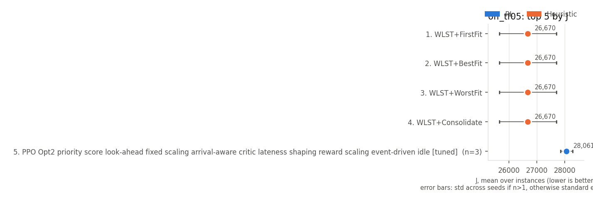 | 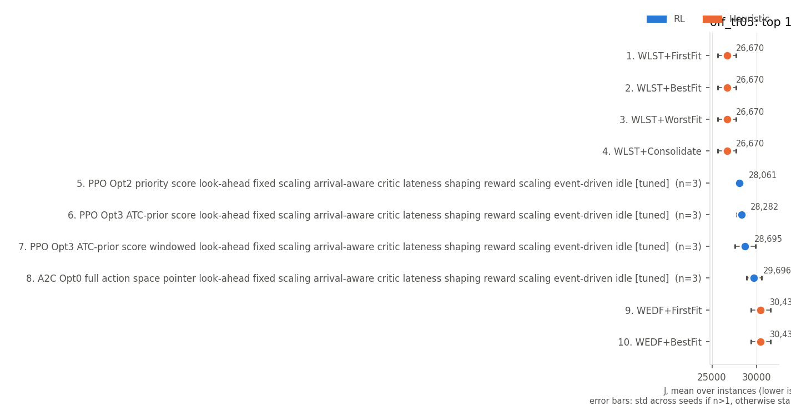 |

## on-time rate (higher is better)

| rank | method | family | on-time rate | J |
|---|---|---|---|---|
| 1 | WMDD+BestFit | Heuristic | 0.694 +/- 0.032 | 61305 +/- 14033 |
| 2 | WMDD+Consolidate | Heuristic | 0.694 +/- 0.032 | 61305 +/- 14033 |
| 3 | WMDD+FirstFit | Heuristic | 0.694 +/- 0.032 | 61305 +/- 14033 |
| 4 | WMDD+WorstFit | Heuristic | 0.694 +/- 0.032 | 61305 +/- 14033 |
| 5 | COVERT+BestFit | Heuristic | 0.679 +/- 0.040 | 49836 +/- 13084 |
| 6 | COVERT+Consolidate | Heuristic | 0.679 +/- 0.040 | 49836 +/- 13084 |
| 7 | COVERT+FirstFit | Heuristic | 0.679 +/- 0.040 | 49836 +/- 13084 |
| 8 | COVERT+WorstFit | Heuristic | 0.679 +/- 0.040 | 49836 +/- 13084 |
| 9 | ATC+FirstFit | Heuristic | 0.666 +/- 0.027 | 75552 +/- 18495 |
| 10 | ATC+BestFit | Heuristic | 0.666 +/- 0.027 | 75552 +/- 18495 |

| top 5 | top 10 |
|---|---|
| 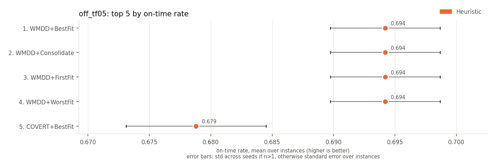 | 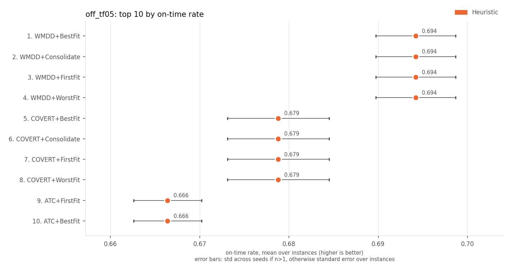 |

## late jobs (lower is better)

| rank | method | family | late jobs | J |
|---|---|---|---|---|
| 1 | WMDD+BestFit | Heuristic | 30.6 +/- 3.2 | 61305 +/- 14033 |
| 2 | WMDD+Consolidate | Heuristic | 30.6 +/- 3.2 | 61305 +/- 14033 |
| 3 | WMDD+FirstFit | Heuristic | 30.6 +/- 3.2 | 61305 +/- 14033 |
| 4 | WMDD+WorstFit | Heuristic | 30.6 +/- 3.2 | 61305 +/- 14033 |
| 5 | COVERT+BestFit | Heuristic | 32.1 +/- 4.0 | 49836 +/- 13084 |
| 6 | COVERT+Consolidate | Heuristic | 32.1 +/- 4.0 | 49836 +/- 13084 |
| 7 | COVERT+FirstFit | Heuristic | 32.1 +/- 4.0 | 49836 +/- 13084 |
| 8 | COVERT+WorstFit | Heuristic | 32.1 +/- 4.0 | 49836 +/- 13084 |
| 9 | ATC+FirstFit | Heuristic | 33.4 +/- 2.7 | 75552 +/- 18495 |
| 10 | ATC+BestFit | Heuristic | 33.4 +/- 2.7 | 75552 +/- 18495 |

| top 5 | top 10 |
|---|---|
| 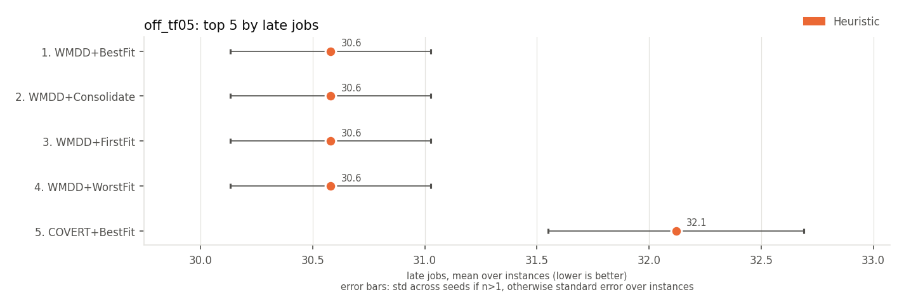 | 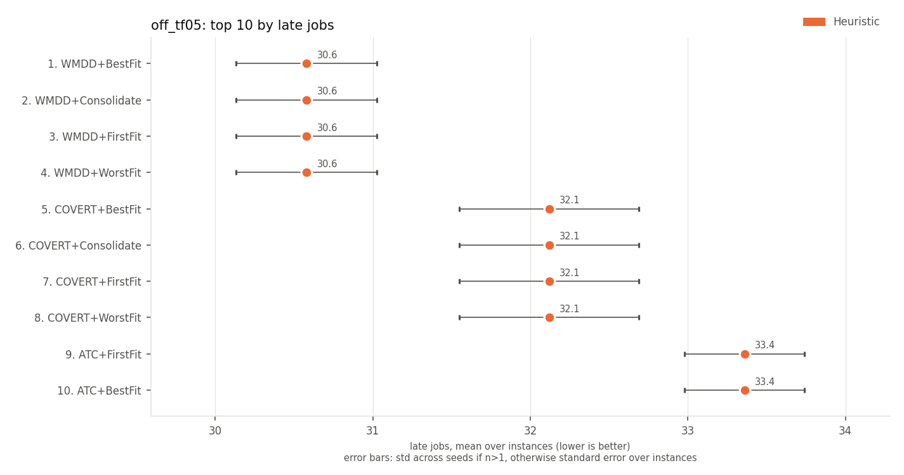 |

## weighted late jobs (lower is better)

| rank | method | family | weighted late jobs | J |
|---|---|---|---|---|
| 1 | WMDD+BestFit | Heuristic | 55.6 +/- 13.5 | 61305 +/- 14033 |
| 2 | WMDD+Consolidate | Heuristic | 55.6 +/- 13.5 | 61305 +/- 14033 |
| 3 | WMDD+FirstFit | Heuristic | 55.6 +/- 13.5 | 61305 +/- 14033 |
| 4 | WMDD+WorstFit | Heuristic | 55.6 +/- 13.5 | 61305 +/- 14033 |
| 5 | ATC+FirstFit | Heuristic | 61.5 +/- 11.1 | 75552 +/- 18495 |
| 6 | ATC+BestFit | Heuristic | 61.5 +/- 11.1 | 75552 +/- 18495 |
| 7 | ATC+Consolidate | Heuristic | 61.5 +/- 11.1 | 75552 +/- 18495 |
| 8 | ATC+WorstFit | Heuristic | 61.5 +/- 11.1 | 75552 +/- 18495 |
| 9 | COVERT+BestFit | Heuristic | 66.8 +/- 16.0 | 49836 +/- 13084 |
| 10 | COVERT+Consolidate | Heuristic | 66.8 +/- 16.0 | 49836 +/- 13084 |

| top 5 | top 10 |
|---|---|
| 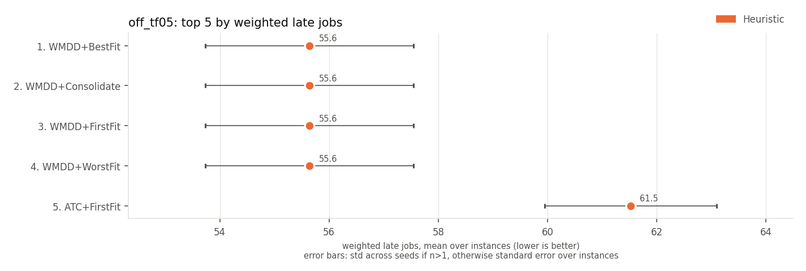 | 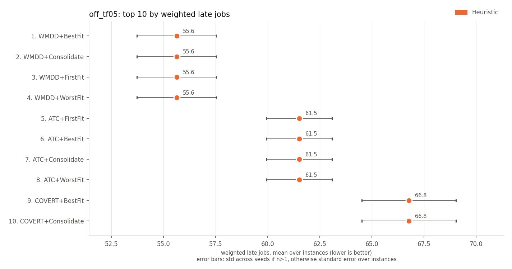 |

## weighted tardiness (lower is better)

| rank | method | family | weighted tardiness | J |
|---|---|---|---|---|
| 1 | PPO Opt2 priority score look-ahead fixed scaling arrival-aware critic lateness shaping reward scaling event-driven idle +linear-tardiness objective [lambda x4] | RL | 1324 +/- 206 | 40225 +/- 6125 |
| 2 | COVERT+BestFit | Heuristic | 1418 +/- 302 | 49836 +/- 13084 |
| 3 | COVERT+Consolidate | Heuristic | 1418 +/- 302 | 49836 +/- 13084 |
| 4 | COVERT+FirstFit | Heuristic | 1418 +/- 302 | 49836 +/- 13084 |
| 5 | COVERT+WorstFit | Heuristic | 1418 +/- 302 | 49836 +/- 13084 |
| 6 | A2C Opt0 full action space pointer look-ahead fixed scaling arrival-aware critic lateness shaping reward scaling event-driven idle [tuned] | RL | 1435 +/- 29 | 29696 +/- 833 |
| 7 | WMDD+BestFit | Heuristic | 1444 +/- 269 | 61305 +/- 14033 |
| 8 | WMDD+Consolidate | Heuristic | 1444 +/- 269 | 61305 +/- 14033 |
| 9 | WMDD+FirstFit | Heuristic | 1444 +/- 269 | 61305 +/- 14033 |
| 10 | WMDD+WorstFit | Heuristic | 1444 +/- 269 | 61305 +/- 14033 |

| top 5 | top 10 |
|---|---|
| 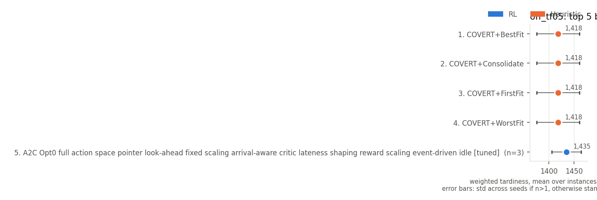 | 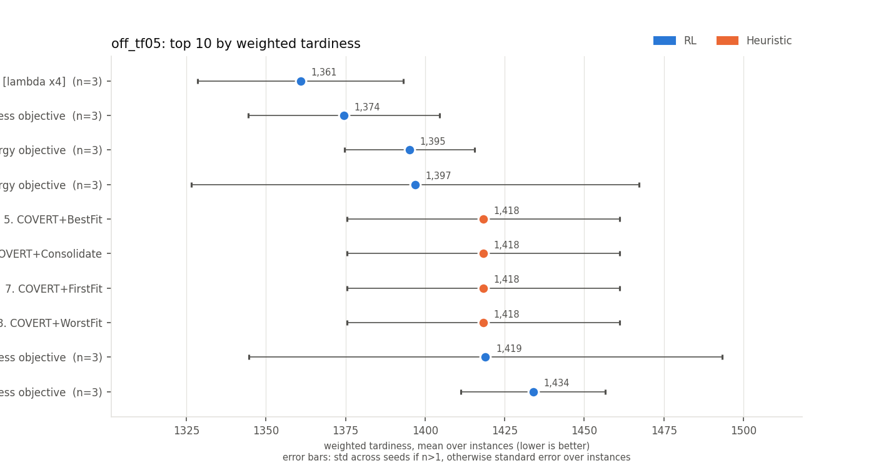 |

## max tardiness (lower is better)

| rank | method | family | max tardiness | J |
|---|---|---|---|---|
| 1 | PPO Opt1 rule selection +Consolidate look-ahead fixed scaling arrival-aware critic lateness shaping [tuned] | RL | 23.9 +/- 0.0 | 39536 +/- 0 |
| 2 | A2C Opt1 rule selection +Consolidate look-ahead fixed scaling arrival-aware critic lateness shaping reward scaling event-driven idle [tuned] | RL | 23.9 +/- 0.0 | 39536 +/- 0 |
| 3 | LST+FirstFit | Heuristic | 23.9 +/- 1.5 | 39536 +/- 9861 |
| 4 | LST+BestFit | Heuristic | 23.9 +/- 1.5 | 39536 +/- 9861 |
| 5 | LST+Consolidate | Heuristic | 23.9 +/- 1.5 | 39536 +/- 9861 |
| 6 | LST+WorstFit | Heuristic | 23.9 +/- 1.5 | 39536 +/- 9861 |
| 7 | PPO Opt1 rule selection +Consolidate non-delay [tuned] | RL | 24.8 +/- 1.5 | 40042 +/- 858 |
| 8 | A2C Opt1 rule selection +Consolidate look-ahead fixed scaling arrival-aware critic lateness shaping [tuned] | RL | 25.0 +/- 1.9 | 40124 +/- 1020 |
| 9 | EDF+FirstFit | Heuristic | 27.1 +/- 1.3 | 41302 +/- 10569 |
| 10 | EDF+BestFit | Heuristic | 27.1 +/- 1.3 | 41302 +/- 10569 |

| top 5 | top 10 |
|---|---|
| 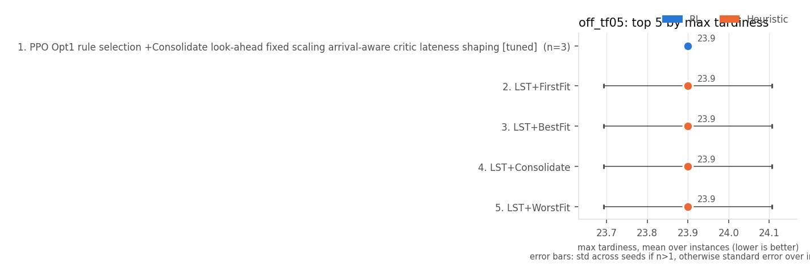 | 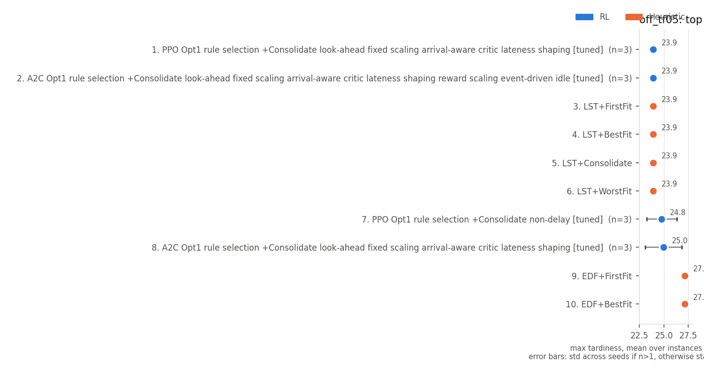 |

## p95 tardiness (lower is better)

| rank | method | family | p95 tardiness | J |
|---|---|---|---|---|
| 1 | PPO Opt1 rule selection +Consolidate look-ahead fixed scaling arrival-aware critic lateness shaping [tuned] | RL | 22.3 +/- 0.0 | 39536 +/- 0 |
| 2 | A2C Opt1 rule selection +Consolidate look-ahead fixed scaling arrival-aware critic lateness shaping reward scaling event-driven idle [tuned] | RL | 22.3 +/- 0.0 | 39536 +/- 0 |
| 3 | LST+FirstFit | Heuristic | 22.3 +/- 1.5 | 39536 +/- 9861 |
| 4 | LST+BestFit | Heuristic | 22.3 +/- 1.5 | 39536 +/- 9861 |
| 5 | LST+Consolidate | Heuristic | 22.3 +/- 1.5 | 39536 +/- 9861 |
| 6 | LST+WorstFit | Heuristic | 22.3 +/- 1.5 | 39536 +/- 9861 |
| 7 | PPO Opt1 rule selection +Consolidate non-delay [tuned] | RL | 22.5 +/- 0.4 | 40042 +/- 858 |
| 8 | A2C Opt1 rule selection +Consolidate look-ahead fixed scaling arrival-aware critic lateness shaping [tuned] | RL | 22.6 +/- 0.5 | 40124 +/- 1020 |
| 9 | EDF+FirstFit | Heuristic | 23.2 +/- 1.7 | 41302 +/- 10569 |
| 10 | EDF+BestFit | Heuristic | 23.2 +/- 1.7 | 41302 +/- 10569 |

| top 5 | top 10 |
|---|---|
|  | 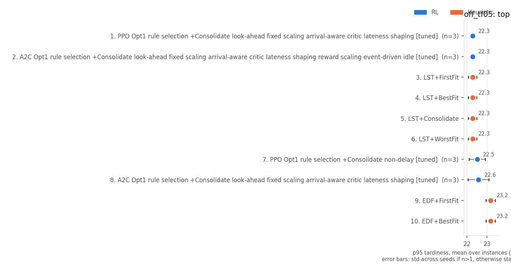 |

## mean wait (lower is better)

| rank | method | family | mean wait | J |
|---|---|---|---|---|
| 1 | WLST+FirstFit | Heuristic | 49.50 +/- 0.00 | 26670 +/- 7229 |
| 2 | WLST+BestFit | Heuristic | 49.50 +/- 0.00 | 26670 +/- 7229 |
| 3 | WLST+WorstFit | Heuristic | 49.50 +/- 0.00 | 26670 +/- 7229 |
| 4 | WLST+Consolidate | Heuristic | 49.50 +/- 0.00 | 26670 +/- 7229 |
| 5 | PPO Opt2 priority score look-ahead fixed scaling arrival-aware critic lateness shaping reward scaling event-driven idle [tuned] | RL | 49.50 +/- 0.00 | 28061 +/- 219 |
| 6 | PPO Opt3 ATC-prior score look-ahead fixed scaling arrival-aware critic lateness shaping reward scaling event-driven idle [tuned] | RL | 49.50 +/- 0.00 | 28282 +/- 537 |
| 7 | PPO Opt4 job x machine branching placement repair look-ahead fixed scaling arrival-aware critic lateness shaping reward scaling event-driven idle [tuned] | RL | 49.50 +/- 0.00 | 28577 +/- 43 |
| 8 | A2C Opt2 priority score look-ahead fixed scaling arrival-aware critic lateness shaping reward scaling event-driven idle [tuned] | RL | 49.50 +/- 0.00 | 28842 +/- 253 |
| 9 | PPO Opt2 priority score look-ahead fixed scaling arrival-aware critic lateness shaping reward scaling event-driven idle +linear-tardiness objective [lambda x0.5] | RL | 49.50 +/- 0.00 | 29286 +/- 711 |
| 10 | PPO Opt2 priority score look-ahead fixed scaling arrival-aware critic lateness shaping reward scaling event-driven idle +energy objective [lambda x0.25] | RL | 49.50 +/- 0.00 | 29406 +/- 891 |

| top 5 | top 10 |
|---|---|
| 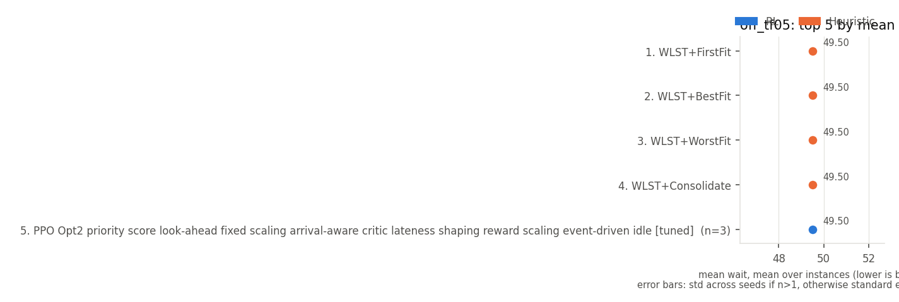 | 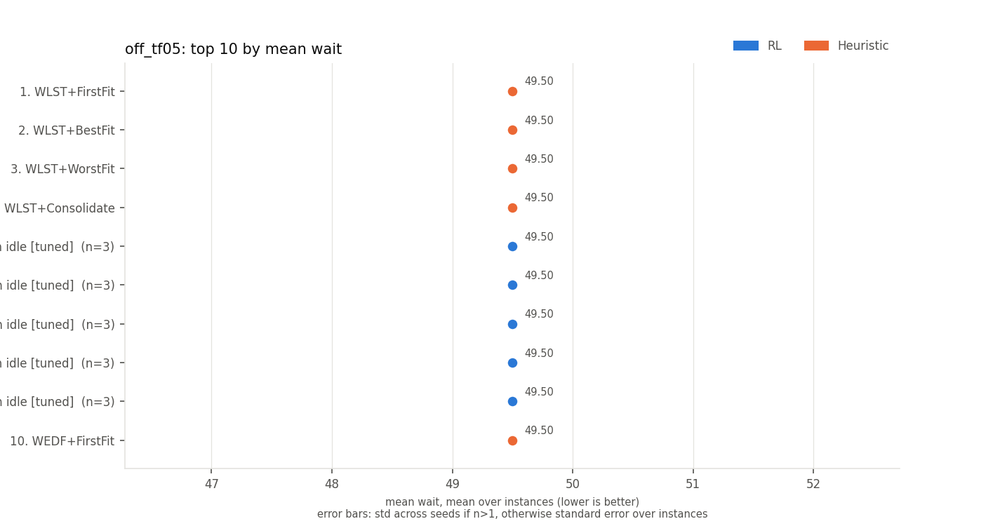 |

## mean flow time (lower is better)

| rank | method | family | mean flow time | J |
|---|---|---|---|---|
| 1 | PPO Opt2 priority score look-ahead fixed scaling arrival-aware critic lateness shaping reward scaling event-driven idle [tuned] | RL | 54.54 +/- 0.00 | 28061 +/- 219 |
| 2 | PPO Opt3 ATC-prior score look-ahead fixed scaling arrival-aware critic lateness shaping reward scaling event-driven idle [tuned] | RL | 54.54 +/- 0.00 | 28282 +/- 537 |
| 3 | PPO Opt4 job x machine branching placement repair look-ahead fixed scaling arrival-aware critic lateness shaping reward scaling event-driven idle [tuned] | RL | 54.54 +/- 0.00 | 28577 +/- 43 |
| 4 | A2C Opt2 priority score look-ahead fixed scaling arrival-aware critic lateness shaping reward scaling event-driven idle [tuned] | RL | 54.54 +/- 0.00 | 28842 +/- 253 |
| 5 | PPO Opt2 priority score look-ahead fixed scaling arrival-aware critic lateness shaping reward scaling event-driven idle +energy objective [lambda x0.25] | RL | 54.54 +/- 0.00 | 29406 +/- 891 |
| 6 | PPO Opt2 priority score look-ahead fixed scaling arrival-aware critic lateness shaping reward scaling event-driven idle +late-count objective [lambda x0.25] | RL | 54.54 +/- 0.00 | 29596 +/- 916 |
| 7 | A2C Opt0 full action space pointer look-ahead fixed scaling arrival-aware critic lateness shaping reward scaling event-driven idle [tuned] | RL | 54.54 +/- 0.00 | 29696 +/- 833 |
| 8 | PPO Opt2 priority score look-ahead fixed scaling arrival-aware critic lateness shaping reward scaling event-driven idle +energy objective [lambda x0.5] | RL | 54.54 +/- 0.00 | 29925 +/- 1145 |
| 9 | PPO Opt2 priority score look-ahead fixed scaling arrival-aware critic lateness shaping reward scaling event-driven idle +late-count objective [lambda x0.5] | RL | 54.54 +/- 0.00 | 30517 +/- 1748 |
| 10 | PPO Opt3 ATC-prior score non-delay | RL | 54.54 +/- 0.00 | 31145 +/- 1639 |

| top 5 | top 10 |
|---|---|
| 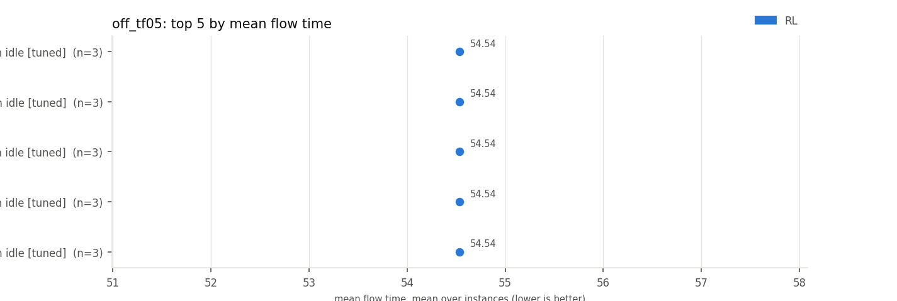 | 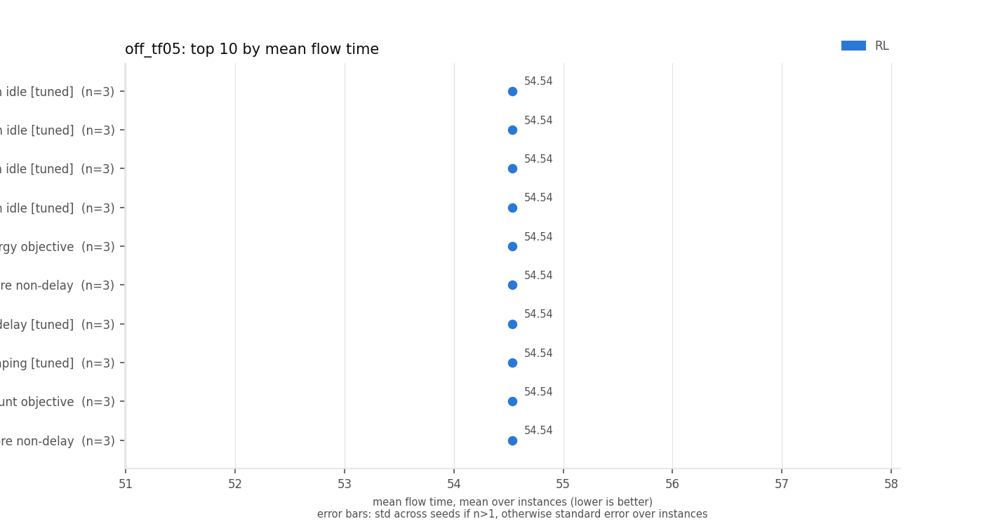 |

## makespan (lower is better)

| rank | method | family | makespan | J |
|---|---|---|---|---|
| 1 | LPT+BestFit | Heuristic | 100.0 +/- 0.0 | 193356 +/- 31197 |
| 2 | LPT+Consolidate | Heuristic | 100.0 +/- 0.0 | 193356 +/- 31197 |
| 3 | LPT+FirstFit | Heuristic | 100.0 +/- 0.0 | 193356 +/- 31197 |
| 4 | LPT+WorstFit | Heuristic | 100.0 +/- 0.0 | 193356 +/- 31197 |
| 5 | LST+FirstFit | Heuristic | 102.3 +/- 1.4 | 39536 +/- 9861 |
| 6 | LST+BestFit | Heuristic | 102.3 +/- 1.4 | 39536 +/- 9861 |
| 7 | LST+Consolidate | Heuristic | 102.3 +/- 1.4 | 39536 +/- 9861 |
| 8 | LST+WorstFit | Heuristic | 102.3 +/- 1.4 | 39536 +/- 9861 |
| 9 | PPO Opt1 rule selection +Consolidate look-ahead fixed scaling arrival-aware critic lateness shaping [tuned] | RL | 102.3 +/- 0.0 | 39536 +/- 0 |
| 10 | A2C Opt1 rule selection +Consolidate look-ahead fixed scaling arrival-aware critic lateness shaping reward scaling event-driven idle [tuned] | RL | 102.3 +/- 0.0 | 39536 +/- 0 |

| top 5 | top 10 |
|---|---|
| 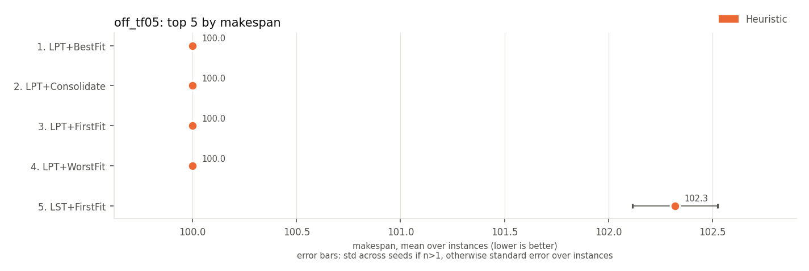 | 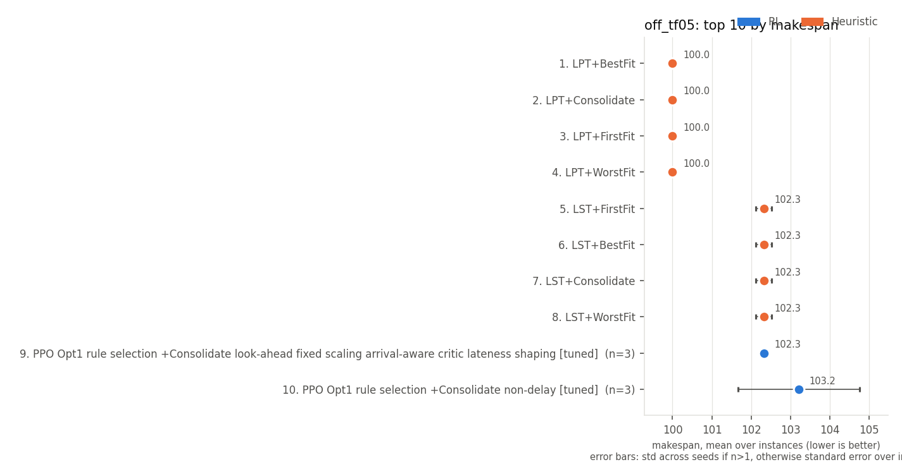 |

## utilisation of active machines (higher is better)

| rank | method | family | utilisation of active machines | J |
|---|---|---|---|---|
| 1 | LPT+Consolidate | Heuristic | 0.665 +/- 0.022 | 193356 +/- 31197 |
| 2 | LST+Consolidate | Heuristic | 0.650 +/- 0.021 | 39536 +/- 9861 |
| 3 | LPT+BestFit | Heuristic | 0.648 +/- 0.025 | 193356 +/- 31197 |
| 4 | COVERT+Consolidate | Heuristic | 0.648 +/- 0.019 | 49836 +/- 13084 |
| 5 | MDC+Consolidate | Heuristic | 0.648 +/- 0.020 | 33312 +/- 9055 |
| 6 | SPT+Consolidate | Heuristic | 0.647 +/- 0.024 | 240824 +/- 32589 |
| 7 | LPT+FirstFit | Heuristic | 0.647 +/- 0.022 | 193356 +/- 31197 |
| 8 | A2C Opt1 rule selection +Consolidate look-ahead fixed scaling arrival-aware critic lateness shaping [tuned] | RL | 0.646 +/- 0.006 | 40124 +/- 1020 |
| 9 | WMDD+Consolidate | Heuristic | 0.645 +/- 0.014 | 61305 +/- 14033 |
| 10 | FCFS+Consolidate | Heuristic | 0.645 +/- 0.020 | 209940 +/- 32735 |

| top 5 | top 10 |
|---|---|
| 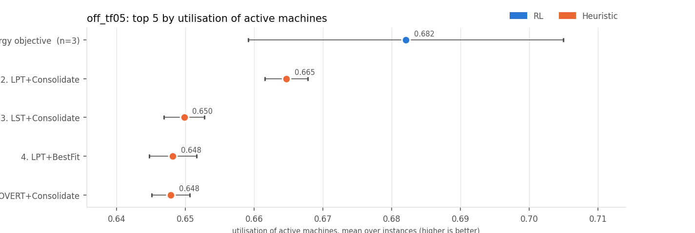 | 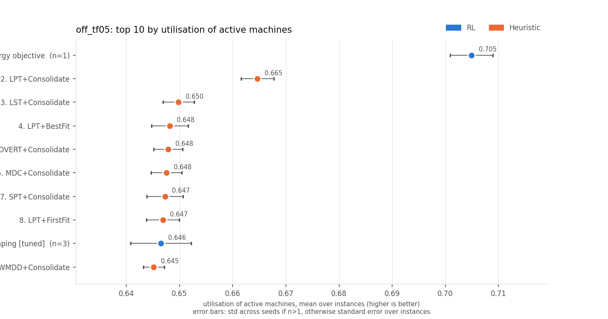 |

## active machine-ticks (lower is better)

| rank | method | family | active machine-ticks | J |
|---|---|---|---|---|
| 1 | LPT+Consolidate | Heuristic | 162 +/- 9 | 193356 +/- 31197 |
| 2 | LPT+BestFit | Heuristic | 165 +/- 10 | 193356 +/- 31197 |
| 3 | LST+Consolidate | Heuristic | 166 +/- 9 | 39536 +/- 9861 |
| 4 | COVERT+Consolidate | Heuristic | 166 +/- 9 | 49836 +/- 13084 |
| 5 | LPT+FirstFit | Heuristic | 166 +/- 10 | 193356 +/- 31197 |
| 6 | MDC+Consolidate | Heuristic | 166 +/- 9 | 33312 +/- 9055 |
| 7 | A2C Opt1 rule selection +Consolidate look-ahead fixed scaling arrival-aware critic lateness shaping [tuned] | RL | 167 +/- 2 | 40124 +/- 1020 |
| 8 | SPT+Consolidate | Heuristic | 167 +/- 7 | 240824 +/- 32589 |
| 9 | FCFS+Consolidate | Heuristic | 167 +/- 11 | 209940 +/- 32735 |
| 10 | WMDD+Consolidate | Heuristic | 167 +/- 10 | 61305 +/- 14033 |

| top 5 | top 10 |
|---|---|
| 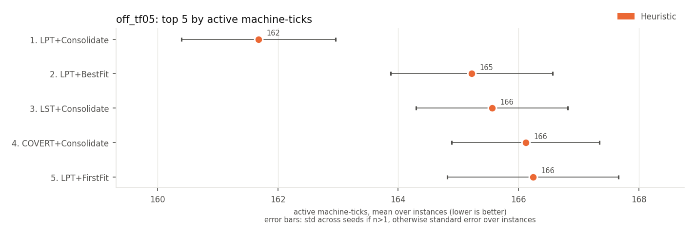 | 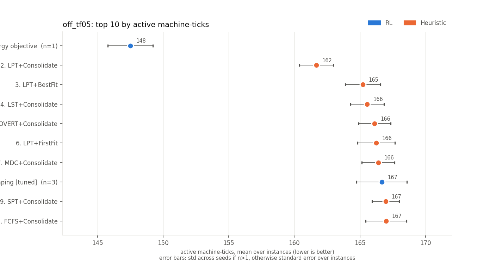 |

## energy (SPECpower) (lower is better)

| rank | method | family | energy (SPECpower) | J |
|---|---|---|---|---|
| 1 | LPT+Consolidate | Heuristic | 139 +/- 8 | 193356 +/- 31197 |
| 2 | LPT+BestFit | Heuristic | 141 +/- 8 | 193356 +/- 31197 |
| 3 | LST+Consolidate | Heuristic | 142 +/- 8 | 39536 +/- 9861 |
| 4 | COVERT+Consolidate | Heuristic | 142 +/- 8 | 49836 +/- 13084 |
| 5 | LPT+FirstFit | Heuristic | 142 +/- 9 | 193356 +/- 31197 |
| 6 | MDC+Consolidate | Heuristic | 142 +/- 8 | 33312 +/- 9055 |
| 7 | A2C Opt1 rule selection +Consolidate look-ahead fixed scaling arrival-aware critic lateness shaping [tuned] | RL | 142 +/- 1 | 40124 +/- 1020 |
| 8 | FCFS+Consolidate | Heuristic | 143 +/- 9 | 209940 +/- 32735 |
| 9 | SPT+Consolidate | Heuristic | 143 +/- 7 | 240824 +/- 32589 |
| 10 | WMDD+Consolidate | Heuristic | 143 +/- 9 | 61305 +/- 14033 |

| top 5 | top 10 |
|---|---|
| 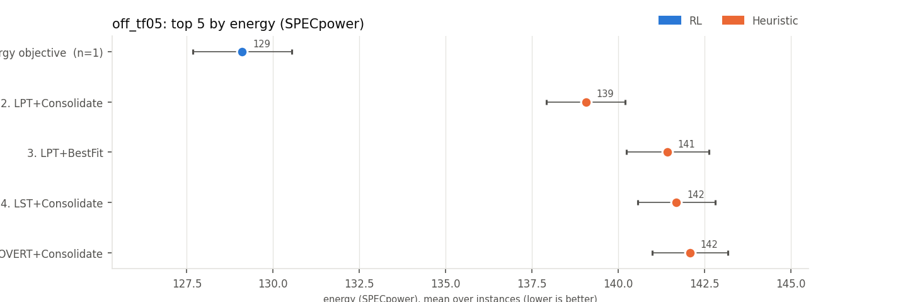 | 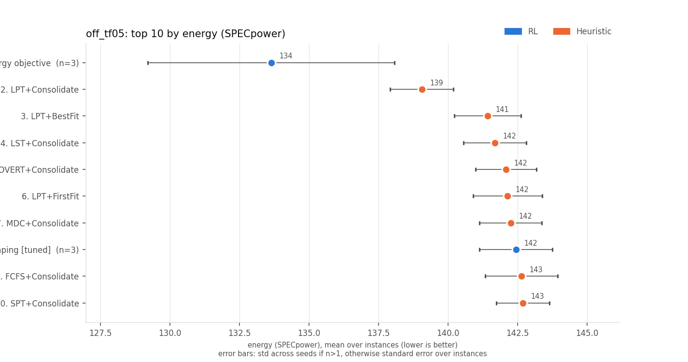 |

Spread (+/-): std across seeds for multi-seed RL rows, otherwise std across instances.
