# off_tf05_w1: leaderboards

Top 10 methods on each metric. Full ranking by J: [`tables/off_tf05_w1.md`](../tables/off_tf05_w1.md). Archive overview: [`HIGHLIGHTS.md`](../HIGHLIGHTS.md).

## J (lower is better)

| rank | method | family | J |
|---|---|---|---|
| 1 | LST+FirstFit | Heuristic | 13098 +/- 3221 |
| 2 | LST+BestFit | Heuristic | 13098 +/- 3221 |
| 3 | LST+Consolidate | Heuristic | 13098 +/- 3221 |
| 4 | LST+WorstFit | Heuristic | 13098 +/- 3221 |
| 5 | PPO Opt1 rule selection +Consolidate look-ahead fixed scaling arrival-aware critic lateness shaping [tuned] | RL | 13098 +/- 0 |
| 6 | WLST+FirstFit | Heuristic | 13098 +/- 3221 |
| 7 | WLST+BestFit | Heuristic | 13098 +/- 3221 |
| 8 | WLST+WorstFit | Heuristic | 13098 +/- 3221 |
| 9 | WLST+Consolidate | Heuristic | 13098 +/- 3221 |
| 10 | A2C Opt1 rule selection +Consolidate look-ahead fixed scaling arrival-aware critic lateness shaping reward scaling event-driven idle [tuned] | RL | 13098 +/- 0 |

| top 5 | top 10 |
|---|---|
| 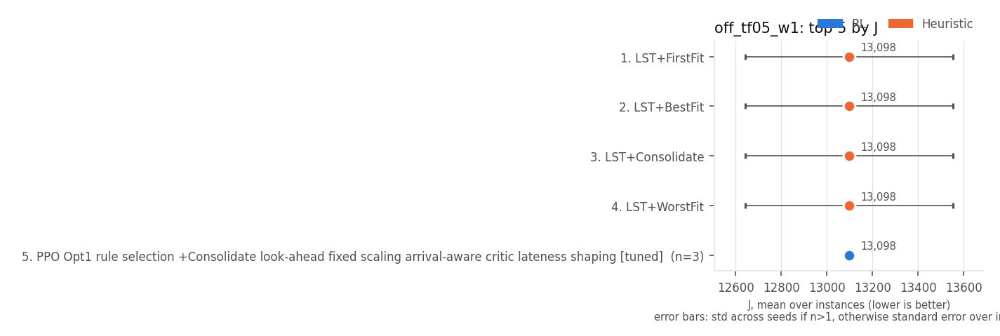 | 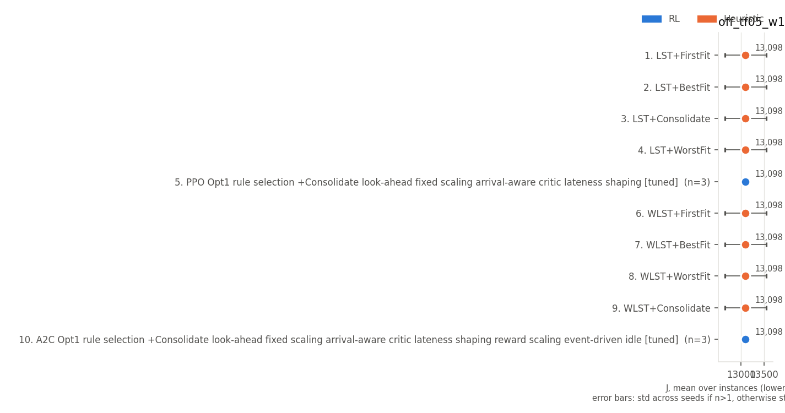 |

## on-time rate (higher is better)

| rank | method | family | on-time rate | J |
|---|---|---|---|---|
| 1 | WMDD+BestFit | Heuristic | 0.678 +/- 0.035 | 34664 +/- 8792 |
| 2 | WMDD+Consolidate | Heuristic | 0.678 +/- 0.035 | 34664 +/- 8792 |
| 3 | WMDD+FirstFit | Heuristic | 0.678 +/- 0.035 | 34664 +/- 8792 |
| 4 | WMDD+WorstFit | Heuristic | 0.678 +/- 0.035 | 34664 +/- 8792 |
| 5 | COVERT+BestFit | Heuristic | 0.660 +/- 0.042 | 29854 +/- 7496 |
| 6 | COVERT+Consolidate | Heuristic | 0.660 +/- 0.042 | 29854 +/- 7496 |
| 7 | COVERT+FirstFit | Heuristic | 0.660 +/- 0.042 | 29854 +/- 7496 |
| 8 | COVERT+WorstFit | Heuristic | 0.660 +/- 0.042 | 29854 +/- 7496 |
| 9 | ATC+FirstFit | Heuristic | 0.656 +/- 0.036 | 47080 +/- 11231 |
| 10 | ATC+BestFit | Heuristic | 0.656 +/- 0.036 | 47080 +/- 11231 |

| top 5 | top 10 |
|---|---|
| 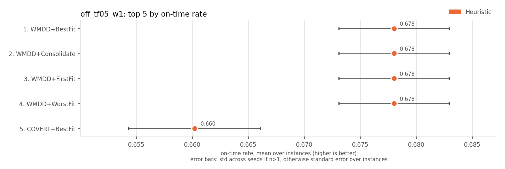 | 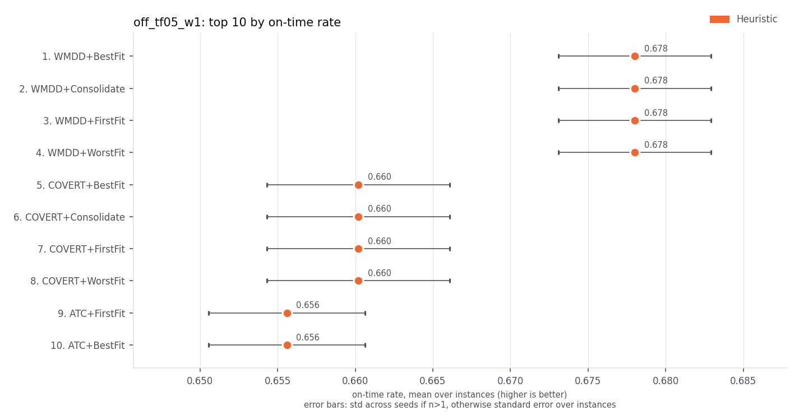 |

## late jobs (lower is better)

| rank | method | family | late jobs | J |
|---|---|---|---|---|
| 1 | WMDD+BestFit | Heuristic | 32.2 +/- 3.5 | 34664 +/- 8792 |
| 2 | WMDD+Consolidate | Heuristic | 32.2 +/- 3.5 | 34664 +/- 8792 |
| 3 | WMDD+FirstFit | Heuristic | 32.2 +/- 3.5 | 34664 +/- 8792 |
| 4 | WMDD+WorstFit | Heuristic | 32.2 +/- 3.5 | 34664 +/- 8792 |
| 5 | COVERT+BestFit | Heuristic | 34.0 +/- 4.2 | 29854 +/- 7496 |
| 6 | COVERT+Consolidate | Heuristic | 34.0 +/- 4.2 | 29854 +/- 7496 |
| 7 | COVERT+FirstFit | Heuristic | 34.0 +/- 4.2 | 29854 +/- 7496 |
| 8 | COVERT+WorstFit | Heuristic | 34.0 +/- 4.2 | 29854 +/- 7496 |
| 9 | ATC+FirstFit | Heuristic | 34.4 +/- 3.6 | 47080 +/- 11231 |
| 10 | ATC+BestFit | Heuristic | 34.4 +/- 3.6 | 47080 +/- 11231 |

| top 5 | top 10 |
|---|---|
| 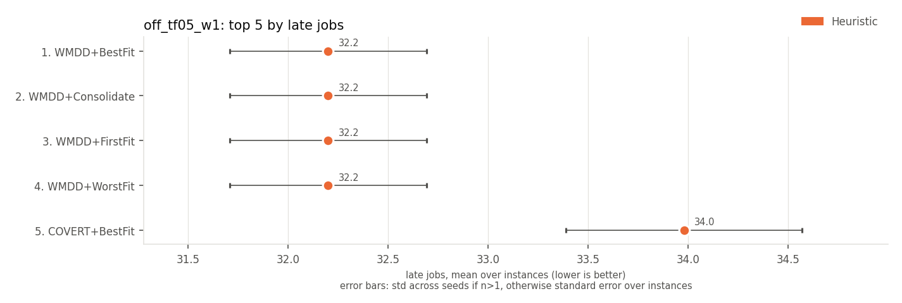 | 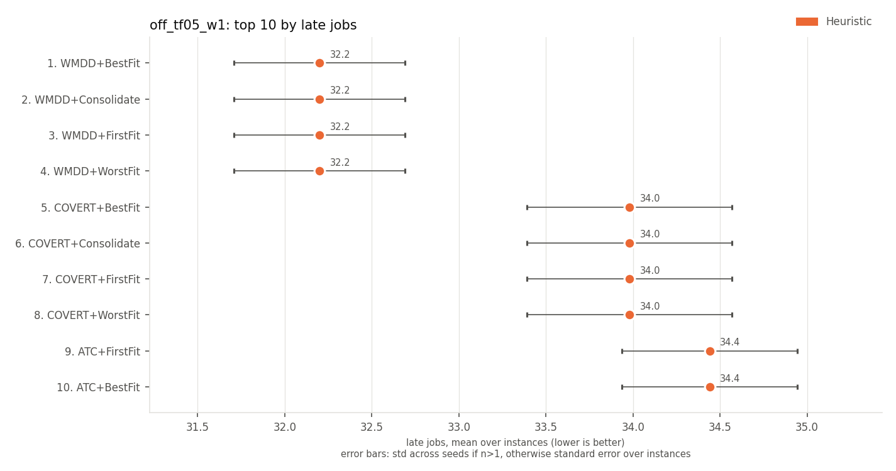 |

## weighted late jobs (lower is better)

| rank | method | family | weighted late jobs | J |
|---|---|---|---|---|
| 1 | WMDD+BestFit | Heuristic | 32.2 +/- 3.5 | 34664 +/- 8792 |
| 2 | WMDD+Consolidate | Heuristic | 32.2 +/- 3.5 | 34664 +/- 8792 |
| 3 | WMDD+FirstFit | Heuristic | 32.2 +/- 3.5 | 34664 +/- 8792 |
| 4 | WMDD+WorstFit | Heuristic | 32.2 +/- 3.5 | 34664 +/- 8792 |
| 5 | COVERT+BestFit | Heuristic | 34.0 +/- 4.2 | 29854 +/- 7496 |
| 6 | COVERT+Consolidate | Heuristic | 34.0 +/- 4.2 | 29854 +/- 7496 |
| 7 | COVERT+FirstFit | Heuristic | 34.0 +/- 4.2 | 29854 +/- 7496 |
| 8 | COVERT+WorstFit | Heuristic | 34.0 +/- 4.2 | 29854 +/- 7496 |
| 9 | ATC+FirstFit | Heuristic | 34.4 +/- 3.6 | 47080 +/- 11231 |
| 10 | ATC+BestFit | Heuristic | 34.4 +/- 3.6 | 47080 +/- 11231 |

| top 5 | top 10 |
|---|---|
| 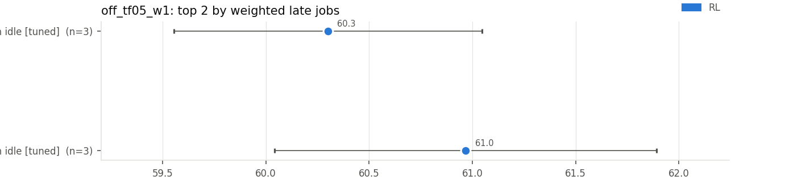 | 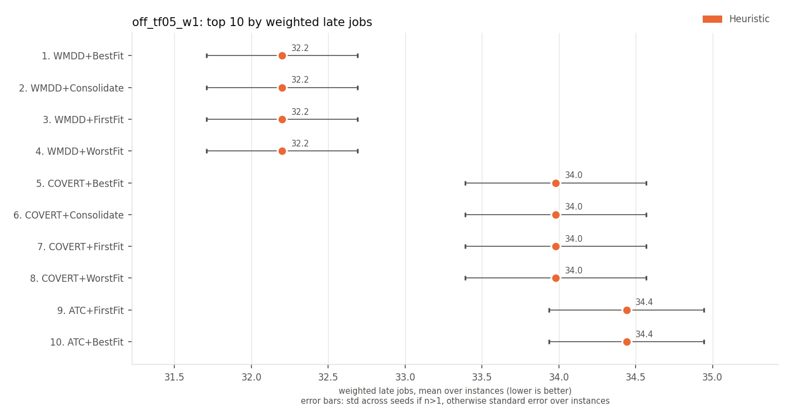 |

## weighted tardiness (lower is better)

| rank | method | family | weighted tardiness | J |
|---|---|---|---|---|
| 1 | LST+FirstFit | Heuristic | 785 +/- 139 | 13098 +/- 3221 |
| 2 | LST+BestFit | Heuristic | 785 +/- 139 | 13098 +/- 3221 |
| 3 | LST+Consolidate | Heuristic | 785 +/- 139 | 13098 +/- 3221 |
| 4 | LST+WorstFit | Heuristic | 785 +/- 139 | 13098 +/- 3221 |
| 5 | PPO Opt1 rule selection +Consolidate look-ahead fixed scaling arrival-aware critic lateness shaping [tuned] | RL | 785 +/- 0 | 13098 +/- 0 |
| 6 | WLST+FirstFit | Heuristic | 785 +/- 139 | 13098 +/- 3221 |
| 7 | WLST+BestFit | Heuristic | 785 +/- 139 | 13098 +/- 3221 |
| 8 | WLST+WorstFit | Heuristic | 785 +/- 139 | 13098 +/- 3221 |
| 9 | WLST+Consolidate | Heuristic | 785 +/- 139 | 13098 +/- 3221 |
| 10 | A2C Opt1 rule selection +Consolidate look-ahead fixed scaling arrival-aware critic lateness shaping reward scaling event-driven idle [tuned] | RL | 785 +/- 0 | 13098 +/- 0 |

| top 5 | top 10 |
|---|---|
| 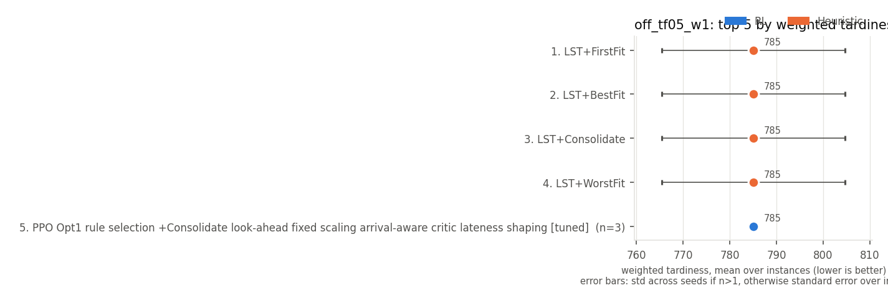 | 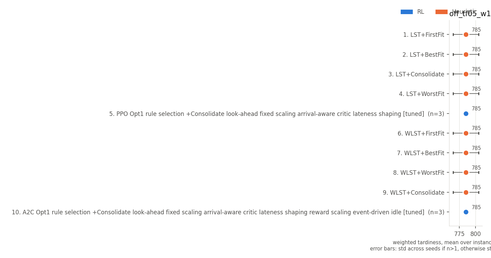 |

## max tardiness (lower is better)

| rank | method | family | max tardiness | J |
|---|---|---|---|---|
| 1 | PPO Opt1 rule selection +Consolidate look-ahead fixed scaling arrival-aware critic lateness shaping [tuned] | RL | 23.9 +/- 0.0 | 13098 +/- 0 |
| 2 | A2C Opt1 rule selection +Consolidate look-ahead fixed scaling arrival-aware critic lateness shaping reward scaling event-driven idle [tuned] | RL | 23.9 +/- 0.0 | 13098 +/- 0 |
| 3 | LST+FirstFit | Heuristic | 23.9 +/- 1.5 | 13098 +/- 3221 |
| 4 | LST+BestFit | Heuristic | 23.9 +/- 1.5 | 13098 +/- 3221 |
| 5 | LST+Consolidate | Heuristic | 23.9 +/- 1.5 | 13098 +/- 3221 |
| 6 | LST+WorstFit | Heuristic | 23.9 +/- 1.5 | 13098 +/- 3221 |
| 7 | WLST+FirstFit | Heuristic | 23.9 +/- 1.5 | 13098 +/- 3221 |
| 8 | WLST+BestFit | Heuristic | 23.9 +/- 1.5 | 13098 +/- 3221 |
| 9 | WLST+WorstFit | Heuristic | 23.9 +/- 1.5 | 13098 +/- 3221 |
| 10 | WLST+Consolidate | Heuristic | 23.9 +/- 1.5 | 13098 +/- 3221 |

| top 5 | top 10 |
|---|---|
| 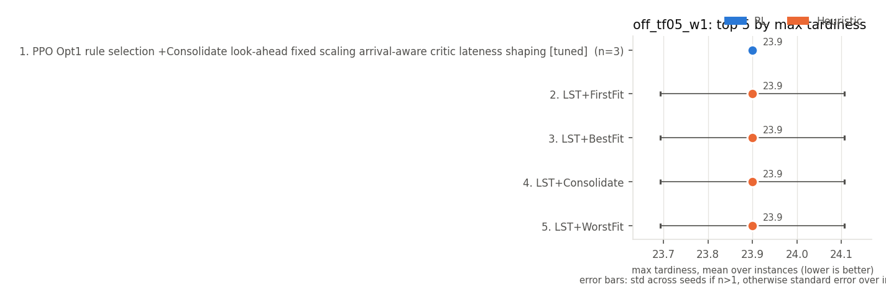 | 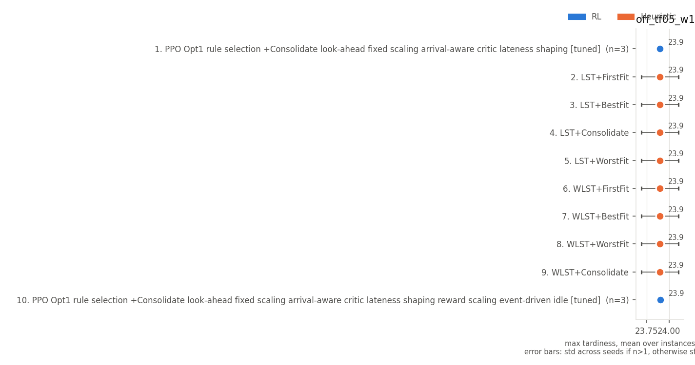 |

## p95 tardiness (lower is better)

| rank | method | family | p95 tardiness | J |
|---|---|---|---|---|
| 1 | PPO Opt1 rule selection +Consolidate look-ahead fixed scaling arrival-aware critic lateness shaping [tuned] | RL | 22.3 +/- 0.0 | 13098 +/- 0 |
| 2 | A2C Opt1 rule selection +Consolidate look-ahead fixed scaling arrival-aware critic lateness shaping reward scaling event-driven idle [tuned] | RL | 22.3 +/- 0.0 | 13098 +/- 0 |
| 3 | LST+FirstFit | Heuristic | 22.3 +/- 1.5 | 13098 +/- 3221 |
| 4 | LST+BestFit | Heuristic | 22.3 +/- 1.5 | 13098 +/- 3221 |
| 5 | LST+Consolidate | Heuristic | 22.3 +/- 1.5 | 13098 +/- 3221 |
| 6 | LST+WorstFit | Heuristic | 22.3 +/- 1.5 | 13098 +/- 3221 |
| 7 | WLST+FirstFit | Heuristic | 22.3 +/- 1.5 | 13098 +/- 3221 |
| 8 | WLST+BestFit | Heuristic | 22.3 +/- 1.5 | 13098 +/- 3221 |
| 9 | WLST+WorstFit | Heuristic | 22.3 +/- 1.5 | 13098 +/- 3221 |
| 10 | WLST+Consolidate | Heuristic | 22.3 +/- 1.5 | 13098 +/- 3221 |

| top 5 | top 10 |
|---|---|
| 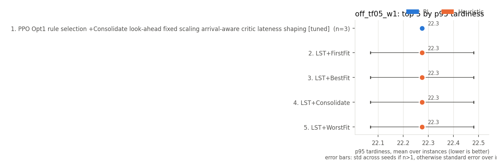 | 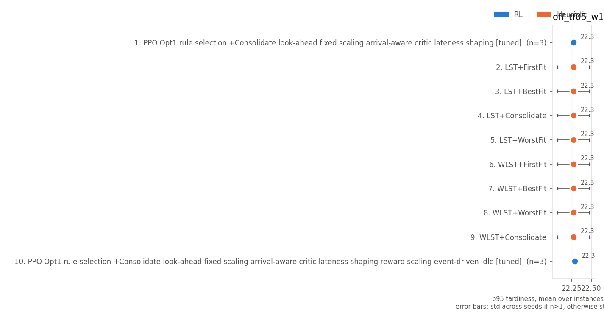 |

## mean wait (lower is better)

| rank | method | family | mean wait | J |
|---|---|---|---|---|
| 1 | LST+FirstFit | Heuristic | 49.50 +/- 0.00 | 13098 +/- 3221 |
| 2 | LST+BestFit | Heuristic | 49.50 +/- 0.00 | 13098 +/- 3221 |
| 3 | LST+Consolidate | Heuristic | 49.50 +/- 0.00 | 13098 +/- 3221 |
| 4 | LST+WorstFit | Heuristic | 49.50 +/- 0.00 | 13098 +/- 3221 |
| 5 | PPO Opt1 rule selection +Consolidate look-ahead fixed scaling arrival-aware critic lateness shaping [tuned] | RL | 49.50 +/- 0.00 | 13098 +/- 0 |
| 6 | WLST+FirstFit | Heuristic | 49.50 +/- 0.00 | 13098 +/- 3221 |
| 7 | WLST+BestFit | Heuristic | 49.50 +/- 0.00 | 13098 +/- 3221 |
| 8 | WLST+WorstFit | Heuristic | 49.50 +/- 0.00 | 13098 +/- 3221 |
| 9 | WLST+Consolidate | Heuristic | 49.50 +/- 0.00 | 13098 +/- 3221 |
| 10 | A2C Opt1 rule selection +Consolidate look-ahead fixed scaling arrival-aware critic lateness shaping reward scaling event-driven idle [tuned] | RL | 49.50 +/- 0.00 | 13098 +/- 0 |

| top 5 | top 10 |
|---|---|
| 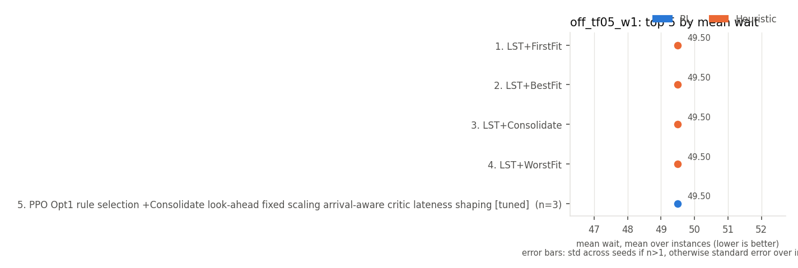 | 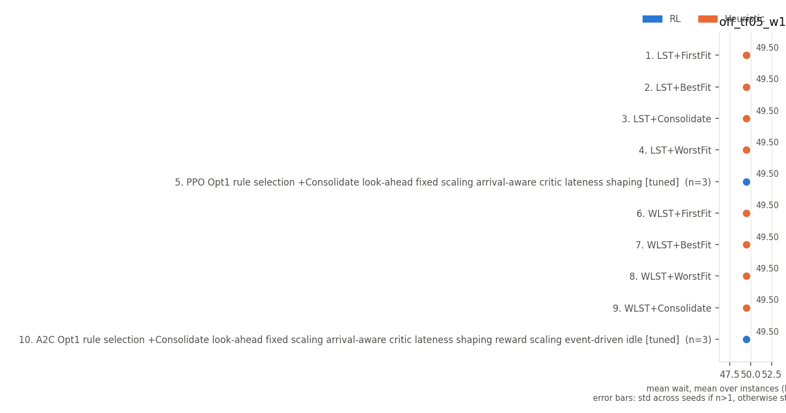 |

## mean flow time (lower is better)

| rank | method | family | mean flow time | J |
|---|---|---|---|---|
| 1 | PPO Opt1 rule selection +Consolidate look-ahead fixed scaling arrival-aware critic lateness shaping [tuned] | RL | 54.54 +/- 0.00 | 13098 +/- 0 |
| 2 | A2C Opt1 rule selection +Consolidate look-ahead fixed scaling arrival-aware critic lateness shaping reward scaling event-driven idle [tuned] | RL | 54.54 +/- 0.00 | 13098 +/- 0 |
| 3 | PPO Opt2 priority score look-ahead fixed scaling arrival-aware critic lateness shaping reward scaling event-driven idle [tuned] | RL | 54.54 +/- 0.00 | 13207 +/- 28 |
| 4 | PPO Opt1 rule selection +Consolidate look-ahead fixed scaling arrival-aware critic lateness shaping reward scaling event-driven idle [tuned] | RL | 54.54 +/- 0.00 | 13255 +/- 72 |
| 5 | A2C Opt1 rule selection +Consolidate non-delay [tuned] | RL | 54.54 +/- 0.00 | 13318 +/- 380 |
| 6 | PPO Opt4 job x machine branching placement repair look-ahead fixed scaling arrival-aware critic lateness shaping reward scaling event-driven idle [tuned] | RL | 54.54 +/- 0.00 | 13411 +/- 181 |
| 7 | PPO Opt3 ATC-prior score windowed look-ahead fixed scaling arrival-aware critic lateness shaping reward scaling event-driven idle [tuned] | RL | 54.54 +/- 0.00 | 13438 +/- 133 |
| 8 | PPO Opt1 rule selection +Consolidate non-delay [tuned] | RL | 54.54 +/- 0.00 | 13440 +/- 323 |
| 9 | A2C Opt2 priority score look-ahead fixed scaling arrival-aware critic lateness shaping reward scaling event-driven idle [tuned] | RL | 54.54 +/- 0.00 | 13449 +/- 280 |
| 10 | PPO Opt0 full action space pointer look-ahead fixed scaling arrival-aware critic lateness shaping [tuned] | RL | 54.54 +/- 0.00 | 13502 +/- 118 |

| top 5 | top 10 |
|---|---|
| 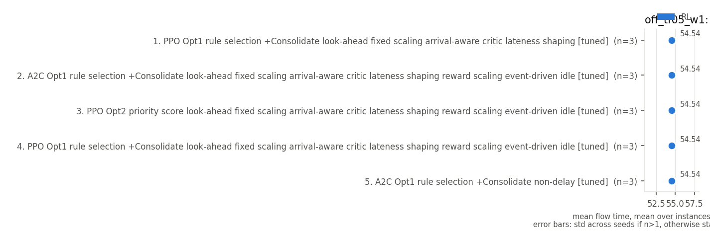 | 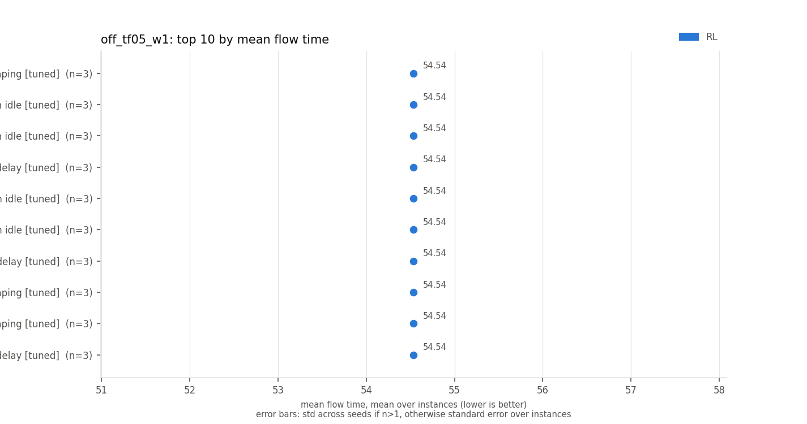 |

## makespan (lower is better)

| rank | method | family | makespan | J |
|---|---|---|---|---|
| 1 | LPT+BestFit | Heuristic | 100.0 +/- 0.0 | 64469 +/- 8262 |
| 2 | LPT+Consolidate | Heuristic | 100.0 +/- 0.0 | 64469 +/- 8262 |
| 3 | LPT+FirstFit | Heuristic | 100.0 +/- 0.0 | 64469 +/- 8262 |
| 4 | LPT+WorstFit | Heuristic | 100.0 +/- 0.0 | 64469 +/- 8262 |
| 5 | A2C Opt3 ATC-prior score look-ahead fixed scaling arrival-aware critic lateness shaping reward scaling event-driven idle [tuned] | RL | 101.0 +/- 1.0 | 14879 +/- 1678 |
| 6 | A2C Opt3 ATC-prior score windowed non-delay [tuned] | RL | 101.7 +/- 1.4 | 24908 +/- 8586 |
| 7 | PPO Opt2 priority score look-ahead fixed scaling arrival-aware critic lateness shaping reward scaling event-driven idle [tuned] | RL | 102.2 +/- 0.2 | 13207 +/- 28 |
| 8 | LST+FirstFit | Heuristic | 102.3 +/- 1.4 | 13098 +/- 3221 |
| 9 | LST+BestFit | Heuristic | 102.3 +/- 1.4 | 13098 +/- 3221 |
| 10 | LST+Consolidate | Heuristic | 102.3 +/- 1.4 | 13098 +/- 3221 |

| top 5 | top 10 |
|---|---|
| 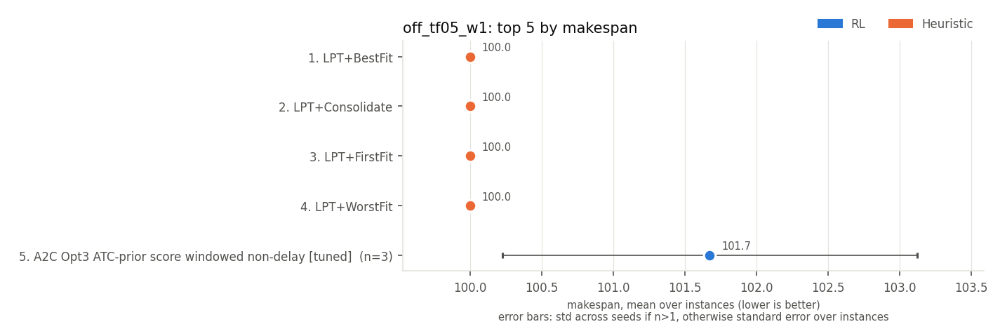 | 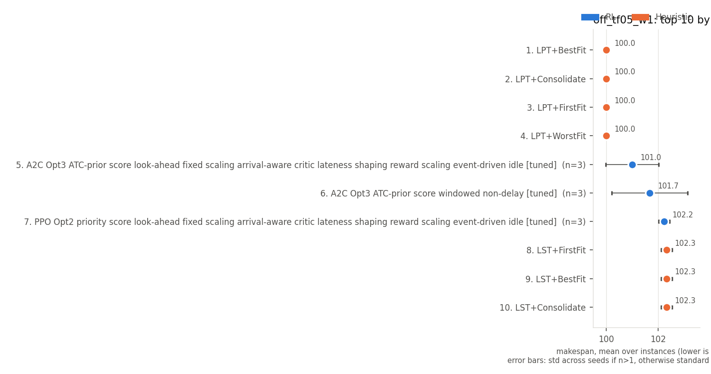 |

## utilisation of active machines (higher is better)

| rank | method | family | utilisation of active machines | J |
|---|---|---|---|---|
| 1 | LPT+Consolidate | Heuristic | 0.665 +/- 0.022 | 64469 +/- 8262 |
| 2 | COVERT+Consolidate | Heuristic | 0.659 +/- 0.022 | 29854 +/- 7496 |
| 3 | ATC+Consolidate | Heuristic | 0.657 +/- 0.020 | 47080 +/- 11231 |
| 4 | WMDD+Consolidate | Heuristic | 0.654 +/- 0.024 | 34664 +/- 8792 |
| 5 | LST+Consolidate | Heuristic | 0.650 +/- 0.021 | 13098 +/- 3221 |
| 6 | LPT+BestFit | Heuristic | 0.648 +/- 0.025 | 64469 +/- 8262 |
| 7 | PPO Opt1 rule selection +Consolidate look-ahead fixed scaling arrival-aware critic lateness shaping reward scaling event-driven idle [tuned] | RL | 0.647 +/- 0.003 | 13255 +/- 72 |
| 8 | SPT+Consolidate | Heuristic | 0.647 +/- 0.024 | 79215 +/- 10569 |
| 9 | WSPT+Consolidate | Heuristic | 0.647 +/- 0.024 | 79215 +/- 10569 |
| 10 | LPT+FirstFit | Heuristic | 0.647 +/- 0.022 | 64469 +/- 8262 |

| top 5 | top 10 |
|---|---|
| 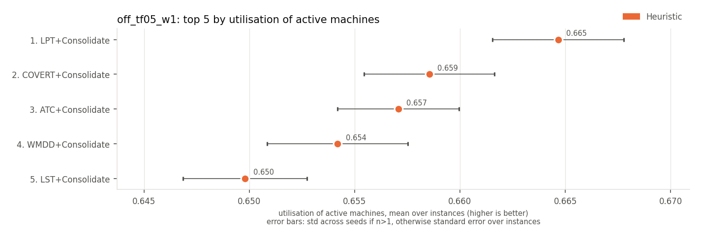 | 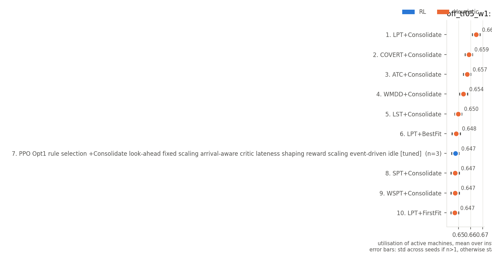 |

## active machine-ticks (lower is better)

| rank | method | family | active machine-ticks | J |
|---|---|---|---|---|
| 1 | LPT+Consolidate | Heuristic | 162 +/- 9 | 64469 +/- 8262 |
| 2 | ATC+Consolidate | Heuristic | 164 +/- 9 | 47080 +/- 11231 |
| 3 | COVERT+Consolidate | Heuristic | 164 +/- 9 | 29854 +/- 7496 |
| 4 | WMDD+Consolidate | Heuristic | 164 +/- 10 | 34664 +/- 8792 |
| 5 | LPT+BestFit | Heuristic | 165 +/- 10 | 64469 +/- 8262 |
| 6 | LST+Consolidate | Heuristic | 166 +/- 9 | 13098 +/- 3221 |
| 7 | LPT+FirstFit | Heuristic | 166 +/- 10 | 64469 +/- 8262 |
| 8 | PPO Opt1 rule selection +Consolidate look-ahead fixed scaling arrival-aware critic lateness shaping reward scaling event-driven idle [tuned] | RL | 166 +/- 1 | 13255 +/- 72 |
| 9 | MDC+Consolidate | Heuristic | 167 +/- 8 | 16658 +/- 3908 |
| 10 | SPT+Consolidate | Heuristic | 167 +/- 7 | 79215 +/- 10569 |

| top 5 | top 10 |
|---|---|
| 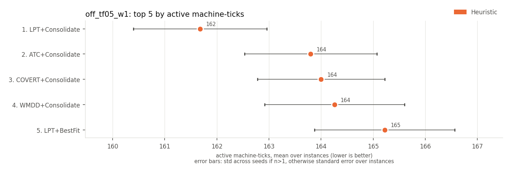 | 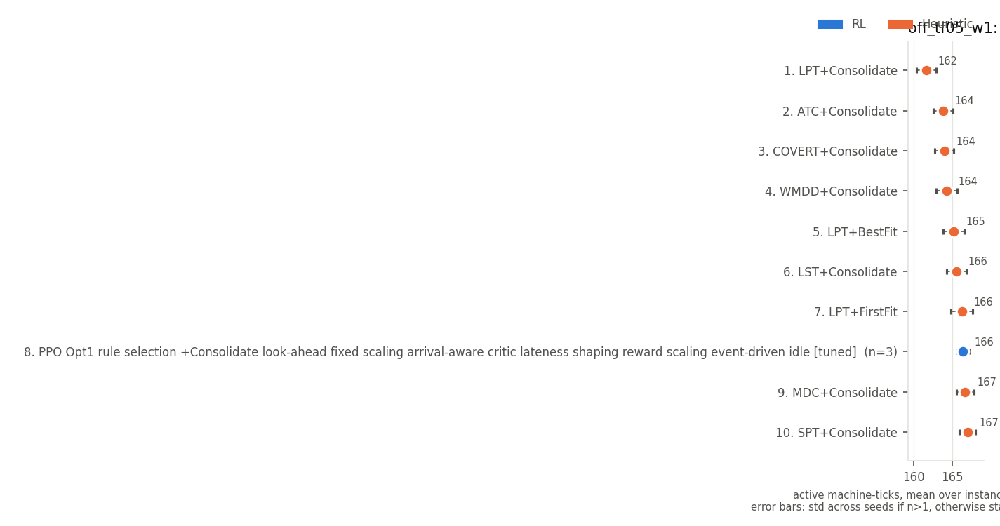 |

## energy (SPECpower) (lower is better)

| rank | method | family | energy (SPECpower) | J |
|---|---|---|---|---|
| 1 | LPT+Consolidate | Heuristic | 139 +/- 8 | 64469 +/- 8262 |
| 2 | ATC+Consolidate | Heuristic | 141 +/- 8 | 47080 +/- 11231 |
| 3 | COVERT+Consolidate | Heuristic | 141 +/- 8 | 29854 +/- 7496 |
| 4 | WMDD+Consolidate | Heuristic | 141 +/- 8 | 34664 +/- 8792 |
| 5 | LPT+BestFit | Heuristic | 141 +/- 8 | 64469 +/- 8262 |
| 6 | LST+Consolidate | Heuristic | 142 +/- 8 | 13098 +/- 3221 |
| 7 | LPT+FirstFit | Heuristic | 142 +/- 9 | 64469 +/- 8262 |
| 8 | PPO Opt1 rule selection +Consolidate look-ahead fixed scaling arrival-aware critic lateness shaping reward scaling event-driven idle [tuned] | RL | 142 +/- 1 | 13255 +/- 72 |
| 9 | MDC+Consolidate | Heuristic | 142 +/- 7 | 16658 +/- 3908 |
| 10 | FCFS+Consolidate | Heuristic | 143 +/- 9 | 70425 +/- 8832 |

| top 5 | top 10 |
|---|---|
| 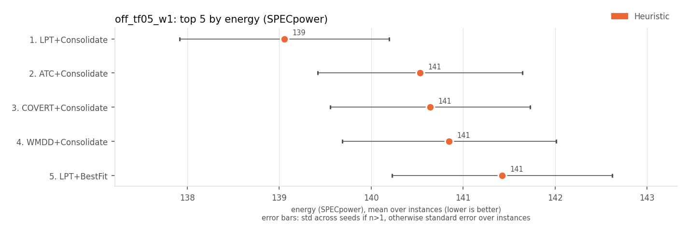 | 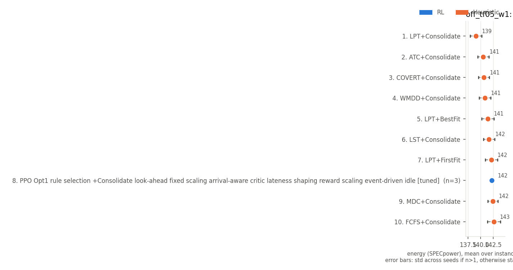 |

Spread (+/-): std across seeds for multi-seed RL rows, otherwise std across instances.
