# off_tf08: leaderboards

Top 10 methods on each metric. Full ranking by J: [`tables/off_tf08.md`](../tables/off_tf08.md). Archive overview: [`HIGHLIGHTS.md`](../HIGHLIGHTS.md).

## J (lower is better)

| rank | method | family | J |
|---|---|---|---|
| 1 | WLST+FirstFit | Heuristic | 257155 +/- 33291 |
| 2 | WLST+BestFit | Heuristic | 257155 +/- 33291 |
| 3 | WLST+WorstFit | Heuristic | 257155 +/- 33291 |
| 4 | WLST+Consolidate | Heuristic | 257155 +/- 33291 |
| 5 | WEDF+FirstFit | Heuristic | 264519 +/- 34606 |
| 6 | WEDF+BestFit | Heuristic | 264519 +/- 34606 |
| 7 | WEDF+WorstFit | Heuristic | 264519 +/- 34606 |
| 8 | WEDF+Consolidate | Heuristic | 264519 +/- 34606 |
| 9 | MDC+FirstFit | Heuristic | 321610 +/- 43049 |
| 10 | MDC+BestFit | Heuristic | 321610 +/- 43049 |

| top 5 | top 10 |
|---|---|
| 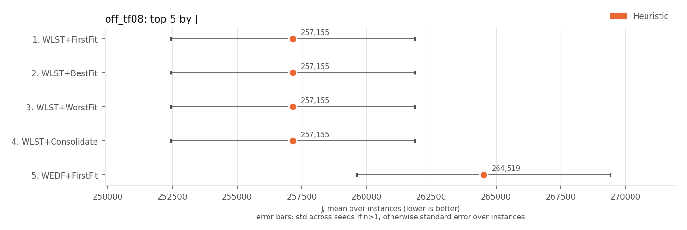 | 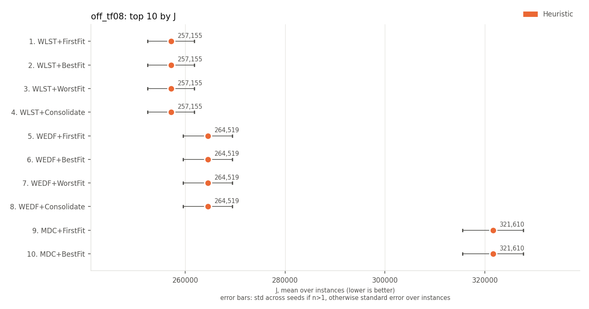 |

## on-time rate (higher is better)

| rank | method | family | on-time rate | J |
|---|---|---|---|---|
| 1 | WMDD+BestFit | Heuristic | 0.247 +/- 0.042 | 412436 +/- 48952 |
| 2 | WMDD+Consolidate | Heuristic | 0.247 +/- 0.042 | 412436 +/- 48952 |
| 3 | WMDD+FirstFit | Heuristic | 0.247 +/- 0.042 | 412436 +/- 48952 |
| 4 | WMDD+WorstFit | Heuristic | 0.247 +/- 0.042 | 412436 +/- 48952 |
| 5 | ATC+FirstFit | Heuristic | 0.235 +/- 0.038 | 423863 +/- 48459 |
| 6 | ATC+BestFit | Heuristic | 0.235 +/- 0.038 | 423863 +/- 48459 |
| 7 | ATC+Consolidate | Heuristic | 0.235 +/- 0.038 | 423863 +/- 48459 |
| 8 | ATC+WorstFit | Heuristic | 0.235 +/- 0.038 | 423863 +/- 48459 |
| 9 | COVERT+BestFit | Heuristic | 0.234 +/- 0.044 | 405440 +/- 49109 |
| 10 | COVERT+Consolidate | Heuristic | 0.234 +/- 0.044 | 405440 +/- 49109 |

| top 5 | top 10 |
|---|---|
| 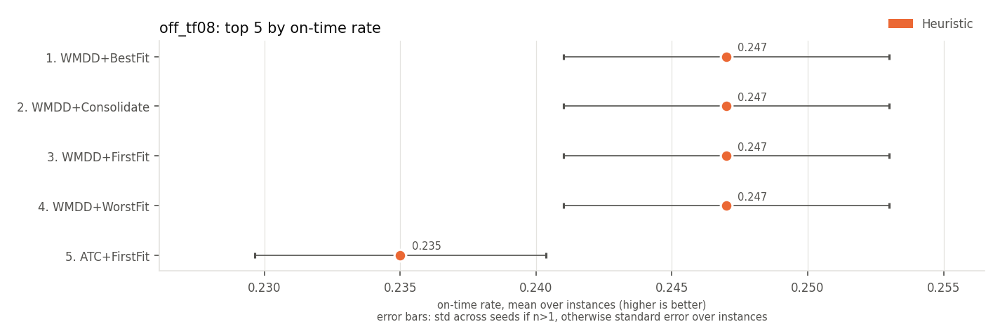 | 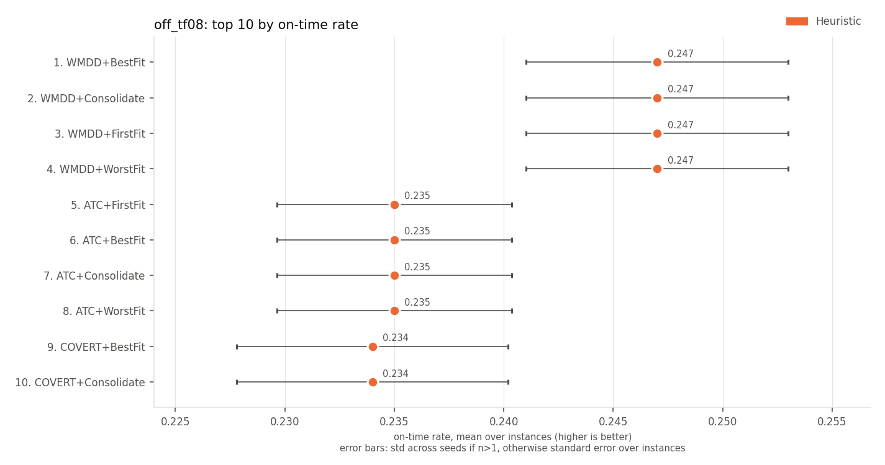 |

## late jobs (lower is better)

| rank | method | family | late jobs | J |
|---|---|---|---|---|
| 1 | WMDD+BestFit | Heuristic | 75.3 +/- 4.2 | 412436 +/- 48952 |
| 2 | WMDD+Consolidate | Heuristic | 75.3 +/- 4.2 | 412436 +/- 48952 |
| 3 | WMDD+FirstFit | Heuristic | 75.3 +/- 4.2 | 412436 +/- 48952 |
| 4 | WMDD+WorstFit | Heuristic | 75.3 +/- 4.2 | 412436 +/- 48952 |
| 5 | ATC+FirstFit | Heuristic | 76.5 +/- 3.8 | 423863 +/- 48459 |
| 6 | ATC+BestFit | Heuristic | 76.5 +/- 3.8 | 423863 +/- 48459 |
| 7 | ATC+Consolidate | Heuristic | 76.5 +/- 3.8 | 423863 +/- 48459 |
| 8 | ATC+WorstFit | Heuristic | 76.5 +/- 3.8 | 423863 +/- 48459 |
| 9 | COVERT+BestFit | Heuristic | 76.6 +/- 4.4 | 405440 +/- 49109 |
| 10 | COVERT+Consolidate | Heuristic | 76.6 +/- 4.4 | 405440 +/- 49109 |

| top 5 | top 10 |
|---|---|
| 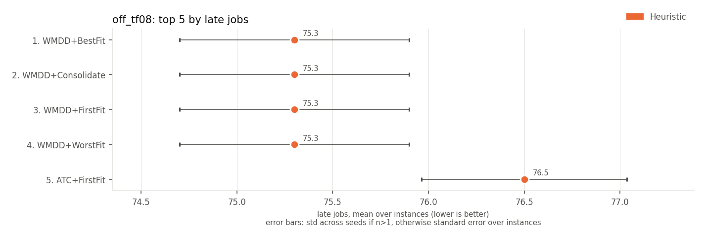 | 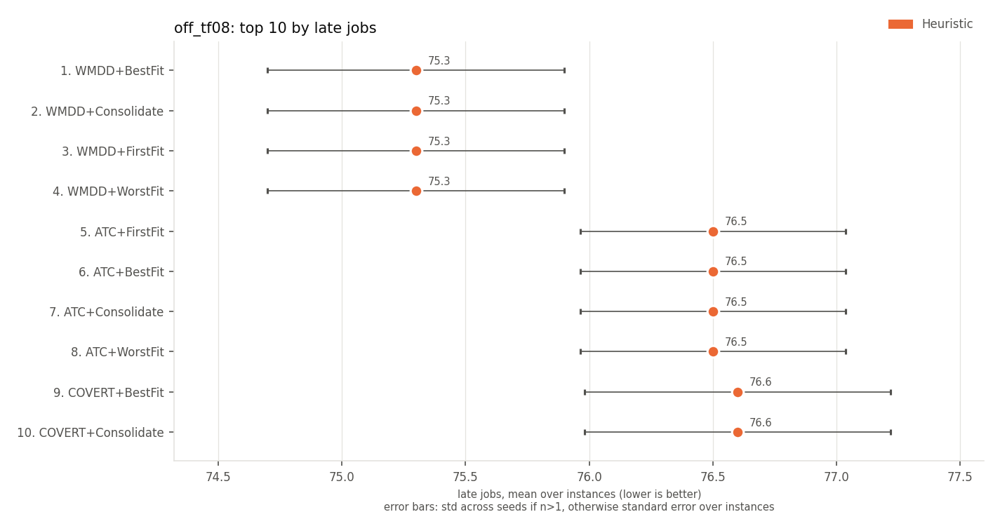 |

## weighted late jobs (lower is better)

| rank | method | family | weighted late jobs | J |
|---|---|---|---|---|
| 1 | WMDD+BestFit | Heuristic | 208.5 +/- 21.4 | 412436 +/- 48952 |
| 2 | WMDD+Consolidate | Heuristic | 208.5 +/- 21.4 | 412436 +/- 48952 |
| 3 | WMDD+FirstFit | Heuristic | 208.5 +/- 21.4 | 412436 +/- 48952 |
| 4 | WMDD+WorstFit | Heuristic | 208.5 +/- 21.4 | 412436 +/- 48952 |
| 5 | COVERT+BestFit | Heuristic | 212.4 +/- 22.6 | 405440 +/- 49109 |
| 6 | COVERT+Consolidate | Heuristic | 212.4 +/- 22.6 | 405440 +/- 49109 |
| 7 | COVERT+FirstFit | Heuristic | 212.4 +/- 22.6 | 405440 +/- 49109 |
| 8 | COVERT+WorstFit | Heuristic | 212.4 +/- 22.6 | 405440 +/- 49109 |
| 9 | ATC+FirstFit | Heuristic | 212.7 +/- 21.5 | 423863 +/- 48459 |
| 10 | ATC+BestFit | Heuristic | 212.7 +/- 21.5 | 423863 +/- 48459 |

| top 5 | top 10 |
|---|---|
| 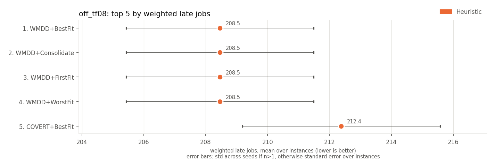 | 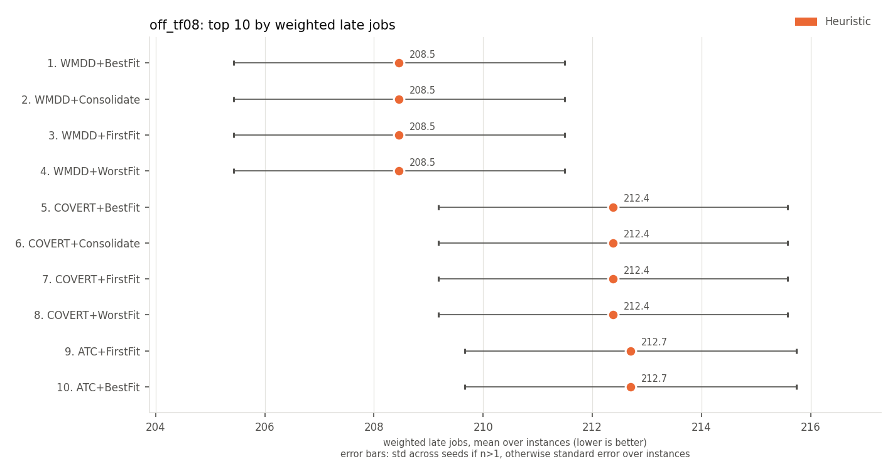 |

## weighted tardiness (lower is better)

| rank | method | family | weighted tardiness | J |
|---|---|---|---|---|
| 1 | WLST+FirstFit | Heuristic | 7048 +/- 697 | 257155 +/- 33291 |
| 2 | WLST+BestFit | Heuristic | 7048 +/- 697 | 257155 +/- 33291 |
| 3 | WLST+WorstFit | Heuristic | 7048 +/- 697 | 257155 +/- 33291 |
| 4 | WLST+Consolidate | Heuristic | 7048 +/- 697 | 257155 +/- 33291 |
| 5 | WEDF+FirstFit | Heuristic | 7352 +/- 721 | 264519 +/- 34606 |
| 6 | WEDF+BestFit | Heuristic | 7352 +/- 721 | 264519 +/- 34606 |
| 7 | WEDF+WorstFit | Heuristic | 7352 +/- 721 | 264519 +/- 34606 |
| 8 | WEDF+Consolidate | Heuristic | 7352 +/- 721 | 264519 +/- 34606 |
| 9 | COVERT+BestFit | Heuristic | 7533 +/- 805 | 405440 +/- 49109 |
| 10 | COVERT+Consolidate | Heuristic | 7533 +/- 805 | 405440 +/- 49109 |

| top 5 | top 10 |
|---|---|
| 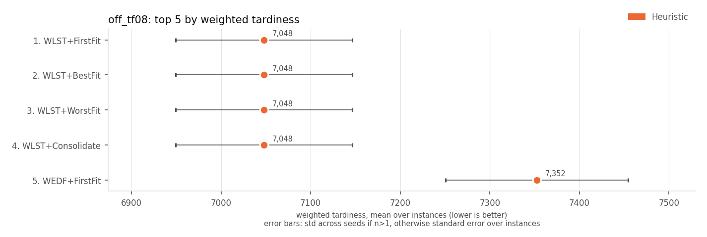 | 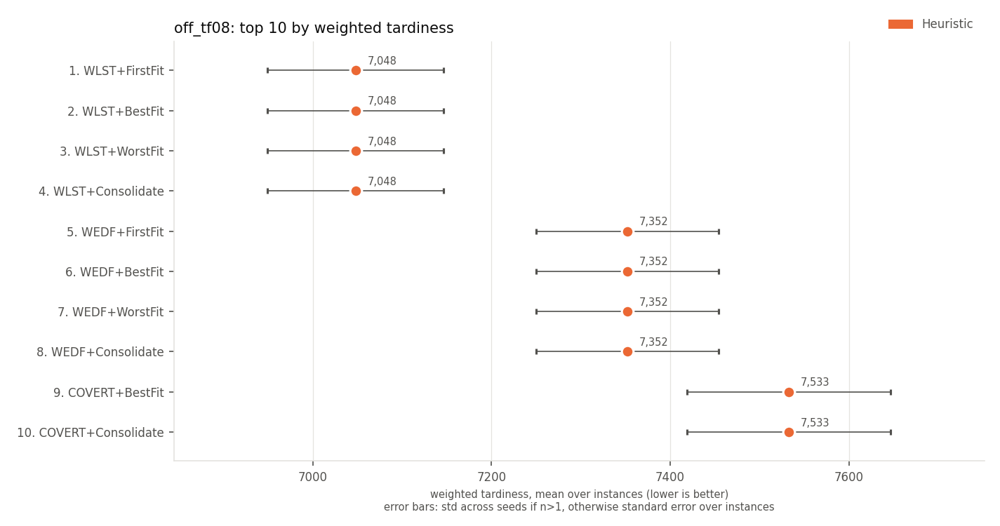 |

## max tardiness (lower is better)

| rank | method | family | max tardiness | J |
|---|---|---|---|---|
| 1 | LST+FirstFit | Heuristic | 53.9 +/- 1.5 | 390493 +/- 44235 |
| 2 | LST+BestFit | Heuristic | 53.9 +/- 1.5 | 390493 +/- 44235 |
| 3 | LST+Consolidate | Heuristic | 53.9 +/- 1.5 | 390493 +/- 44235 |
| 4 | LST+WorstFit | Heuristic | 53.9 +/- 1.5 | 390493 +/- 44235 |
| 5 | EDF+FirstFit | Heuristic | 57.1 +/- 1.3 | 394149 +/- 45422 |
| 6 | EDF+BestFit | Heuristic | 57.1 +/- 1.3 | 394149 +/- 45422 |
| 7 | EDF+Consolidate | Heuristic | 57.1 +/- 1.3 | 394149 +/- 45422 |
| 8 | EDF+WorstFit | Heuristic | 57.1 +/- 1.3 | 394149 +/- 45422 |
| 9 | RandomRule+FirstFitConsolidate | Heuristic | 81.3 +/- 6.2 | 523933 +/- 63359 |
| 10 | WLST+FirstFit | Heuristic | 83.4 +/- 4.3 | 257155 +/- 33291 |

| top 5 | top 10 |
|---|---|
| 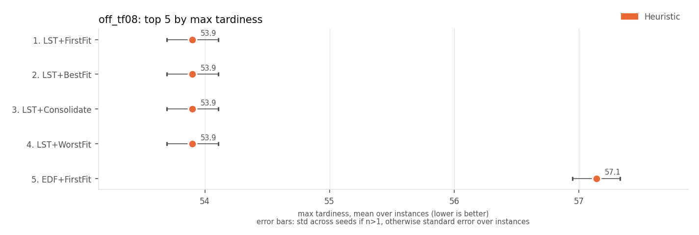 | 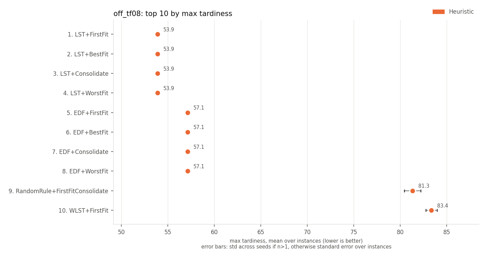 |

## p95 tardiness (lower is better)

| rank | method | family | p95 tardiness | J |
|---|---|---|---|---|
| 1 | LST+FirstFit | Heuristic | 52.3 +/- 1.5 | 390493 +/- 44235 |
| 2 | LST+BestFit | Heuristic | 52.3 +/- 1.5 | 390493 +/- 44235 |
| 3 | LST+Consolidate | Heuristic | 52.3 +/- 1.5 | 390493 +/- 44235 |
| 4 | LST+WorstFit | Heuristic | 52.3 +/- 1.5 | 390493 +/- 44235 |
| 5 | EDF+FirstFit | Heuristic | 53.2 +/- 1.7 | 394149 +/- 45422 |
| 6 | EDF+BestFit | Heuristic | 53.2 +/- 1.7 | 394149 +/- 45422 |
| 7 | EDF+Consolidate | Heuristic | 53.2 +/- 1.7 | 394149 +/- 45422 |
| 8 | EDF+WorstFit | Heuristic | 53.2 +/- 1.7 | 394149 +/- 45422 |
| 9 | RandomRule+FirstFitConsolidate | Heuristic | 75.7 +/- 5.4 | 523933 +/- 63359 |
| 10 | WEDF+FirstFit | Heuristic | 78.2 +/- 3.6 | 264519 +/- 34606 |

| top 5 | top 10 |
|---|---|
| 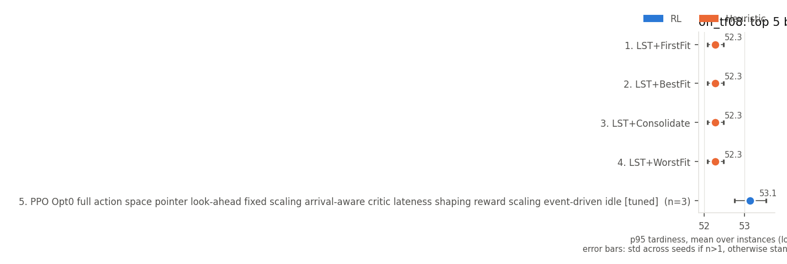 | 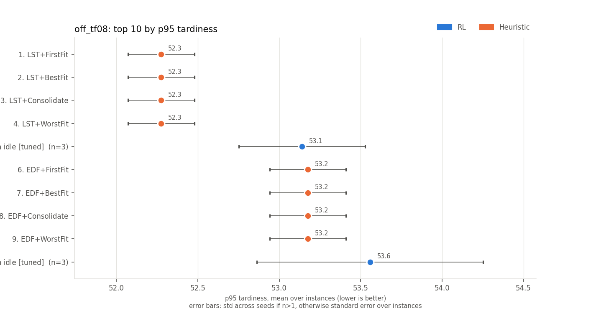 |

## mean wait (lower is better)

Every method has the same value here, so there is no ranking.

## mean flow time (lower is better)

Every method has the same value here, so there is no ranking.

## makespan (lower is better)

| rank | method | family | makespan | J |
|---|---|---|---|---|
| 1 | LPT+BestFit | Heuristic | 100.0 +/- 0.0 | 600070 +/- 62367 |
| 2 | LPT+Consolidate | Heuristic | 100.0 +/- 0.0 | 600070 +/- 62367 |
| 3 | LPT+FirstFit | Heuristic | 100.0 +/- 0.0 | 600070 +/- 62367 |
| 4 | LPT+WorstFit | Heuristic | 100.0 +/- 0.0 | 600070 +/- 62367 |
| 5 | LST+FirstFit | Heuristic | 102.3 +/- 1.4 | 390493 +/- 44235 |
| 6 | LST+BestFit | Heuristic | 102.3 +/- 1.4 | 390493 +/- 44235 |
| 7 | LST+Consolidate | Heuristic | 102.3 +/- 1.4 | 390493 +/- 44235 |
| 8 | LST+WorstFit | Heuristic | 102.3 +/- 1.4 | 390493 +/- 44235 |
| 9 | WLST+FirstFit | Heuristic | 104.9 +/- 1.5 | 257155 +/- 33291 |
| 10 | WLST+BestFit | Heuristic | 104.9 +/- 1.5 | 257155 +/- 33291 |

| top 5 | top 10 |
|---|---|
| 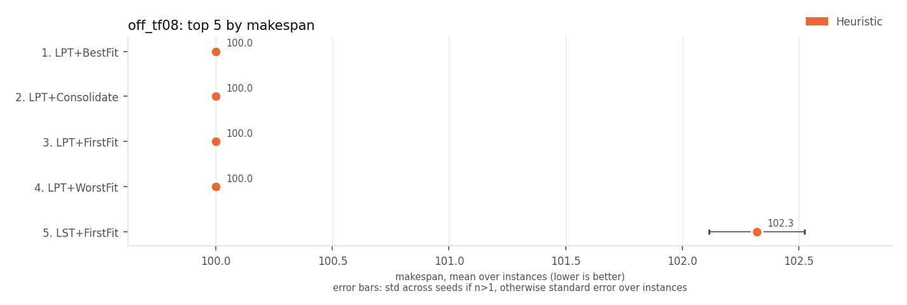 | 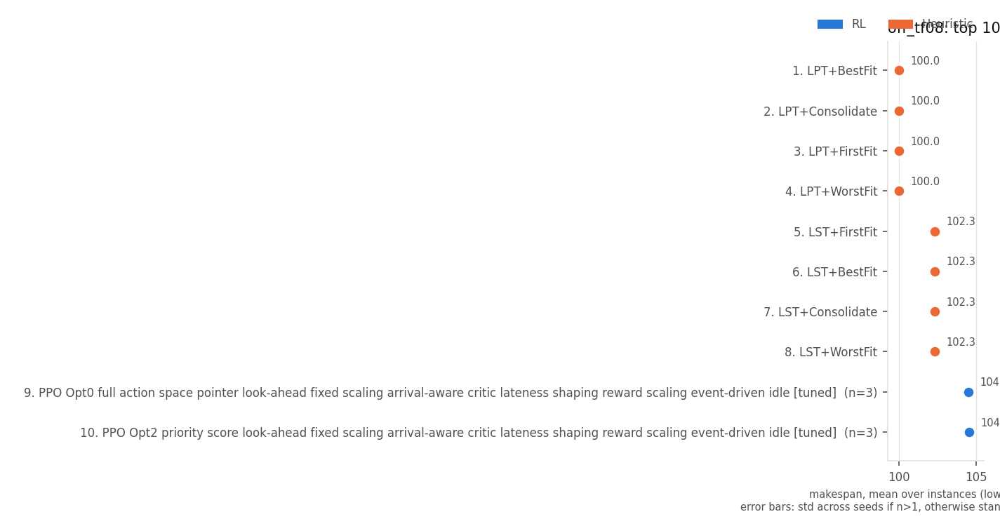 |

## utilisation of active machines (higher is better)

| rank | method | family | utilisation of active machines | J |
|---|---|---|---|---|
| 1 | LPT+Consolidate | Heuristic | 0.665 +/- 0.022 | 600070 +/- 62367 |
| 2 | LPT+BestFit | Heuristic | 0.648 +/- 0.025 | 600070 +/- 62367 |
| 3 | LST+Consolidate | Heuristic | 0.647 +/- 0.020 | 390493 +/- 44235 |
| 4 | SPT+Consolidate | Heuristic | 0.647 +/- 0.024 | 653300 +/- 60308 |
| 5 | LPT+FirstFit | Heuristic | 0.647 +/- 0.022 | 600070 +/- 62367 |
| 6 | WMDD+Consolidate | Heuristic | 0.646 +/- 0.020 | 412436 +/- 48952 |
| 7 | COVERT+Consolidate | Heuristic | 0.645 +/- 0.018 | 405440 +/- 49109 |
| 8 | FCFS+Consolidate | Heuristic | 0.645 +/- 0.020 | 617319 +/- 62259 |
| 9 | EDF+Consolidate | Heuristic | 0.640 +/- 0.021 | 394149 +/- 45422 |
| 10 | WLST+Consolidate | Heuristic | 0.640 +/- 0.015 | 257155 +/- 33291 |

| top 5 | top 10 |
|---|---|
| 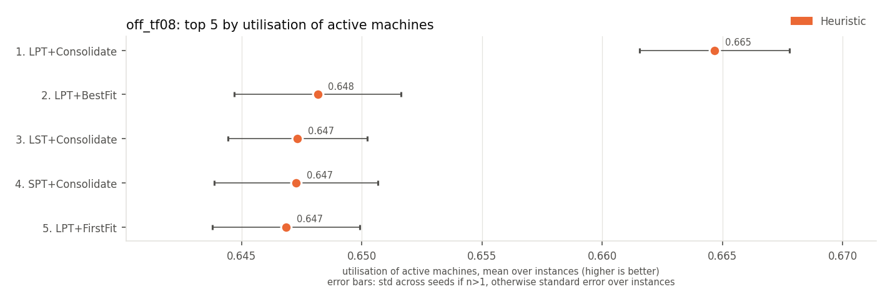 | 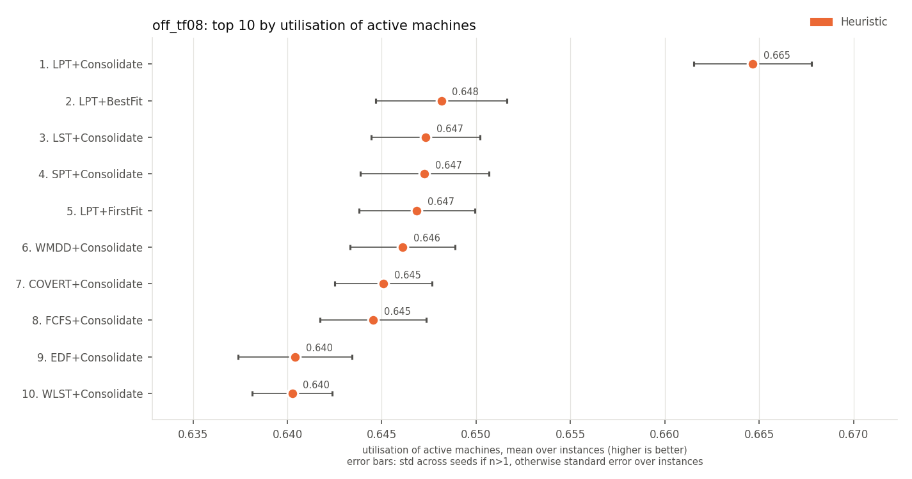 |

## active machine-ticks (lower is better)

| rank | method | family | active machine-ticks | J |
|---|---|---|---|---|
| 1 | LPT+Consolidate | Heuristic | 162 +/- 9 | 600070 +/- 62367 |
| 2 | LPT+BestFit | Heuristic | 165 +/- 10 | 600070 +/- 62367 |
| 3 | LST+Consolidate | Heuristic | 166 +/- 9 | 390493 +/- 44235 |
| 4 | LPT+FirstFit | Heuristic | 166 +/- 10 | 600070 +/- 62367 |
| 5 | SPT+Consolidate | Heuristic | 167 +/- 7 | 653300 +/- 60308 |
| 6 | FCFS+Consolidate | Heuristic | 167 +/- 11 | 617319 +/- 62259 |
| 7 | WMDD+Consolidate | Heuristic | 167 +/- 7 | 412436 +/- 48952 |
| 8 | COVERT+Consolidate | Heuristic | 168 +/- 8 | 405440 +/- 49109 |
| 9 | WLST+Consolidate | Heuristic | 168 +/- 9 | 257155 +/- 33291 |
| 10 | MDC+Consolidate | Heuristic | 168 +/- 9 | 321610 +/- 43049 |

| top 5 | top 10 |
|---|---|
| 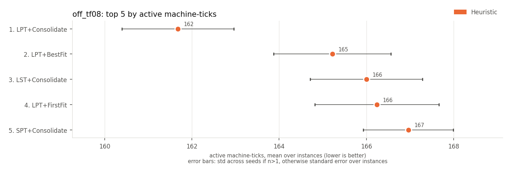 | 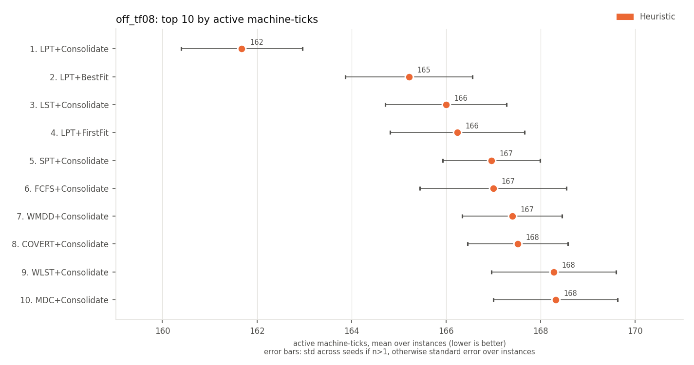 |

## energy (SPECpower) (lower is better)

| rank | method | family | energy (SPECpower) | J |
|---|---|---|---|---|
| 1 | LPT+Consolidate | Heuristic | 139 +/- 8 | 600070 +/- 62367 |
| 2 | LPT+BestFit | Heuristic | 141 +/- 8 | 600070 +/- 62367 |
| 3 | LST+Consolidate | Heuristic | 142 +/- 8 | 390493 +/- 44235 |
| 4 | LPT+FirstFit | Heuristic | 142 +/- 9 | 600070 +/- 62367 |
| 5 | FCFS+Consolidate | Heuristic | 143 +/- 9 | 617319 +/- 62259 |
| 6 | SPT+Consolidate | Heuristic | 143 +/- 7 | 653300 +/- 60308 |
| 7 | WMDD+Consolidate | Heuristic | 143 +/- 7 | 412436 +/- 48952 |
| 8 | COVERT+Consolidate | Heuristic | 143 +/- 7 | 405440 +/- 49109 |
| 9 | WLST+Consolidate | Heuristic | 144 +/- 8 | 257155 +/- 33291 |
| 10 | MDC+Consolidate | Heuristic | 144 +/- 8 | 321610 +/- 43049 |

| top 5 | top 10 |
|---|---|
| 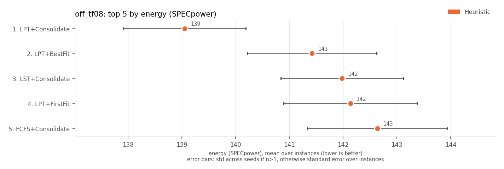 | 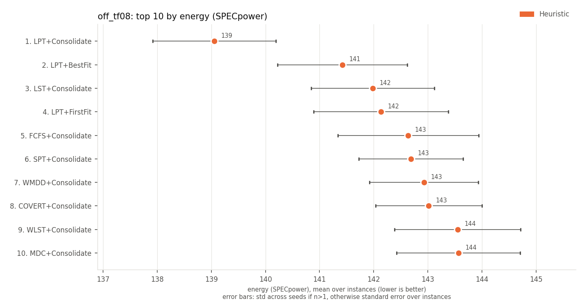 |

Spread (+/-): std across seeds for multi-seed RL rows, otherwise std across instances.
