# off_tf08_w1: leaderboards

Top 10 methods on each metric. Full ranking by J: [`tables/off_tf08_w1.md`](../tables/off_tf08_w1.md). Archive overview: [`HIGHLIGHTS.md`](../HIGHLIGHTS.md).

## J (lower is better)

| rank | method | family | J |
|---|---|---|---|
| 1 | WLST+FirstFit | Heuristic | 129805 +/- 12950 |
| 2 | WLST+BestFit | Heuristic | 129805 +/- 12950 |
| 3 | WLST+WorstFit | Heuristic | 129805 +/- 12950 |
| 4 | WLST+Consolidate | Heuristic | 129805 +/- 12950 |
| 5 | WEDF+FirstFit | Heuristic | 130919 +/- 12957 |
| 6 | WEDF+BestFit | Heuristic | 130919 +/- 12957 |
| 7 | WEDF+WorstFit | Heuristic | 130919 +/- 12957 |
| 8 | WEDF+Consolidate | Heuristic | 130919 +/- 12957 |
| 9 | MDC+FirstFit | Heuristic | 161279 +/- 15663 |
| 10 | MDC+BestFit | Heuristic | 161279 +/- 15663 |

| top 5 | top 10 |
|---|---|
| 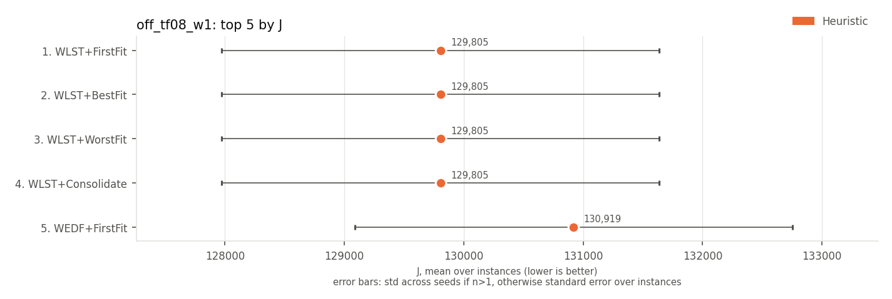 | 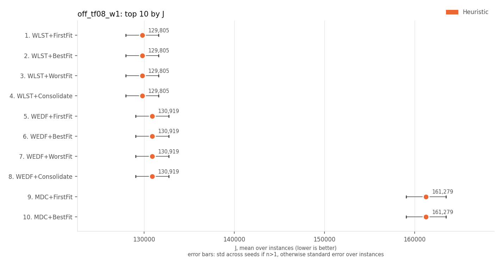 |

## on-time rate (higher is better)

| rank | method | family | on-time rate | J |
|---|---|---|---|---|
| 1 | ATC+FirstFit | Heuristic | 0.243 +/- 0.039 | 210328 +/- 14586 |
| 2 | ATC+BestFit | Heuristic | 0.243 +/- 0.039 | 210328 +/- 14586 |
| 3 | ATC+Consolidate | Heuristic | 0.243 +/- 0.039 | 210328 +/- 14586 |
| 4 | WEDF+FirstFit | Heuristic | 0.010 +/- 0.001 | 130919 +/- 12957 |
| 5 | WEDF+BestFit | Heuristic | 0.010 +/- 0.001 | 130919 +/- 12957 |
| 6 | WEDF+WorstFit | Heuristic | 0.010 +/- 0.001 | 130919 +/- 12957 |
| 7 | WEDF+Consolidate | Heuristic | 0.010 +/- 0.001 | 130919 +/- 12957 |
| 8 | WLST+FirstFit | Heuristic | 0.010 +/- 0.000 | 129805 +/- 12950 |
| 9 | WLST+BestFit | Heuristic | 0.010 +/- 0.000 | 129805 +/- 12950 |
| 10 | WLST+WorstFit | Heuristic | 0.010 +/- 0.000 | 129805 +/- 12950 |

| top 5 | top 10 |
|---|---|
| 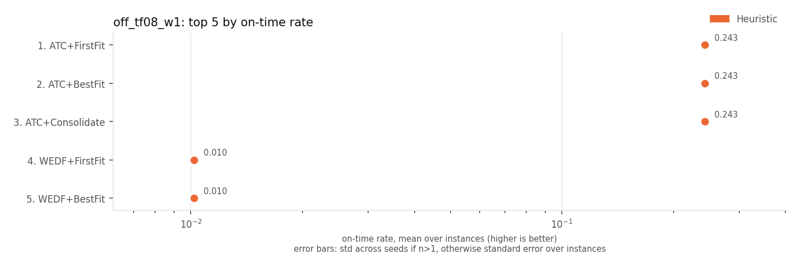 | 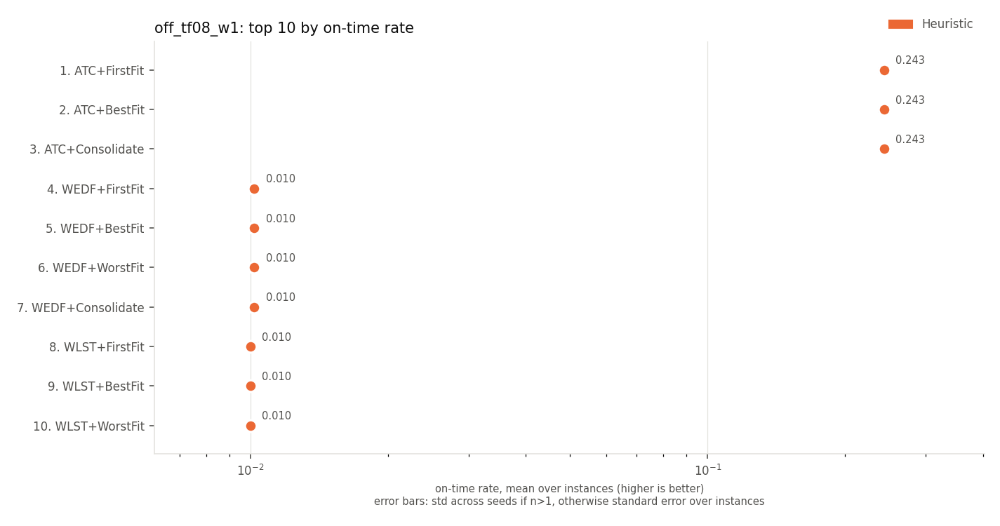 |

## late jobs (lower is better)

| rank | method | family | late jobs | J |
|---|---|---|---|---|
| 1 | ATC+FirstFit | Heuristic | 75.7 +/- 3.9 | 210328 +/- 14586 |
| 2 | ATC+BestFit | Heuristic | 75.7 +/- 3.9 | 210328 +/- 14586 |
| 3 | ATC+Consolidate | Heuristic | 75.7 +/- 3.9 | 210328 +/- 14586 |
| 4 | WEDF+FirstFit | Heuristic | 99.0 +/- 0.1 | 130919 +/- 12957 |
| 5 | WEDF+BestFit | Heuristic | 99.0 +/- 0.1 | 130919 +/- 12957 |
| 6 | WEDF+WorstFit | Heuristic | 99.0 +/- 0.1 | 130919 +/- 12957 |
| 7 | WEDF+Consolidate | Heuristic | 99.0 +/- 0.1 | 130919 +/- 12957 |
| 8 | WLST+FirstFit | Heuristic | 99.0 +/- 0.0 | 129805 +/- 12950 |
| 9 | WLST+BestFit | Heuristic | 99.0 +/- 0.0 | 129805 +/- 12950 |
| 10 | WLST+WorstFit | Heuristic | 99.0 +/- 0.0 | 129805 +/- 12950 |

| top 5 | top 10 |
|---|---|
| 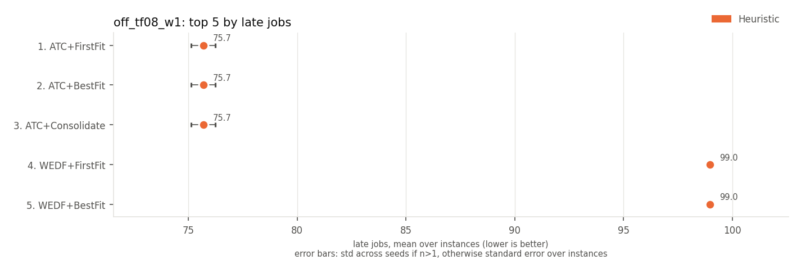 | 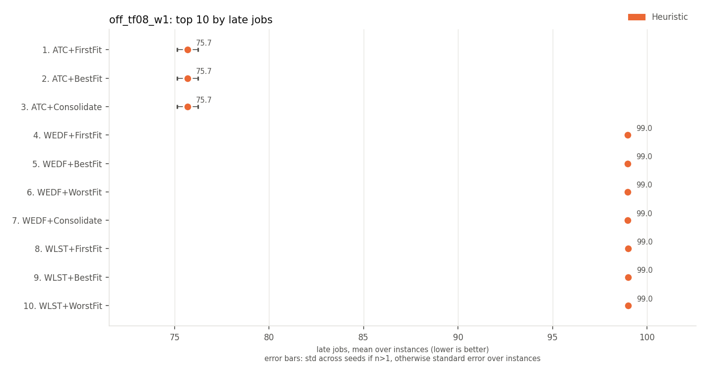 |

## weighted late jobs (lower is better)

Every method has the same value here, so there is no ranking.

## weighted tardiness (lower is better)

| rank | method | family | weighted tardiness | J |
|---|---|---|---|---|
| 1 | WLST+FirstFit | Heuristic | 3283 +/- 171 | 129805 +/- 12950 |
| 2 | WLST+BestFit | Heuristic | 3283 +/- 171 | 129805 +/- 12950 |
| 3 | WLST+WorstFit | Heuristic | 3283 +/- 171 | 129805 +/- 12950 |
| 4 | WLST+Consolidate | Heuristic | 3283 +/- 171 | 129805 +/- 12950 |
| 5 | MDC+FirstFit | Heuristic | 3283 +/- 171 | 161279 +/- 15663 |
| 6 | MDC+BestFit | Heuristic | 3283 +/- 171 | 161279 +/- 15663 |
| 7 | MDC+WorstFit | Heuristic | 3283 +/- 171 | 161279 +/- 15663 |
| 8 | MDC+Consolidate | Heuristic | 3283 +/- 171 | 161279 +/- 15663 |
| 9 | WEDF+FirstFit | Heuristic | 3283 +/- 171 | 130919 +/- 12957 |
| 10 | WEDF+BestFit | Heuristic | 3283 +/- 171 | 130919 +/- 12957 |

| top 5 | top 10 |
|---|---|
| 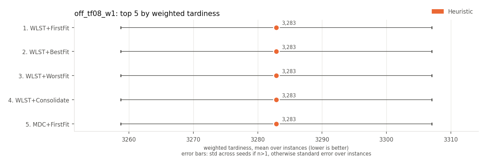 | 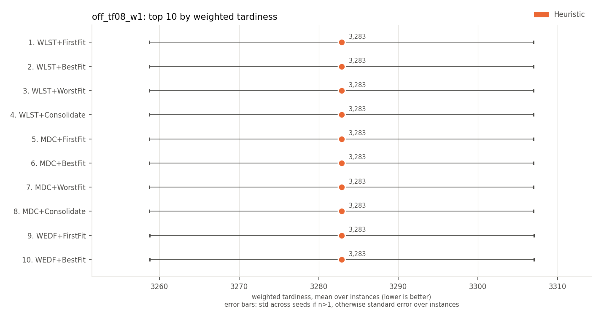 |

## max tardiness (lower is better)

| rank | method | family | max tardiness | J |
|---|---|---|---|---|
| 1 | WLST+FirstFit | Heuristic | 53.9 +/- 1.5 | 129805 +/- 12950 |
| 2 | WLST+BestFit | Heuristic | 53.9 +/- 1.5 | 129805 +/- 12950 |
| 3 | WLST+WorstFit | Heuristic | 53.9 +/- 1.5 | 129805 +/- 12950 |
| 4 | WLST+Consolidate | Heuristic | 53.9 +/- 1.5 | 129805 +/- 12950 |
| 5 | WEDF+FirstFit | Heuristic | 57.1 +/- 1.3 | 130919 +/- 12957 |
| 6 | WEDF+BestFit | Heuristic | 57.1 +/- 1.3 | 130919 +/- 12957 |
| 7 | WEDF+WorstFit | Heuristic | 57.1 +/- 1.3 | 130919 +/- 12957 |
| 8 | WEDF+Consolidate | Heuristic | 57.1 +/- 1.3 | 130919 +/- 12957 |
| 9 | MDC+FirstFit | Heuristic | 75.9 +/- 5.2 | 161279 +/- 15663 |
| 10 | MDC+BestFit | Heuristic | 75.9 +/- 5.2 | 161279 +/- 15663 |

| top 5 | top 10 |
|---|---|
| 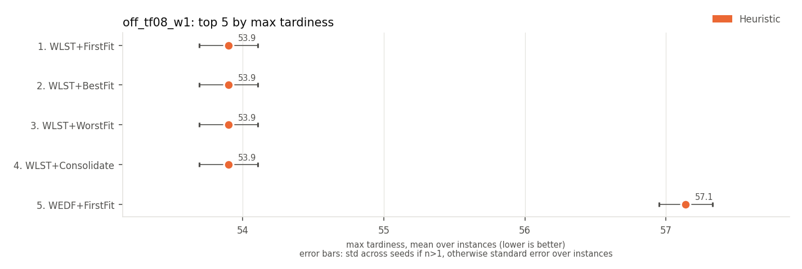 | 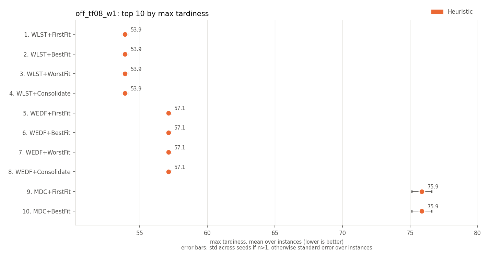 |

## p95 tardiness (lower is better)

| rank | method | family | p95 tardiness | J |
|---|---|---|---|---|
| 1 | WLST+FirstFit | Heuristic | 52.3 +/- 1.5 | 129805 +/- 12950 |
| 2 | WLST+BestFit | Heuristic | 52.3 +/- 1.5 | 129805 +/- 12950 |
| 3 | WLST+WorstFit | Heuristic | 52.3 +/- 1.5 | 129805 +/- 12950 |
| 4 | WLST+Consolidate | Heuristic | 52.3 +/- 1.5 | 129805 +/- 12950 |
| 5 | WEDF+FirstFit | Heuristic | 53.2 +/- 1.7 | 130919 +/- 12957 |
| 6 | WEDF+BestFit | Heuristic | 53.2 +/- 1.7 | 130919 +/- 12957 |
| 7 | WEDF+WorstFit | Heuristic | 53.2 +/- 1.7 | 130919 +/- 12957 |
| 8 | WEDF+Consolidate | Heuristic | 53.2 +/- 1.7 | 130919 +/- 12957 |
| 9 | MDC+FirstFit | Heuristic | 70.8 +/- 4.5 | 161279 +/- 15663 |
| 10 | MDC+BestFit | Heuristic | 70.8 +/- 4.5 | 161279 +/- 15663 |

| top 5 | top 10 |
|---|---|
| 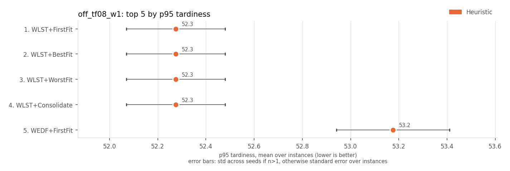 | 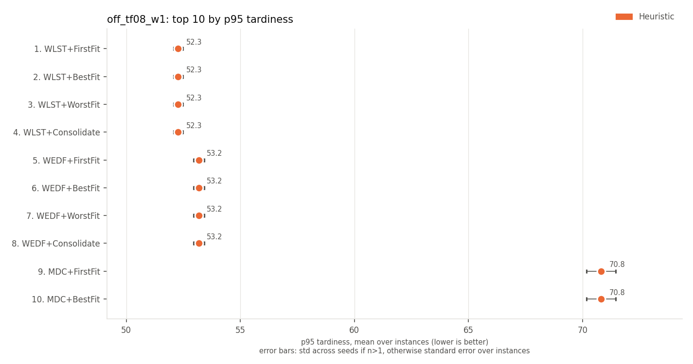 |

## mean wait (lower is better)

Every method has the same value here, so there is no ranking.

## mean flow time (lower is better)

Every method has the same value here, so there is no ranking.

## makespan (lower is better)

| rank | method | family | makespan | J |
|---|---|---|---|---|
| 1 | WLST+FirstFit | Heuristic | 102.6 +/- 1.5 | 129805 +/- 12950 |
| 2 | WLST+BestFit | Heuristic | 102.6 +/- 1.5 | 129805 +/- 12950 |
| 3 | WLST+WorstFit | Heuristic | 102.6 +/- 1.5 | 129805 +/- 12950 |
| 4 | WLST+Consolidate | Heuristic | 102.6 +/- 1.5 | 129805 +/- 12950 |
| 5 | WEDF+FirstFit | Heuristic | 105.6 +/- 1.3 | 130919 +/- 12957 |
| 6 | WEDF+BestFit | Heuristic | 105.6 +/- 1.3 | 130919 +/- 12957 |
| 7 | WEDF+WorstFit | Heuristic | 105.6 +/- 1.3 | 130919 +/- 12957 |
| 8 | WEDF+Consolidate | Heuristic | 105.6 +/- 1.3 | 130919 +/- 12957 |
| 9 | MDC+FirstFit | Heuristic | 107.9 +/- 0.3 | 161279 +/- 15663 |
| 10 | MDC+BestFit | Heuristic | 107.9 +/- 0.3 | 161279 +/- 15663 |

| top 5 | top 10 |
|---|---|
| 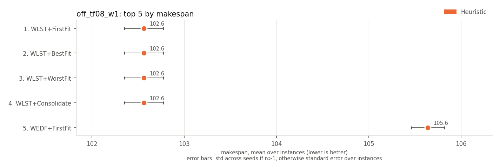 | 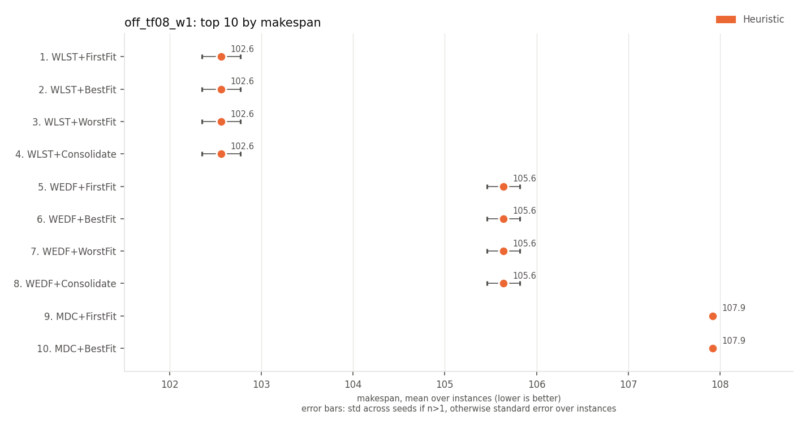 |

## utilisation of active machines (higher is better)

| rank | method | family | utilisation of active machines | J |
|---|---|---|---|---|
| 1 | MDC+Consolidate | Heuristic | 0.654 +/- 0.021 | 161279 +/- 15663 |
| 2 | ATC+Consolidate | Heuristic | 0.650 +/- 0.025 | 210328 +/- 14586 |
| 3 | WLST+Consolidate | Heuristic | 0.645 +/- 0.021 | 129805 +/- 12950 |
| 4 | WEDF+Consolidate | Heuristic | 0.640 +/- 0.021 | 130919 +/- 12957 |
| 5 | MDC+FirstFit | Heuristic | 0.636 +/- 0.022 | 161279 +/- 15663 |
| 6 | WLST+BestFit | Heuristic | 0.634 +/- 0.019 | 129805 +/- 12950 |
| 7 | MDC+BestFit | Heuristic | 0.633 +/- 0.023 | 161279 +/- 15663 |
| 8 | WLST+FirstFit | Heuristic | 0.631 +/- 0.019 | 129805 +/- 12950 |
| 9 | ATC+FirstFit | Heuristic | 0.630 +/- 0.024 | 210328 +/- 14586 |
| 10 | ATC+BestFit | Heuristic | 0.629 +/- 0.025 | 210328 +/- 14586 |

| top 5 | top 10 |
|---|---|
| 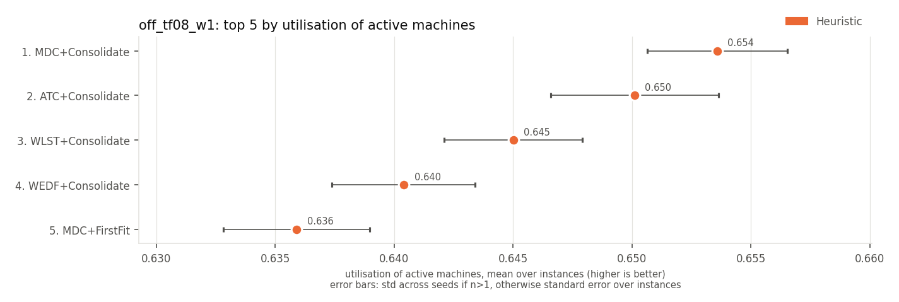 | 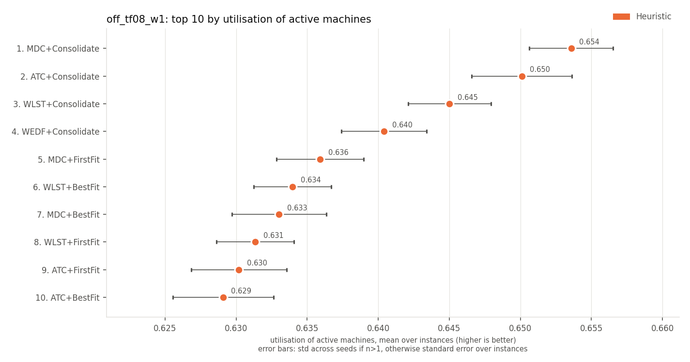 |

## active machine-ticks (lower is better)

| rank | method | family | active machine-ticks | J |
|---|---|---|---|---|
| 1 | MDC+Consolidate | Heuristic | 166 +/- 9 | 161279 +/- 15663 |
| 2 | ATC+Consolidate | Heuristic | 166 +/- 7 | 210328 +/- 14586 |
| 3 | WLST+Consolidate | Heuristic | 167 +/- 10 | 129805 +/- 12950 |
| 4 | WEDF+Consolidate | Heuristic | 169 +/- 11 | 130919 +/- 12957 |
| 5 | WLST+BestFit | Heuristic | 170 +/- 10 | 129805 +/- 12950 |
| 6 | MDC+FirstFit | Heuristic | 171 +/- 10 | 161279 +/- 15663 |
| 7 | WLST+FirstFit | Heuristic | 171 +/- 10 | 129805 +/- 12950 |
| 8 | MDC+BestFit | Heuristic | 171 +/- 10 | 161279 +/- 15663 |
| 9 | ATC+FirstFit | Heuristic | 171 +/- 10 | 210328 +/- 14586 |
| 10 | ATC+BestFit | Heuristic | 172 +/- 10 | 210328 +/- 14586 |

| top 5 | top 10 |
|---|---|
| 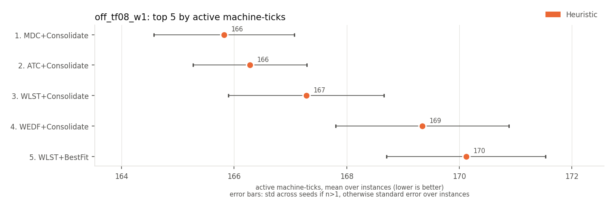 | 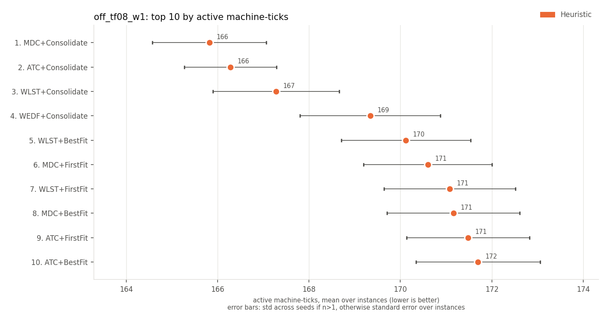 |

## energy (SPECpower) (lower is better)

| rank | method | family | energy (SPECpower) | J |
|---|---|---|---|---|
| 1 | MDC+Consolidate | Heuristic | 142 +/- 8 | 161279 +/- 15663 |
| 2 | ATC+Consolidate | Heuristic | 142 +/- 7 | 210328 +/- 14586 |
| 3 | WLST+Consolidate | Heuristic | 143 +/- 9 | 129805 +/- 12950 |
| 4 | WEDF+Consolidate | Heuristic | 144 +/- 9 | 130919 +/- 12957 |
| 5 | WLST+BestFit | Heuristic | 145 +/- 9 | 129805 +/- 12950 |
| 6 | MDC+FirstFit | Heuristic | 145 +/- 9 | 161279 +/- 15663 |
| 7 | WLST+FirstFit | Heuristic | 145 +/- 9 | 129805 +/- 12950 |
| 8 | MDC+BestFit | Heuristic | 145 +/- 9 | 161279 +/- 15663 |
| 9 | ATC+FirstFit | Heuristic | 146 +/- 8 | 210328 +/- 14586 |
| 10 | ATC+BestFit | Heuristic | 146 +/- 8 | 210328 +/- 14586 |

| top 5 | top 10 |
|---|---|
| 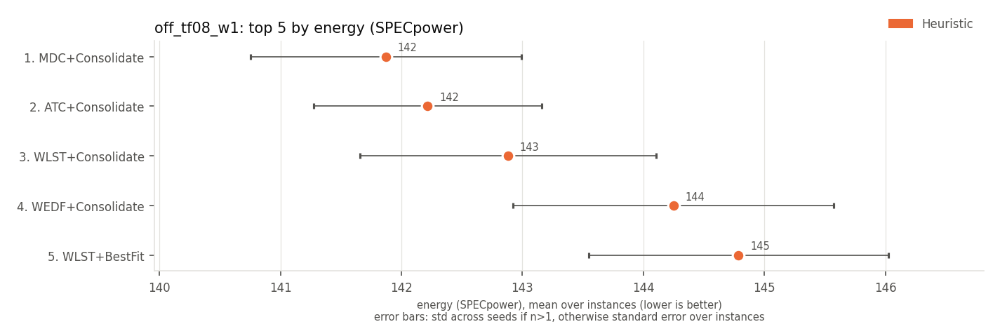 | 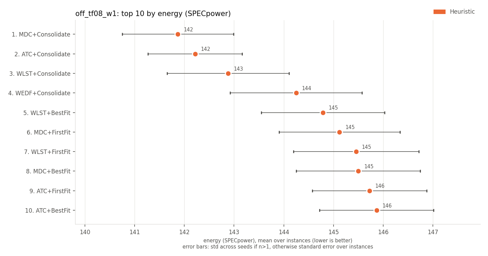 |

Spread (+/-): std across seeds for multi-seed RL rows, otherwise std across instances.
