# on_rho050: leaderboards

Top 10 methods on each metric. Full ranking by J: [`tables/on_rho050.md`](../tables/on_rho050.md). Archive overview: [`HIGHLIGHTS.md`](../HIGHLIGHTS.md).

## J (lower is better)

| rank | method | family | J |
|---|---|---|---|
| 1 | WLST+Consolidate | Heuristic | 4085 +/- 2414 |
| 2 | LST+Consolidate | Heuristic | 4087 +/- 2413 |
| 3 | MDC+Consolidate | Heuristic | 4087 +/- 2413 |
| 4 | WEDF+Consolidate | Heuristic | 4089 +/- 2415 |
| 5 | WEDF+BestFit | Heuristic | 4090 +/- 2414 |
| 6 | ATC+Consolidate | Heuristic | 4090 +/- 2414 |
| 7 | LST+FirstFit | Heuristic | 4090 +/- 2413 |
| 8 | MDC+FirstFit | Heuristic | 4090 +/- 2413 |
| 9 | LPT+Consolidate | Heuristic | 4091 +/- 2412 |
| 10 | LST+BestFit | Heuristic | 4092 +/- 2414 |

| top 5 | top 10 |
|---|---|
| 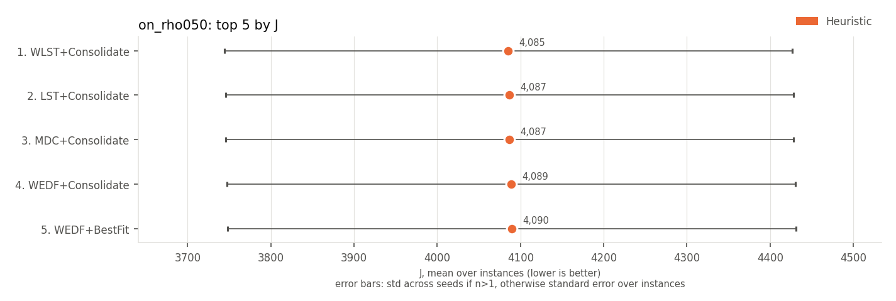 | 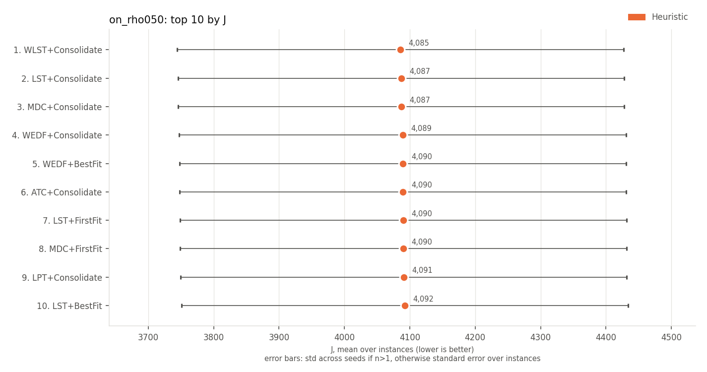 |

## on-time rate (higher is better)

| rank | method | family | on-time rate | J |
|---|---|---|---|---|
| 1 | WLST+Consolidate | Heuristic | 0.978 +/- 0.007 | 4085 +/- 2414 |
| 2 | LST+Consolidate | Heuristic | 0.978 +/- 0.007 | 4087 +/- 2413 |
| 3 | MDC+Consolidate | Heuristic | 0.978 +/- 0.007 | 4087 +/- 2413 |
| 4 | LST+BestFit | Heuristic | 0.978 +/- 0.007 | 4092 +/- 2414 |
| 5 | MDC+BestFit | Heuristic | 0.978 +/- 0.007 | 4092 +/- 2414 |
| 6 | WLST+BestFit | Heuristic | 0.978 +/- 0.007 | 4098 +/- 2416 |
| 7 | LST+FirstFit | Heuristic | 0.977 +/- 0.007 | 4090 +/- 2413 |
| 8 | MDC+FirstFit | Heuristic | 0.977 +/- 0.007 | 4090 +/- 2413 |
| 9 | LPT+Consolidate | Heuristic | 0.977 +/- 0.007 | 4091 +/- 2412 |
| 10 | ATC+Consolidate | Heuristic | 0.977 +/- 0.007 | 4090 +/- 2414 |

| top 5 | top 10 |
|---|---|
| 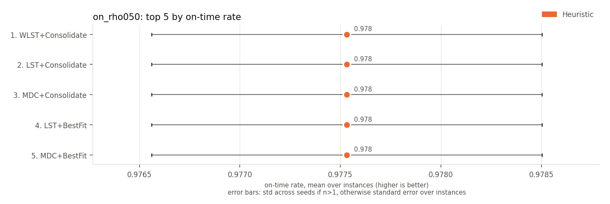 | 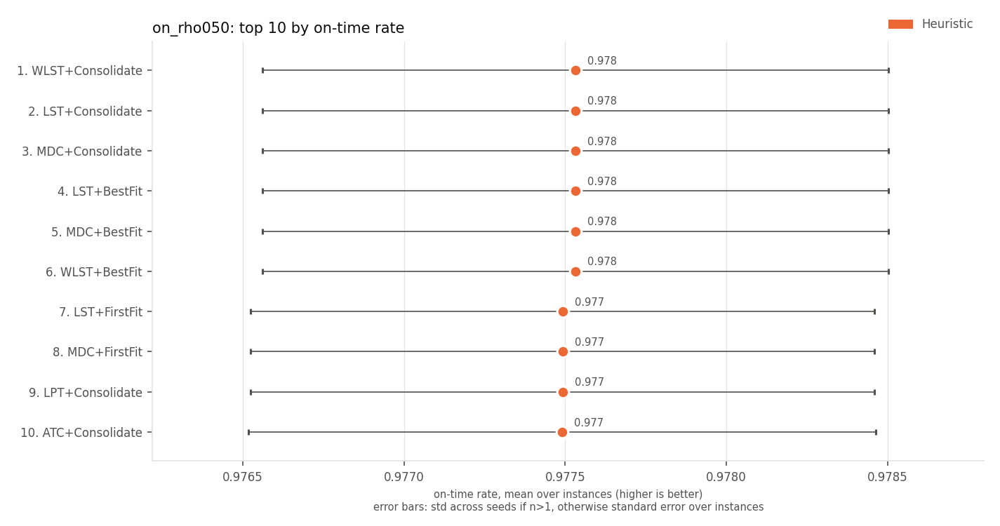 |

## late jobs (lower is better)

| rank | method | family | late jobs | J |
|---|---|---|---|---|
| 1 | WLST+Consolidate | Heuristic | 10.6 +/- 3.3 | 4085 +/- 2414 |
| 2 | LST+Consolidate | Heuristic | 10.6 +/- 3.3 | 4087 +/- 2413 |
| 3 | MDC+Consolidate | Heuristic | 10.6 +/- 3.3 | 4087 +/- 2413 |
| 4 | LST+BestFit | Heuristic | 10.6 +/- 3.3 | 4092 +/- 2414 |
| 5 | MDC+BestFit | Heuristic | 10.6 +/- 3.3 | 4092 +/- 2414 |
| 6 | WLST+BestFit | Heuristic | 10.6 +/- 3.3 | 4098 +/- 2416 |
| 7 | WEDF+Consolidate | Heuristic | 10.7 +/- 3.3 | 4089 +/- 2415 |
| 8 | ATC+Consolidate | Heuristic | 10.7 +/- 3.3 | 4090 +/- 2414 |
| 9 | LST+FirstFit | Heuristic | 10.7 +/- 3.3 | 4090 +/- 2413 |
| 10 | MDC+FirstFit | Heuristic | 10.7 +/- 3.3 | 4090 +/- 2413 |

| top 5 | top 10 |
|---|---|
| 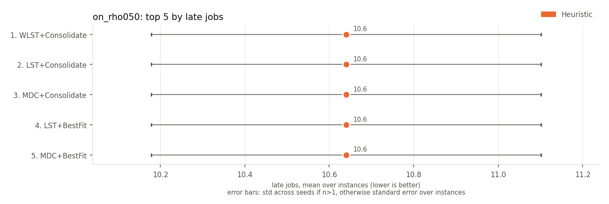 | 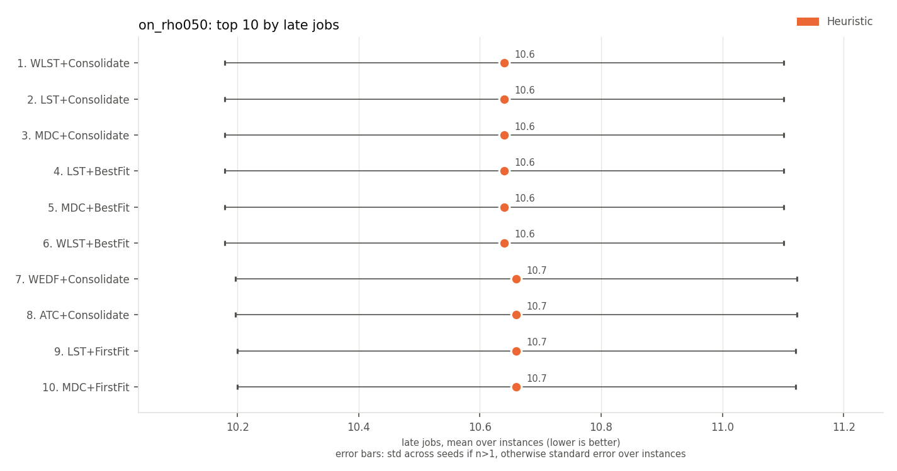 |

## weighted late jobs (lower is better)

Every method has the same value here, so there is no ranking.

## weighted tardiness (lower is better)

| rank | method | family | weighted tardiness | J |
|---|---|---|---|---|
| 1 | WLST+Consolidate | Heuristic | 278 +/- 115 | 4085 +/- 2414 |
| 2 | LST+Consolidate | Heuristic | 278 +/- 115 | 4087 +/- 2413 |
| 3 | MDC+Consolidate | Heuristic | 278 +/- 115 | 4087 +/- 2413 |
| 4 | WEDF+Consolidate | Heuristic | 278 +/- 115 | 4089 +/- 2415 |
| 5 | ATC+Consolidate | Heuristic | 278 +/- 115 | 4090 +/- 2414 |
| 6 | LST+BestFit | Heuristic | 278 +/- 115 | 4092 +/- 2414 |
| 7 | MDC+BestFit | Heuristic | 278 +/- 115 | 4092 +/- 2414 |
| 8 | LST+FirstFit | Heuristic | 278 +/- 115 | 4090 +/- 2413 |
| 9 | MDC+FirstFit | Heuristic | 278 +/- 115 | 4090 +/- 2413 |
| 10 | WEDF+BestFit | Heuristic | 278 +/- 115 | 4090 +/- 2414 |

| top 5 | top 10 |
|---|---|
| 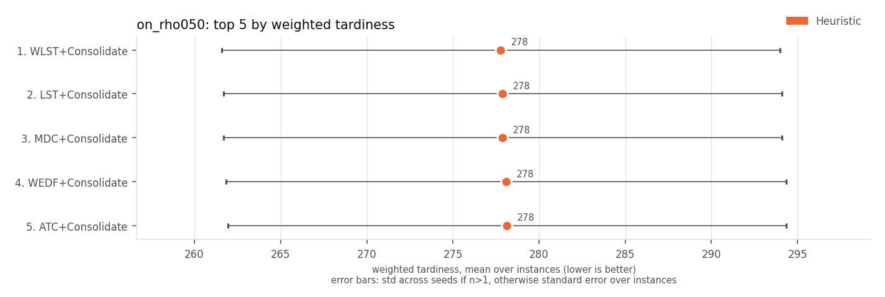 | 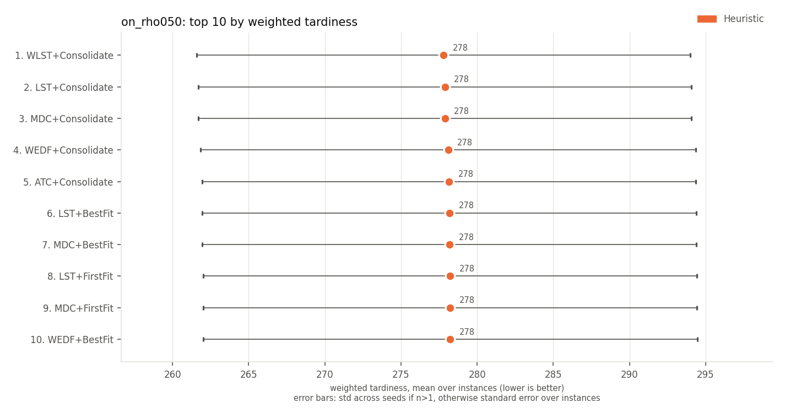 |

## max tardiness (lower is better)

| rank | method | family | max tardiness | J |
|---|---|---|---|---|
| 1 | WLST+Consolidate | Heuristic | 21.9 +/- 6.4 | 4085 +/- 2414 |
| 2 | LST+Consolidate | Heuristic | 21.9 +/- 6.4 | 4087 +/- 2413 |
| 3 | MDC+Consolidate | Heuristic | 21.9 +/- 6.4 | 4087 +/- 2413 |
| 4 | WEDF+Consolidate | Heuristic | 21.9 +/- 6.4 | 4089 +/- 2415 |
| 5 | WEDF+BestFit | Heuristic | 21.9 +/- 6.4 | 4090 +/- 2414 |
| 6 | ATC+Consolidate | Heuristic | 21.9 +/- 6.4 | 4090 +/- 2414 |
| 7 | LST+FirstFit | Heuristic | 21.9 +/- 6.4 | 4090 +/- 2413 |
| 8 | MDC+FirstFit | Heuristic | 21.9 +/- 6.4 | 4090 +/- 2413 |
| 9 | LPT+Consolidate | Heuristic | 21.9 +/- 6.4 | 4091 +/- 2412 |
| 10 | LST+BestFit | Heuristic | 21.9 +/- 6.4 | 4092 +/- 2414 |

| top 5 | top 10 |
|---|---|
| 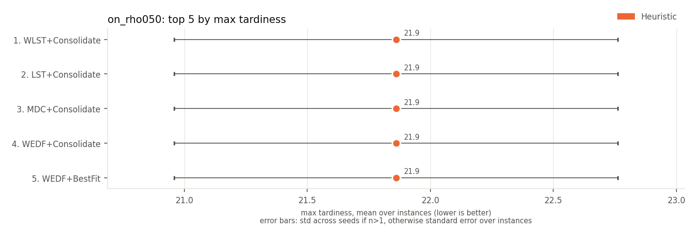 | 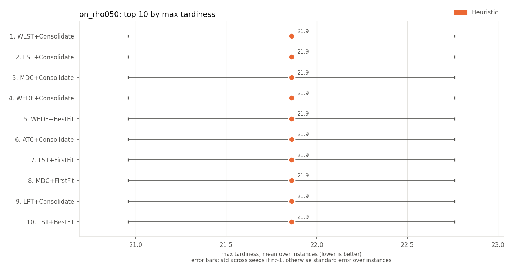 |

## p95 tardiness (lower is better)

| rank | method | family | p95 tardiness | J |
|---|---|---|---|---|
| 1 | WLST+Consolidate | Heuristic | 0.0 +/- 0.0 | 4085 +/- 2414 |
| 2 | LST+Consolidate | Heuristic | 0.0 +/- 0.0 | 4087 +/- 2413 |
| 3 | MDC+Consolidate | Heuristic | 0.0 +/- 0.0 | 4087 +/- 2413 |
| 4 | WEDF+Consolidate | Heuristic | 0.0 +/- 0.0 | 4089 +/- 2415 |
| 5 | WEDF+BestFit | Heuristic | 0.0 +/- 0.0 | 4090 +/- 2414 |
| 6 | ATC+Consolidate | Heuristic | 0.0 +/- 0.0 | 4090 +/- 2414 |
| 7 | LST+FirstFit | Heuristic | 0.0 +/- 0.0 | 4090 +/- 2413 |
| 8 | MDC+FirstFit | Heuristic | 0.0 +/- 0.0 | 4090 +/- 2413 |
| 9 | LPT+Consolidate | Heuristic | 0.0 +/- 0.0 | 4091 +/- 2412 |
| 10 | LST+BestFit | Heuristic | 0.0 +/- 0.0 | 4092 +/- 2414 |

| top 5 | top 10 |
|---|---|
| 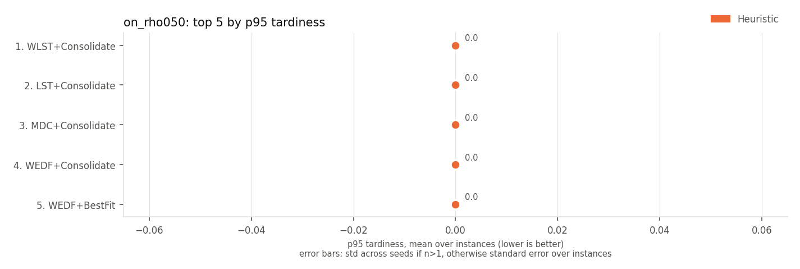 | 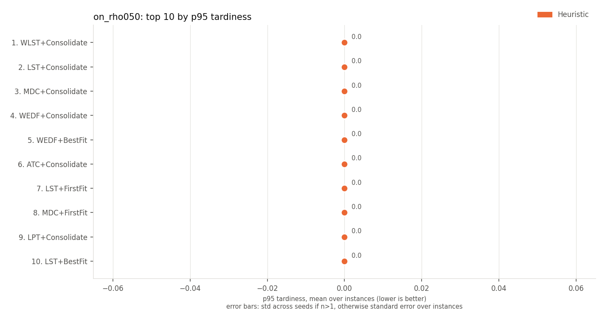 |

## mean wait (lower is better)

| rank | method | family | mean wait | J |
|---|---|---|---|---|
| 1 | SPT+Consolidate | Heuristic | 0.03 +/- 0.04 | 4137 +/- 2423 |
| 2 | FCFS+Consolidate | Heuristic | 0.03 +/- 0.04 | 4099 +/- 2420 |
| 3 | MDC+Consolidate | Heuristic | 0.03 +/- 0.05 | 4087 +/- 2413 |
| 4 | ATC+Consolidate | Heuristic | 0.03 +/- 0.05 | 4090 +/- 2414 |
| 5 | LST+Consolidate | Heuristic | 0.03 +/- 0.05 | 4087 +/- 2413 |
| 6 | WSPT+Consolidate | Heuristic | 0.03 +/- 0.05 | 4137 +/- 2441 |
| 7 | WEDF+Consolidate | Heuristic | 0.03 +/- 0.05 | 4089 +/- 2415 |
| 8 | WLST+Consolidate | Heuristic | 0.03 +/- 0.05 | 4085 +/- 2414 |
| 9 | EDF+Consolidate | Heuristic | 0.03 +/- 0.05 | 4097 +/- 2411 |
| 10 | SPT+BestFit | Heuristic | 0.04 +/- 0.05 | 4151 +/- 2429 |

| top 5 | top 10 |
|---|---|
| 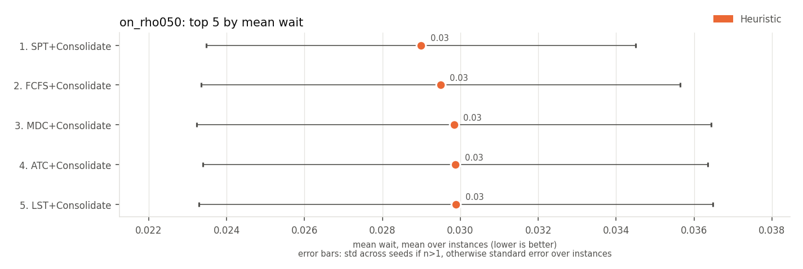 | 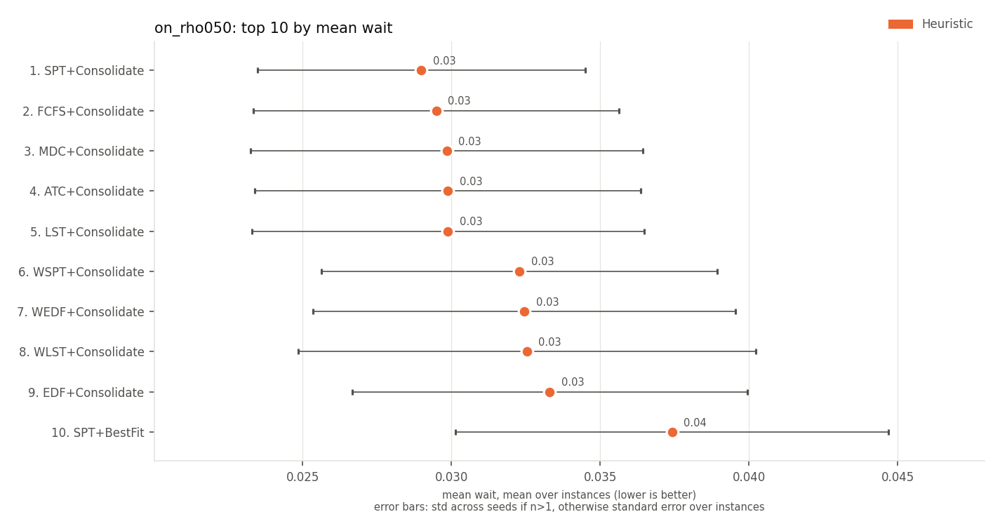 |

## mean flow time (lower is better)

| rank | method | family | mean flow time | J |
|---|---|---|---|---|
| 1 | SPT+Consolidate | Heuristic | 5.50 +/- 0.30 | 4137 +/- 2423 |
| 2 | FCFS+Consolidate | Heuristic | 5.50 +/- 0.30 | 4099 +/- 2420 |
| 3 | MDC+Consolidate | Heuristic | 5.51 +/- 0.30 | 4087 +/- 2413 |
| 4 | ATC+Consolidate | Heuristic | 5.51 +/- 0.29 | 4090 +/- 2414 |
| 5 | LST+Consolidate | Heuristic | 5.51 +/- 0.30 | 4087 +/- 2413 |
| 6 | WSPT+Consolidate | Heuristic | 5.51 +/- 0.30 | 4137 +/- 2441 |
| 7 | WEDF+Consolidate | Heuristic | 5.51 +/- 0.30 | 4089 +/- 2415 |
| 8 | WLST+Consolidate | Heuristic | 5.51 +/- 0.30 | 4085 +/- 2414 |
| 9 | EDF+Consolidate | Heuristic | 5.51 +/- 0.30 | 4097 +/- 2411 |
| 10 | SPT+BestFit | Heuristic | 5.51 +/- 0.30 | 4151 +/- 2429 |

| top 5 | top 10 |
|---|---|
| 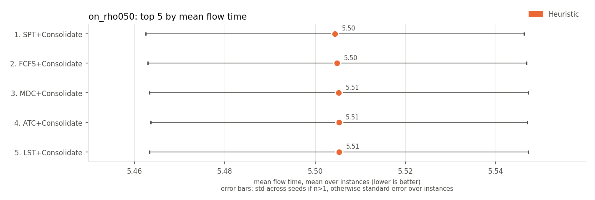 | 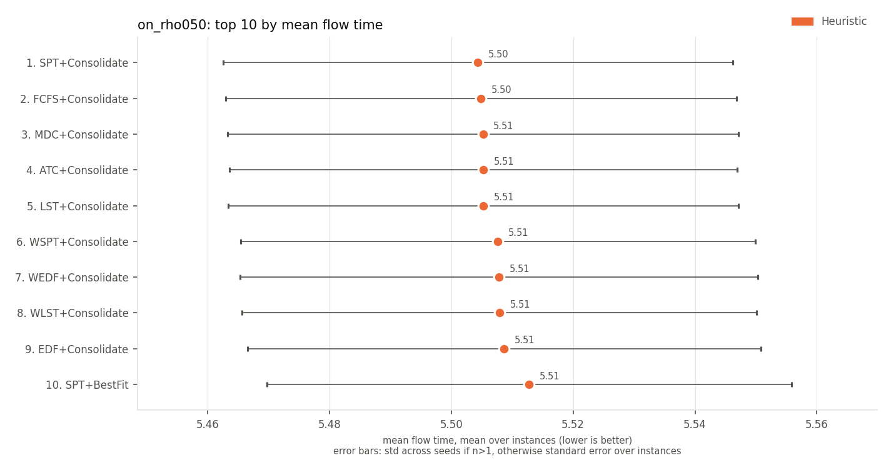 |

## makespan (lower is better)

| rank | method | family | makespan | J |
|---|---|---|---|---|
| 1 | WLST+Consolidate | Heuristic | 127.0 +/- 7.9 | 4085 +/- 2414 |
| 2 | LST+Consolidate | Heuristic | 127.0 +/- 7.9 | 4087 +/- 2413 |
| 3 | MDC+Consolidate | Heuristic | 127.0 +/- 7.9 | 4087 +/- 2413 |
| 4 | WEDF+Consolidate | Heuristic | 127.0 +/- 7.9 | 4089 +/- 2415 |
| 5 | WEDF+BestFit | Heuristic | 127.0 +/- 7.8 | 4090 +/- 2414 |
| 6 | ATC+Consolidate | Heuristic | 127.0 +/- 7.8 | 4090 +/- 2414 |
| 7 | LST+FirstFit | Heuristic | 127.0 +/- 7.8 | 4090 +/- 2413 |
| 8 | MDC+FirstFit | Heuristic | 127.0 +/- 7.8 | 4090 +/- 2413 |
| 9 | LPT+Consolidate | Heuristic | 127.0 +/- 7.8 | 4091 +/- 2412 |
| 10 | ATC+BestFit | Heuristic | 127.0 +/- 7.8 | 4093 +/- 2421 |

| top 5 | top 10 |
|---|---|
| 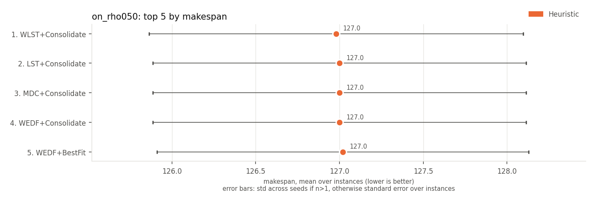 | 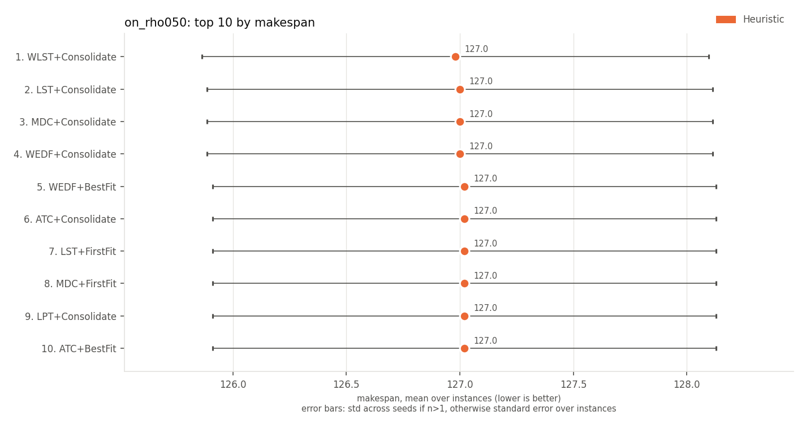 |

## utilisation of active machines (higher is better)

| rank | method | family | utilisation of active machines | J |
|---|---|---|---|---|
| 1 | LPT+Consolidate | Heuristic | 0.860 +/- 0.018 | 4091 +/- 2412 |
| 2 | LST+Consolidate | Heuristic | 0.854 +/- 0.017 | 4087 +/- 2413 |
| 3 | MDC+Consolidate | Heuristic | 0.854 +/- 0.017 | 4087 +/- 2413 |
| 4 | WLST+Consolidate | Heuristic | 0.851 +/- 0.018 | 4085 +/- 2414 |
| 5 | EDF+Consolidate | Heuristic | 0.849 +/- 0.019 | 4097 +/- 2411 |
| 6 | FCFS+Consolidate | Heuristic | 0.849 +/- 0.018 | 4099 +/- 2420 |
| 7 | ATC+Consolidate | Heuristic | 0.847 +/- 0.018 | 4090 +/- 2414 |
| 8 | WEDF+Consolidate | Heuristic | 0.847 +/- 0.020 | 4089 +/- 2415 |
| 9 | SPT+Consolidate | Heuristic | 0.841 +/- 0.020 | 4137 +/- 2423 |
| 10 | WSPT+Consolidate | Heuristic | 0.841 +/- 0.017 | 4137 +/- 2441 |

| top 5 | top 10 |
|---|---|
| 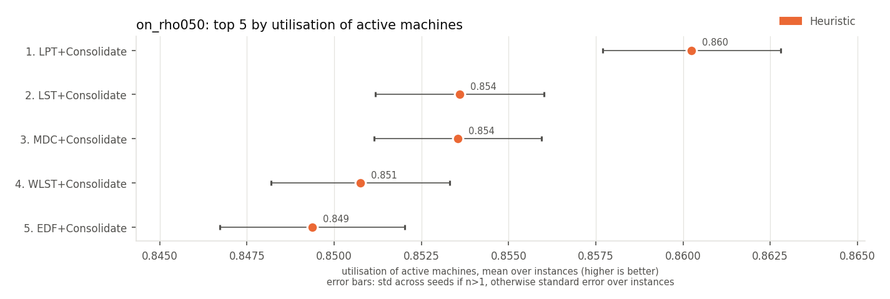 | 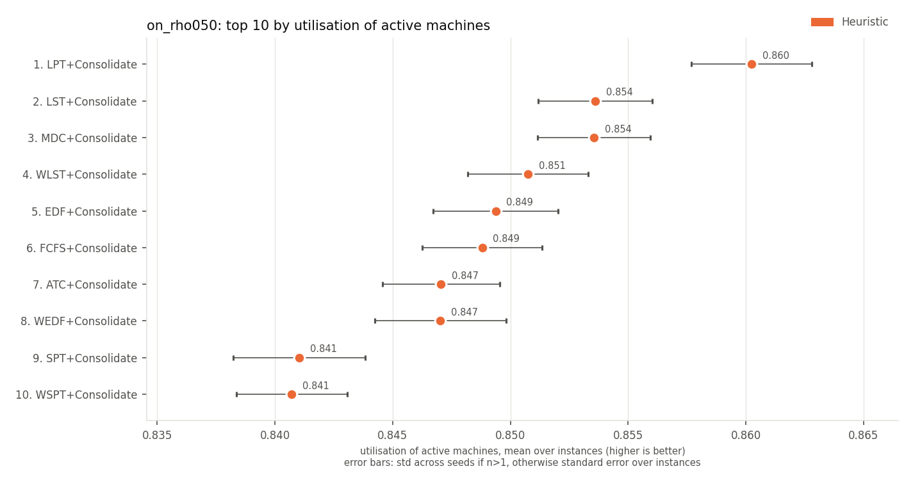 |

## active machine-ticks (lower is better)

| rank | method | family | active machine-ticks | J |
|---|---|---|---|---|
| 1 | LPT+Consolidate | Heuristic | 815 +/- 60 | 4091 +/- 2412 |
| 2 | LST+Consolidate | Heuristic | 823 +/- 58 | 4087 +/- 2413 |
| 3 | MDC+Consolidate | Heuristic | 823 +/- 58 | 4087 +/- 2413 |
| 4 | WLST+Consolidate | Heuristic | 827 +/- 61 | 4085 +/- 2414 |
| 5 | FCFS+Consolidate | Heuristic | 829 +/- 61 | 4099 +/- 2420 |
| 6 | WEDF+Consolidate | Heuristic | 833 +/- 61 | 4089 +/- 2415 |
| 7 | EDF+Consolidate | Heuristic | 833 +/- 58 | 4097 +/- 2411 |
| 8 | ATC+Consolidate | Heuristic | 833 +/- 58 | 4090 +/- 2414 |
| 9 | LPT+BestFit | Heuristic | 841 +/- 61 | 4098 +/- 2413 |
| 10 | SPT+Consolidate | Heuristic | 842 +/- 59 | 4137 +/- 2423 |

| top 5 | top 10 |
|---|---|
| 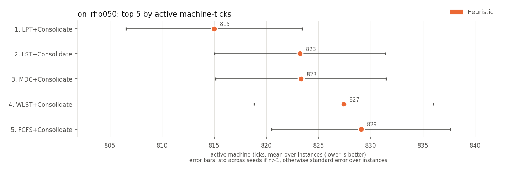 | 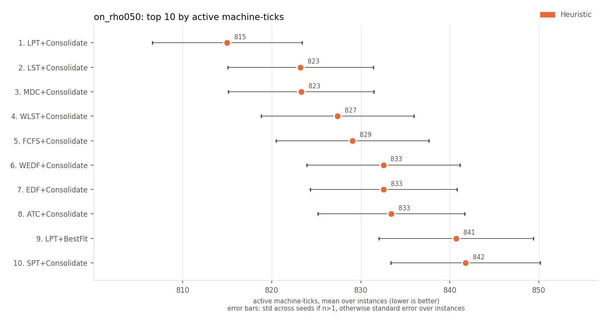 |

## energy (SPECpower) (lower is better)

| rank | method | family | energy (SPECpower) | J |
|---|---|---|---|---|
| 1 | LPT+Consolidate | Heuristic | 708 +/- 52 | 4091 +/- 2412 |
| 2 | LST+Consolidate | Heuristic | 713 +/- 51 | 4087 +/- 2413 |
| 3 | MDC+Consolidate | Heuristic | 713 +/- 51 | 4087 +/- 2413 |
| 4 | WLST+Consolidate | Heuristic | 716 +/- 53 | 4085 +/- 2414 |
| 5 | FCFS+Consolidate | Heuristic | 717 +/- 53 | 4099 +/- 2420 |
| 6 | WEDF+Consolidate | Heuristic | 720 +/- 53 | 4089 +/- 2415 |
| 7 | EDF+Consolidate | Heuristic | 720 +/- 51 | 4097 +/- 2411 |
| 8 | ATC+Consolidate | Heuristic | 720 +/- 51 | 4090 +/- 2414 |
| 9 | LPT+BestFit | Heuristic | 725 +/- 53 | 4098 +/- 2413 |
| 10 | SPT+Consolidate | Heuristic | 726 +/- 52 | 4137 +/- 2423 |

| top 5 | top 10 |
|---|---|
| 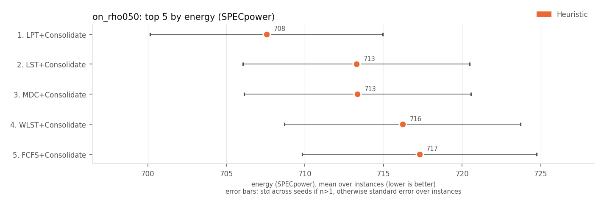 | 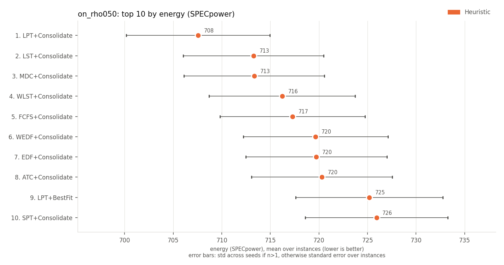 |

Spread (+/-): std across seeds for multi-seed RL rows, otherwise std across instances.
