# on_rho075: leaderboards

Top 10 methods on each metric. Full ranking by J: [`tables/on_rho075.md`](../tables/on_rho075.md). Archive overview: [`HIGHLIGHTS.md`](../HIGHLIGHTS.md).

## J (lower is better)

| rank | method | family | J |
|---|---|---|---|
| 1 | WLST+Consolidate | Heuristic | 5990 +/- 3881 |
| 2 | LST+Consolidate | Heuristic | 6051 +/- 4035 |
| 3 | MDC+Consolidate | Heuristic | 6068 +/- 4037 |
| 4 | MDC+FirstFit | Heuristic | 6149 +/- 4064 |
| 5 | LST+FirstFit | Heuristic | 6181 +/- 4181 |
| 6 | EDF+Consolidate | Heuristic | 6181 +/- 4022 |
| 7 | WLST+FirstFit | Heuristic | 6204 +/- 4086 |
| 8 | WLST+BestFit | Heuristic | 6210 +/- 4129 |
| 9 | COVERT+Consolidate | Heuristic | 6219 +/- 4449 |
| 10 | WEDF+Consolidate | Heuristic | 6222 +/- 4062 |

| top 5 | top 10 |
|---|---|
| 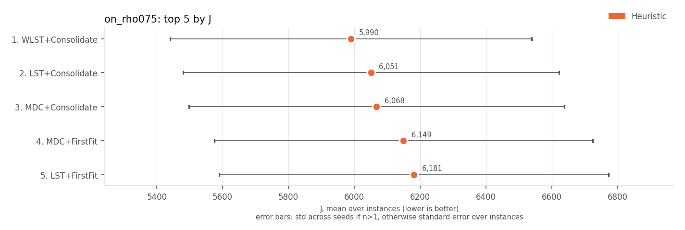 | 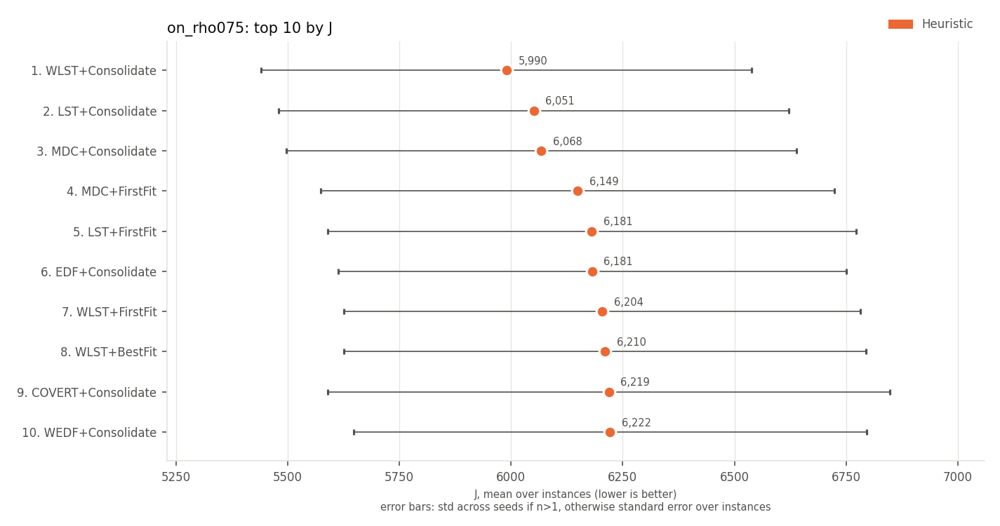 |

## on-time rate (higher is better)

| rank | method | family | on-time rate | J |
|---|---|---|---|---|
| 1 | MDC+Consolidate | Heuristic | 0.977 +/- 0.005 | 6068 +/- 4037 |
| 2 | LST+Consolidate | Heuristic | 0.977 +/- 0.005 | 6051 +/- 4035 |
| 3 | COVERT+Consolidate | Heuristic | 0.977 +/- 0.005 | 6219 +/- 4449 |
| 4 | WLST+Consolidate | Heuristic | 0.976 +/- 0.005 | 5990 +/- 3881 |
| 5 | EDF+Consolidate | Heuristic | 0.976 +/- 0.006 | 6181 +/- 4022 |
| 6 | ATC+Consolidate | Heuristic | 0.976 +/- 0.006 | 7109 +/- 5514 |
| 7 | MDC+FirstFit | Heuristic | 0.976 +/- 0.006 | 6149 +/- 4064 |
| 8 | LST+FirstFit | Heuristic | 0.976 +/- 0.007 | 6181 +/- 4181 |
| 9 | WMDD+Consolidate | Heuristic | 0.975 +/- 0.006 | 7688 +/- 7376 |
| 10 | WEDF+Consolidate | Heuristic | 0.975 +/- 0.006 | 6222 +/- 4062 |

| top 5 | top 10 |
|---|---|
| 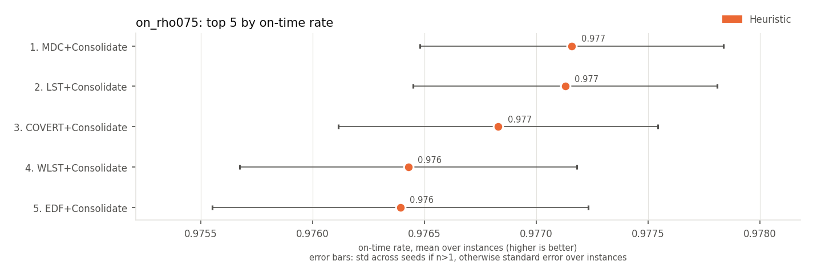 | 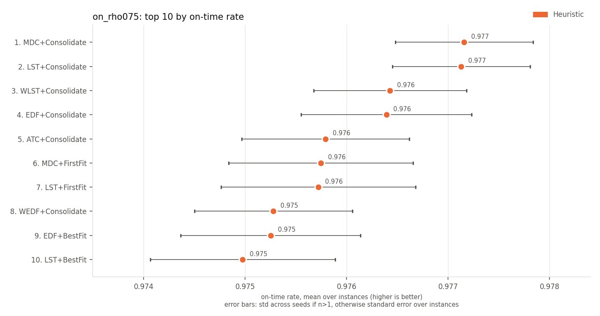 |

## late jobs (lower is better)

| rank | method | family | late jobs | J |
|---|---|---|---|---|
| 1 | MDC+Consolidate | Heuristic | 16.3 +/- 3.5 | 6068 +/- 4037 |
| 2 | LST+Consolidate | Heuristic | 16.4 +/- 3.5 | 6051 +/- 4035 |
| 3 | COVERT+Consolidate | Heuristic | 16.6 +/- 3.7 | 6219 +/- 4449 |
| 4 | WLST+Consolidate | Heuristic | 16.9 +/- 4.0 | 5990 +/- 3881 |
| 5 | EDF+Consolidate | Heuristic | 16.9 +/- 4.4 | 6181 +/- 4022 |
| 6 | ATC+Consolidate | Heuristic | 17.3 +/- 4.3 | 7109 +/- 5514 |
| 7 | MDC+FirstFit | Heuristic | 17.4 +/- 4.8 | 6149 +/- 4064 |
| 8 | LST+FirstFit | Heuristic | 17.4 +/- 5.1 | 6181 +/- 4181 |
| 9 | WMDD+Consolidate | Heuristic | 17.6 +/- 4.1 | 7688 +/- 7376 |
| 10 | WEDF+Consolidate | Heuristic | 17.7 +/- 4.1 | 6222 +/- 4062 |

| top 5 | top 10 |
|---|---|
| 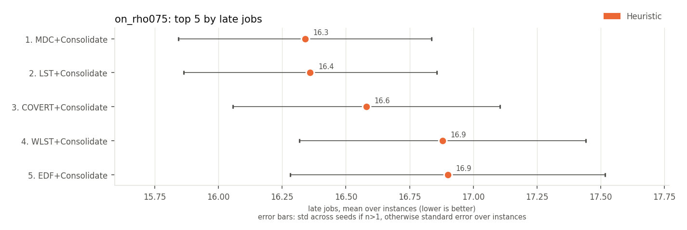 | 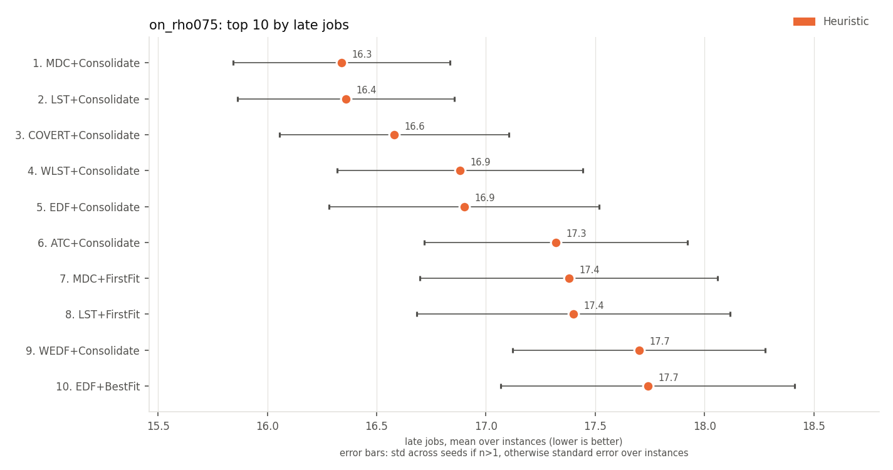 |

## weighted late jobs (lower is better)

| rank | method | family | weighted late jobs | J |
|---|---|---|---|---|
| 1 | MDC+Consolidate | Heuristic | 50.1 +/- 12.4 | 6068 +/- 4037 |
| 2 | LST+Consolidate | Heuristic | 50.2 +/- 12.4 | 6051 +/- 4035 |
| 3 | COVERT+Consolidate | Heuristic | 50.6 +/- 12.6 | 6219 +/- 4449 |
| 4 | WLST+Consolidate | Heuristic | 51.0 +/- 14.2 | 5990 +/- 3881 |
| 5 | ATC+Consolidate | Heuristic | 51.5 +/- 13.8 | 7109 +/- 5514 |
| 6 | EDF+Consolidate | Heuristic | 51.6 +/- 15.1 | 6181 +/- 4022 |
| 7 | WMDD+Consolidate | Heuristic | 51.6 +/- 13.8 | 7688 +/- 7376 |
| 8 | WEDF+Consolidate | Heuristic | 51.7 +/- 13.5 | 6222 +/- 4062 |
| 9 | MDC+FirstFit | Heuristic | 53.1 +/- 16.4 | 6149 +/- 4064 |
| 10 | LST+FirstFit | Heuristic | 53.2 +/- 17.2 | 6181 +/- 4181 |

| top 5 | top 10 |
|---|---|
| 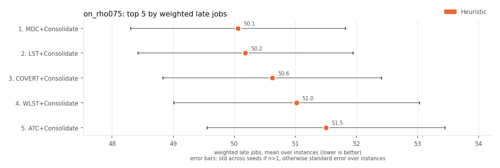 | 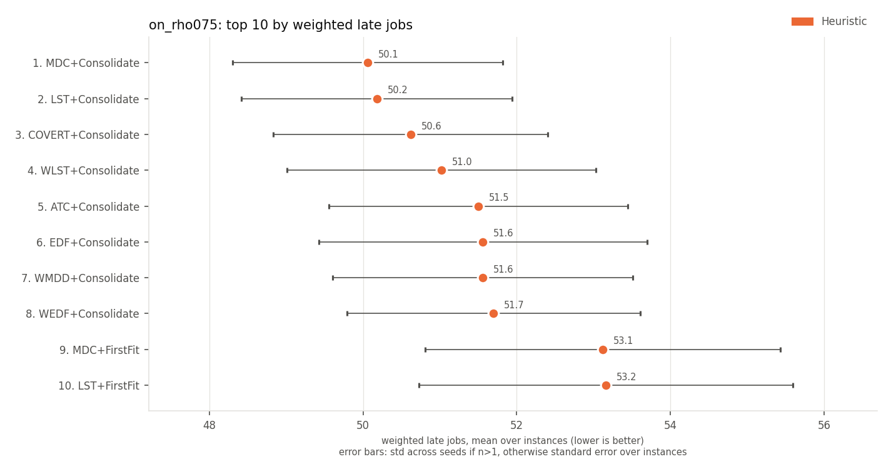 |

## weighted tardiness (lower is better)

| rank | method | family | weighted tardiness | J |
|---|---|---|---|---|
| 1 | WLST+Consolidate | Heuristic | 414 +/- 181 | 5990 +/- 3881 |
| 2 | LST+Consolidate | Heuristic | 414 +/- 184 | 6051 +/- 4035 |
| 3 | MDC+Consolidate | Heuristic | 414 +/- 184 | 6068 +/- 4037 |
| 4 | COVERT+Consolidate | Heuristic | 419 +/- 188 | 6219 +/- 4449 |
| 5 | EDF+Consolidate | Heuristic | 424 +/- 189 | 6181 +/- 4022 |
| 6 | WEDF+Consolidate | Heuristic | 426 +/- 184 | 6222 +/- 4062 |
| 7 | MDC+FirstFit | Heuristic | 427 +/- 195 | 6149 +/- 4064 |
| 8 | LST+FirstFit | Heuristic | 431 +/- 208 | 6181 +/- 4181 |
| 9 | WLST+FirstFit | Heuristic | 437 +/- 202 | 6204 +/- 4086 |
| 10 | WLST+BestFit | Heuristic | 437 +/- 209 | 6210 +/- 4129 |

| top 5 | top 10 |
|---|---|
| 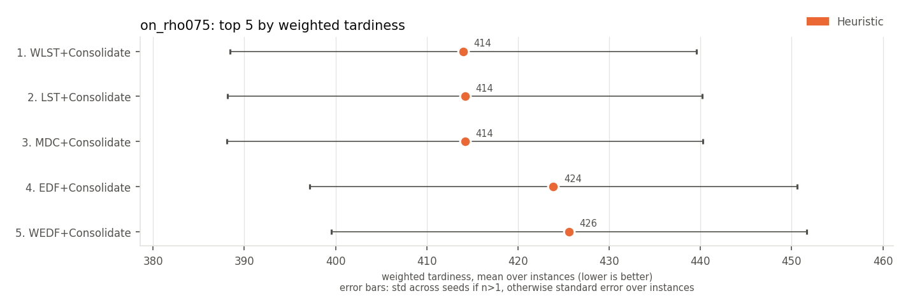 | 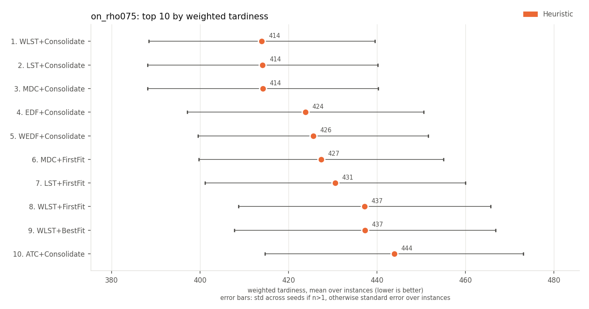 |

## max tardiness (lower is better)

| rank | method | family | max tardiness | J |
|---|---|---|---|---|
| 1 | WLST+BestFit | Heuristic | 23.8 +/- 5.0 | 6210 +/- 4129 |
| 2 | LST+Consolidate | Heuristic | 23.9 +/- 5.2 | 6051 +/- 4035 |
| 3 | MDC+Consolidate | Heuristic | 23.9 +/- 5.2 | 6068 +/- 4037 |
| 4 | WLST+FirstFit | Heuristic | 23.9 +/- 5.0 | 6204 +/- 4086 |
| 5 | LST+BestFit | Heuristic | 23.9 +/- 5.0 | 6323 +/- 4374 |
| 6 | LST+FirstFit | Heuristic | 24.0 +/- 5.1 | 6181 +/- 4181 |
| 7 | WLST+Consolidate | Heuristic | 24.0 +/- 5.1 | 5990 +/- 3881 |
| 8 | MDC+FirstFit | Heuristic | 24.1 +/- 5.0 | 6149 +/- 4064 |
| 9 | EDF+Consolidate | Heuristic | 24.1 +/- 5.2 | 6181 +/- 4022 |
| 10 | COVERT+Consolidate | Heuristic | 24.4 +/- 6.2 | 6219 +/- 4449 |

| top 5 | top 10 |
|---|---|
| 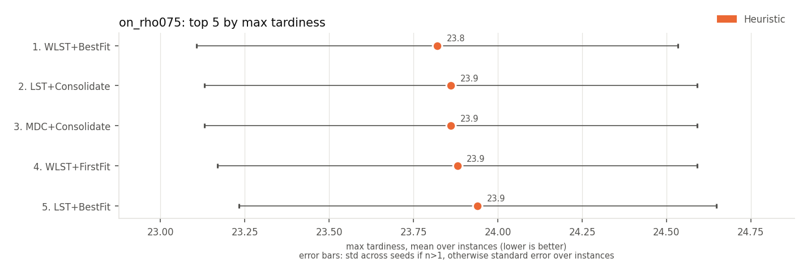 | 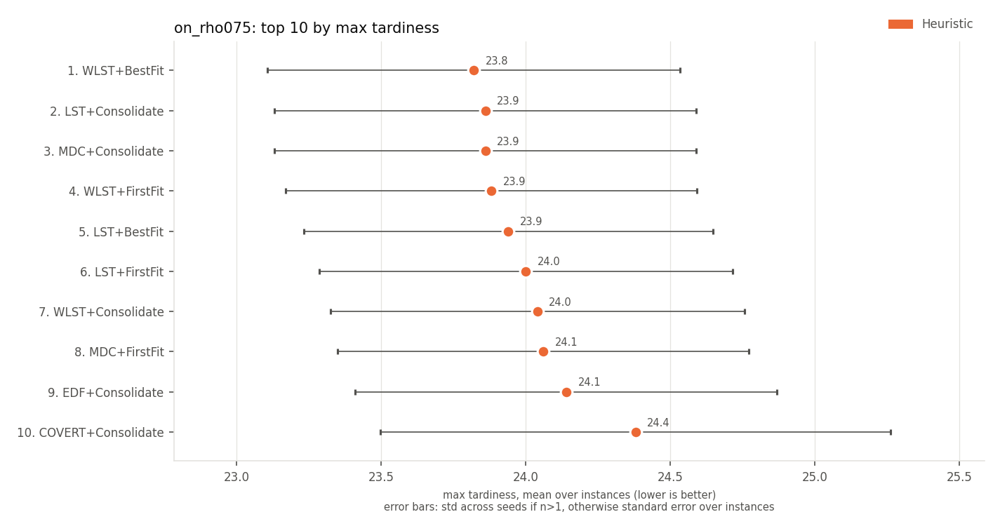 |

## p95 tardiness (lower is better)

| rank | method | family | p95 tardiness | J |
|---|---|---|---|---|
| 1 | WLST+Consolidate | Heuristic | 0.0 +/- 0.0 | 5990 +/- 3881 |
| 2 | LST+Consolidate | Heuristic | 0.0 +/- 0.0 | 6051 +/- 4035 |
| 3 | MDC+Consolidate | Heuristic | 0.0 +/- 0.0 | 6068 +/- 4037 |
| 4 | MDC+FirstFit | Heuristic | 0.0 +/- 0.0 | 6149 +/- 4064 |
| 5 | LST+FirstFit | Heuristic | 0.0 +/- 0.0 | 6181 +/- 4181 |
| 6 | EDF+Consolidate | Heuristic | 0.0 +/- 0.0 | 6181 +/- 4022 |
| 7 | WLST+FirstFit | Heuristic | 0.0 +/- 0.0 | 6204 +/- 4086 |
| 8 | WLST+BestFit | Heuristic | 0.0 +/- 0.0 | 6210 +/- 4129 |
| 9 | COVERT+Consolidate | Heuristic | 0.0 +/- 0.0 | 6219 +/- 4449 |
| 10 | WEDF+Consolidate | Heuristic | 0.0 +/- 0.0 | 6222 +/- 4062 |

| top 5 | top 10 |
|---|---|
| 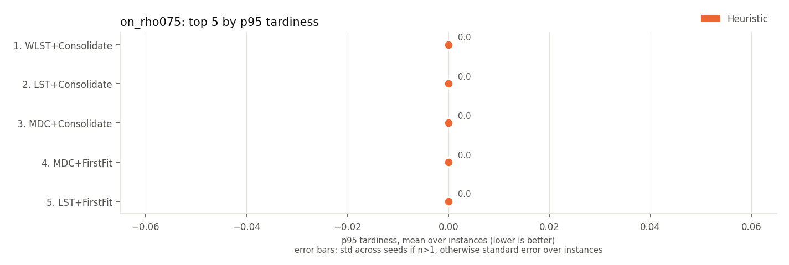 | 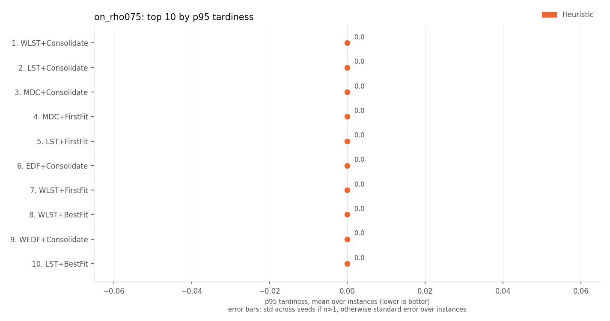 |

## mean wait (lower is better)

| rank | method | family | mean wait | J |
|---|---|---|---|---|
| 1 | SPT+Consolidate | Heuristic | 0.60 +/- 0.27 | 17647 +/- 18184 |
| 2 | WSPT+Consolidate | Heuristic | 0.65 +/- 0.30 | 13848 +/- 13952 |
| 3 | SPT+BestFit | Heuristic | 0.69 +/- 0.30 | 20689 +/- 19530 |
| 4 | WSPT+BestFit | Heuristic | 0.71 +/- 0.32 | 18358 +/- 19023 |
| 5 | ATC+Consolidate | Heuristic | 0.76 +/- 0.41 | 7109 +/- 5514 |
| 6 | FCFS+Consolidate | Heuristic | 0.78 +/- 0.46 | 7011 +/- 4969 |
| 7 | SPT+FirstFit | Heuristic | 0.81 +/- 0.31 | 26165 +/- 22870 |
| 8 | FCFS+BestFit | Heuristic | 0.81 +/- 0.44 | 7431 +/- 5297 |
| 9 | EDF+Consolidate | Heuristic | 0.84 +/- 0.52 | 6181 +/- 4022 |
| 10 | ATC+BestFit | Heuristic | 0.84 +/- 0.42 | 7930 +/- 6629 |

| top 5 | top 10 |
|---|---|
| 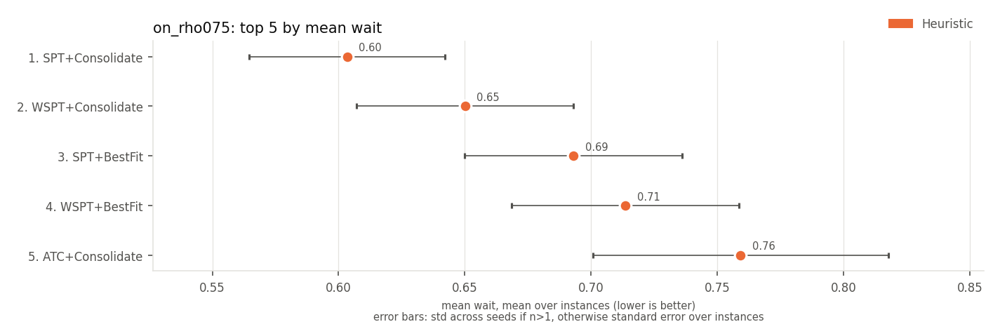 | 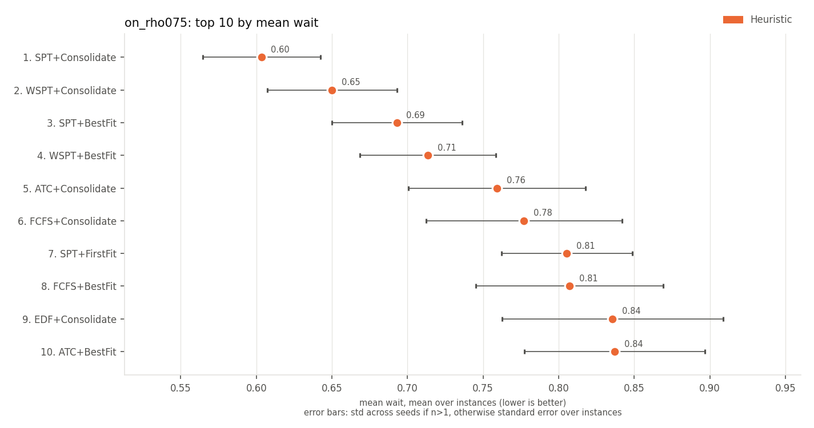 |

## mean flow time (lower is better)

| rank | method | family | mean flow time | J |
|---|---|---|---|---|
| 1 | SPT+Consolidate | Heuristic | 6.03 +/- 0.42 | 17647 +/- 18184 |
| 2 | WSPT+Consolidate | Heuristic | 6.07 +/- 0.44 | 13848 +/- 13952 |
| 3 | SPT+BestFit | Heuristic | 6.12 +/- 0.45 | 20689 +/- 19530 |
| 4 | WSPT+BestFit | Heuristic | 6.14 +/- 0.44 | 18358 +/- 19023 |
| 5 | ATC+Consolidate | Heuristic | 6.18 +/- 0.55 | 7109 +/- 5514 |
| 6 | FCFS+Consolidate | Heuristic | 6.20 +/- 0.57 | 7011 +/- 4969 |
| 7 | SPT+FirstFit | Heuristic | 6.23 +/- 0.43 | 26165 +/- 22870 |
| 8 | FCFS+BestFit | Heuristic | 6.23 +/- 0.57 | 7431 +/- 5297 |
| 9 | EDF+Consolidate | Heuristic | 6.26 +/- 0.65 | 6181 +/- 4022 |
| 10 | ATC+BestFit | Heuristic | 6.26 +/- 0.55 | 7930 +/- 6629 |

| top 5 | top 10 |
|---|---|
| 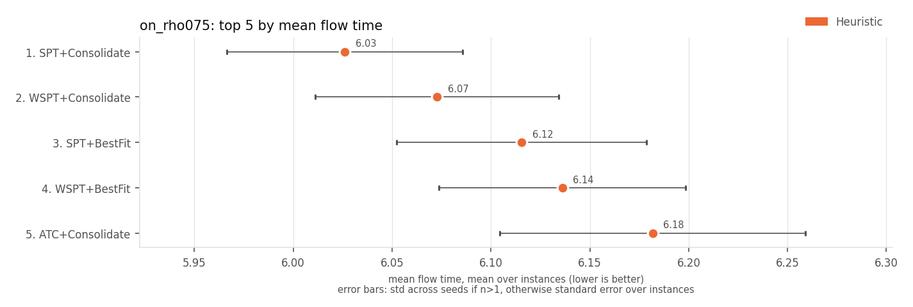 | 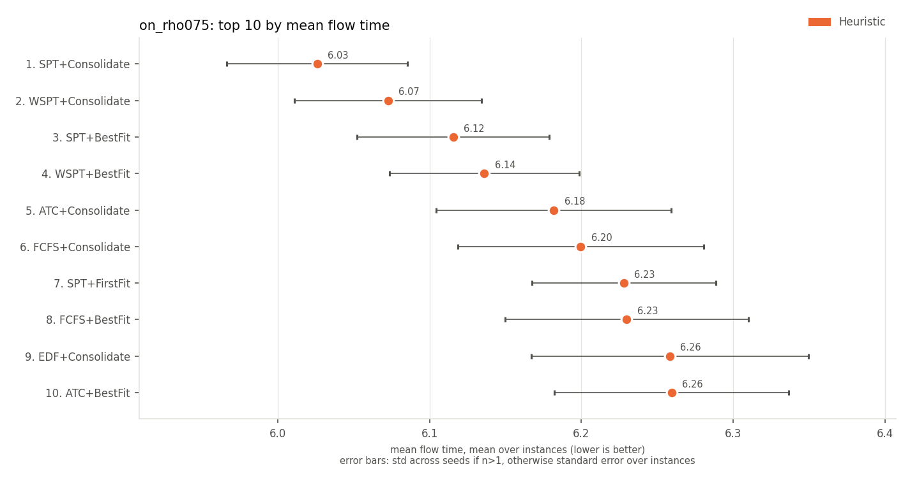 |

## makespan (lower is better)

| rank | method | family | makespan | J |
|---|---|---|---|---|
| 1 | LPT+BestFit | Heuristic | 129.7 +/- 6.5 | 25631 +/- 30944 |
| 2 | LPT+Consolidate | Heuristic | 129.8 +/- 6.4 | 21443 +/- 27215 |
| 3 | LPT+FirstFit | Heuristic | 129.9 +/- 6.3 | 26058 +/- 28478 |
| 4 | LST+Consolidate | Heuristic | 130.0 +/- 6.4 | 6051 +/- 4035 |
| 5 | MDC+Consolidate | Heuristic | 130.0 +/- 6.5 | 6068 +/- 4037 |
| 6 | RandomRule+FirstFitConsolidate | Heuristic | 130.2 +/- 6.2 | 6624 +/- 4610 |
| 7 | LST+FirstFit | Heuristic | 130.2 +/- 6.4 | 6181 +/- 4181 |
| 8 | WLST+Consolidate | Heuristic | 130.2 +/- 6.5 | 5990 +/- 3881 |
| 9 | WLST+BestFit | Heuristic | 130.2 +/- 6.3 | 6210 +/- 4129 |
| 10 | MDC+FirstFit | Heuristic | 130.3 +/- 6.4 | 6149 +/- 4064 |

| top 5 | top 10 |
|---|---|
| 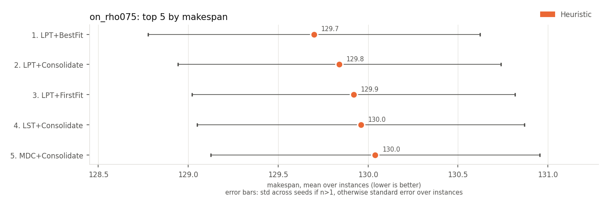 | 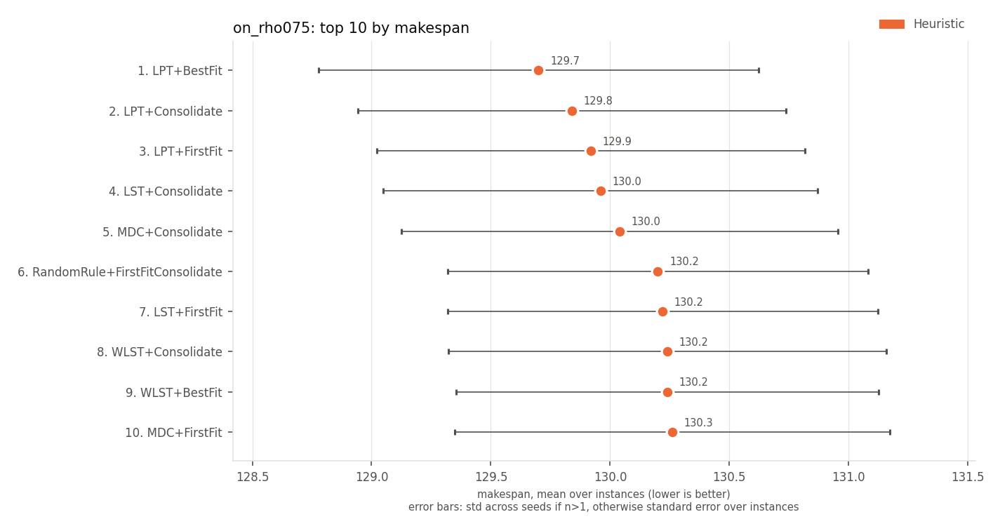 |

## utilisation of active machines (higher is better)

| rank | method | family | utilisation of active machines | J |
|---|---|---|---|---|
| 1 | LPT+Consolidate | Heuristic | 0.916 +/- 0.017 | 21443 +/- 27215 |
| 2 | MDC+Consolidate | Heuristic | 0.912 +/- 0.018 | 6068 +/- 4037 |
| 3 | LST+Consolidate | Heuristic | 0.911 +/- 0.018 | 6051 +/- 4035 |
| 4 | COVERT+Consolidate | Heuristic | 0.911 +/- 0.018 | 6219 +/- 4449 |
| 5 | WLST+Consolidate | Heuristic | 0.909 +/- 0.019 | 5990 +/- 3881 |
| 6 | FCFS+Consolidate | Heuristic | 0.908 +/- 0.021 | 7011 +/- 4969 |
| 7 | EDF+Consolidate | Heuristic | 0.907 +/- 0.018 | 6181 +/- 4022 |
| 8 | WEDF+Consolidate | Heuristic | 0.906 +/- 0.020 | 6222 +/- 4062 |
| 9 | WMDD+Consolidate | Heuristic | 0.905 +/- 0.019 | 7688 +/- 7376 |
| 10 | LPT+FirstFit | Heuristic | 0.905 +/- 0.019 | 26058 +/- 28478 |

| top 5 | top 10 |
|---|---|
| 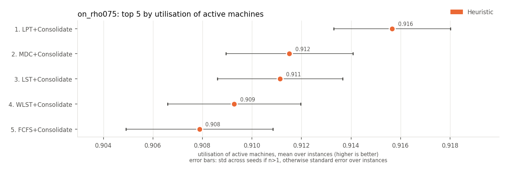 | 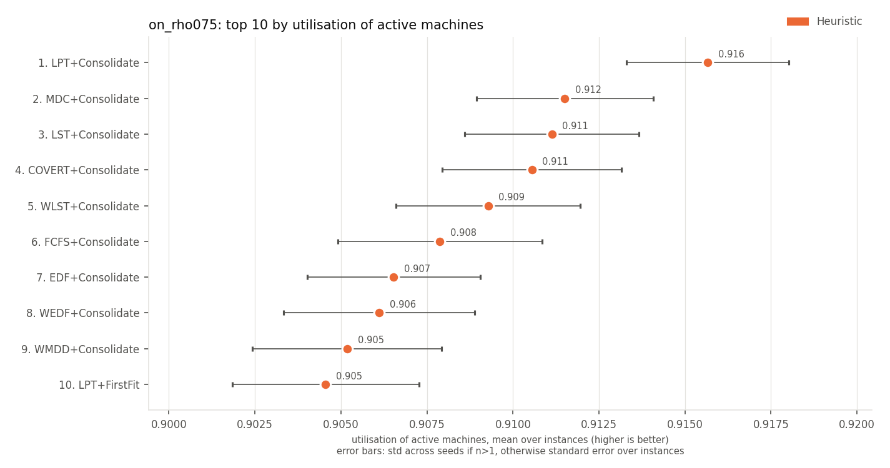 |

## active machine-ticks (lower is better)

| rank | method | family | active machine-ticks | J |
|---|---|---|---|---|
| 1 | LPT+Consolidate | Heuristic | 1073 +/- 50 | 21443 +/- 27215 |
| 2 | MDC+Consolidate | Heuristic | 1079 +/- 47 | 6068 +/- 4037 |
| 3 | LST+Consolidate | Heuristic | 1080 +/- 49 | 6051 +/- 4035 |
| 4 | COVERT+Consolidate | Heuristic | 1083 +/- 49 | 6219 +/- 4449 |
| 5 | WLST+Consolidate | Heuristic | 1083 +/- 49 | 5990 +/- 3881 |
| 6 | FCFS+Consolidate | Heuristic | 1083 +/- 48 | 7011 +/- 4969 |
| 7 | EDF+Consolidate | Heuristic | 1089 +/- 48 | 6181 +/- 4022 |
| 8 | WEDF+Consolidate | Heuristic | 1091 +/- 48 | 6222 +/- 4062 |
| 9 | LPT+BestFit | Heuristic | 1092 +/- 49 | 25631 +/- 30944 |
| 10 | LPT+FirstFit | Heuristic | 1092 +/- 49 | 26058 +/- 28478 |

| top 5 | top 10 |
|---|---|
| 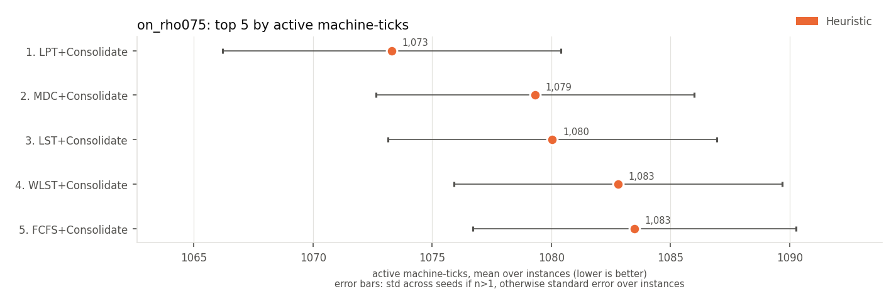 | 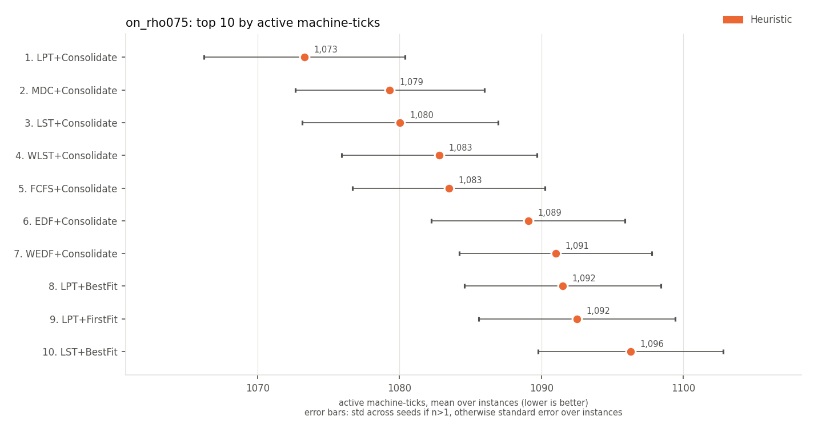 |

## energy (SPECpower) (lower is better)

| rank | method | family | energy (SPECpower) | J |
|---|---|---|---|---|
| 1 | LPT+Consolidate | Heuristic | 961 +/- 47 | 21443 +/- 27215 |
| 2 | MDC+Consolidate | Heuristic | 965 +/- 45 | 6068 +/- 4037 |
| 3 | LST+Consolidate | Heuristic | 966 +/- 45 | 6051 +/- 4035 |
| 4 | COVERT+Consolidate | Heuristic | 967 +/- 45 | 6219 +/- 4449 |
| 5 | WLST+Consolidate | Heuristic | 968 +/- 45 | 5990 +/- 3881 |
| 6 | FCFS+Consolidate | Heuristic | 968 +/- 45 | 7011 +/- 4969 |
| 7 | EDF+Consolidate | Heuristic | 972 +/- 45 | 6181 +/- 4022 |
| 8 | WEDF+Consolidate | Heuristic | 973 +/- 45 | 6222 +/- 4062 |
| 9 | LPT+BestFit | Heuristic | 973 +/- 46 | 25631 +/- 30944 |
| 10 | LPT+FirstFit | Heuristic | 975 +/- 45 | 26058 +/- 28478 |

| top 5 | top 10 |
|---|---|
| 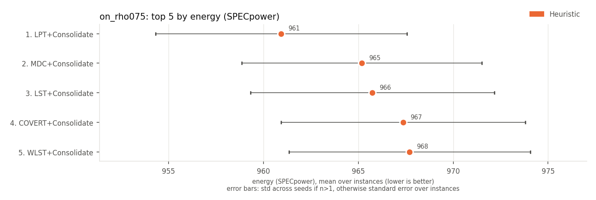 | 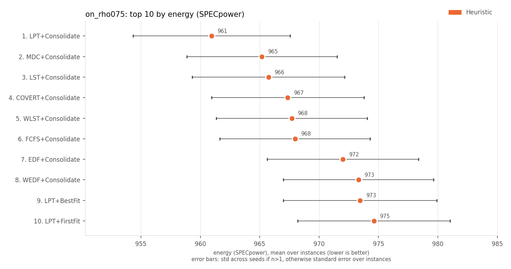 |

Spread (+/-): std across seeds for multi-seed RL rows, otherwise std across instances.
