# on_rho075_tight: leaderboards

Top 10 methods on each metric. Full ranking by J: [`tables/on_rho075_tight.md`](../tables/on_rho075_tight.md). Archive overview: [`HIGHLIGHTS.md`](../HIGHLIGHTS.md).

## J (lower is better)

| rank | method | family | J |
|---|---|---|---|
| 1 | WLST+Consolidate | Heuristic | 29502 +/- 10035 |
| 2 | MDC+Consolidate | Heuristic | 29749 +/- 10416 |
| 3 | LST+Consolidate | Heuristic | 29975 +/- 10819 |
| 4 | WEDF+Consolidate | Heuristic | 30476 +/- 10271 |
| 5 | EDF+Consolidate | Heuristic | 31101 +/- 11371 |
| 6 | MDC+FirstFit | Heuristic | 31406 +/- 11125 |
| 7 | WLST+FirstFit | Heuristic | 31920 +/- 12527 |
| 8 | FCFS+Consolidate | Heuristic | 32179 +/- 11674 |
| 9 | MDC+BestFit | Heuristic | 32244 +/- 13029 |
| 10 | LST+FirstFit | Heuristic | 32262 +/- 13031 |

| top 5 | top 10 |
|---|---|
| 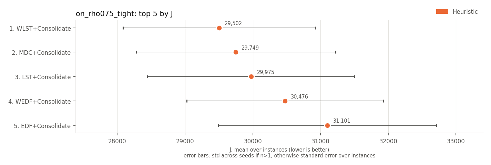 | 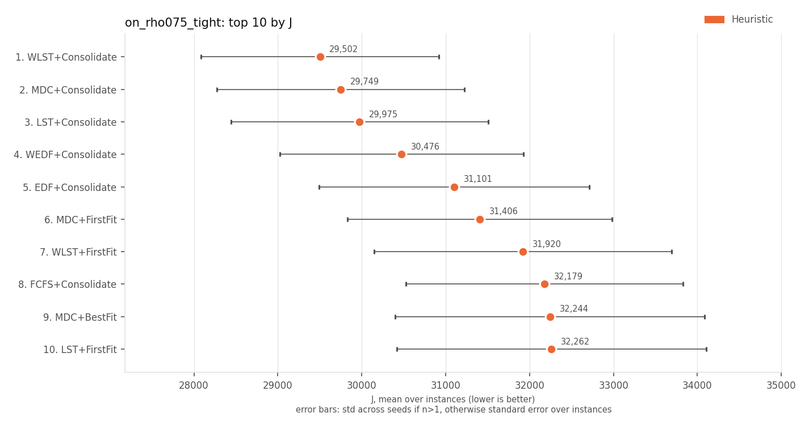 |

## on-time rate (higher is better)

| rank | method | family | on-time rate | J |
|---|---|---|---|---|
| 1 | ATC+Consolidate | Heuristic | 0.887 +/- 0.015 | 41078 +/- 22264 |
| 2 | ATC+BestFit | Heuristic | 0.884 +/- 0.015 | 45653 +/- 27837 |
| 3 | EDF+Consolidate | Heuristic | 0.884 +/- 0.021 | 31101 +/- 11371 |
| 4 | SPT+Consolidate | Heuristic | 0.884 +/- 0.015 | 52486 +/- 31580 |
| 5 | WSPT+Consolidate | Heuristic | 0.882 +/- 0.015 | 46188 +/- 26154 |
| 6 | LST+Consolidate | Heuristic | 0.882 +/- 0.022 | 29975 +/- 10819 |
| 7 | WSPT+BestFit | Heuristic | 0.881 +/- 0.015 | 54702 +/- 33567 |
| 8 | SPT+BestFit | Heuristic | 0.881 +/- 0.015 | 58955 +/- 34820 |
| 9 | ATC+FirstFit | Heuristic | 0.881 +/- 0.017 | 49923 +/- 25900 |
| 10 | MDC+Consolidate | Heuristic | 0.881 +/- 0.023 | 29749 +/- 10416 |

| top 5 | top 10 |
|---|---|
| 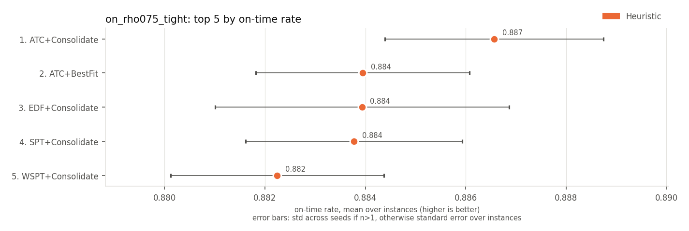 | 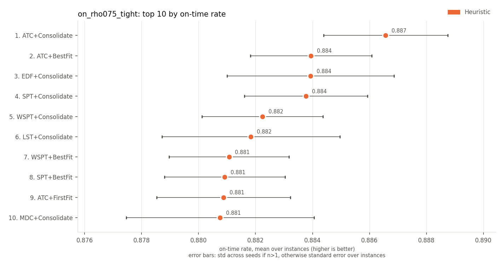 |

## late jobs (lower is better)

| rank | method | family | late jobs | J |
|---|---|---|---|---|
| 1 | ATC+Consolidate | Heuristic | 81.1 +/- 11.6 | 41078 +/- 22264 |
| 2 | ATC+BestFit | Heuristic | 83.0 +/- 11.4 | 45653 +/- 27837 |
| 3 | EDF+Consolidate | Heuristic | 83.1 +/- 15.8 | 31101 +/- 11371 |
| 4 | SPT+Consolidate | Heuristic | 83.1 +/- 11.6 | 52486 +/- 31580 |
| 5 | WSPT+Consolidate | Heuristic | 84.3 +/- 11.9 | 46188 +/- 26154 |
| 6 | LST+Consolidate | Heuristic | 84.6 +/- 16.8 | 29975 +/- 10819 |
| 7 | WSPT+BestFit | Heuristic | 85.1 +/- 11.4 | 54702 +/- 33567 |
| 8 | SPT+BestFit | Heuristic | 85.2 +/- 11.5 | 58955 +/- 34820 |
| 9 | ATC+FirstFit | Heuristic | 85.2 +/- 12.6 | 49923 +/- 25900 |
| 10 | MDC+Consolidate | Heuristic | 85.4 +/- 17.8 | 29749 +/- 10416 |

| top 5 | top 10 |
|---|---|
| 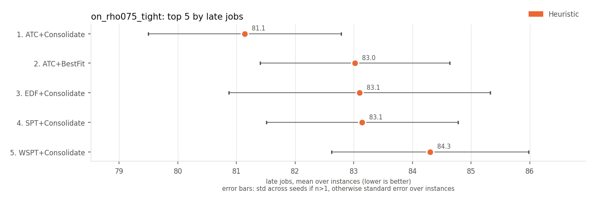 | 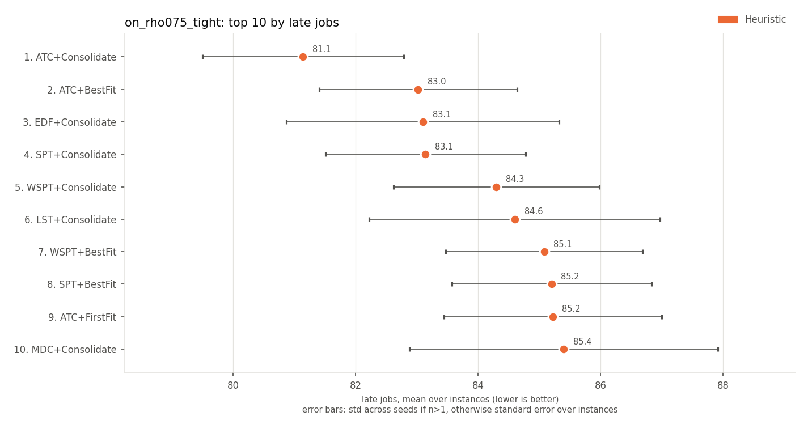 |

## weighted late jobs (lower is better)

Every method has the same value here, so there is no ranking.

## weighted tardiness (lower is better)

| rank | method | family | weighted tardiness | J |
|---|---|---|---|---|
| 1 | MDC+Consolidate | Heuristic | 1966 +/- 501 | 29749 +/- 10416 |
| 2 | WLST+Consolidate | Heuristic | 1973 +/- 493 | 29502 +/- 10035 |
| 3 | WEDF+Consolidate | Heuristic | 1985 +/- 484 | 30476 +/- 10271 |
| 4 | LST+Consolidate | Heuristic | 1989 +/- 535 | 29975 +/- 10819 |
| 5 | EDF+Consolidate | Heuristic | 2008 +/- 503 | 31101 +/- 11371 |
| 6 | MDC+FirstFit | Heuristic | 2067 +/- 507 | 31406 +/- 11125 |
| 7 | MDC+BestFit | Heuristic | 2091 +/- 608 | 32244 +/- 13029 |
| 8 | FCFS+Consolidate | Heuristic | 2092 +/- 547 | 32179 +/- 11674 |
| 9 | ATC+Consolidate | Heuristic | 2108 +/- 545 | 41078 +/- 22264 |
| 10 | WLST+BestFit | Heuristic | 2112 +/- 647 | 32380 +/- 14450 |

| top 5 | top 10 |
|---|---|
| 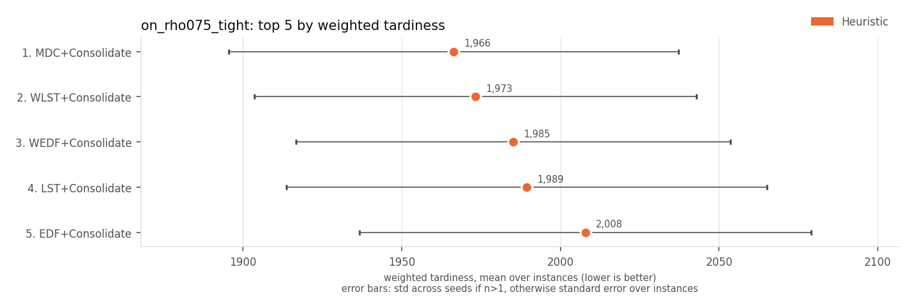 | 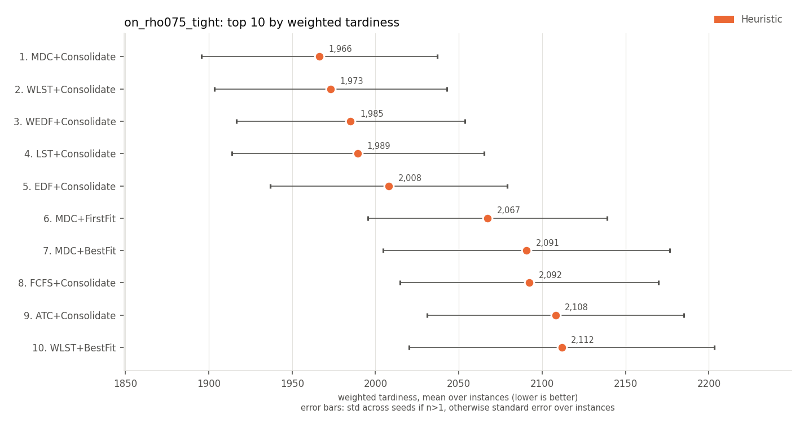 |

## max tardiness (lower is better)

| rank | method | family | max tardiness | J |
|---|---|---|---|---|
| 1 | LST+Consolidate | Heuristic | 32.9 +/- 3.1 | 29975 +/- 10819 |
| 2 | WLST+Consolidate | Heuristic | 33.0 +/- 3.5 | 29502 +/- 10035 |
| 3 | LST+FirstFit | Heuristic | 33.0 +/- 3.5 | 32262 +/- 13031 |
| 4 | MDC+Consolidate | Heuristic | 33.1 +/- 3.3 | 29749 +/- 10416 |
| 5 | LST+BestFit | Heuristic | 33.3 +/- 4.5 | 33192 +/- 15481 |
| 6 | EDF+Consolidate | Heuristic | 33.4 +/- 3.9 | 31101 +/- 11371 |
| 7 | WEDF+Consolidate | Heuristic | 33.5 +/- 3.4 | 30476 +/- 10271 |
| 8 | WLST+FirstFit | Heuristic | 33.5 +/- 4.7 | 31920 +/- 12527 |
| 9 | WLST+BestFit | Heuristic | 33.5 +/- 4.6 | 32380 +/- 14450 |
| 10 | MDC+BestFit | Heuristic | 33.7 +/- 5.2 | 32244 +/- 13029 |

| top 5 | top 10 |
|---|---|
| 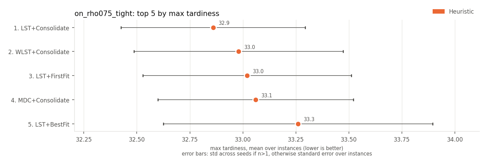 | 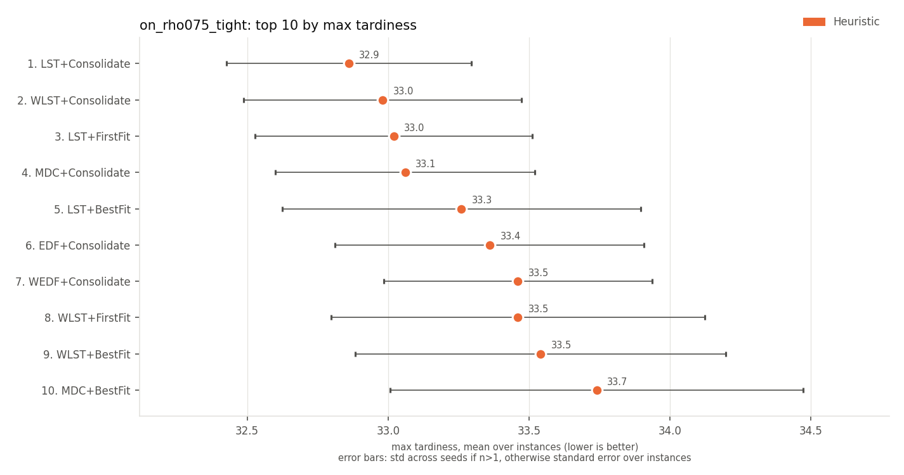 |

## p95 tardiness (lower is better)

| rank | method | family | p95 tardiness | J |
|---|---|---|---|---|
| 1 | MDC+Consolidate | Heuristic | 6.2 +/- 1.8 | 29749 +/- 10416 |
| 2 | LST+Consolidate | Heuristic | 6.4 +/- 2.0 | 29975 +/- 10819 |
| 3 | EDF+Consolidate | Heuristic | 6.4 +/- 1.8 | 31101 +/- 11371 |
| 4 | WLST+Consolidate | Heuristic | 6.4 +/- 1.8 | 29502 +/- 10035 |
| 5 | MDC+FirstFit | Heuristic | 6.6 +/- 1.7 | 31406 +/- 11125 |
| 6 | WEDF+Consolidate | Heuristic | 6.6 +/- 1.8 | 30476 +/- 10271 |
| 7 | MDC+BestFit | Heuristic | 6.7 +/- 2.1 | 32244 +/- 13029 |
| 8 | FCFS+Consolidate | Heuristic | 6.8 +/- 1.9 | 32179 +/- 11674 |
| 9 | ATC+Consolidate | Heuristic | 6.8 +/- 1.8 | 41078 +/- 22264 |
| 10 | EDF+BestFit | Heuristic | 6.9 +/- 2.2 | 33369 +/- 13889 |

| top 5 | top 10 |
|---|---|
| 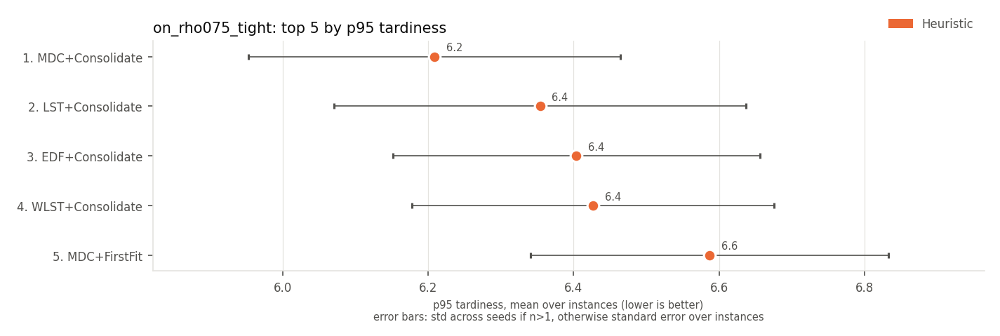 | 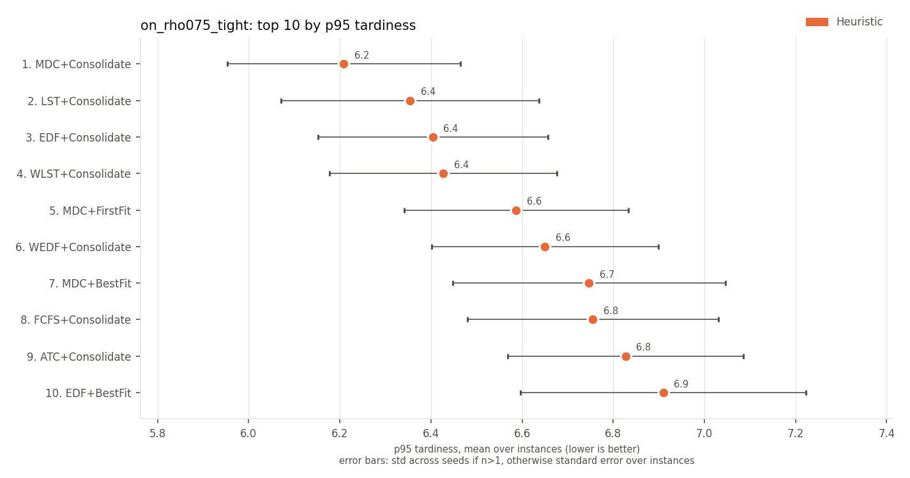 |

## mean wait (lower is better)

| rank | method | family | mean wait | J |
|---|---|---|---|---|
| 1 | SPT+Consolidate | Heuristic | 0.60 +/- 0.27 | 52486 +/- 31580 |
| 2 | ATC+Consolidate | Heuristic | 0.64 +/- 0.29 | 41078 +/- 22264 |
| 3 | WSPT+Consolidate | Heuristic | 0.65 +/- 0.30 | 46188 +/- 26154 |
| 4 | SPT+BestFit | Heuristic | 0.69 +/- 0.30 | 58955 +/- 34820 |
| 5 | WSPT+BestFit | Heuristic | 0.71 +/- 0.32 | 54702 +/- 33567 |
| 6 | ATC+BestFit | Heuristic | 0.72 +/- 0.31 | 45653 +/- 27837 |
| 7 | FCFS+Consolidate | Heuristic | 0.78 +/- 0.46 | 32179 +/- 11674 |
| 8 | SPT+FirstFit | Heuristic | 0.81 +/- 0.31 | 68902 +/- 39184 |
| 9 | FCFS+BestFit | Heuristic | 0.81 +/- 0.44 | 34033 +/- 12531 |
| 10 | EDF+Consolidate | Heuristic | 0.81 +/- 0.45 | 31101 +/- 11371 |

| top 5 | top 10 |
|---|---|
| 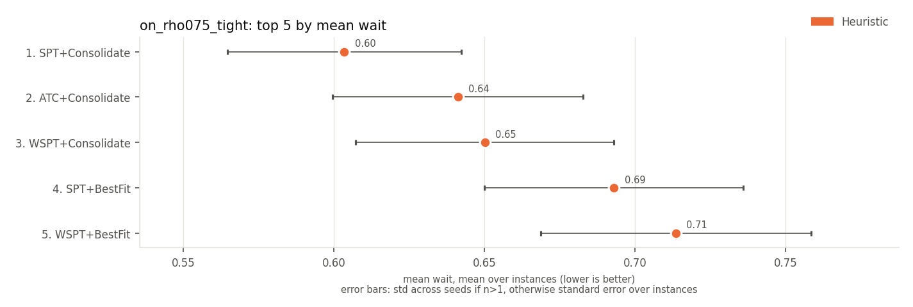 | 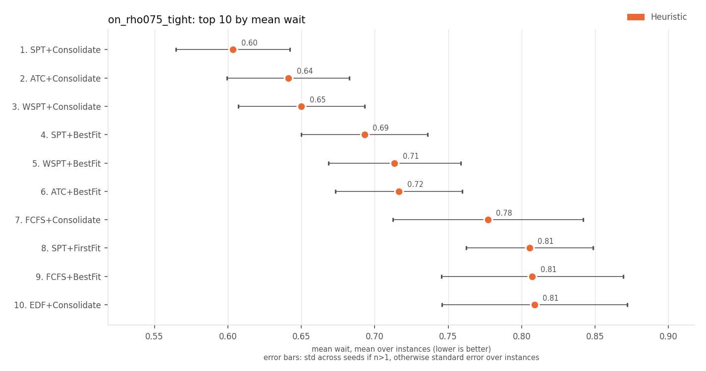 |

## mean flow time (lower is better)

| rank | method | family | mean flow time | J |
|---|---|---|---|---|
| 1 | SPT+Consolidate | Heuristic | 6.03 +/- 0.42 | 52486 +/- 31580 |
| 2 | ATC+Consolidate | Heuristic | 6.06 +/- 0.43 | 41078 +/- 22264 |
| 3 | WSPT+Consolidate | Heuristic | 6.07 +/- 0.44 | 46188 +/- 26154 |
| 4 | SPT+BestFit | Heuristic | 6.12 +/- 0.45 | 58955 +/- 34820 |
| 5 | WSPT+BestFit | Heuristic | 6.14 +/- 0.44 | 54702 +/- 33567 |
| 6 | ATC+BestFit | Heuristic | 6.14 +/- 0.44 | 45653 +/- 27837 |
| 7 | FCFS+Consolidate | Heuristic | 6.20 +/- 0.57 | 32179 +/- 11674 |
| 8 | SPT+FirstFit | Heuristic | 6.23 +/- 0.43 | 68902 +/- 39184 |
| 9 | FCFS+BestFit | Heuristic | 6.23 +/- 0.57 | 34033 +/- 12531 |
| 10 | EDF+Consolidate | Heuristic | 6.23 +/- 0.57 | 31101 +/- 11371 |

| top 5 | top 10 |
|---|---|
| 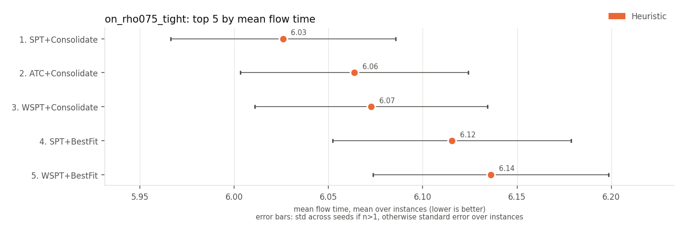 | 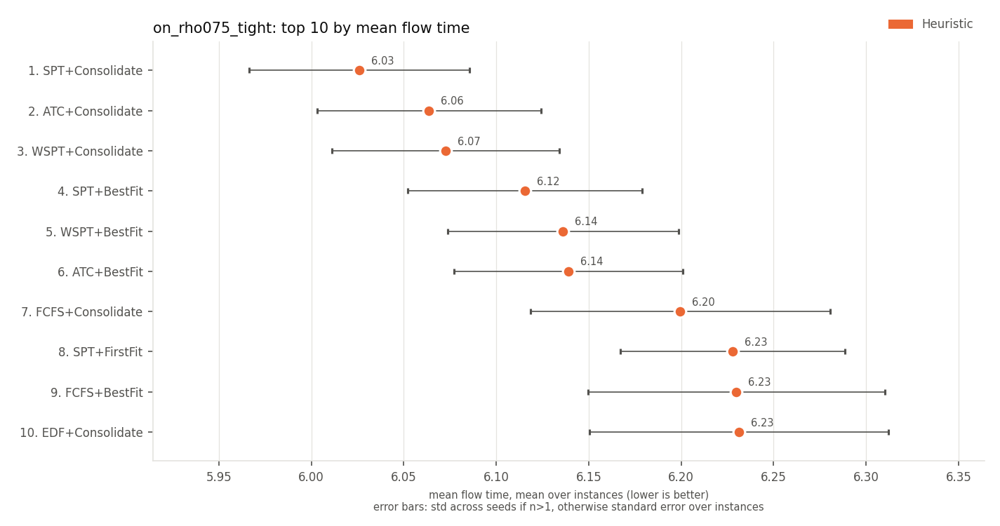 |

## makespan (lower is better)

| rank | method | family | makespan | J |
|---|---|---|---|---|
| 1 | LPT+BestFit | Heuristic | 129.7 +/- 6.5 | 75080 +/- 62264 |
| 2 | WLST+Consolidate | Heuristic | 129.8 +/- 6.3 | 29502 +/- 10035 |
| 3 | LST+Consolidate | Heuristic | 129.8 +/- 6.4 | 29975 +/- 10819 |
| 4 | WLST+FirstFit | Heuristic | 129.8 +/- 6.4 | 31920 +/- 12527 |
| 5 | LPT+Consolidate | Heuristic | 129.8 +/- 6.4 | 64381 +/- 53835 |
| 6 | LST+FirstFit | Heuristic | 129.9 +/- 6.3 | 32262 +/- 13031 |
| 7 | LPT+FirstFit | Heuristic | 129.9 +/- 6.3 | 77120 +/- 59730 |
| 8 | MDC+BestFit | Heuristic | 130.0 +/- 6.5 | 32244 +/- 13029 |
| 9 | LST+BestFit | Heuristic | 130.0 +/- 6.4 | 33192 +/- 15481 |
| 10 | RandomRule+FirstFitConsolidate | Heuristic | 130.0 +/- 6.2 | 35096 +/- 16756 |

| top 5 | top 10 |
|---|---|
| 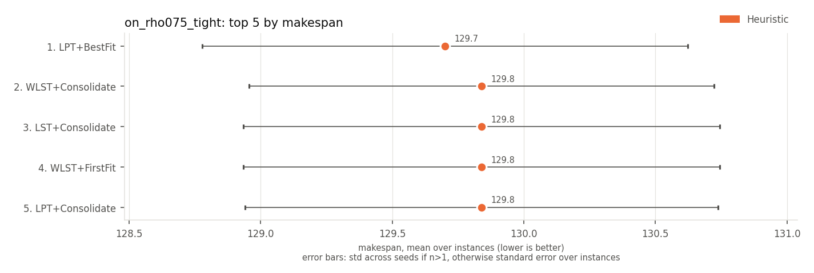 | 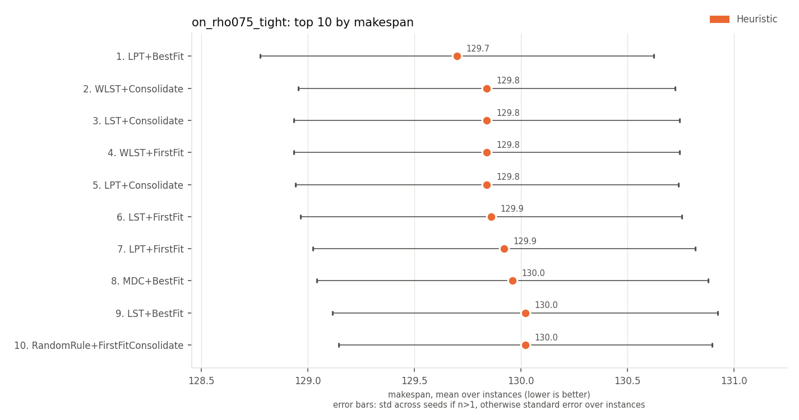 |

## utilisation of active machines (higher is better)

| rank | method | family | utilisation of active machines | J |
|---|---|---|---|---|
| 1 | LPT+Consolidate | Heuristic | 0.916 +/- 0.017 | 64381 +/- 53835 |
| 2 | LST+Consolidate | Heuristic | 0.914 +/- 0.018 | 29975 +/- 10819 |
| 3 | WLST+Consolidate | Heuristic | 0.912 +/- 0.019 | 29502 +/- 10035 |
| 4 | MDC+Consolidate | Heuristic | 0.912 +/- 0.020 | 29749 +/- 10416 |
| 5 | FCFS+Consolidate | Heuristic | 0.908 +/- 0.021 | 32179 +/- 11674 |
| 6 | WEDF+Consolidate | Heuristic | 0.907 +/- 0.020 | 30476 +/- 10271 |
| 7 | EDF+Consolidate | Heuristic | 0.907 +/- 0.020 | 31101 +/- 11371 |
| 8 | LPT+FirstFit | Heuristic | 0.905 +/- 0.019 | 77120 +/- 59730 |
| 9 | MDC+FirstFit | Heuristic | 0.904 +/- 0.018 | 31406 +/- 11125 |
| 10 | LST+FirstFit | Heuristic | 0.904 +/- 0.020 | 32262 +/- 13031 |

| top 5 | top 10 |
|---|---|
| 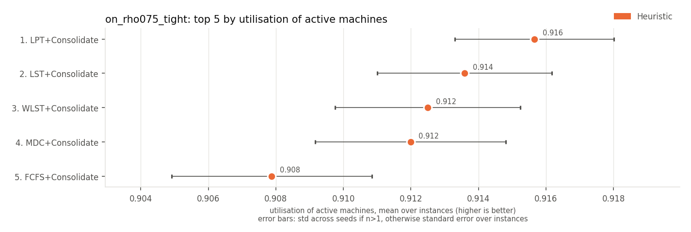 | 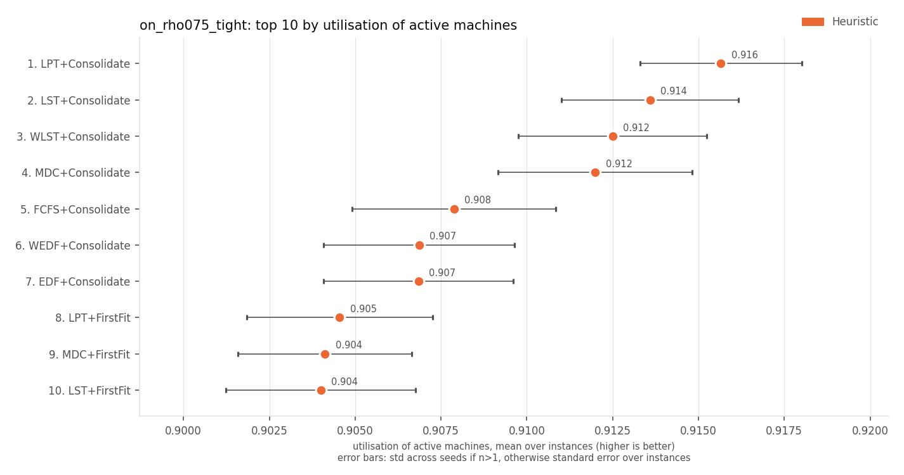 |

## active machine-ticks (lower is better)

| rank | method | family | active machine-ticks | J |
|---|---|---|---|---|
| 1 | LPT+Consolidate | Heuristic | 1073 +/- 50 | 64381 +/- 53835 |
| 2 | LST+Consolidate | Heuristic | 1074 +/- 48 | 29975 +/- 10819 |
| 3 | WLST+Consolidate | Heuristic | 1075 +/- 44 | 29502 +/- 10035 |
| 4 | MDC+Consolidate | Heuristic | 1076 +/- 48 | 29749 +/- 10416 |
| 5 | FCFS+Consolidate | Heuristic | 1083 +/- 48 | 32179 +/- 11674 |
| 6 | EDF+Consolidate | Heuristic | 1085 +/- 48 | 31101 +/- 11371 |
| 7 | WEDF+Consolidate | Heuristic | 1087 +/- 46 | 30476 +/- 10271 |
| 8 | LST+FirstFit | Heuristic | 1090 +/- 44 | 32262 +/- 13031 |
| 9 | MDC+FirstFit | Heuristic | 1091 +/- 46 | 31406 +/- 11125 |
| 10 | WLST+BestFit | Heuristic | 1091 +/- 45 | 32380 +/- 14450 |

| top 5 | top 10 |
|---|---|
| 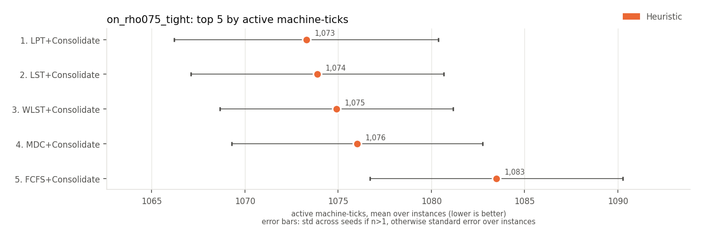 | 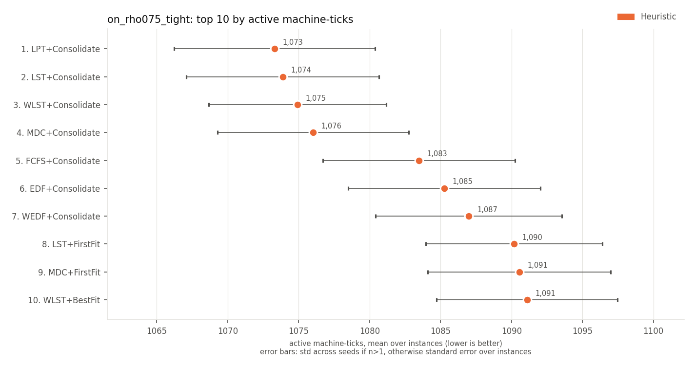 |

## energy (SPECpower) (lower is better)

| rank | method | family | energy (SPECpower) | J |
|---|---|---|---|---|
| 1 | LPT+Consolidate | Heuristic | 961 +/- 47 | 64381 +/- 53835 |
| 2 | LST+Consolidate | Heuristic | 961 +/- 45 | 29975 +/- 10819 |
| 3 | WLST+Consolidate | Heuristic | 962 +/- 42 | 29502 +/- 10035 |
| 4 | MDC+Consolidate | Heuristic | 963 +/- 45 | 29749 +/- 10416 |
| 5 | FCFS+Consolidate | Heuristic | 968 +/- 45 | 32179 +/- 11674 |
| 6 | EDF+Consolidate | Heuristic | 969 +/- 45 | 31101 +/- 11371 |
| 7 | WEDF+Consolidate | Heuristic | 971 +/- 44 | 30476 +/- 10271 |
| 8 | LST+FirstFit | Heuristic | 973 +/- 42 | 32262 +/- 13031 |
| 9 | LST+BestFit | Heuristic | 973 +/- 44 | 33192 +/- 15481 |
| 10 | WLST+BestFit | Heuristic | 973 +/- 42 | 32380 +/- 14450 |

| top 5 | top 10 |
|---|---|
| 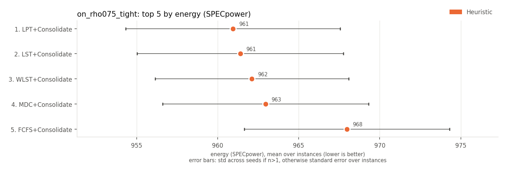 | 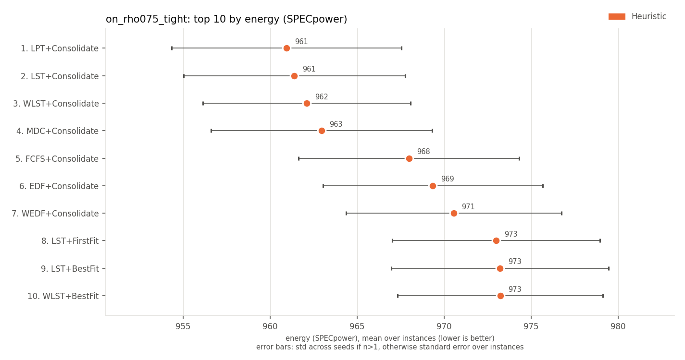 |

Spread (+/-): std across seeds for multi-seed RL rows, otherwise std across instances.
