# on_rho095: leaderboards

Top 10 methods on each metric. Full ranking by J: [`tables/on_rho095.md`](../tables/on_rho095.md). Archive overview: [`HIGHLIGHTS.md`](../HIGHLIGHTS.md).

## J (lower is better)

| rank | method | family | J |
|---|---|---|---|
| 1 | EDF+Consolidate | Heuristic | 21986 +/- 16435 |
| 2 | MDC+Consolidate | Heuristic | 22646 +/- 22184 |
| 3 | WLST+Consolidate | Heuristic | 24874 +/- 21375 |
| 4 | PPO Opt2 priority score look-ahead fixed scaling arrival-aware critic lateness shaping reward scaling event-driven idle 2M-step budget [tuned] | RL | 24921 +/- 2555 |
| 5 | WEDF+Consolidate | Heuristic | 25689 +/- 22866 |
| 6 | COVERT+Consolidate | Heuristic | 26019 +/- 23766 |
| 7 | PPO Opt2 priority score look-ahead fixed scaling arrival-aware critic lateness shaping reward scaling event-driven idle 1M-step budget [tuned] | RL | 26515 +/- 4564 |
| 8 | LST+Consolidate | Heuristic | 27839 +/- 29934 |
| 9 | MDC+FirstFit | Heuristic | 30421 +/- 24573 |
| 10 | PPO Opt3 ATC-prior score look-ahead fixed scaling arrival-aware critic lateness shaping reward scaling event-driven idle 1M-step budget [tuned] | RL | 30611 +/- 1909 |

| top 5 | top 10 |
|---|---|
| 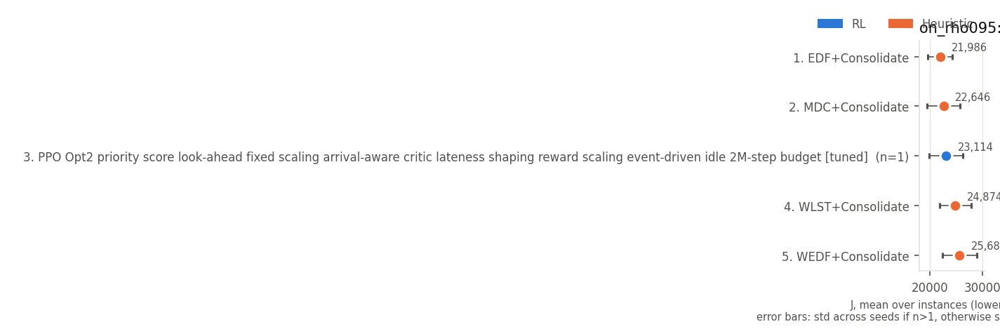 | 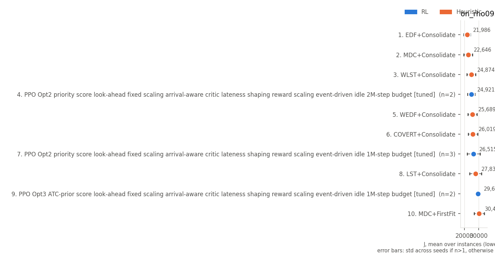 |

## on-time rate (higher is better)

| rank | method | family | on-time rate | J |
|---|---|---|---|---|
| 1 | ATC+Consolidate | Heuristic | 0.960 +/- 0.010 | 40676 +/- 28529 |
| 2 | WMDD+Consolidate | Heuristic | 0.958 +/- 0.011 | 36190 +/- 23110 |
| 3 | ATC+BestFit | Heuristic | 0.957 +/- 0.011 | 46117 +/- 31644 |
| 4 | COVERT+Consolidate | Heuristic | 0.955 +/- 0.014 | 26019 +/- 23766 |
| 5 | PPO Opt1 rule selection +Consolidate look-ahead fixed scaling arrival-aware critic lateness shaping [tuned] | RL | 0.955 +/- 0.005 | 63165 +/- 55924 |
| 6 | EDF+Consolidate | Heuristic | 0.954 +/- 0.017 | 21986 +/- 16435 |
| 7 | WMDD+BestFit | Heuristic | 0.954 +/- 0.013 | 47163 +/- 34402 |
| 8 | ATC+FirstFit | Heuristic | 0.954 +/- 0.011 | 59081 +/- 40133 |
| 9 | WMDD+FirstFit | Heuristic | 0.953 +/- 0.012 | 45044 +/- 27550 |
| 10 | COVERT+BestFit | Heuristic | 0.951 +/- 0.013 | 38459 +/- 30772 |

| top 5 | top 10 |
|---|---|
| 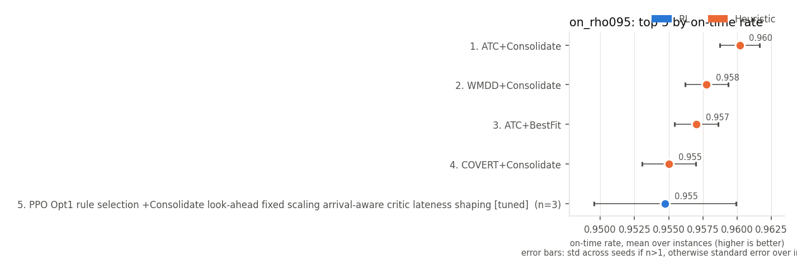 | 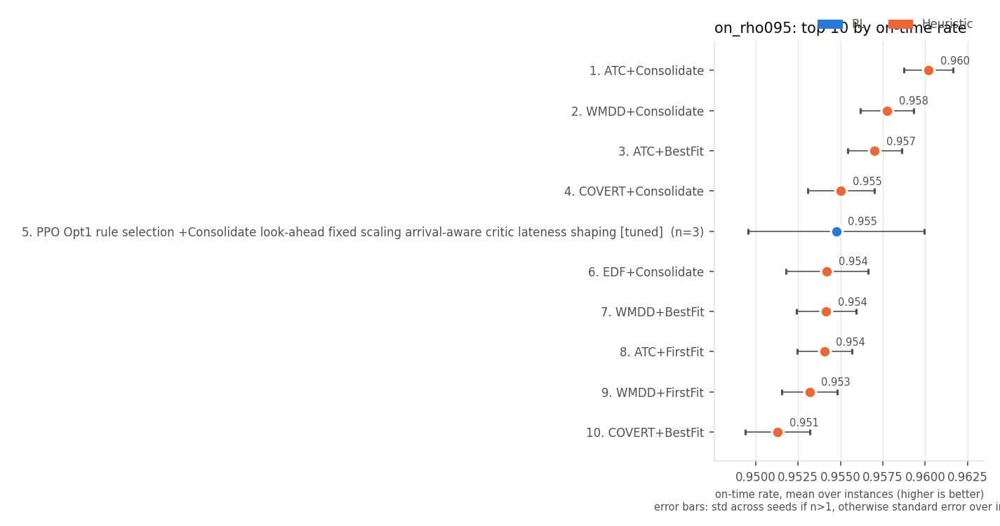 |

## late jobs (lower is better)

| rank | method | family | late jobs | J |
|---|---|---|---|---|
| 1 | ATC+Consolidate | Heuristic | 36.2 +/- 9.7 | 40676 +/- 28529 |
| 2 | WMDD+Consolidate | Heuristic | 38.4 +/- 10.4 | 36190 +/- 23110 |
| 3 | ATC+BestFit | Heuristic | 39.1 +/- 10.5 | 46117 +/- 31644 |
| 4 | COVERT+Consolidate | Heuristic | 41.0 +/- 13.1 | 26019 +/- 23766 |
| 5 | PPO Opt1 rule selection +Consolidate look-ahead fixed scaling arrival-aware critic lateness shaping [tuned] | RL | 41.2 +/- 4.7 | 63165 +/- 55924 |
| 6 | WMDD+BestFit | Heuristic | 41.7 +/- 11.8 | 47163 +/- 34402 |
| 7 | EDF+Consolidate | Heuristic | 41.7 +/- 16.1 | 21986 +/- 16435 |
| 8 | ATC+FirstFit | Heuristic | 41.8 +/- 10.7 | 59081 +/- 40133 |
| 9 | WMDD+FirstFit | Heuristic | 42.6 +/- 11.1 | 45044 +/- 27550 |
| 10 | COVERT+BestFit | Heuristic | 44.3 +/- 12.6 | 38459 +/- 30772 |

| top 5 | top 10 |
|---|---|
| 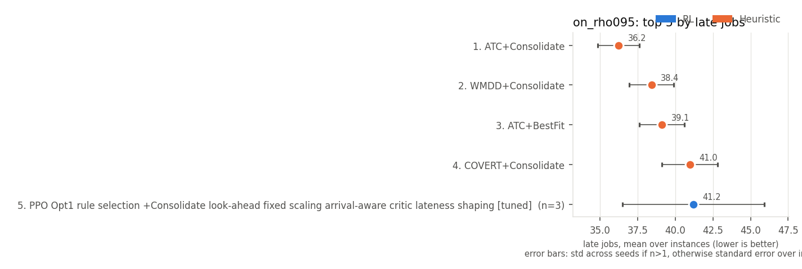 | 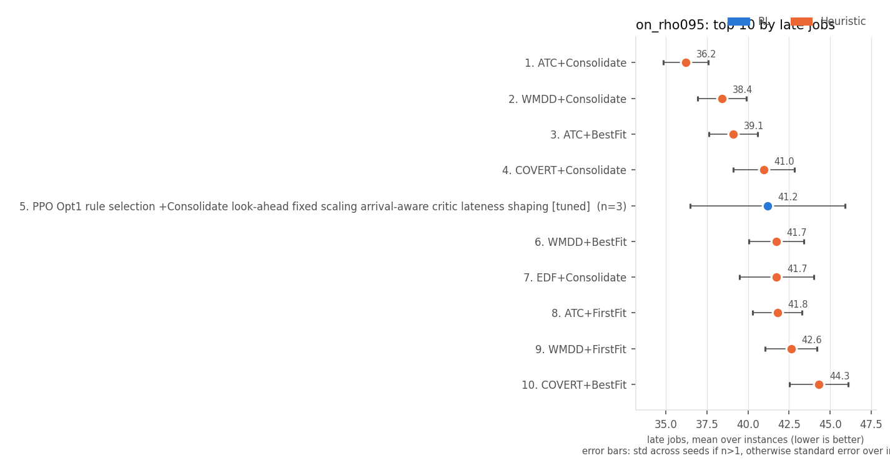 |

## weighted late jobs (lower is better)

| rank | method | family | weighted late jobs | J |
|---|---|---|---|---|
| 1 | ATC+Consolidate | Heuristic | 97.2 +/- 28.5 | 40676 +/- 28529 |
| 2 | WMDD+Consolidate | Heuristic | 97.2 +/- 29.9 | 36190 +/- 23110 |
| 3 | ATC+BestFit | Heuristic | 107.1 +/- 29.9 | 46117 +/- 31644 |
| 4 | WMDD+BestFit | Heuristic | 108.5 +/- 34.9 | 47163 +/- 34402 |
| 5 | WMDD+FirstFit | Heuristic | 108.8 +/- 29.1 | 45044 +/- 27550 |
| 6 | ATC+FirstFit | Heuristic | 113.9 +/- 31.6 | 59081 +/- 40133 |
| 7 | COVERT+Consolidate | Heuristic | 117.9 +/- 39.5 | 26019 +/- 23766 |
| 8 | PPO Opt3 ATC-prior score look-ahead fixed scaling arrival-aware critic lateness shaping reward scaling event-driven idle 1M-step budget [tuned] | RL | 122.3 +/- 2.4 | 30611 +/- 1909 |
| 9 | EDF+Consolidate | Heuristic | 124.6 +/- 49.2 | 21986 +/- 16435 |
| 10 | WSPT+Consolidate | Heuristic | 125.3 +/- 32.7 | 107362 +/- 58122 |

| top 5 | top 10 |
|---|---|
| 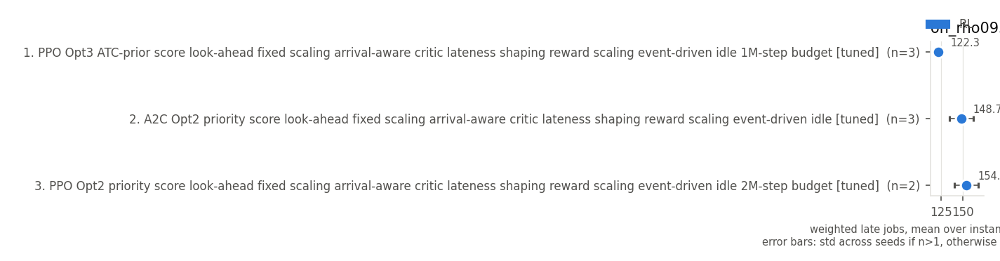 | 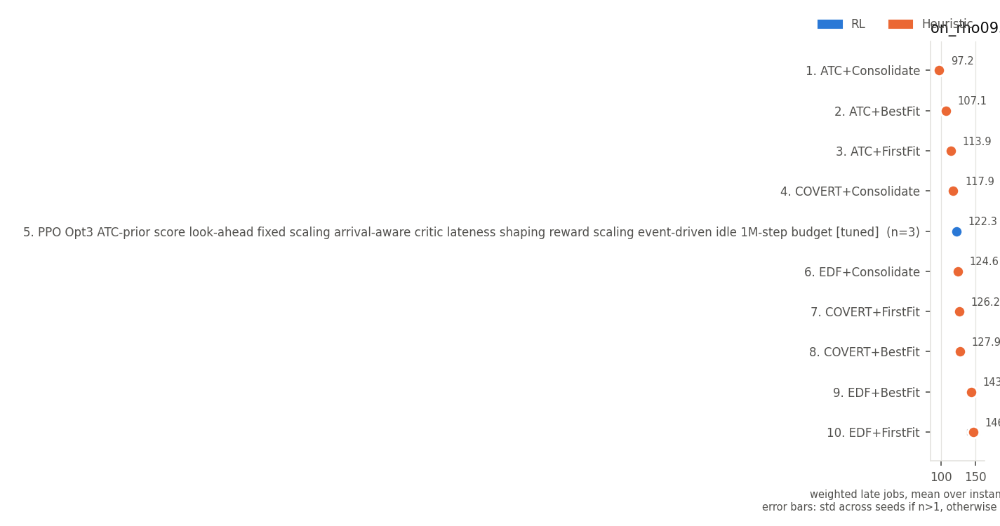 |

## weighted tardiness (lower is better)

| rank | method | family | weighted tardiness | J |
|---|---|---|---|---|
| 1 | WMDD+Consolidate | Heuristic | 1207 +/- 545 | 36190 +/- 23110 |
| 2 | COVERT+Consolidate | Heuristic | 1213 +/- 685 | 26019 +/- 23766 |
| 3 | EDF+Consolidate | Heuristic | 1252 +/- 670 | 21986 +/- 16435 |
| 4 | MDC+Consolidate | Heuristic | 1287 +/- 793 | 22646 +/- 22184 |
| 5 | ATC+Consolidate | Heuristic | 1304 +/- 626 | 40676 +/- 28529 |
| 6 | WEDF+Consolidate | Heuristic | 1346 +/- 830 | 25689 +/- 22866 |
| 7 | PPO Opt3 ATC-prior score look-ahead fixed scaling arrival-aware critic lateness shaping reward scaling event-driven idle 1M-step budget [tuned] | RL | 1385 +/- 35 | 30611 +/- 1909 |
| 8 | WLST+Consolidate | Heuristic | 1406 +/- 826 | 24874 +/- 21375 |
| 9 | WMDD+FirstFit | Heuristic | 1439 +/- 614 | 45044 +/- 27550 |
| 10 | COVERT+FirstFit | Heuristic | 1452 +/- 756 | 36166 +/- 28065 |

| top 5 | top 10 |
|---|---|
| 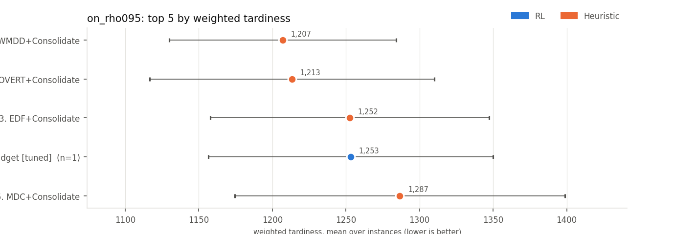 | 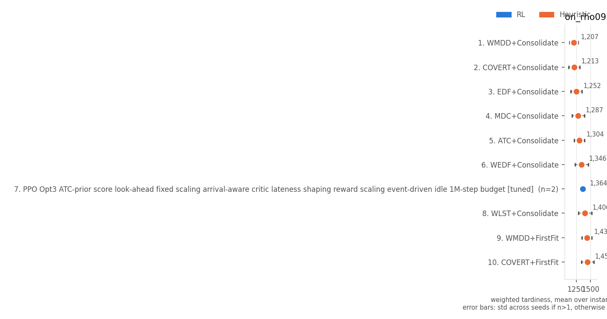 |

## max tardiness (lower is better)

| rank | method | family | max tardiness | J |
|---|---|---|---|---|
| 1 | LST+Consolidate | Heuristic | 30.3 +/- 8.6 | 27839 +/- 29934 |
| 2 | EDF+Consolidate | Heuristic | 33.4 +/- 9.7 | 21986 +/- 16435 |
| 3 | LST+FirstFit | Heuristic | 33.7 +/- 9.4 | 38831 +/- 31768 |
| 4 | WLST+Consolidate | Heuristic | 33.9 +/- 11.4 | 24874 +/- 21375 |
| 5 | MDC+Consolidate | Heuristic | 34.4 +/- 13.0 | 22646 +/- 22184 |
| 6 | PPO Opt2 priority score look-ahead fixed scaling arrival-aware critic lateness shaping reward scaling event-driven idle 2M-step budget [tuned] | RL | 34.8 +/- 4.0 | 24921 +/- 2555 |
| 7 | PPO Opt2 priority score look-ahead fixed scaling arrival-aware critic lateness shaping reward scaling event-driven idle 1M-step budget [tuned] | RL | 35.1 +/- 5.1 | 26515 +/- 4564 |
| 8 | LST+BestFit | Heuristic | 36.3 +/- 11.5 | 39115 +/- 28826 |
| 9 | EDF+BestFit | Heuristic | 36.5 +/- 11.7 | 35250 +/- 28408 |
| 10 | WEDF+Consolidate | Heuristic | 36.6 +/- 12.6 | 25689 +/- 22866 |

| top 5 | top 10 |
|---|---|
| 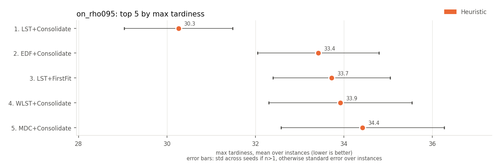 | 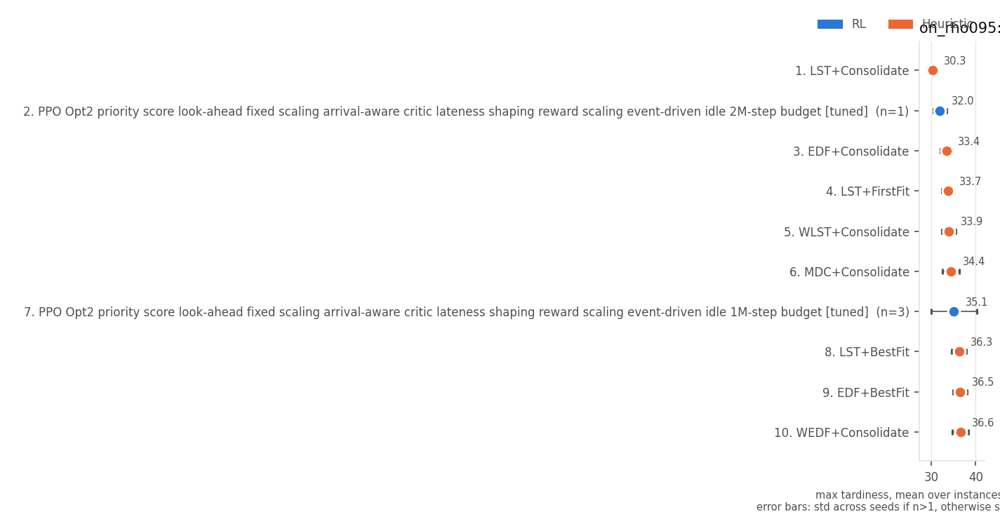 |

## p95 tardiness (lower is better)

| rank | method | family | p95 tardiness | J |
|---|---|---|---|---|
| 1 | ATC+Consolidate | Heuristic | 0.2 +/- 0.7 | 40676 +/- 28529 |
| 2 | WMDD+Consolidate | Heuristic | 0.4 +/- 0.9 | 36190 +/- 23110 |
| 3 | ATC+BestFit | Heuristic | 0.5 +/- 1.3 | 46117 +/- 31644 |
| 4 | COVERT+Consolidate | Heuristic | 0.8 +/- 1.3 | 26019 +/- 23766 |
| 5 | WMDD+FirstFit | Heuristic | 0.8 +/- 1.3 | 45044 +/- 27550 |
| 6 | ATC+FirstFit | Heuristic | 0.8 +/- 1.9 | 59081 +/- 40133 |
| 7 | WMDD+BestFit | Heuristic | 0.9 +/- 1.5 | 47163 +/- 34402 |
| 8 | PPO Opt1 rule selection +Consolidate look-ahead fixed scaling arrival-aware critic lateness shaping [tuned] | RL | 1.0 +/- 0.7 | 63165 +/- 55924 |
| 9 | COVERT+FirstFit | Heuristic | 1.1 +/- 1.5 | 36166 +/- 28065 |
| 10 | COVERT+BestFit | Heuristic | 1.2 +/- 1.8 | 38459 +/- 30772 |

| top 5 | top 10 |
|---|---|
| 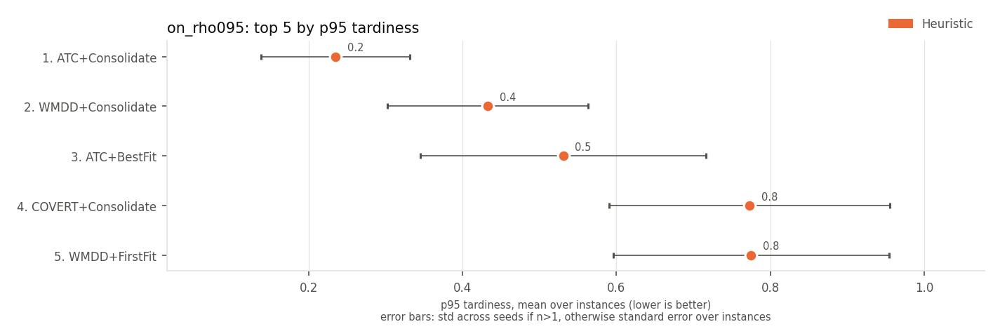 | 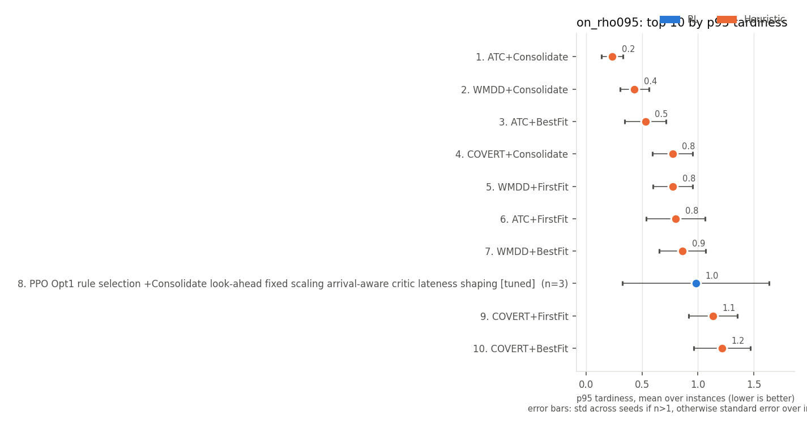 |

## mean wait (lower is better)

| rank | method | family | mean wait | J |
|---|---|---|---|---|
| 1 | SPT+Consolidate | Heuristic | 2.30 +/- 0.71 | 126833 +/- 69967 |
| 2 | SPT+BestFit | Heuristic | 2.41 +/- 0.71 | 130401 +/- 66624 |
| 3 | WSPT+Consolidate | Heuristic | 2.45 +/- 0.77 | 107362 +/- 58122 |
| 4 | WSPT+BestFit | Heuristic | 2.57 +/- 0.75 | 119065 +/- 67990 |
| 5 | PPO Opt1 rule selection +Consolidate non-delay [tuned] | RL | 2.68 +/- 0.53 | 97758 +/- 34882 |
| 6 | SPT+FirstFit | Heuristic | 2.73 +/- 0.73 | 162421 +/- 77529 |
| 7 | WSPT+FirstFit | Heuristic | 2.87 +/- 0.80 | 143035 +/- 66752 |
| 8 | PPO Opt1 rule selection +Consolidate non-delay | RL | 3.06 +/- 0.86 | 96497 +/- 65192 |
| 9 | PPO Opt1 rule selection +Consolidate look-ahead fixed scaling arrival-aware critic lateness shaping reward scaling event-driven idle [tuned] | RL | 3.10 +/- 0.32 | 93528 +/- 59663 |
| 10 | ATC+BestFit | Heuristic | 3.14 +/- 0.93 | 46117 +/- 31644 |

| top 5 | top 10 |
|---|---|
| 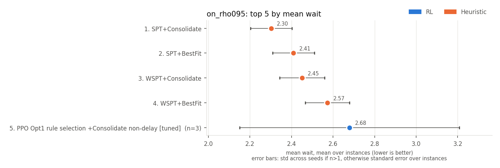 | 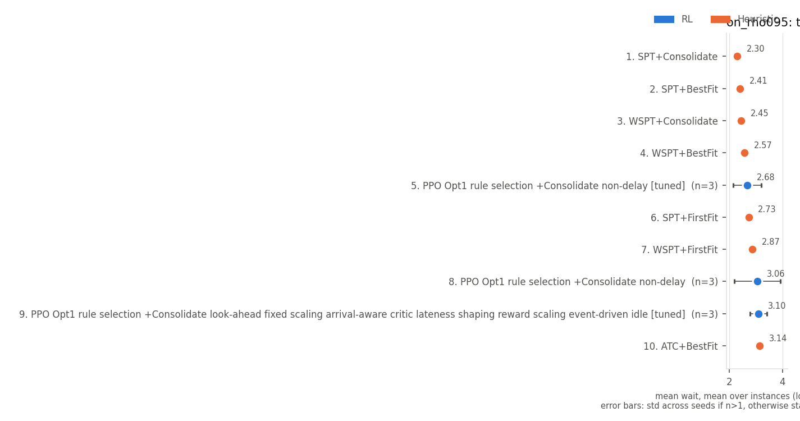 |

## mean flow time (lower is better)

| rank | method | family | mean flow time | J |
|---|---|---|---|---|
| 1 | SPT+Consolidate | Heuristic | 7.71 +/- 0.83 | 126833 +/- 69967 |
| 2 | SPT+BestFit | Heuristic | 7.81 +/- 0.83 | 130401 +/- 66624 |
| 3 | WSPT+Consolidate | Heuristic | 7.86 +/- 0.88 | 107362 +/- 58122 |
| 4 | WSPT+BestFit | Heuristic | 7.98 +/- 0.87 | 119065 +/- 67990 |
| 5 | PPO Opt1 rule selection +Consolidate non-delay [tuned] | RL | 8.08 +/- 0.53 | 97758 +/- 34882 |
| 6 | SPT+FirstFit | Heuristic | 8.13 +/- 0.85 | 162421 +/- 77529 |
| 7 | WSPT+FirstFit | Heuristic | 8.28 +/- 0.92 | 143035 +/- 66752 |
| 8 | PPO Opt1 rule selection +Consolidate non-delay | RL | 8.46 +/- 0.86 | 96497 +/- 65192 |
| 9 | PPO Opt1 rule selection +Consolidate look-ahead fixed scaling arrival-aware critic lateness shaping reward scaling event-driven idle [tuned] | RL | 8.50 +/- 0.32 | 93528 +/- 59663 |
| 10 | ATC+BestFit | Heuristic | 8.55 +/- 1.04 | 46117 +/- 31644 |

| top 5 | top 10 |
|---|---|
| 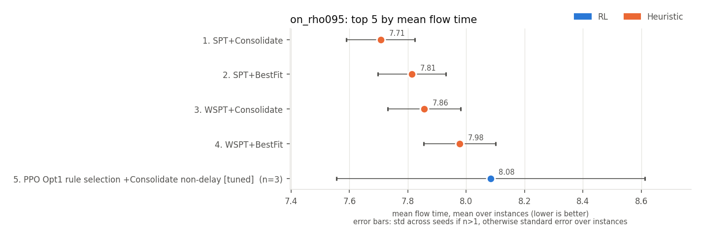 | 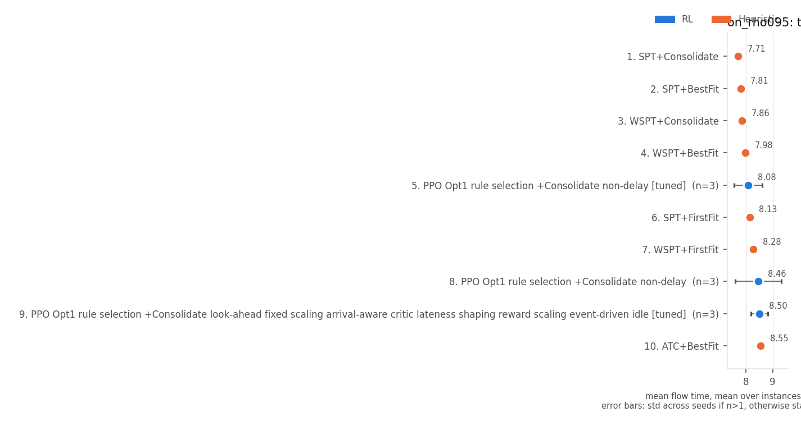 |

## makespan (lower is better)

| rank | method | family | makespan | J |
|---|---|---|---|---|
| 1 | LPT+Consolidate | Heuristic | 132.0 +/- 5.6 | 271325 +/- 180422 |
| 2 | LPT+FirstFit | Heuristic | 132.3 +/- 6.1 | 289859 +/- 177708 |
| 3 | LPT+BestFit | Heuristic | 132.5 +/- 6.5 | 254666 +/- 154340 |
| 4 | LPT+WorstFit | Heuristic | 134.9 +/- 6.3 | 491840 +/- 181610 |
| 5 | LST+FirstFit | Heuristic | 135.3 +/- 7.2 | 38831 +/- 31768 |
| 6 | LST+Consolidate | Heuristic | 135.3 +/- 8.0 | 27839 +/- 29934 |
| 7 | RandomRule+FirstFitConsolidate | Heuristic | 135.6 +/- 7.7 | 52018 +/- 41825 |
| 8 | WLST+Consolidate | Heuristic | 135.7 +/- 9.2 | 24874 +/- 21375 |
| 9 | LST+BestFit | Heuristic | 135.7 +/- 8.1 | 39115 +/- 28826 |
| 10 | WLST+BestFit | Heuristic | 135.7 +/- 7.5 | 34508 +/- 29217 |

| top 5 | top 10 |
|---|---|
| 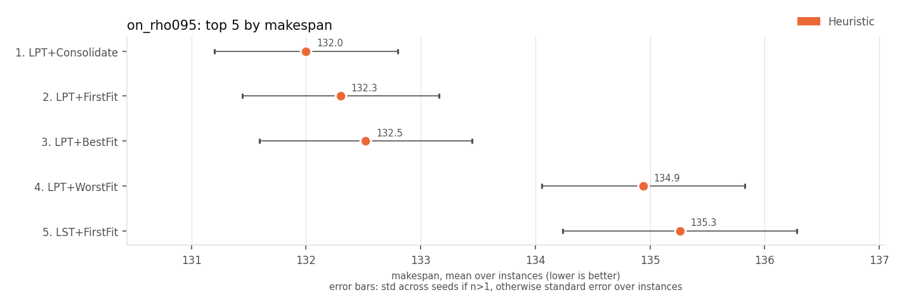 | 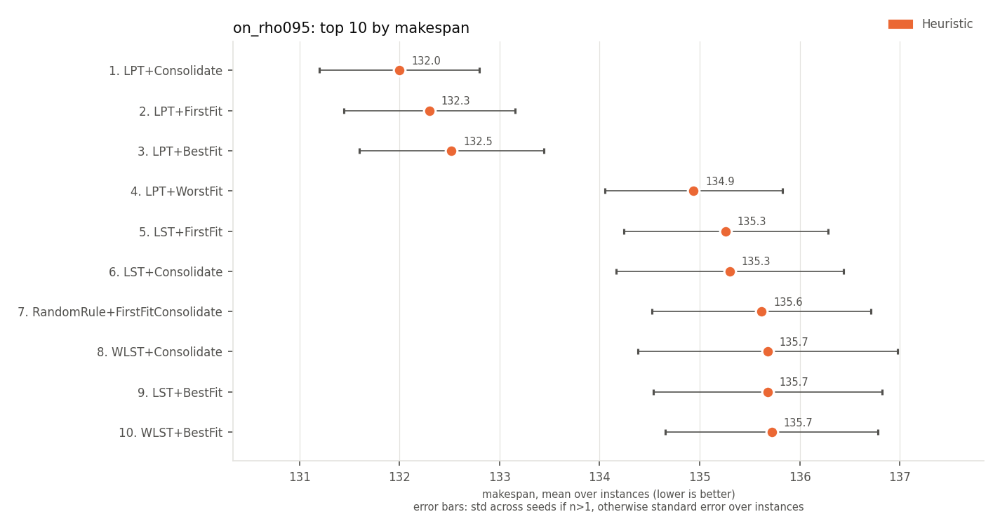 |

## utilisation of active machines (higher is better)

| rank | method | family | utilisation of active machines | J |
|---|---|---|---|---|
| 1 | LPT+Consolidate | Heuristic | 0.966 +/- 0.014 | 271325 +/- 180422 |
| 2 | LPT+BestFit | Heuristic | 0.962 +/- 0.014 | 254666 +/- 154340 |
| 3 | LPT+FirstFit | Heuristic | 0.961 +/- 0.013 | 289859 +/- 177708 |
| 4 | LST+Consolidate | Heuristic | 0.960 +/- 0.013 | 27839 +/- 29934 |
| 5 | WLST+Consolidate | Heuristic | 0.959 +/- 0.012 | 24874 +/- 21375 |
| 6 | MDC+Consolidate | Heuristic | 0.959 +/- 0.011 | 22646 +/- 22184 |
| 7 | COVERT+Consolidate | Heuristic | 0.958 +/- 0.011 | 26019 +/- 23766 |
| 8 | LST+BestFit | Heuristic | 0.956 +/- 0.015 | 39115 +/- 28826 |
| 9 | MDC+BestFit | Heuristic | 0.955 +/- 0.013 | 32592 +/- 26659 |
| 10 | A2C Opt1 rule selection +Consolidate non-delay | RL | 0.955 +/- 0.014 | 135509 +/- 124159 |

| top 5 | top 10 |
|---|---|
| 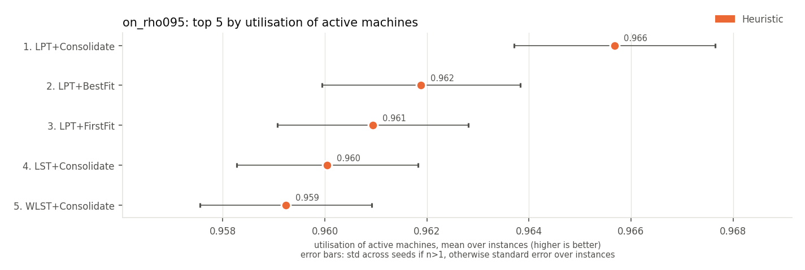 | 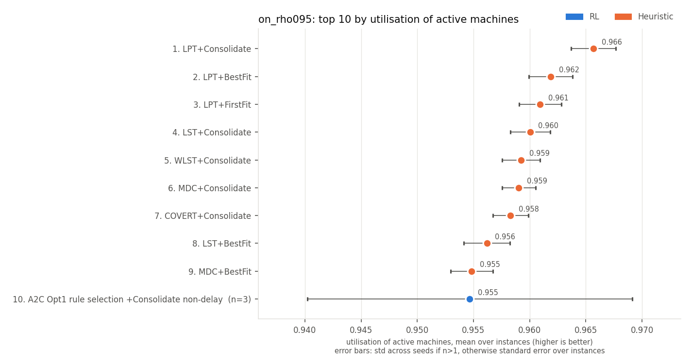 |

## active machine-ticks (lower is better)

| rank | method | family | active machine-ticks | J |
|---|---|---|---|---|
| 1 | LPT+Consolidate | Heuristic | 1219 +/- 64 | 271325 +/- 180422 |
| 2 | LPT+BestFit | Heuristic | 1227 +/- 63 | 254666 +/- 154340 |
| 3 | LST+Consolidate | Heuristic | 1229 +/- 61 | 27839 +/- 29934 |
| 4 | MDC+Consolidate | Heuristic | 1231 +/- 67 | 22646 +/- 22184 |
| 5 | LPT+FirstFit | Heuristic | 1231 +/- 66 | 289859 +/- 177708 |
| 6 | WLST+Consolidate | Heuristic | 1232 +/- 64 | 24874 +/- 21375 |
| 7 | COVERT+Consolidate | Heuristic | 1233 +/- 70 | 26019 +/- 23766 |
| 8 | LST+BestFit | Heuristic | 1236 +/- 64 | 39115 +/- 28826 |
| 9 | MDC+BestFit | Heuristic | 1240 +/- 66 | 32592 +/- 26659 |
| 10 | LST+FirstFit | Heuristic | 1241 +/- 66 | 38831 +/- 31768 |

| top 5 | top 10 |
|---|---|
| 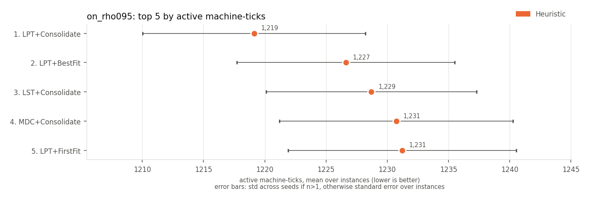 | 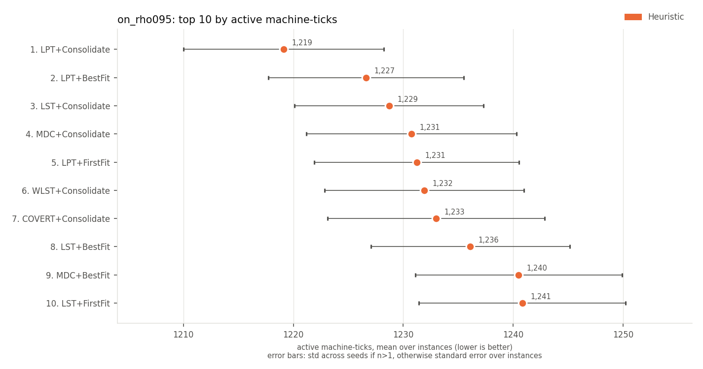 |

## energy (SPECpower) (lower is better)

| rank | method | family | energy (SPECpower) | J |
|---|---|---|---|---|
| 1 | LPT+Consolidate | Heuristic | 1123 +/- 63 | 271325 +/- 180422 |
| 2 | LPT+BestFit | Heuristic | 1129 +/- 62 | 254666 +/- 154340 |
| 3 | LST+Consolidate | Heuristic | 1130 +/- 61 | 27839 +/- 29934 |
| 4 | MDC+Consolidate | Heuristic | 1132 +/- 66 | 22646 +/- 22184 |
| 5 | LPT+FirstFit | Heuristic | 1132 +/- 64 | 289859 +/- 177708 |
| 6 | WLST+Consolidate | Heuristic | 1132 +/- 63 | 24874 +/- 21375 |
| 7 | COVERT+Consolidate | Heuristic | 1133 +/- 67 | 26019 +/- 23766 |
| 8 | LST+BestFit | Heuristic | 1135 +/- 63 | 39115 +/- 28826 |
| 9 | MDC+BestFit | Heuristic | 1138 +/- 65 | 32592 +/- 26659 |
| 10 | LST+FirstFit | Heuristic | 1139 +/- 65 | 38831 +/- 31768 |

| top 5 | top 10 |
|---|---|
| 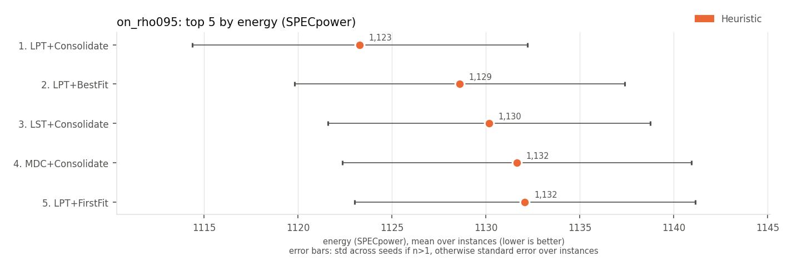 | 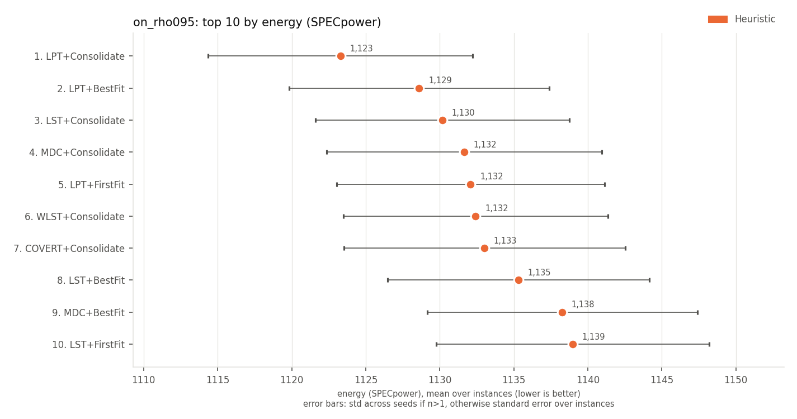 |

Spread (+/-): std across seeds for multi-seed RL rows, otherwise std across instances.
