# on_rho110: leaderboards

Top 10 methods on each metric. Full ranking by J: [`tables/on_rho110.md`](../tables/on_rho110.md). Archive overview: [`HIGHLIGHTS.md`](../HIGHLIGHTS.md).

## J (lower is better)

| rank | method | family | J |
|---|---|---|---|
| 1 | MDC+Consolidate | Heuristic | 106463 +/- 87144 |
| 2 | WEDF+Consolidate | Heuristic | 107519 +/- 73473 |
| 3 | EDF+Consolidate | Heuristic | 114142 +/- 68444 |
| 4 | MDC+FirstFit | Heuristic | 135268 +/- 81598 |
| 5 | MDC+BestFit | Heuristic | 138364 +/- 93785 |
| 6 | WLST+Consolidate | Heuristic | 139904 +/- 104537 |
| 7 | LST+Consolidate | Heuristic | 144386 +/- 97469 |
| 8 | WEDF+BestFit | Heuristic | 148158 +/- 82230 |
| 9 | WEDF+FirstFit | Heuristic | 149937 +/- 93909 |
| 10 | COVERT+Consolidate | Heuristic | 150616 +/- 88508 |

| top 5 | top 10 |
|---|---|
| 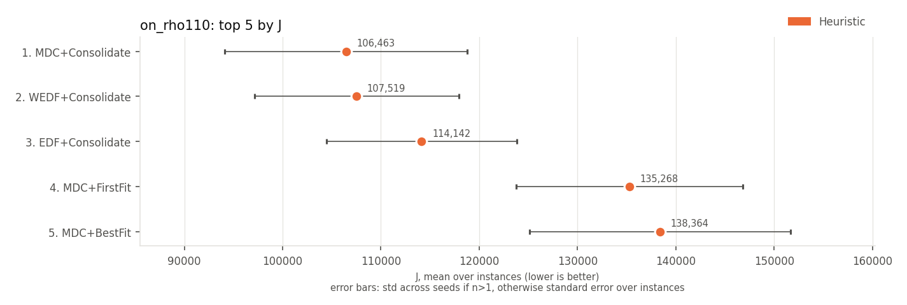 | 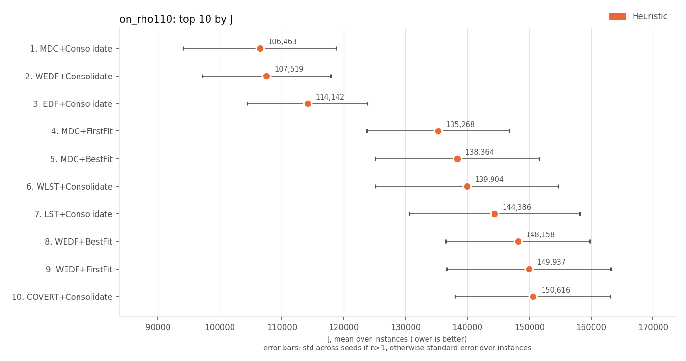 |

## on-time rate (higher is better)

| rank | method | family | on-time rate | J |
|---|---|---|---|---|
| 1 | ATC+Consolidate | Heuristic | 0.935 +/- 0.013 | 159315 +/- 88420 |
| 2 | ATC+BestFit | Heuristic | 0.933 +/- 0.012 | 191577 +/- 108044 |
| 3 | ATC+FirstFit | Heuristic | 0.930 +/- 0.012 | 205642 +/- 98055 |
| 4 | COVERT+Consolidate | Heuristic | 0.924 +/- 0.016 | 150616 +/- 88508 |
| 5 | COVERT+BestFit | Heuristic | 0.924 +/- 0.014 | 187862 +/- 102012 |
| 6 | SPT+Consolidate | Heuristic | 0.923 +/- 0.013 | 391147 +/- 161979 |
| 7 | SPT+BestFit | Heuristic | 0.921 +/- 0.013 | 408295 +/- 157784 |
| 8 | COVERT+FirstFit | Heuristic | 0.921 +/- 0.016 | 180812 +/- 108182 |
| 9 | ATC+WorstFit | Heuristic | 0.919 +/- 0.011 | 312216 +/- 120179 |
| 10 | WSPT+Consolidate | Heuristic | 0.919 +/- 0.014 | 339583 +/- 134907 |

| top 5 | top 10 |
|---|---|
| 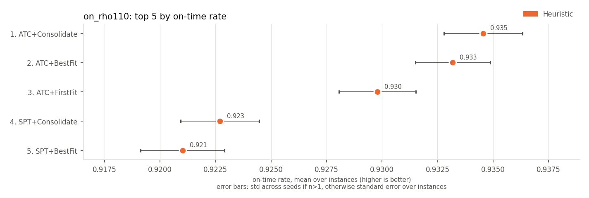 | 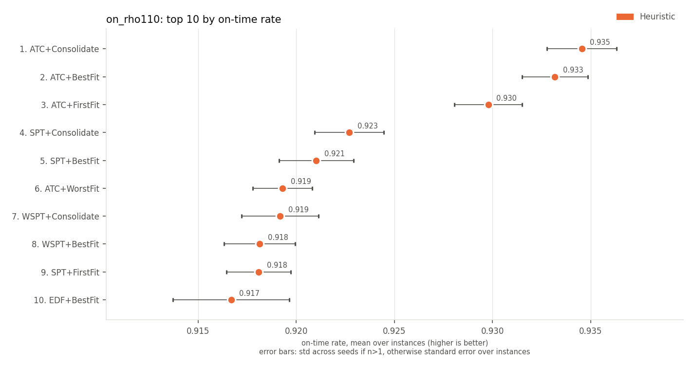 |

## late jobs (lower is better)

| rank | method | family | late jobs | J |
|---|---|---|---|---|
| 1 | ATC+Consolidate | Heuristic | 69.4 +/- 13.5 | 159315 +/- 88420 |
| 2 | ATC+BestFit | Heuristic | 70.9 +/- 13.5 | 191577 +/- 108044 |
| 3 | ATC+FirstFit | Heuristic | 74.5 +/- 13.6 | 205642 +/- 98055 |
| 4 | COVERT+Consolidate | Heuristic | 80.5 +/- 17.9 | 150616 +/- 88508 |
| 5 | COVERT+BestFit | Heuristic | 80.7 +/- 16.0 | 187862 +/- 102012 |
| 6 | SPT+Consolidate | Heuristic | 82.0 +/- 14.3 | 391147 +/- 161979 |
| 7 | SPT+BestFit | Heuristic | 83.8 +/- 15.2 | 408295 +/- 157784 |
| 8 | COVERT+FirstFit | Heuristic | 83.9 +/- 18.1 | 180812 +/- 108182 |
| 9 | ATC+WorstFit | Heuristic | 85.5 +/- 11.8 | 312216 +/- 120179 |
| 10 | WSPT+Consolidate | Heuristic | 85.8 +/- 15.8 | 339583 +/- 134907 |

| top 5 | top 10 |
|---|---|
| 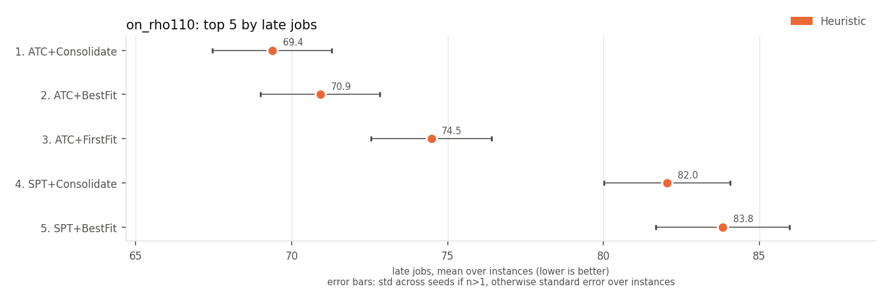 | 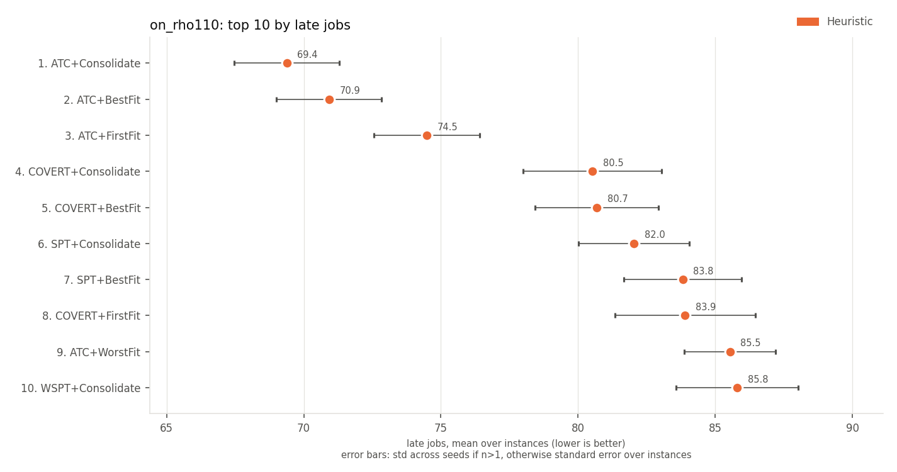 |

## weighted late jobs (lower is better)

| rank | method | family | weighted late jobs | J |
|---|---|---|---|---|
| 1 | ATC+Consolidate | Heuristic | 183.8 +/- 38.6 | 159315 +/- 88420 |
| 2 | ATC+BestFit | Heuristic | 189.3 +/- 41.2 | 191577 +/- 108044 |
| 3 | ATC+FirstFit | Heuristic | 198.9 +/- 40.6 | 205642 +/- 98055 |
| 4 | COVERT+Consolidate | Heuristic | 226.2 +/- 53.6 | 150616 +/- 88508 |
| 5 | ATC+WorstFit | Heuristic | 231.6 +/- 35.8 | 312216 +/- 120179 |
| 6 | COVERT+BestFit | Heuristic | 231.8 +/- 48.1 | 187862 +/- 102012 |
| 7 | COVERT+FirstFit | Heuristic | 240.1 +/- 55.4 | 180812 +/- 108182 |
| 8 | SPT+Consolidate | Heuristic | 246.3 +/- 44.0 | 391147 +/- 161979 |
| 9 | SPT+BestFit | Heuristic | 251.4 +/- 48.1 | 408295 +/- 157784 |
| 10 | SPT+FirstFit | Heuristic | 260.2 +/- 42.7 | 445610 +/- 154209 |

| top 5 | top 10 |
|---|---|
| 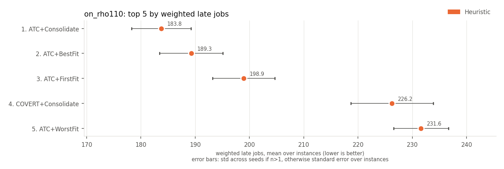 | 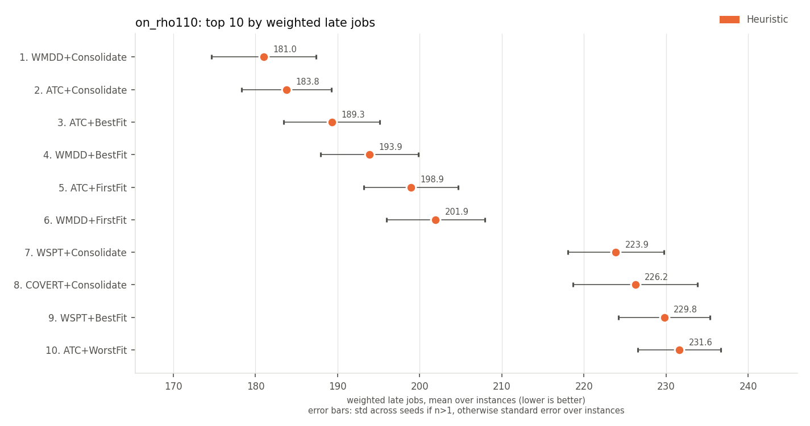 |

## weighted tardiness (lower is better)

| rank | method | family | weighted tardiness | J |
|---|---|---|---|---|
| 1 | ATC+Consolidate | Heuristic | 3604 +/- 1430 | 159315 +/- 88420 |
| 2 | MDC+Consolidate | Heuristic | 3763 +/- 1913 | 106463 +/- 87144 |
| 3 | COVERT+Consolidate | Heuristic | 3867 +/- 1565 | 150616 +/- 88508 |
| 4 | WEDF+Consolidate | Heuristic | 4031 +/- 1856 | 107519 +/- 73473 |
| 5 | ATC+BestFit | Heuristic | 4081 +/- 1699 | 191577 +/- 108044 |
| 6 | EDF+Consolidate | Heuristic | 4229 +/- 1758 | 114142 +/- 68444 |
| 7 | MDC+BestFit | Heuristic | 4310 +/- 1904 | 138364 +/- 93785 |
| 8 | ATC+FirstFit | Heuristic | 4331 +/- 1549 | 205642 +/- 98055 |
| 9 | MDC+FirstFit | Heuristic | 4343 +/- 1731 | 135268 +/- 81598 |
| 10 | COVERT+BestFit | Heuristic | 4412 +/- 1776 | 187862 +/- 102012 |

| top 5 | top 10 |
|---|---|
| 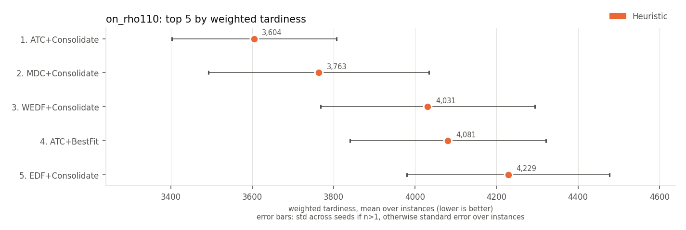 | 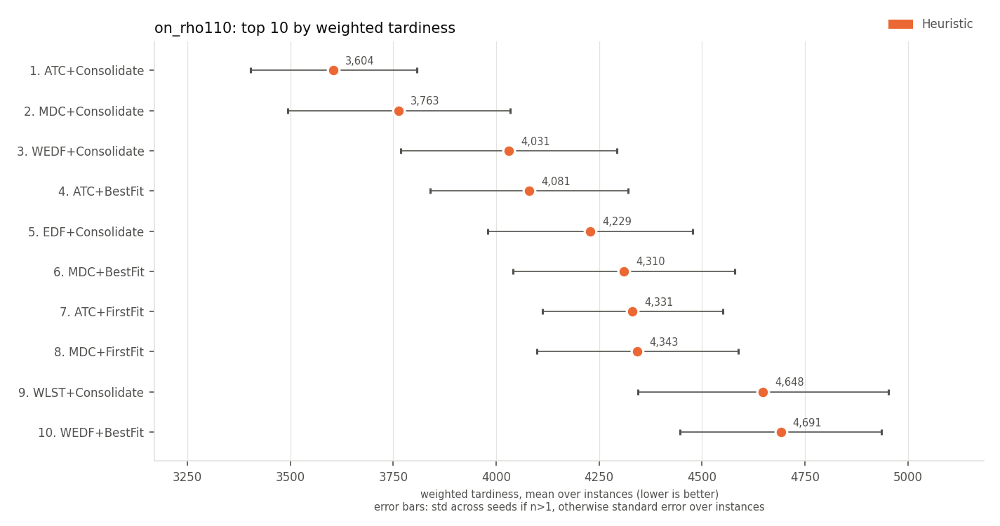 |

## max tardiness (lower is better)

| rank | method | family | max tardiness | J |
|---|---|---|---|---|
| 1 | LST+Consolidate | Heuristic | 48.5 +/- 13.7 | 144386 +/- 97469 |
| 2 | EDF+Consolidate | Heuristic | 52.5 +/- 14.3 | 114142 +/- 68444 |
| 3 | LST+BestFit | Heuristic | 54.6 +/- 15.3 | 178161 +/- 110493 |
| 4 | LST+FirstFit | Heuristic | 55.1 +/- 14.0 | 187603 +/- 117291 |
| 5 | FCFS+Consolidate | Heuristic | 59.9 +/- 12.9 | 154636 +/- 98058 |
| 6 | WEDF+Consolidate | Heuristic | 60.7 +/- 15.0 | 107519 +/- 73473 |
| 7 | EDF+BestFit | Heuristic | 60.8 +/- 16.4 | 155351 +/- 109761 |
| 8 | EDF+FirstFit | Heuristic | 61.4 +/- 16.8 | 170841 +/- 112561 |
| 9 | FCFS+WorstFit | Heuristic | 64.7 +/- 12.3 | 195430 +/- 111028 |
| 10 | LST+WorstFit | Heuristic | 64.9 +/- 15.4 | 283931 +/- 143265 |

| top 5 | top 10 |
|---|---|
| 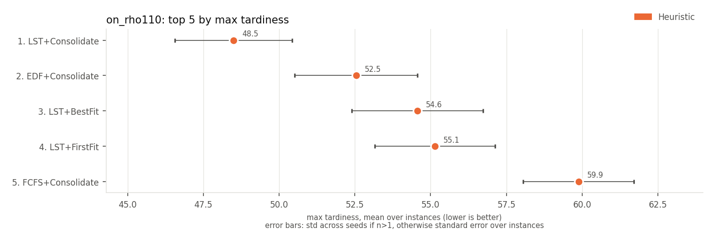 | 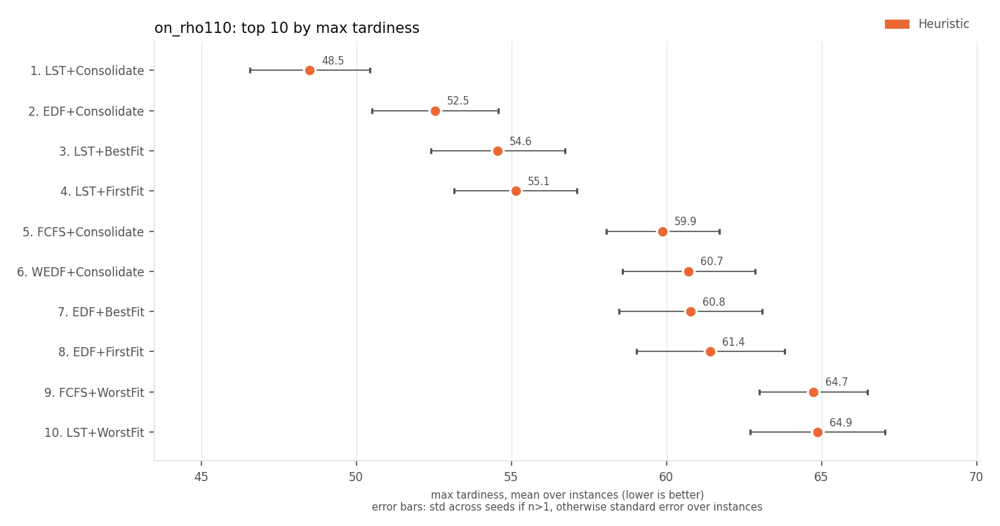 |

## p95 tardiness (lower is better)

| rank | method | family | p95 tardiness | J |
|---|---|---|---|---|
| 1 | ATC+Consolidate | Heuristic | 4.7 +/- 3.5 | 159315 +/- 88420 |
| 2 | ATC+BestFit | Heuristic | 5.7 +/- 4.5 | 191577 +/- 108044 |
| 3 | COVERT+Consolidate | Heuristic | 6.1 +/- 3.9 | 150616 +/- 88508 |
| 4 | ATC+FirstFit | Heuristic | 6.5 +/- 4.3 | 205642 +/- 98055 |
| 5 | COVERT+BestFit | Heuristic | 6.9 +/- 4.6 | 187862 +/- 102012 |
| 6 | COVERT+FirstFit | Heuristic | 7.5 +/- 5.3 | 180812 +/- 108182 |
| 7 | MDC+Consolidate | Heuristic | 7.8 +/- 4.7 | 106463 +/- 87144 |
| 8 | MDC+FirstFit | Heuristic | 9.0 +/- 4.8 | 135268 +/- 81598 |
| 9 | MDC+BestFit | Heuristic | 9.3 +/- 5.2 | 138364 +/- 93785 |
| 10 | EDF+Consolidate | Heuristic | 9.7 +/- 5.5 | 114142 +/- 68444 |

| top 5 | top 10 |
|---|---|
| 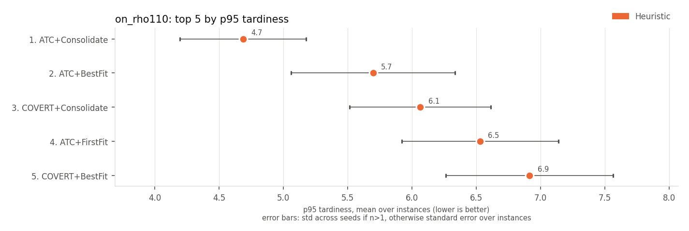 | 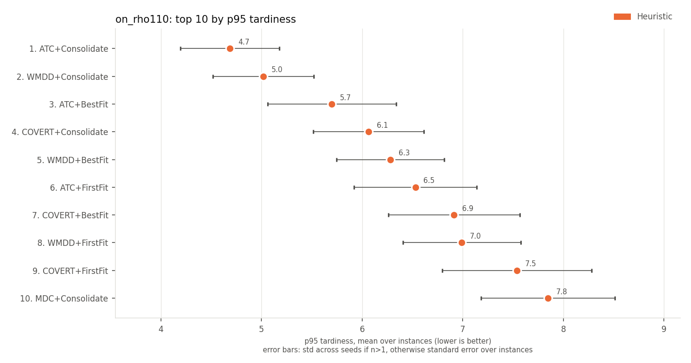 |

## mean wait (lower is better)

| rank | method | family | mean wait | J |
|---|---|---|---|---|
| 1 | SPT+Consolidate | Heuristic | 4.35 +/- 0.95 | 391147 +/- 161979 |
| 2 | SPT+BestFit | Heuristic | 4.42 +/- 0.94 | 408295 +/- 157784 |
| 3 | WSPT+Consolidate | Heuristic | 4.70 +/- 0.99 | 339583 +/- 134907 |
| 4 | SPT+FirstFit | Heuristic | 4.71 +/- 0.86 | 445610 +/- 154209 |
| 5 | WSPT+BestFit | Heuristic | 4.79 +/- 0.98 | 367881 +/- 141653 |
| 6 | WSPT+FirstFit | Heuristic | 5.17 +/- 0.98 | 409159 +/- 146537 |
| 7 | SPT+WorstFit | Heuristic | 5.95 +/- 0.88 | 644925 +/- 189011 |
| 8 | ATC+FirstFit | Heuristic | 6.15 +/- 1.24 | 205642 +/- 98055 |
| 9 | ATC+BestFit | Heuristic | 6.26 +/- 1.32 | 191577 +/- 108044 |
| 10 | ATC+Consolidate | Heuristic | 6.26 +/- 1.24 | 159315 +/- 88420 |

| top 5 | top 10 |
|---|---|
| 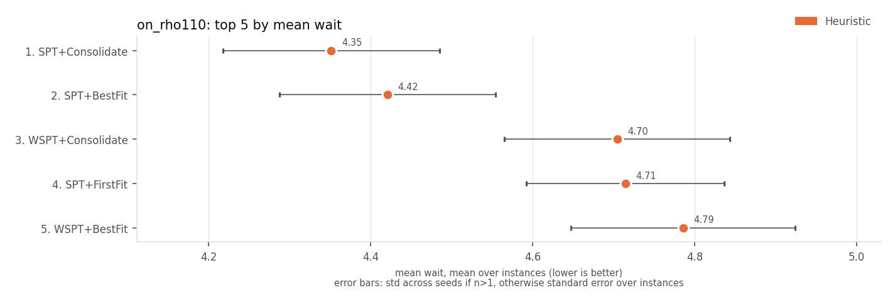 | 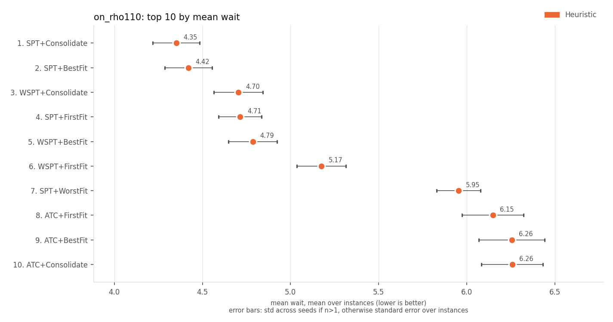 |

## mean flow time (lower is better)

| rank | method | family | mean flow time | J |
|---|---|---|---|---|
| 1 | SPT+Consolidate | Heuristic | 9.82 +/- 1.05 | 391147 +/- 161979 |
| 2 | SPT+BestFit | Heuristic | 9.89 +/- 1.05 | 408295 +/- 157784 |
| 3 | WSPT+Consolidate | Heuristic | 10.17 +/- 1.09 | 339583 +/- 134907 |
| 4 | SPT+FirstFit | Heuristic | 10.18 +/- 1.00 | 445610 +/- 154209 |
| 5 | WSPT+BestFit | Heuristic | 10.25 +/- 1.10 | 367881 +/- 141653 |
| 6 | WSPT+FirstFit | Heuristic | 10.64 +/- 1.09 | 409159 +/- 146537 |
| 7 | SPT+WorstFit | Heuristic | 11.42 +/- 0.99 | 644925 +/- 189011 |
| 8 | ATC+FirstFit | Heuristic | 11.62 +/- 1.33 | 205642 +/- 98055 |
| 9 | ATC+BestFit | Heuristic | 11.73 +/- 1.40 | 191577 +/- 108044 |
| 10 | ATC+Consolidate | Heuristic | 11.73 +/- 1.33 | 159315 +/- 88420 |

| top 5 | top 10 |
|---|---|
| 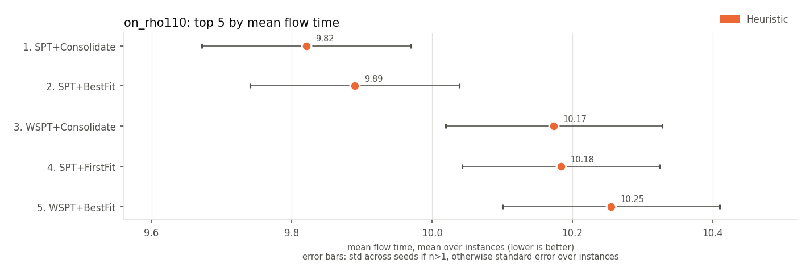 | 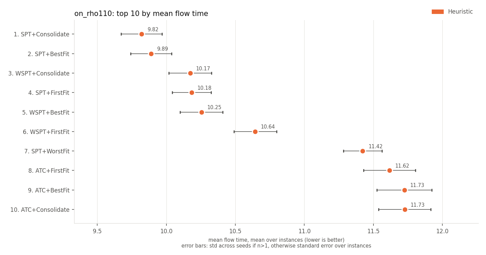 |

## makespan (lower is better)

| rank | method | family | makespan | J |
|---|---|---|---|---|
| 1 | LPT+Consolidate | Heuristic | 140.9 +/- 7.6 | 1112071 +/- 557022 |
| 2 | LPT+BestFit | Heuristic | 142.0 +/- 7.4 | 1008368 +/- 508233 |
| 3 | LPT+FirstFit | Heuristic | 142.0 +/- 8.3 | 1051760 +/- 433452 |
| 4 | LPT+WorstFit | Heuristic | 145.9 +/- 7.0 | 1161351 +/- 417931 |
| 5 | RandomRule+FirstFitConsolidate | Heuristic | 148.2 +/- 9.1 | 241365 +/- 116668 |
| 6 | RandomRule+FirstFit | Heuristic | 148.7 +/- 9.0 | 268708 +/- 147638 |
| 7 | LST+Consolidate | Heuristic | 149.9 +/- 10.5 | 144386 +/- 97469 |
| 8 | LST+BestFit | Heuristic | 150.4 +/- 10.6 | 178161 +/- 110493 |
| 9 | WLST+Consolidate | Heuristic | 150.8 +/- 10.4 | 139904 +/- 104537 |
| 10 | WLST+FirstFit | Heuristic | 150.8 +/- 10.0 | 156726 +/- 99272 |

| top 5 | top 10 |
|---|---|
| 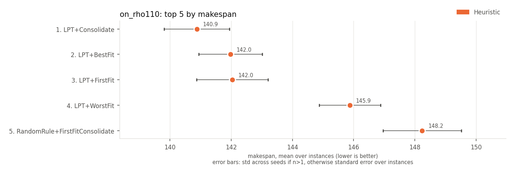 | 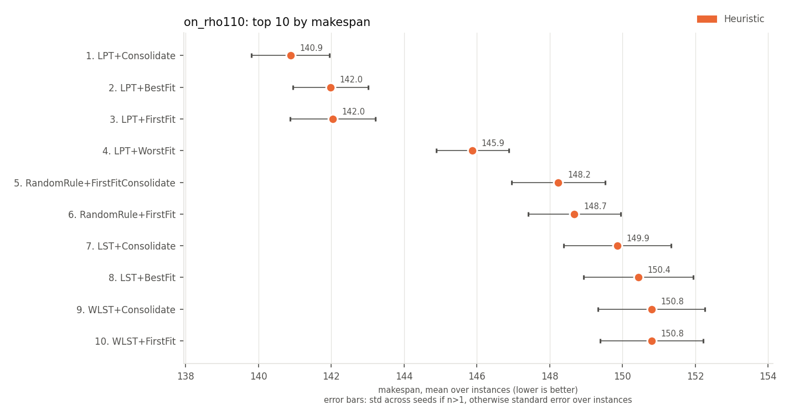 |

## utilisation of active machines (higher is better)

| rank | method | family | utilisation of active machines | J |
|---|---|---|---|---|
| 1 | LPT+Consolidate | Heuristic | 0.986 +/- 0.004 | 1112071 +/- 557022 |
| 2 | LPT+BestFit | Heuristic | 0.984 +/- 0.005 | 1008368 +/- 508233 |
| 3 | LPT+FirstFit | Heuristic | 0.983 +/- 0.005 | 1051760 +/- 433452 |
| 4 | LST+Consolidate | Heuristic | 0.979 +/- 0.005 | 144386 +/- 97469 |
| 5 | WLST+Consolidate | Heuristic | 0.978 +/- 0.005 | 139904 +/- 104537 |
| 6 | MDC+Consolidate | Heuristic | 0.978 +/- 0.005 | 106463 +/- 87144 |
| 7 | LST+BestFit | Heuristic | 0.977 +/- 0.006 | 178161 +/- 110493 |
| 8 | MDC+BestFit | Heuristic | 0.977 +/- 0.005 | 138364 +/- 93785 |
| 9 | COVERT+Consolidate | Heuristic | 0.977 +/- 0.005 | 150616 +/- 88508 |
| 10 | LST+FirstFit | Heuristic | 0.976 +/- 0.005 | 187603 +/- 117291 |

| top 5 | top 10 |
|---|---|
| 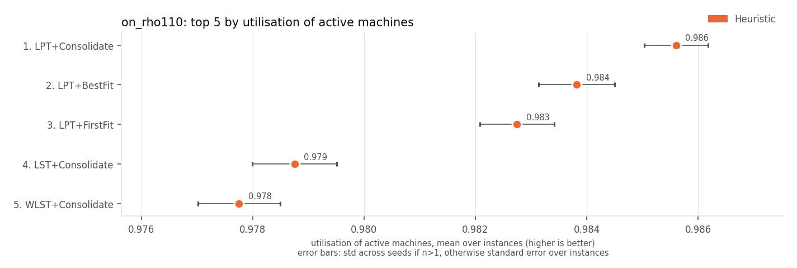 | 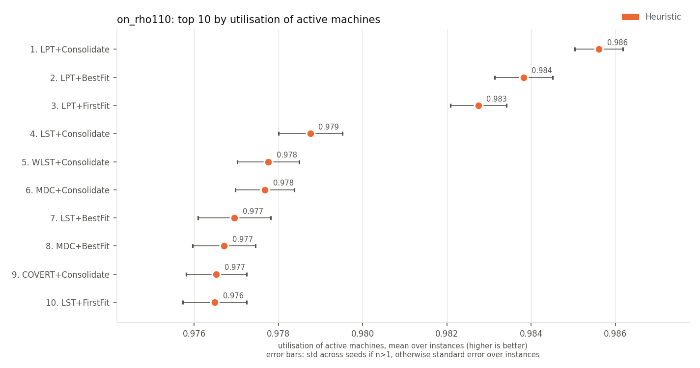 |

## active machine-ticks (lower is better)

| rank | method | family | active machine-ticks | J |
|---|---|---|---|---|
| 1 | LPT+Consolidate | Heuristic | 1368 +/- 68 | 1112071 +/- 557022 |
| 2 | LPT+FirstFit | Heuristic | 1377 +/- 69 | 1051760 +/- 433452 |
| 3 | LPT+BestFit | Heuristic | 1380 +/- 71 | 1008368 +/- 508233 |
| 4 | LST+Consolidate | Heuristic | 1387 +/- 71 | 144386 +/- 97469 |
| 5 | LST+BestFit | Heuristic | 1393 +/- 67 | 178161 +/- 110493 |
| 6 | WLST+Consolidate | Heuristic | 1394 +/- 73 | 139904 +/- 104537 |
| 7 | MDC+Consolidate | Heuristic | 1395 +/- 75 | 106463 +/- 87144 |
| 8 | LST+FirstFit | Heuristic | 1395 +/- 70 | 187603 +/- 117291 |
| 9 | WLST+BestFit | Heuristic | 1396 +/- 67 | 152726 +/- 87886 |
| 10 | MDC+BestFit | Heuristic | 1399 +/- 72 | 138364 +/- 93785 |

| top 5 | top 10 |
|---|---|
| 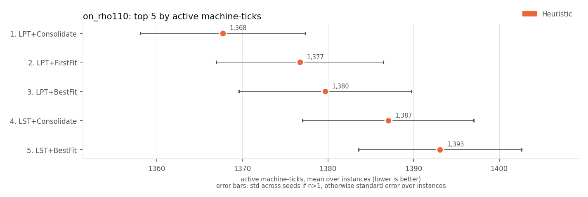 | 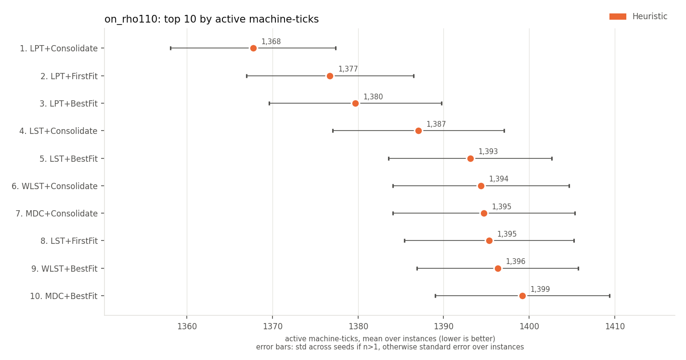 |

## energy (SPECpower) (lower is better)

| rank | method | family | energy (SPECpower) | J |
|---|---|---|---|---|
| 1 | LPT+Consolidate | Heuristic | 1273 +/- 67 | 1112071 +/- 557022 |
| 2 | LPT+FirstFit | Heuristic | 1279 +/- 67 | 1051760 +/- 433452 |
| 3 | LPT+BestFit | Heuristic | 1281 +/- 69 | 1008368 +/- 508233 |
| 4 | LST+Consolidate | Heuristic | 1286 +/- 69 | 144386 +/- 97469 |
| 5 | LST+BestFit | Heuristic | 1291 +/- 67 | 178161 +/- 110493 |
| 6 | MDC+Consolidate | Heuristic | 1292 +/- 72 | 106463 +/- 87144 |
| 7 | WLST+Consolidate | Heuristic | 1292 +/- 71 | 139904 +/- 104537 |
| 8 | LST+FirstFit | Heuristic | 1292 +/- 68 | 187603 +/- 117291 |
| 9 | WLST+BestFit | Heuristic | 1293 +/- 66 | 152726 +/- 87886 |
| 10 | MDC+BestFit | Heuristic | 1295 +/- 70 | 138364 +/- 93785 |

| top 5 | top 10 |
|---|---|
| 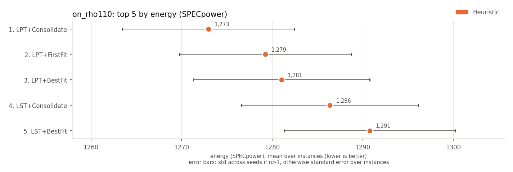 | 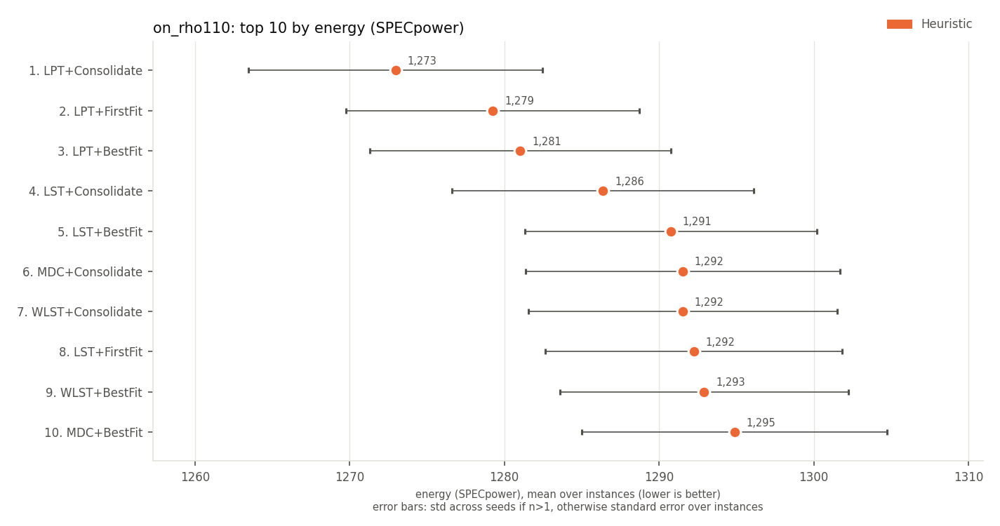 |

Spread (+/-): std across seeds for multi-seed RL rows, otherwise std across instances.
